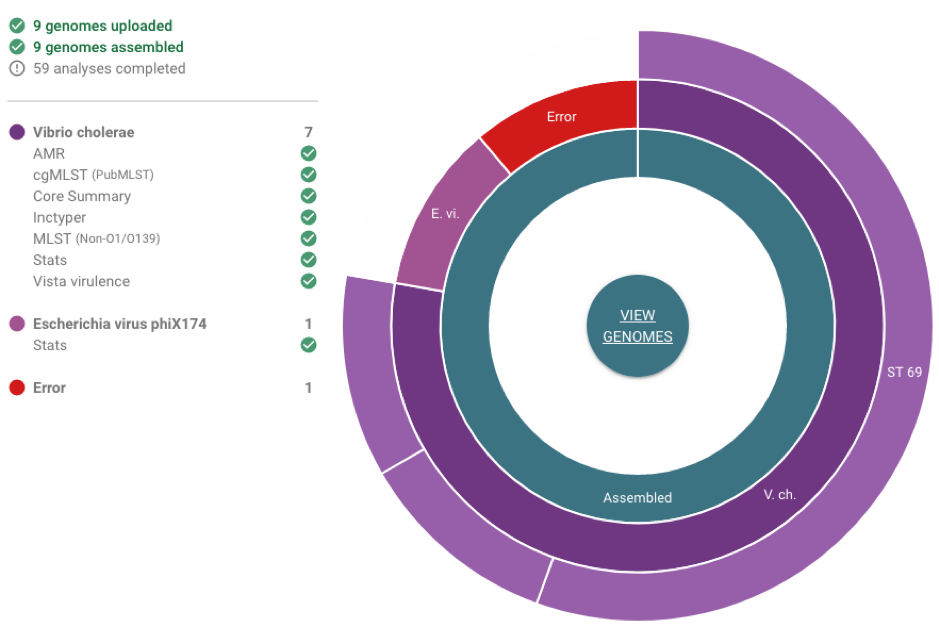
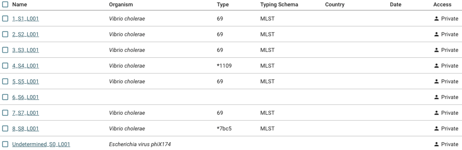
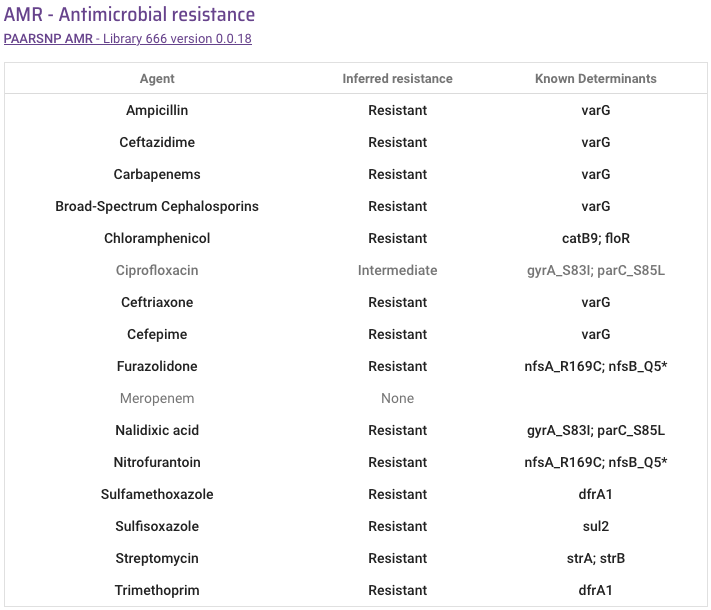
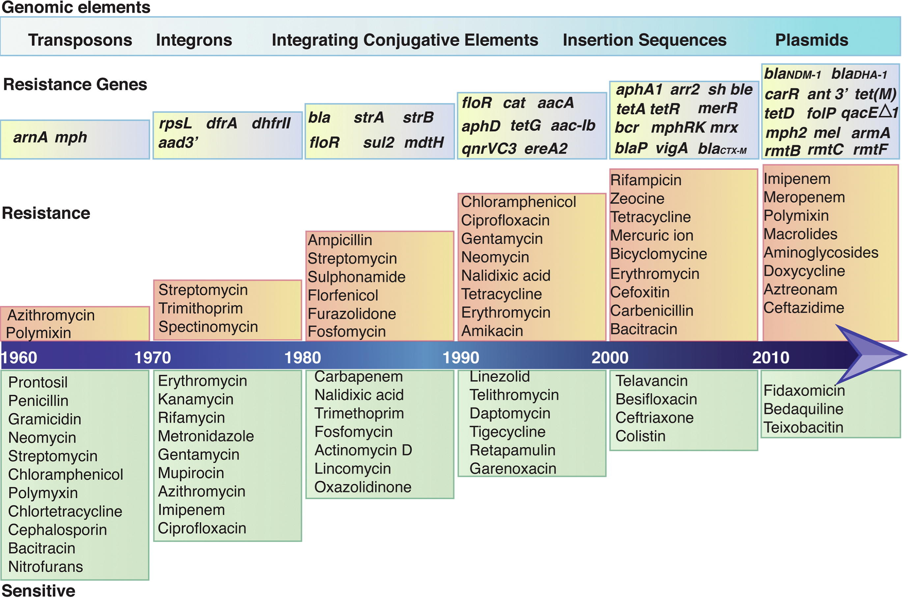
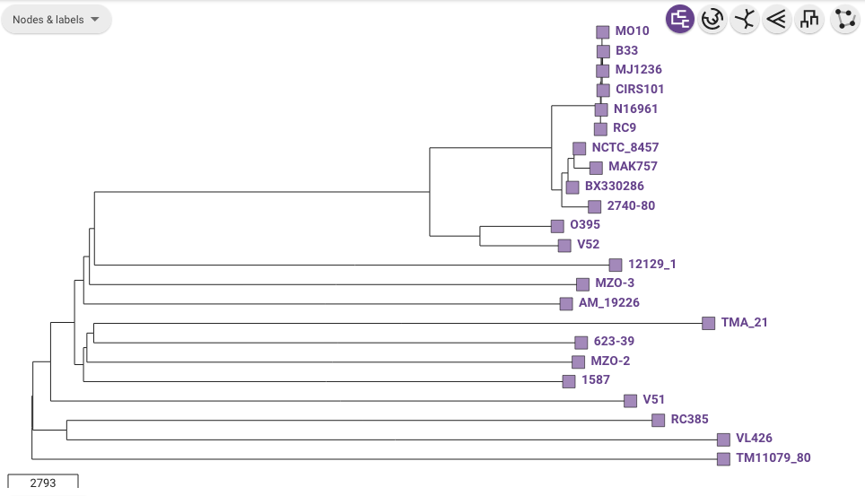
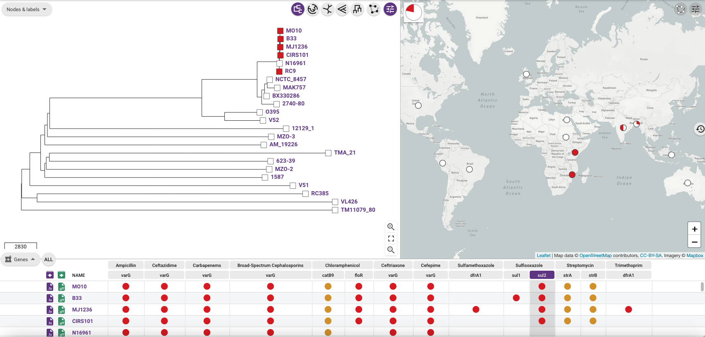
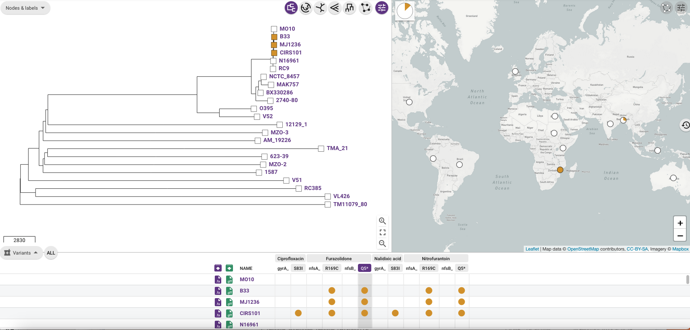

Predicting antimicrobial resistance genes
=========================================

In this section, we will describe how you can:

* `Short guide for those in a hurry: what is the predicted antimicrobial resistance profile of my isolate?`_
* `Antimicrobials recommended for treating cholera`_
* `Antimicrobial resistance in the current pandemic lineage of Vibrio cholerae`_
* `Predicting antimicrobial resistance genes in your isolate, and assessing the predictions`_
* `Displaying antimicrobial resistance gene presence/absence on the tree for a collection of isolates`_.

Short guide for those in a hurry: what is the predicted antimicrobial resistance profile of my isolate?
-------------------------------------------------------------------------------------------------------

A quick way to find out whether your isolate is predicted to display antimicrobial resistance is to look at the predicted antimicrobial resistance  for your isolate in Vibriowatch.

Once you have sequencing reads or a genome assembly for your isolate to Vibriowatch (see `Is my isolate Vibrio cholerae? <https://vibriowatch.readthedocs.io/en/latest/assemblies.html#short-guide-for-those-in-a-hurry-is-my-isolate-vibrio-cholerae>`_), Vibriowatch will display a piechart showing the species of your isolates are, e.g.:

To view the report pages for your isolates, which will tell you their predicted antimicrobial resistance, you need
to click on the 'View genomes' link in the middle of the piechart.
  
This will bring up a list of your isolates in Vibriowatch, looking something like this:

  
To go to the report page for a particular isolate, click on the link on the left in the 'Name' column, e.g. '1_S1_L001'.

If you scroll down the 'report page' for your isolate, you will find a section with the heading 'AMR - Antimicrobial resistance'. 

For example, here is 'Antimicrobial resistance' part of the report page for an isolate HCUF-01, which was collected in Haiti in 2010 and
published by `Hasan et al 2012`_:

.. _Hasan et al 2012: https://pubmed.ncbi.nlm.nih.gov/22711841/

  
We can see that HCUF-01 has resistance genes *strA* and *strB*, predicted to give resistance to aminoglycosides such as streptomycin;
resistance gene *sul2*, predicted to give resistance to sulfonamides (e.g. sulfisoxazole); 
resistance genes *catB9* and *floR*, predicted to give resistance
to chloramphenicol; resistance gene *varG*, predicted to give resistance to beta-lactam class antibiotics including carbapenems, cephalosporins,
and ampicillin; and resistance gene *dfrA1*, predicted to give resistance to trimethoprim.

HCUF-01 also has some variants predicted to give antimicrobial resistance: variants *nfsA* (R169C) and *nfsB* (Q5STOP), predicted to give resistance
to nitrofurans (e.g. nitrofurantoin, furazolidone); and variants *gyrA* (S83I) and *parC* (S85L), predicted to give resistance to quinolones (e.g. ciprofloxacin, nalidixic acid). 

Note that these are predictions, and should be confirmed by experimental testing of antimicrobial resistances in the laboratory.
  
If you found this useful, you may want to read through the rest of the tutorial to find out more details.
  
Antimicrobials recommended for treating cholera
-----------------------------------------------

The main treatment for cholera is to give fluids and salt either orally as oral rehydration salts, or
by injection (see `CDC`_, `Somboonwit et al 2017`_). However, in some particular situations, antimicrobial treatment is sometimes given to patients. 
Antimicrobials can reduce the duration and severity
of the cholera illness, and also reduce onward transmission to other people (see `Leibovici-Weissman et al 2014`_, `Hseuh and Waters 2019`_).

.. _CDC: https://www.cdc.gov/cholera/treatment/antibiotic-treatment.html

.. _Leibovici-Weissman et al 2014: https://pubmed.ncbi.nlm.nih.gov/24944120/

.. _Hseuh and Waters 2019: https://pubmed.ncbi.nlm.nih.gov/31069064/

.. _Somboonwit et al 2017: https://pubmed.ncbi.nlm.nih.gov/29379258/

Historically, many different antimicrobials have been used or investigated for treating cholera.
Effective antimicrobials to treat cholera are doxycycline, azithromycin and tetracycline (`Hseuh and Waters 2019`_).
A Cochrane review of antimicrobial treatments for cholera by `Leibovici-Weissman et al 2014`_ compared the evidence
for efficacy of 39 trials in humans, and concluded that tetracycline likely has some advantages over
doxycycline or norfloxacin or trimethoprim-sulfamethoxazole; and that azithromycin has some
advantages over ciprofloxacin or erthyromycin.

.. _Leibovici-Weissman et al 2014: https://pubmed.ncbi.nlm.nih.gov/24944120/

.. _Hseuh and Waters 2019: https://pubmed.ncbi.nlm.nih.gov/31069064/

The `CDC`_ (in the USA) currently recommends that, in severe cases, or
for all pregnant women and patients with comorbidities (e.g., severe acute malnutrition, HIV infection),
cholera can be treated with doxycycline. If resistance to doxycycline is documented in the country with the cholera
outbreak, azithromycin and ciprofloxacin are alternative options. 
That is, the choice of which antimicrobial to use
will depend on previous knowledge of local drug resistance.
We recommend clinicians to review the latest `CDC`_ guidelines for details of treatment.

.. _CDC: https://www.cdc.gov/cholera/treatment/antibiotic-treatment.html

Antimicrobial resistance in the current pandemic lineage of Vibrio cholerae
---------------------------------------------------------------------------

A disadvantage of using antimicrobials to treat cholera is that drug resistances have
developed in the current pandemic lineage (7PET lineage) of *Vibrio cholerae*. 
In recent years, treatment failures have been seen due to the 
emergence of antimicrobial resistances in pandemic lineage *V. cholerae* (`Hseuh and Waters 2019`_, `Das et al 2020`_).
This has lead to has been increasing concern about antimicrobial resistances in *V. cholerae*. 

.. _Hseuh and Waters 2019: https://pubmed.ncbi.nlm.nih.gov/31069064/

.. _Das et al 2020: https://pubmed.ncbi.nlm.nih.gov/31272870/

For example, ciprofloxacin (a fluoroquinolone class antimicrobial) was commonly used
in the early 1990s to treat cholera, but resistance developed in many countries with
a high number of cholera cases, such as Haiti and Bangladesh (see `Hseuh and Waters 2019`_).
Strains resistant to tetracycline have been isolated in several countries including
Bangladesh, India, Thailand and Vietnam (see `Hseuh and Waters 2019`_). Azithromycin
resistance also emerged during the 1900s (see `Somboonwit et al 2017`_, `Wang et al 2018`_). 
Resistances to many other useful antimicrobials has also been seen in the current
pandemic lineage (7PET lineage) of *V. cholerae*, for example, resistances to 
chloramphenicol, furazolidone, trimethoprim-sulfamethoxazole, and nalidixic acid (see
`Ghosh and Ramamurthy 2011`_, `Ramamurthy et al 2019`_). 

.. _Hseuh and Waters 2019: https://pubmed.ncbi.nlm.nih.gov/31069064/

.. _Somboonwit et al 2017: https://pubmed.ncbi.nlm.nih.gov/29379258/

.. _Wang et al 2018: https://pubmed.ncbi.nlm.nih.gov/28919196/

.. _Ghosh and Ramamurthy 2011: https://pubmed.ncbi.nlm.nih.gov/21415499/

.. _Ramamurthy et al 2019: https://pubmed.ncbi.nlm.nih.gov/31396501/

.. _Das et al 2020: https://pubmed.ncbi.nlm.nih.gov/31272870/

The emergence of antimicrobial resistance genes and variants in *V. cholerae* since the 1960s
is illustrated in this beautiful figure from `Das et al 2020`_, showing that the current pandemic
lineage (7PET lineage) of *V. cholerae* has
acquired resistances to almost all the commonly used antimicrobials over time:

.. _Das et al 2020: https://pubmed.ncbi.nlm.nih.gov/31272870/

  
For further details on antimicrobial resistance in 
the current pandemic lineage (7PET lineage) of *V. cholerae*, see in-depth reviews by `Ramamurthy et al 2019`_ and
`Das et al 2020`_.

Predicting antimicrobial resistance genes in your isolate, and assessing the predictions
----------------------------------------------------------------------------------------

A key use of genomic data for *Vibrio cholerae* is to predict antimicrobial resistance based on the genome of isolates from an outbreak.
It is possible to predict which antimicrobials the *V. cholerae* causing a 
particular outbreak or epidemic are likely to be susceptible to, and to which they are likely to be resistant. 
This can help a clinican or public health microbiologist to get some
early warning of whether there is a possibility of resistance to particular antimicrobials in the *V. cholerae*
causing the outbreak. 

One should bear in mind that the predictions of antimicrobial resistance based
on genomic data are just predictions, and should be confirmed by experimental testing of antimicrobial 
resistances in the laboratory. Furthermore, predictions of antimicrobial resistance for *V. cholerae* based on genomic information 
are not currently considered reliable enough to use for clinical decision making (see `Ramamurthy et al 2019`_).
However, information on predicted antimicrobial resistances of isolates from an outbreak can be very useful information
for clinicians and public health workers to gather during an outbreak, to help inform which antimicrobials to choose for
laboratory testing for resistance, and also to gain insights into possible reasons for any treatment failures observed.

.. _Ramamurthy et al 2019: https://pubmed.ncbi.nlm.nih.gov/31396501/

In VibrioWatch, we predict antimicrobial resistance based on looking for antimicrobial resistance genes and variants in them.
We can predict resistance to many different antimicrobial classes such as beta-lactams (e.g.
ampicillin, ceftriaxone), aminoglycosides (e.g. streptomycin), fluoroquinolones (e.g. ciprofloxacin) and 
other quinolones (e.g. nalidixic acid), chloramphenicol, and sulfonamides (e.g. sulfisoxazole). 

Vibriowatch uses a tool called 'PAARSNP' based on BLAST, to identify antimicrobial resistance genes and variants in *V. cholerae* genomes.
In general, it is possible to make reasonably accurate predictions of antimicrobial resistance profile for a *V. cholerae* isolate
based on its genomic data (see `Weill et al 2017`_). However, one exception is the *catB9* gene, which is predicted to cause
resistance to chloramphenicol, but which in *V. cholerae* isolates from the current pandemic lineage (7PET lineage) appears to be
a silent (unexpressed) gene (see `Weill et al 2017`_). Therefore, even if a *catB9* gene is present in a particular isolate belonging
to the current pandemic lineage (7PET lineage), that isolate may not be resistant to chloramphenicol (unless it has other genes/variants
causing chloramphenicol resistance).

.. _Weill et al 2017: https://pubmed.ncbi.nlm.nih.gov/29123067/

Displaying antimicrobial resistance gene presence/absence on the tree for a collection of isolates
--------------------------------------------------------------------------------------------------

If you make a collection of isolates in Vibriowatch, you can display the presence/absence of a particular antimicrobial resistance gene
(e.g. *sul2*, which is predicted to confer sulfonamide resistance) beside the tree.

For example, if you look at the public Vibriowatch `collection for the paper by Chun et al 2009`_ (see `here`_ for the paper in PubMed), if
you turn on the leaf labels you will see a picture of the tree with the isolate names beside the tips of the tree:

.. _collection for the paper by Chun et al 2009: https://pathogen.watch/collection/2c43jl3z2xs8-vibriowatch-collection-chun-et-al-2009

.. _here: https://pubmed.ncbi.nlm.nih.gov/19720995/

  
To show virulence gene presence/absence beside the tree, click on the 'Timeline' menu below the tree, and choose 'Genes' instead
of 'Timeline'. Then click on the column heading 'sul2' to show the presence/absence of the *sul2* gene and you should see the nodes
of the tree light up as red if they have the *sul2* gene, orange if they have a partial match to the *sul2* gene, and colourless if
they don't have a match to *sul2*:

.. _ctxA: https://biocyc.org/gene?orgid=GCF_900205735&id=FY484_RS07330

  
We can see that the *sul2* gene is present in the isolates in
the current pandemic lineage (7PET lineage), i.e. isolates M010, B33, MJ1236, CIRS101, and RC9, but is not found
in isolates from other lineages of *V. cholerae*. In the map on the right, it shows the percentage of isolates from each 
country in this collection that have the *sul2* gene.

In a similar way you can look at the presence/absence of variants that are predicted to cause antimicrobial resistances.
For example, if you change 'Genes' to 'Variants' (in the menu that originally said 'Timeline'), and then select
the column saying 'Q5' under 'Furazolidone', you will see which isolates are predicted to be resistant to furazolidone due to
a mutation in the *nfsB* gene that changes amino acid Q at position 5 in the protein to a STOP codon:

  
We can see that this variant is present in several isolates from the current pandemic lineage (7PET lineage), namely, B33, MJ1236, and
CIRS101. Again, in the map on the right, we see where these variants were found around the world, and the frequency of the variant
in each country sampled in this collection.

Contact
-------

I will be grateful if you will send me (Avril Coghlan) corrections or suggestions for improvements to my email address alc@sanger.ac.uk

