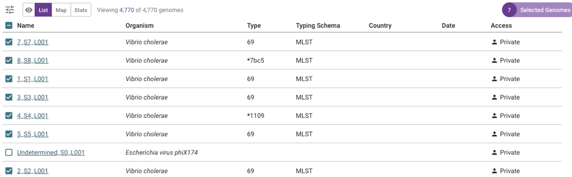

Assemblies and assembly quality
===============================

This section will cover:

* `Short guide for those in a hurry: is my isolate Vibrio cholerae?`_.
* `Check if your fastq files of reads are suitable for Vibriowatch`_.
* `Upload reads to Vibriowatch, to make an assembly`_.
* `Upload an assembly for an isolate`_.
* `Verify that your isolate is Vibrio cholerae`_.
* `View the Vibriowatch report page for your isolate`_.
* `View the assembly statistics for your isolate`_.
* `Download the assembly for your isolate`_.
* `Run CheckM to check if the assembly for your isolate is contaminated`_.

Short guide for those in a hurry: is my isolate Vibrio cholerae?
----------------------------------------------------------------

You can upload either raw Illumina sequencing reads, or an assembly to Vibriowatch. 

They will be stored in your private Vibriowatch account and only visible to you.

To upload files of raw Illumina reads to Vibriowatch, your files of reads must have file-names ending in '_R1.fastq.gz' and '_R2.fastq.gz'.

To upload an assembly file to Vibriowatch, your assembly file must have a file-name ending in '.fa' or '.fasta' or '.fna'.

You can upload your raw reads or assembly to Vibriowatch by going to the `Pathogenwatch`_ website.

.. _Pathogenwatch: https://pathogen.watch/

On the Pathogenwatch website, click on 'Upload' at the top right of the website:

.. image:: Picture1.png
  :width: 650
  
To upload data it's necessary to make an account first, for example, using your email address as your login. Now log into Pathogenwatch.

This will bring you to a webpage saying 'What would you like to upload?', and you need to click on 'FASTQ' for reads,
or 'Single genome FASTAs' for an assembly (or for assemblies for several isolates):

.. image:: Picture2.png
  :width: 500

Next click on the '+' button at the bottom right of the screen to upload your raw reads or assembly:

  
If raw reads, select all the zipped fastq files that you want to upload, for example, if you want to upload fastq files for 9 isolates:

.. image:: Picture4.png
  :width: 200
  
If assemblies, select all the fasta files that you want to upload, with one assembly file (FASTA file) per isolate.

As soon as some of the genomes have uploaded or assembled from raw reads, a piechart will show which species they are, for example:

.. image:: Picture7.png
  :width: 650
  
In this example seven isolates were identified as *Vibrio cholerae*. 

If you found this useful, you may want to read through the rest of the tutorial to find out more details. 

Check if your fastq files of reads are suitable for Vibriowatch
---------------------------------------------------------------

If you have fastq files of Illumina sequencing reads for your isolate, you can upload the fastq files to Vibriowatch to make an assembly.

Alternatively, if you already have an assembly for your isolate, you can upload the assembly to Vibriowatch (see `Upload an assembly for an isolate`_). 

At present, Vibriowatch can only make assemblies for Illumina reads.
If you have sequenced reads using a different sequencing technology than Illumina (e.g. Oxford Nanopore), and are not sure how
to make an assembly, please contact us.

When you upload fastq files or assemblies to Vibriowatch, they are stored in your private Vibriowatch account, and can only be viewed or analysed by you and nobody else.

The maximum file size that Vibriowatch can accept for a zipped fastq file (that is, zipped with file names ending in .gz) is 500 Mbyte.

Usually you will have a pair of zipped fastq files for an isolate, with the forward and reverse reads respectively, called something like sample1_R1.fastq.gz and sample1_R2.fastq.gz.

If you have these files on a computer running Linux, you can find their sizes in Megabytes by typing in the terminal window
(Note: these are Linux commands; for a simple Linux tutorial see `here`_):

.. _here: https://swcarpentry.github.io/shell-novice/

.. code-block:: console

   $ du -h *fastq.gz
   
You will see something like this in your terminal window:

.. code-block:: console

   $ 160M    sample1_R1.fastq.gz
   $ 176M    sample1_R2.fastq.gz

The sizes of the files in Mbyte are given in the left column.

If the zipped fastq files are each :math:`<` 500 Mbyte in size, then they are fine for Vibriowatch to accept.

If your zipped fastq files of reads are :math:`>` 500 Mbyte in size, you could either (i) sample a smaller set of the reads in the files to give to Vibriowatch to make an assembly (the easier option), or (ii) alternatively you can make an assembly outside Vibriowatch using an assembly software (a more difficult option).

Upload reads to Vibriowatch, to make an assembly 
------------------------------------------------

To upload files to Vibriowatch, they need to have file-names ending in '_R1.fastq.gz' and '_R2.fastq.gz'.

If your files do not have file-names ending in '_R1.fastq.gz' and '_R2.fastq.gz', you will need to rename them using the Linux 'mv' command. For example, you can rename a file 'S1_R1_001.fastq.gz' to be called 'S1_R1.fastq.gz' by typing:

.. code-block:: console

   $ mv S1_R1_001.fastq.gz S1_R1.fastq.gz

Once your files have names ending in '_R1.fastq.gz' and '_R2.fastq.gz', you can upload them to Vibriowatch by going to the `Pathogenwatch`_ website.

.. _Pathogenwatch: https://pathogen.watch/

On the Pathogenwatch website, click on 'Upload' at the top right of the website:

.. image:: Picture1.png
  :width: 650
  
You will need to now sign into the Pathogenwatch website. To upload data to the Pathogenwatch website, it's necessary
to make an account first, for example, using your email address as your login. 

This will bring you to a webpage saying 'What would you like to upload?', and you need to click on 'FASTQ':

.. image:: Picture2.png
  :width: 500

You then need to click on the '+' button at the bottom right of the screen to upload your zipped fastq files:

  
Then select all the zipped fastq files that you want to upload, for example, if you want to upload fastq files for 9 isolates:

.. image:: Picture4.png
  :width: 200
  
The Pathogenwatch website will then tell you that it is uploading your data, and when it has finished uploading it all, it will tell you that it is making assemblies for your isolates. The assembly process takes quite a while (e.g. roughly one hour for 10 isolates), and while it is running the website will give you a piechart showing its progress, for example:

.. image:: Picture5.png
  :width: 650
  
As soon as some of the genomes have been assembled, the piechart will show which species they have been recognised to be, and also will show how many analyses have been carried out on the assemblies (see to the left of the piechart), for example:

.. image:: Picture6.png
  :width: 650
  
We call the *Vibrio cholerae* component of Pathogenwatch 'Vibriowatch'. Vibriowatch carries out eight different analyses for each assembly. We will explain these analyses later in the tutorial:

#. Species identification.
#. AMR gene analysis.
#. cgMLST.
#. Core gene summary.
#. Predicting plasmids using Inctyper.
#. MLST.
#. Assembly statistics.
#. Predicting virulence genes using 'Vista'.

When Pathogenwatch has finished the analyses on all the isolates that it has assembled genomes for, the piechart will look something like this:

.. image:: Picture7.png
  :width: 650
  
The piechart above shows that one isolate had failed the assembly process (labelled 'Error'). This can happen if there is something wrong with the fastq files, for example, if they are empty files. 
  
Upload an assembly for an isolate
---------------------------------

If you already have an assembly for an isolate, you can upload your assembly to Vibriowatch.

The steps are very similar to uploading reads (see `Upload reads to Vibriowatch, to make an assembly`_), except that on the webpage saying 'What would you like to upload?', you need to click on 'Single genome FASTAs' (instead of 'FASTQ'):

.. image:: Picture2.png
  :width: 500

Pathogenwatch will carry out eight different analyses for each assembly, as it does after making assemblies from reads (see `Upload reads to Vibriowatch, to make an assembly`_):

#. Species identification.
#. AMR gene analysis.
#. cgMLST.
#. Core gene summary.
#. Predicting plasmids using Inctyper.
#. MLST.
#. Assembly statistics.
#. Predicting virulence genes using 'Vista'.

Verify that your isolate is Vibrio cholerae
-------------------------------------------

It can sometimes happen that a researcher thinks they have isolated *Vibrio cholerae*, but the reads that they have sequenced come from another species, either due to mis-identification of *V. cholerae* or contamination of their sample. 

For example, the piechart below shows that one isolate was identified as phiX174 virus, a virus that infects *Escherichia coli*: 

.. image:: Picture7.png
  :width: 650
  
In the example above, there were also seven isolates that were assembled that were identified by Pathogenwatch as *Vibrio cholerae*. 

View the Vibriowatch report page for your isolate
-------------------------------------------------

Once you have uploaded reads and Pathogenwatch has made an assembly for you (or once you have uploaded your own assembly to Pathogenwatch), the Pathogenwatch website will make a 'report page' for your isolate with more information on its genome. 

To view the report pages for your isolates, you need to click on the 'View genomes' link in the middle of the piechart:

.. image:: Picture7.png
  :width: 650
  
This will bring up a list of the assemblies that have just been made for you in Vibriowatch, looking something like this:

.. image:: Picture8.png
  :width: 650
  
You can see in the column on the far right that the 'Access' for each of the isolates is 'Private', which means that only you (and nobody else) can see or analyse these assemblies in Vibriowatch.

Note that you can also find the full list of genomes in your private Vibriowatch account by clicking on the three small horizontal bars at the top left of the Pathogenwatch website:

  
This will bring up a menu:

.. image:: Picture10.png
  :width: 150
  
If you click on 'My Genomes' in this menu, it will give you the list of genomes that you have just uploaded (or have been assembled from fastq files that you just uploaded), as well as any genomes that you uploaded on previous days:

.. image:: Picture8.png
  :width: 650
  
To see more information on a particular isolate's assembly, click on the link on the left in the 'Name' column, e.g. '1_S1_L001'. This will bring you to a Vibriowatch 'report page' for that genome, which will look something like this (just showing the top of the report page):

.. image:: Picture11.png
  :width: 650

View the assembly statistics for your isolate
---------------------------------------------

Once you have uploaded reads and Pathogenwatch has made an assembly for you (or once you have uploaded your own assembly to Pathogenwatch), it is a good idea to have a closer look at the assembly statistics for your isolates.

To find the assembly statistics for your isolate, you need to look at the bottom of the report page for that isolate (see `View the Vibriowatch report page for your isolate`_).

At the bottom of the report page for your isolate, you will see some assembly statistics, for example:

In the example above, the isolate has a genome size of about 4.0 Megabases, and GC content of 47.5%. This is consistent with the reference genome for *Vibrio cholerae* strain N16961, which has a genome size of about 4.0 Megabases and GC content of 47.5% (see  `Heidelberg et al 2000`_).

.. _Heidelberg et al 2000: https://pubmed.ncbi.nlm.nih.gov/10952301/

As a very rough 'rule of thumb', we would consider that an assembly size of between about 3.3 and 5.3 Megabase, and a GC content of between about 41.3% and 48.6%, is reasonable for a *Vibrio cholerae* genome. However, note that this an extremely rough rule of thumb, and may need to be revised in future when more is known about the diversity found in the species *Vibrio cholerae*.

If your assembly has a genome size or GC content far outside these ranges, it would probably be a good idea to investigate whether your assembly likely contains contamination from another species' DNA (see below).

Another commonly used measures of assembly quality is the number of contigs. We would usually consider that an assembly is of relatively good quality if it consists of :math:`<` 700 contigs. If the assembly for your isolate has more contigs, it is relatively poor quality and so this may introduce errors into further bioinformatic analyses that you carry out using Vibriowatch.

In the example above, the genome for the isolate has 62 contigs, so is relatively good quality.

Download the assembly for your isolate
--------------------------------------

If you have uploaded reads for your isolate to Vibriowatch, and Vibriowatch has made an assembly for your isolate, you can then download the assembly to your computer. This is useful to do if you want to do further analysis of your isolate's assembly outside Vibriowatch (e.g. running CheckM; see `Run CheckM to check if the assembly for your isolate is contaminated`_). 

To find the list of assemblies that you have made using Vibriowatch, you can click on the three horizontal small horizontal bars at the top left of the Vibriowatch website:

  
This will bring up a menu:

.. image:: Picture10.png
  :width: 150
  
If you click on 'My Genomes' in this menu, it will give you the list of genomes that have been assembled from fastq files that you just uploaded (or for which you uploaded the ready-made assemblies), as well as any genomes that you uploaded on previous days:

.. image:: Picture8.png
  :width: 650
  
Tick the boxes for the isolates whose assemblies you want to download, e.g. isolates 1, 2, 3, 4, 5, 7 and 8 in this example:

  
At the top right of the screen, you will see something like '7 Selected Genomes' appear in a purple button (see above). To download the assemblies, click on the purple '7 Selected Genomes' button, and choose 'Download data' from the menu that appears, and then choose 'FASTA files' from the next menu that appears. This will give you a file 'genomes.zip' containing the assemblies (e.g. 7 assemblies in this example). When you unzip that file, you will find assembly files inside it, called something like '1_S1_L001.fasta', '2_S2_L001.fasta', and so on.
  
Run CheckM to check if the assembly for your isolate is contaminated
--------------------------------------------------------------------

If you suspect that the assembly for your isolate may be contaminated with DNA from another species, for example because it has an unusual genome size and/or GC content for *V. cholerae*, you could try running a 'contamination scan' software such as CheckM by `Parks et al 2015`_.  

.. _Parks et al 2015: https://pubmed.ncbi.nlm.nih.gov/25977477/

CheckM is not part of Vibriowatch, and to run it you will need to install it on a computer that runs Linux. The latest version of CheckM is version 2, called CheckM2. You can find instructions on how to install it on the `CheckM2 github page`_.  

.. _CheckM2 github page: https://github.com/chklovski/CheckM2

To run CheckM2 on the assembly for your isolate, you will need to copy the assembly for that isolate to a computer that runs Linux and has CheckM2 installed. 

You can run CheckM2 on several isolates at once, for example, to run CheckM2 on the assemblies for 7 isolates, you need to type on the Linux command line:

.. code-block:: console

   $ checkM2 predict --threads 8 -x fasta --input folder_with_fasta --output checkm2_output
   
where 'folder_with_fasta' is the path to the directory where you have put the fasta files for the 7 assemblies, and 'checkm2_output' is the name you want CheckM2 to give to the directory where it puts its output files.

When CheckM2 has finished running, the output folder will contain a report called 'checkm2.collated.report', which will look something like this:

  
In this example, the 'checkm2.collated.report' file shows that isolates 1, 2, 3, 5, 7 and 8 had very little contamination; the percent contamination of the assembly is the third column, so we see that <0.05% of each of those assemblies was classified as contamination. However, 29.5% of the assembly for isolate 4 was classified by CheckM as contamination, which is quite high. This means that we can use Vibriowatch to do some analyses of the assembly for isolate 4 (e.g. predicting virulence genes), but need to bear in mind that the assembly is probably partially contaminated with some DNA from another species, so that might introduce some errors into the results.

CholeraBook
-----------

If you would like to learn more about cholera genomics, you may also be interested in our `Online Cholera Genomics Course (CholeraBook)`_.

.. _Online Cholera Genomics Course (CholeraBook): https://cholerabook.readthedocs.io/

Contact
-------

I will be grateful if you will send me (Avril Coghlan) corrections or suggestions for improvements to my email address alc@sanger.ac.uk

