Finding closely related isolates
================================

In this section, we will describe how you can:

* `Use cgMLST to find close relatives of your isolate`_.
* `Build a phylogenetic tree of their isolate and its closest relatives`_.

Use cgMLST to find close relatives of your isolate
--------------------------------------------------

Since the MLST scheme of `Octavia et al 2013`_ was based on just seven genes, more recently `Liang et al 2020`_ have created a 'core genome MLST' (cgMLST) scheme for *V. cholorae*. This is based on 2443 core genes, that is genes that are present in almost all *V. cholorae* isolates sequenced by 2020. In VibrioWatch, we use this core genome MLST scheme to place isolates into clusters of closely related isolates. 

.. _Octavia et al 2013: https://pubmed.ncbi.nlm.nih.gov/23776471/

.. _Liang et al 2020: https://pubmed.ncbi.nlm.nih.gov/32540931/

For example, isolate HCUF_O1 is an isolate collected in Haiti in 2010, sequenced by `Hasan et al 2012`_. 

.. _Hasan et al 2012: https://pubmed.ncbi.nlm.nih.gov/22711841/

If you search for isolate HCUF_01 in Vibriowatch, you'll see at the top of its 
report page that HCUF_01 has Sequence Type 69 (ST69) in the Octavia scheme, so likely belongs to the current pandemic lineage (7PET lineage):

.. image:: Picture26.png
  :width: 650
  
If you scroll down the report page for HCUF_01, you will come to the 'core genome clustering' (cgMLST) section:

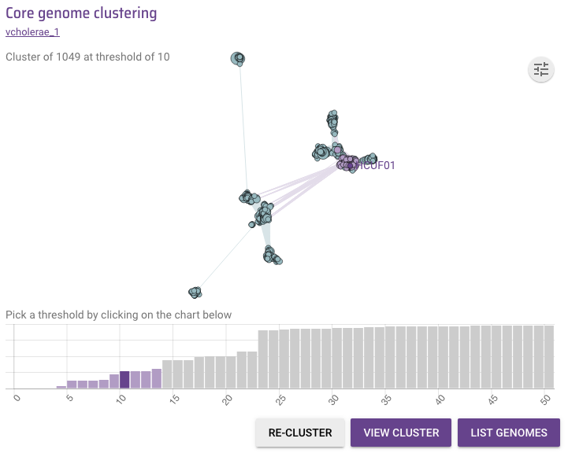
  
This shows that HCUF_01 belongs to a cgMLST cluster of 1049 isolates, when a threshold of 10 base differences (10 SNPs) is used to define clusters (ie. when any two isolates that differ by 10 or fewer SNPs in the 2443 core genes are put into the same cgMLST cluster). 

Since 1049 is a large number of related isolates, we can see if we can reduce the number of close relatives by using a stricter threshold for the allowed number of SNPs. If we mouse over the bars in the barchart, we can see that above the smallest bar it says 'cluster of 138 at threshold of 4':

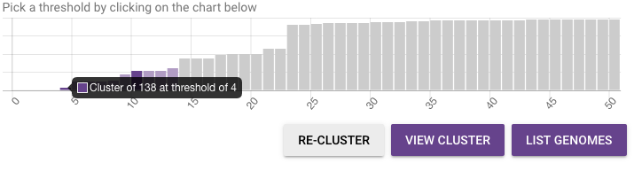
  
This means that when a threshold of 4 base differences (4 SNPs) is used to define clusters (ie. when any two isolates that differ by 4 or fewer SNPs in the 2443 core genes are put into the same cgMLST cluster), then HCUF_01 is put into a cgMLST cluster with 138 closely related isolates. If you click on that bar in the barchart, you will see that cluster of 138 isolates, including HCUF_01:

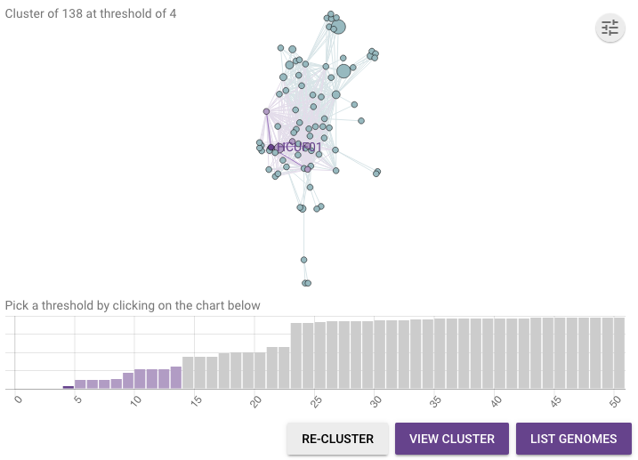
  
To see a list of the 138 closely related isolates in that cluster, you can click on the big purple 'List genomes' button. 

To see the cluster of the 138 closely related isolates, click on the big purple 'View cluster' button. This will bring up a webpage showing the cgMLST cluster on the left and a map of the isolates in it on the right:

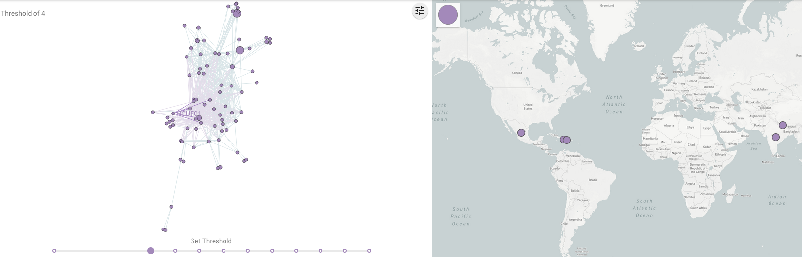
  
You can see from the map that HCUF_01 and other isolates from Haiti are closely related to isolates from the Dominican Republic (Haiti's neighbour), Mexico, but also India and Nepal. 

If you click on the circle representing Haiti on the map, it will highlight the Haitian isolates in the cgMLST cluster and the timeline below, and youc an see the Haitian isolates are all in one big 'blob' of closely related isolates in the cgMLST cluster, and were collected in 2010 and 2012:

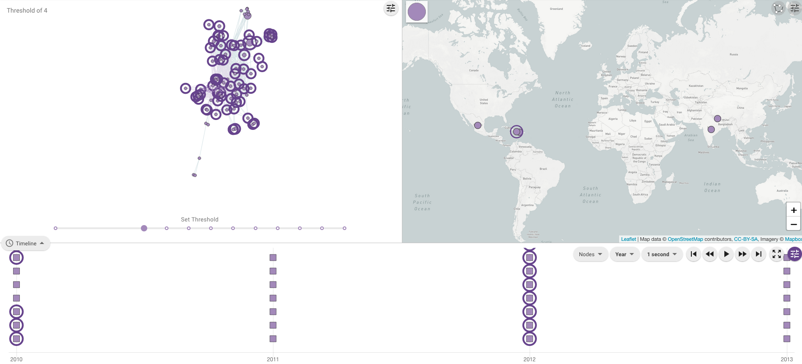

If you click on the circle representing India on the map, it will highlight the India isolates in the cgMLST cluster and the timeline below, and you can see that the Indian isolates were mostly from 2011 and some of them are at the very bottom of the cgMLST cluster (relatively distant from HCUF_01):

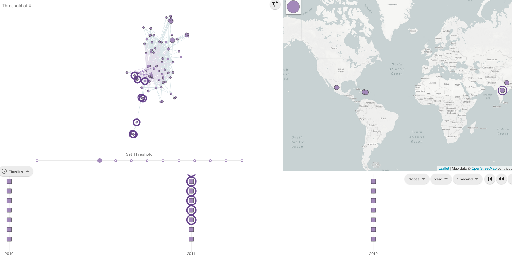
  
However, if you click on the circle representing Nepal on the map, it will highlight the Nepalese isolates in the cgMLST in the cgMLST cluster and timeline, and you can see the Nepalese isolates were mostly from 2010 and some of them are in the same big 'blob' of closely related Haitian isolates as HCUF_01:

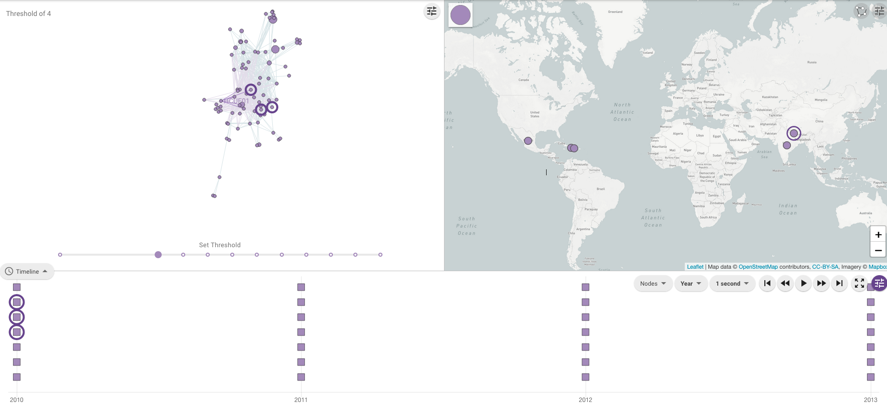

This suggests that HCUF_01 and other isolates from the Haiti 2010 epidemic were closely related to isolates from Nepal and India. This agrees with extensive analyses that have been since published on the origin of the Haiti epidemic in 2010, which led to the hypothesis that *V. cholerae* was carried from Nepal to Haiti (reviewed in `Orata et al 2014`_).

.. _Orata et al 2014: https://pubmed.ncbi.nlm.nih.gov/24699938/
 
As another example, let's take isolate ATCC 25872, which was collected from an outbreak in former Czechoslovakia in 1965 (`Aldova et al 1968`_). If you search for ATCC 25872 in Vibriowatch, you will see on its report page that it belongs to a cgMLST cluster of size 4 when a threshold of 10 SNPs is used:

.. _Aldova et al 1968: https://pubmed.ncbi.nlm.nih.gov/5640984/

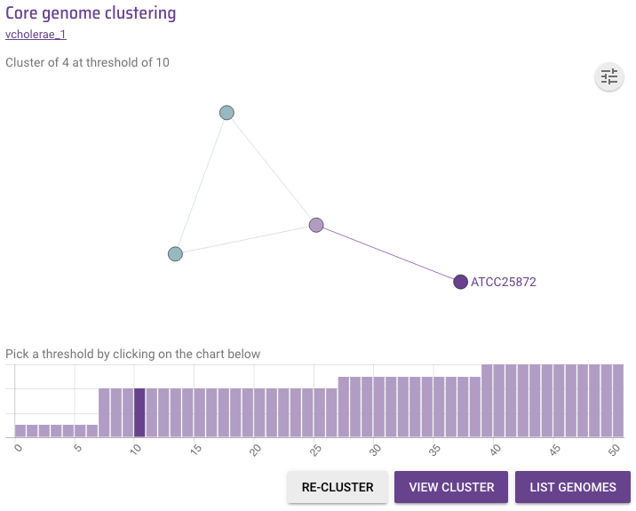
  
As this is quite few closely related isolates, we can mouse over the barchart below, and find that it belongs to a cluster of 6 isolates if a threshold of 50 SNPs is used:

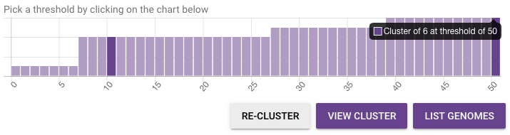
  
If we click on the big purple 'List genomes' button below the barchart, we can see the list of 4 closely related isolates:

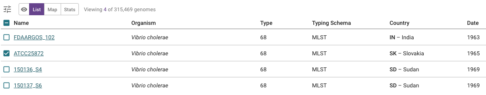
  
You can see that these 4 closely related isolates (ATCC 25872, 150136_S4, 150137_S6 and FDAARGOS_102) all belong to MLST sequence type ST68. In fact, they belong to the same *V. cholerae* lineage, which previously caused relatively small outbreaks in former Czechoslovakia and Sudan, and has recently been named in the 'Sudanese lineage' (Dorman & Thomson 2023, in press).
  
Build a phylogenetic tree of their isolate and its closest relatives
--------------------------------------------------------------------

Once we have found closely related isolates using cgMLST (see above), you can build a phylogenetic tree of your isolate of interest, and its close relatives. To ensure that your phylogenetic tree is rooted correctly, it is a good idea to use a relatively distantly related isolate as the 'outgroup' for your tree.

For example, in the case of isolate ATCC 25872 and its close relatives (ATCC 25872, 150136_S4, 150137_S6 and FDAARGOS_102), we know that these all belong to the MLST sequence type ST68. We can therefore use the *V. cholerae* isolate N16961, which has MLST sequence type ST69, as the outgroup, as it is relatively distantly related to ATCC 25872 and its close relatives (ATCC 25872, 150136_S4, 150137_S6 and FDAARGOS_102).

You can therefore build a collection of isolate ATCC 25872 and its close relatives (ATCC 25872, 150136_S4, 150137_S6 and FDAARGOS_102), and N16961. When you do this, you should get a tree that looks something like this:

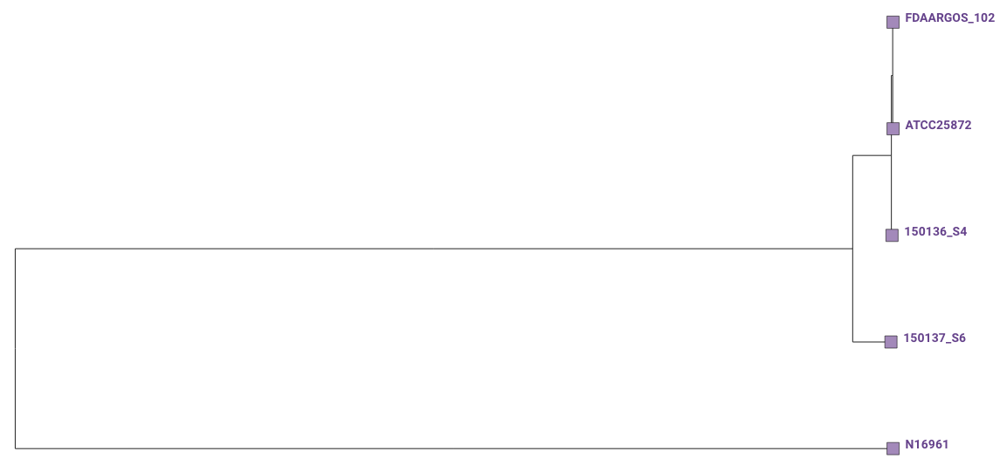
  
You can see that ATCC 25872 is a little more closely related to FDAARGOS_102 than to 150136_S4 or 150137_S6. Therefore, the closest relative of ATCC 25872 in the current version of Vibriowatch appears to be FDAARGOS_102, an isolate collected in India in 1963.

Acknowledgements
----------------

I would like here to acknowledge the great help and work of my colleagues at the Wellcome Sanger Institute, especially Dr Matthew Dorman, Dr Florent Lassalle, Dr Sina Beier, Dr Alyce Taylor-Brown, Dr Adrian Cazares, Sam Dougan, and Prof. Nicholas Thomson, and all of the Thomson group.

Thank you also to our fantastic collaborators Dr Corin Yeats and Prof. David Aanensen who have developed Pathogenwatch at the Centre for Genomic Pathogen Surveillance, and have extensively adapted it for Vibriowatch.

Thank you to Dr Josefina Campos (INEI-ANLIS Malbran, Argentina),
Dr Neelam Taneja and Nisha Singh (PGIMER Chandigarh, India), 
and Dr Yann Boucher (National University of Singapore),
who have advised us on Vibriowatch.

Lastly, but very importantly, we would
like to say thank you to our funders who have funded our work. These are the Bill and Melinda Gates Foundation, and also the University of Oxford, Wellcome Trust, and Wellcome Sanger Institute. 

Contact
-------

I will be grateful if you will send me (Avril Coghlan) corrections or suggestions for improvements to my email address alc@sanger.ac.uk

