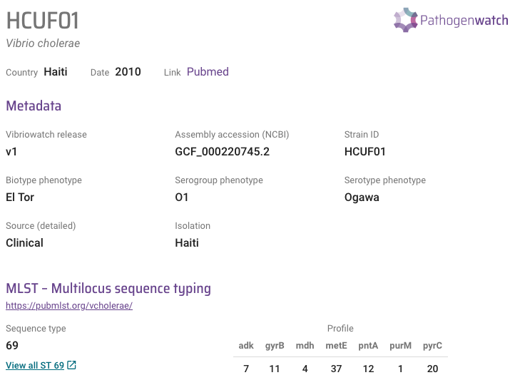

Finding closely related isolates
================================

This section will cover:

* `Short guide for those in a hurry: is my isolate closely related to other sequenced Vibrio cholerae isolates?`_.
* `Use cgMLST to find close relatives of your isolate: example 1`_.
* `Use cgMLST to find close relatives of your isolate: example 2`_.
* `Use cgMLST to find close relatives of your isolate: example 3`_.
* `Use cgMLST to find close relatives of your isolate: example 4`_.
* `Build a phylogenetic tree of their isolate and its closest relatives: example 1`_.
* `Build a phylogenetic tree of their isolate and its closest relatives: example 2`_.

Short guide for those in a hurry: is my isolate closely related to other sequenced Vibrio cholerae isolates?
------------------------------------------------------------------------------------------------------------

A good way to find out whether your isolate is closely related to other sequenced *V. cholerae* isolates is to look at cgMLST (core genome multi-locus sequence typing) results for your isolates in Vibriowatch.

Once you have sequencing reads or a genome assembly for your isolate to Vibriowatch (see `Is my isolate Vibrio cholerae? <https://vibriowatch.readthedocs.io/en/latest/assemblies.html#short-guide-for-those-in-a-hurry-is-my-isolate-vibrio-cholerae>`_), Vibriowatch will display a piechart showing the species of your isolates are, e.g.:

.. image:: Picture7.png
  :width: 650

To view the report pages for your isolates, which will show you their cgMLST analysis results, 
you need to click on the 'View genomes' link in the middle of the piechart.
  
This will bring up a list of your isolates in Vibriowatch, looking something like this:

.. image:: Picture8.png
  :width: 650
  
To go to the report page for a particular isolate, click on the link on the left in the 'Name' column, e.g. '1_S1_L001'.

If you scroll down the report page for an isolate, you will come to the 'core genome clustering' (cgMLST) section.

For example, here is cgMLST part of the report page for an isolate HCUF_01:

.. image:: Picture27.png
  :width: 650
  
This shows that HCUF_01 belongs to a 'cluster' of 1049 closely related isolates. 

These are the most closely related isolates among all the sequenced *V. cholerae* genomes that are in Vibriowatch (about 5000 genomes so far).

In this case, the cluster was defined using a threshold of 10 base differences (10 SNPs) between isolates, ie.
all the isolates in this cluster differ from each other by 10 or fewer SNPs in a
set of 2443 'core' *V. cholerae* genes.

If you found this useful, you may want to read through the rest of the tutorial to find out more details. 

Use cgMLST to find close relatives of your isolate: example 1
-------------------------------------------------------------

Since the MLST scheme of `Octavia et al 2013`_ was based on just seven genes, more recently `Liang et al 2020`_ have created a 'core genome MLST' (cgMLST) scheme for *V. cholorae*. This is based on 2443 core genes, that is genes that are present in almost all *V. cholorae* isolates sequenced by 2020. In VibrioWatch, we use this core genome MLST scheme to place isolates into clusters of closely related isolates. 

.. _Octavia et al 2013: https://pubmed.ncbi.nlm.nih.gov/23776471/

.. _Liang et al 2020: https://pubmed.ncbi.nlm.nih.gov/32540931/

For example, isolate HCUF_O1 is an isolate collected in Haiti in 2010, sequenced by `Hasan et al 2012`_. 

.. _Hasan et al 2012: https://pubmed.ncbi.nlm.nih.gov/22711841/

If you search for isolate HCUF_01 in Vibriowatch, you'll see at the top of its 
report page that HCUF_01 has Sequence Type 69 (ST69) in the Octavia scheme, so likely belongs to the current pandemic lineage (7PET lineage):

  
If you scroll down the report page for HCUF_01, you will come to the 'core genome clustering' (cgMLST) section:

.. image:: Picture27.png
  :width: 650
  
This shows that HCUF_01 belongs to a cgMLST cluster of 1049 isolates, when a threshold of 10 base differences (10 SNPs) is used to define clusters (ie. when any two isolates that differ by 10 or fewer SNPs in the 2443 core genes are put into the same cgMLST cluster). 

Since 1049 is a large number of related isolates, we can see if we can reduce the number of close relatives by using a stricter threshold for the allowed number of SNPs. If we mouse over the bars in the barchart, we can see that above the smallest bar it says 'cluster of 138 at threshold of 4':

  
This means that when a threshold of 4 base differences (4 SNPs) is used to define clusters (ie. when any two isolates that differ by 4 or fewer SNPs in the 2443 core genes are put into the same cgMLST cluster), then HCUF_01 is put into a cgMLST cluster with 138 closely related isolates. If you click on that bar in the barchart, you will see that cluster of 138 isolates, including HCUF_01:

.. image:: Picture52.png
  :width: 650
  
To see a list of the 138 closely related isolates in that cluster, you can click on the big purple 'List genomes' button. This will give a list of the 138 isolates (just showing the top of the list here):

To see the cluster of the 138 closely related isolates, click on the big purple 'View cluster' button. This will bring up a webpage showing the cgMLST cluster on the left and a map of the isolates in it on the right:

.. image:: Picture57.png
  :width: 850
  
You can see from the map that HCUF_01 and other isolates from Haiti are closely related to isolates from the Dominican Republic (Haiti's neighbour), Mexico, but also India and Nepal. 

If you click on the circle representing Haiti on the map, it will highlight the Haitian isolates in the cgMLST cluster and the timeline below, and youc an see the Haitian isolates are all in one big 'blob' of closely related isolates in the cgMLST cluster, and were collected in 2010 and 2012:

If you click on the circle representing India on the map, it will highlight the India isolates in the cgMLST cluster and the timeline below, and you can see that the Indian isolates were mostly from 2011 and some of them are at the very bottom of the cgMLST cluster (relatively distant from HCUF_01):

.. image:: Picture58.png
  :width: 850
  
However, if you click on the circle representing Nepal on the map, it will highlight the Nepalese isolates in the cgMLST in the cgMLST cluster and timeline, and you can see the Nepalese isolates were mostly from 2010 and some of them are in the same big 'blob' of closely related Haitian isolates as HCUF_01:

This suggests that HCUF_01 and other isolates from the Haiti 2010 epidemic were closely related to isolates from Nepal and India. This agrees with extensive analyses that have been since published on the origin of the Haiti epidemic in 2010, which led to the hypothesis that *V. cholerae* was carried from Nepal to Haiti (reviewed in `Orata et al 2014`_).

.. _Orata et al 2014: https://pubmed.ncbi.nlm.nih.gov/24699938/

Use cgMLST to find close relatives of your isolate: example 2
-------------------------------------------------------------

As another example, let's take isolate ATCC 25872, which was collected from an outbreak in former Czechoslovakia in 1965 (`Aldova et al 1968`_). If you search for ATCC 25872 in Vibriowatch, you will see on its report page that it belongs to a cgMLST cluster of size 4 when a threshold of 10 SNPs is used:

.. _Aldova et al 1968: https://pubmed.ncbi.nlm.nih.gov/5640984/

  
As this is quite few closely related isolates, we can mouse over the barchart below, and find that it belongs to a cluster of 6 isolates if a threshold of 50 SNPs is used:

.. image:: Picture54.png
  :width: 650
  
If you click on the far right bar in the barchart where (when you hover your mouse over it) it says 'cluster of 6 at threshold of 50', it will now show you the cluster of 6 isolates at a threshold of 50:

  
If we now click on the big purple 'List genomes' button below the barchart, we can see the list of 6 closely related isolates:

  
You can see that these 6 closely related isolates (1322-69, ATCC 25872, 150136_S4, 150137_S6, FDAARGOS_102 and V52) all belong to MLST sequence type ST68. In fact, they belong to the same *V. cholerae* lineage, which previously caused relatively small outbreaks in former Czechoslovakia and Sudan, and has recently been named in the 'Sudanese lineage' (Dorman & Thomson 2023, in press).

Use cgMLST to find close relatives of your isolate: example 3
-------------------------------------------------------------

Sometimes an isolate might not have any close relatives when we look at the cgMLST results. An example is isolate GXFL1-4, which was sequenced from prawns by `Zhou et al 2022`_. We see that it is in a cluster of size 1 with just itself, and that changing the threshold doesn't increase the cgMLST cluster size:

.. _Zhou et al 2022: https://pubmed.ncbi.nlm.nih.gov/35664858/

Use cgMLST to find close relatives of your isolate: example 4
-------------------------------------------------------------

Note that occasionally you may find that the barchart with closely related isolates is greyed out, even though when you mouse over it you may see a message saying something like 'cluster of 1869 at threshold of 19'. The reason that the barchart is greyed out, and that you can't click on it to see the cgMLT cluster, is that the cluster is too large for Vibriowatch to display. 

An example is isolate NALMLE08, collected by `Baddam et al 2020`_ in Bangladesh in 2018:

.. _Baddam et al 2020: https://pubmed.ncbi.nlm.nih.gov/32047137/

  
We see that NALMLE08 is in a cgMLST cluster of 1008 members using a threshold of 10. If we mouse over the barchart, we can see it is in a cgMLST cluster of 1701 members at a threshold of 14, but that bar is greyed out, as a cgMLST cluster of 1701 members is too big to display.
  
Build a phylogenetic tree of their isolate and its closest relatives: example 1
-------------------------------------------------------------------------------

Once we have found closely related isolates using cgMLST (see above), you can build a phylogenetic tree of your isolate of interest, and its close relatives. To ensure that your phylogenetic tree is rooted correctly, it is a good idea to use a relatively distantly related isolate as the 'outgroup' for your tree.

For example, in the case of the cgMLST cluster of HCUF-01 and its 138 close relatives that we found using cgMLST, we can get a list of the 138 isolates by pressing the big purple 'List genomes' button (see above). If we then click on the box to the left of the column heading 'Name', it will select all 138 close relatives (which includes HCUF-01):

  
We can see in this table that HCUF-01 and the other 137 close relatives in the cgMLST cluster are all sequence type ST69, which is one of the sequence types often seen in isolates from the current pandemic lineage (7PET lineage). We know that HCUF-01 should be closely related to all the other members of this cgMLST cluster. We can therefore use *V. cholerae* isolate N16961, which is the 'reference' 7PET isolate, and was collected in Bangladesh in 1975, as the outgroup in our tree, as although it is 7PET, it should be relatively distantly related to HCUF-01 and its 137 close relatives. If you type 'N16961' in the search box at the top left of the Vibriowatch webpage, you will find MAK757, and can tick the box to select it too:

  
If you then click on the purple '139 Selected Genomes' button at the top right, you can make a collection of the 138 close relatives plus N16961 (the outgroup). This will build a tree in Vibriowatch, which should look something like this, which the N16961 outgroup on a very long branch at the bottom of the tree:

You can see that the scalebar at the bottom of the tree says '6', which is a very short genetic distance, indicating that all these isolates are  closely related. If you zoom in on the bottom of the tree, you will see something like this, displaying the isolate names on the tree tips:

  
To display the locations where the isolates were collected on the tree tips, instead of the isolate names, we can click on the 'Timeline' menu, and select 'Metadata', and then choose 'Isolation' in the Metadata menu. You should now see the locations displayed on the tree tips:

You can see that there are several clades of closely related isolates from Mexico, and from Haiti. To make the tree a bit easier to view, you can zoom in on these clades and collapse them. For example, if you zoom in on the Mexico isolates, and right-click your mouse on the ancestral node of the Mexico isolates, a menu should appear, and then you can select 'Collapse subtree' in that menu:

The collapsed part of the tree containing the Mexico isolates is now represented by a single round node, and if you hover your mouse over it, you should see '30' appear, meaning that it represents 30 isolates (from Mexico):

  
If we also collapse a few clades that just contain isolates from Haiti, the tree is much easier to view, and should look something like this:

.. image:: Picture77.png
  :width: 650

We can see that near the root of the tree (ie. near N16961) there are several isolates from India. The Haitian isolates in the tree are extremely closely related to isolates from Nepal (which appear near the top of the tree). This agrees with analyses published on the origin of the Haiti epidemic in 2010, which support the hypothesis that *V. cholerae* was carried from Nepal to Haiti (reviewed in `Orata et al 2014`_). Note that there are also isolates from Dominican Republic and Mexico that are very closely related to the Haitian isolates; these isolates were due to outbreaks in Dominican Republic and Mexico that occurred when travellers went from Haiti to those nearby countries.

.. _Orata et al 2014: https://pubmed.ncbi.nlm.nih.gov/24699938/

One thing you might be interested in is to ask: what is the closest relative of HCUF-01 in the tree? If you zoom in on the tree, you can find a part of the tree containing HCUF-01 and its closest relatives according to the tree. You can see the scale-bar at the bottom left shows a distance of 1, which is a very short genetic distance. Therefore, all the isolates in this part of the tree are very closely related:

 
You can then display the country on this tree, by clicking on the 'Timeline' menu and choosing 'Metadata', and selecting the 'Isolation' column, which shows that most of very close relatives of HCUF-01 are from Haiti, but a couple were from the Dominican Republic or Nepal:

  
Similarly, you can select the "Literature link" column of the metadata table to show the PubMed reference for the papers that published each isolate:

  
This tells us that the isolates were published by `CDC 2010`_, `Reimer et al 2011`_, `Hendriksen et al 2011`_, `Hasan et al 2012`_, `Sealfon et al 2012`_, `Azarian et al 2014`_, and `Weill et al 2017`_.

.. _CDC 2010: https://pubmed.ncbi.nlm.nih.gov/24699938/

.. _Reimer et al 2011: https://pubmed.ncbi.nlm.nih.gov/22099115/ 

.. _Hendriksen et al 2011: https://pubmed.ncbi.nlm.nih.gov/21862630/

.. _Hasan et al 2012: https://pubmed.ncbi.nlm.nih.gov/22711841/

.. _Sealfon et al 2012: https://pubmed.ncbi.nlm.nih.gov/22963323/

.. _Azarian et al 2014: https://pubmed.ncbi.nlm.nih.gov/25538191/ 

.. _Weill et al 2017: https://pubmed.ncbi.nlm.nih.gov/29123067/

In a similar way, you can select the "AMR phenotype" column in the metadata table, to show antimicrobial resistance phenotypic information (from lab. tests) beside the tree: 

  
We see that many of the closely related isolates had trimethoprim (see symbol "TMP" beside the tree); sulfamethoxazole ("SMZ"), trimethoprim and sulfamethoxazole ("SXT"), nalidixic acid ("NAL"), furazolidone ("FZD"), and intermediate resitance to ciprofloxacin ("(CIP)"). 

Similarly, you can the "serotype phenotype" column of the metadata table to plot the lab. serotype for the related isolates:

  
This revealed that the closely related isolates had serotype Ogawa.
  
Build a phylogenetic tree of their isolate and its closest relatives: example 2
-------------------------------------------------------------------------------

Let's look at another example: the case of isolate ATCC 25872 and its close relatives (ATCC 25872, 150136_S4, 150137_S6 and FDAARGOS_102) in the cgMLST cluster of size 4. We know that these all belong to the MLST sequence type ST68. We can therefore use the *V. cholerae* isolate N16961, which has MLST sequence type ST69, as the outgroup, as it is relatively distantly related to ATCC 25872 and its close relatives (ATCC 25872, 150136_S4, 150137_S6 and FDAARGOS_102).

You can therefore build a collection of isolate ATCC 25872 and its close relatives (ATCC 25872, 150136_S4, 150137_S6 and FDAARGOS_102), and N16961. When you do this, you should get a tree that looks something like this:

.. image:: Picture56.png
  :width: 650
  
You can see that ATCC 25872 is a little more closely related to FDAARGOS_102 than to 150136_S4 or 150137_S6. Therefore, the closest relative of ATCC 25872 in the current version of Vibriowatch appears to be FDAARGOS_102, an isolate collected in India in 1963.

Contact
-------

I will be grateful if you will send me (Avril Coghlan) corrections or suggestions for improvements to my email address alc@sanger.ac.uk

