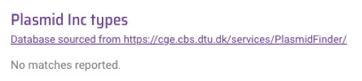

Downloading data from Vibriowatch
=================================

This section will cover:

* `Downloading data for a set of isolates`_.
* `Downloading data for a collection`_.
* `Bulk downloads of all Vibriowatch data`_.
* `Plotting Vibriowatch trees and data in Microreact`_.

Downloading data for a set of isolates
--------------------------------------

You can download data for a set of isolates by first creating a list of the isolates you are interested in.

For example, this links to a `list of all publicly available isolates in Vibriowatch`_.
If you click on the list you will see a list like this (showing the top of the list):

.. _list of all publicly available isolates in Vibriowatch: https://pathogen.watch/genomes/all?access=public&genusId=662

.. image:: Picture141.png
  :width: 600

If you are interested in downloading the data for the top 5 isolates, you can click the boxes
beside their names:

Then if you click on the purple button saying "5 Selected Genomes" at the top right of the webpage, you can click on
"Download data", and this will allow you to download data for those 5 genomes, such as:

* fasta files of the genomes
* metadata for the genomes (e.g. place and date of collection
* AMR predictions - this says whether each isolate is predicted to be resistant (or not) to a set of antimicrobials
* AMR genes/mutations - this says whether each isolate has any of a set of known *V. cholerae* AMR genes and mutations
* Inctyper - this says whether each isolate is predicted to have plasmids
* MLST 
* stats - genome assembly statistics (e.g. N50)
* lineage - this is based on PopPUNK
* virulence - this says whether each isolate has any of a set of known *V. cholerae* virulence genes

Downloading data for a collection
---------------------------------

Plasmids can be an interesting and important feature of *Vibrio cholerae* genomes, particularly because
antibiotic resistance genes are carried by IncC/A-type plasmids in some isolates from the current
pandemic lineage (7PET). For example, the multi-drug resistant (MDR) phenotype seen in *V. cholerae* in
Yemen, starting in 2019, was due to spread of an IncC-type plasmid carrying antibiotic resistance genes
(`Lassalle et al 2022`_).
Therefore, understanding of evolution and spread of plasmids and other mobile elements in *V. cholerae*,
particularly in the current pandemic lineage (7PET lineage) is an important topic of research. 

.. _Lassalle et al 2022: https://www.biorxiv.org/content/10.1101/2022.08.24.504966v1

Many plasmids have been identified in environmental isolates of *Vibrio cholerae* 
(note that most of these isolates probably do not belong to the current pandemic lineage), as well 
as in isolates of the current pandemic lineage (7PET lineage) (see `De et al 2021`_). Some of these
*V. cholerae* plasmids have been given names (e.g. 'pVC1', 'pVC2', 'pSDH-1', 'pSDH-2', 'p3iANG', etc.).
Some of the classes of plasmids seen in *V. cholerae* are ColE1-like plasmids and Inc-A/C family plasmids (`De et al 2021`_).

.. _De et al 2021: https://www.frontiersin.org/articles/10.3389/fitd.2021.691604/full

Bulk downloads of all Vibriowatch data
--------------------------------------

Vibriowatch uses the IncTyper tool to identify plasmids in *Vibrio cholerae* genomes.
If no plasmids are predicted in the genome of an isolate, you will see this in the 'Plasmid Inc types'
section of its report page:

  
An example of an isolate with a predicted plasmid is RC9, which was isolated in Kenya in 1985.
Here is the 'Plasmid Inc types' section of its report page in Vibriowatch:

  
This shows that this isolate is predicted by Vibriowatch to have a IncC-type plasmid.

Plotting Vibriowatch trees and data in Microreact
-------------------------------------------------

CholeraBook
-----------

If you would like to learn more about cholera genomics, you may also be interested in our `Online Cholera Genomics Course (CholeraBook)`_.

.. _Online Cholera Genomics Course (CholeraBook): https://cholerabook.readthedocs.io/

Contact
-------

I will be grateful if you will send me (Avril Coghlan) corrections or suggestions for improvements to my email address alc@sanger.ac.uk
