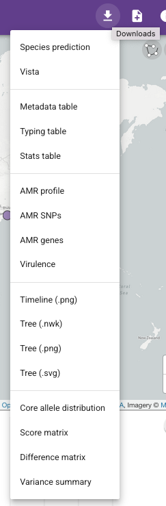
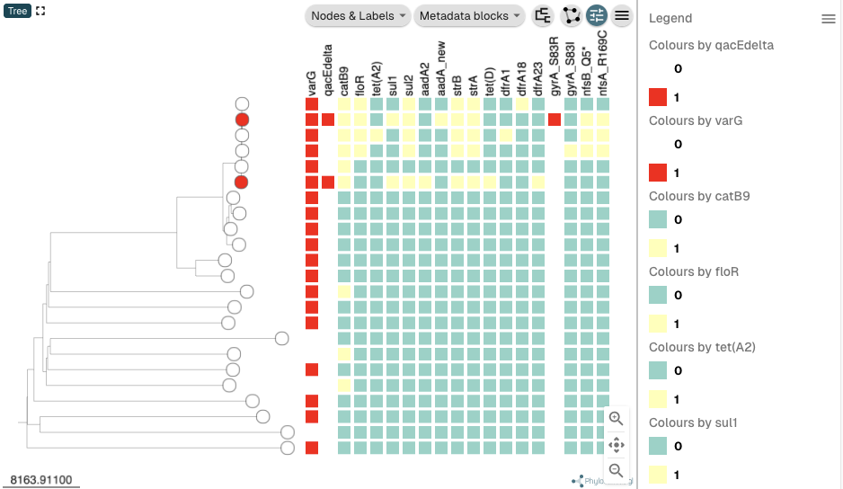

Downloading and sharing Vibriowatch data 
========================================

This section will cover:

* `Downloading data for a set of isolates`_.
* `Downloading data for a collection`_.
* `Sharing data with collaborators`_.
* `Plotting the tree and data for a Vibriowatch collection in Microreact`_.
* `Bulk downloads of all Vibriowatch data`_.

Downloading data for a set of isolates
--------------------------------------

You can download data for a set of isolates by first creating a list of the isolates you are interested in.

For example, this links to a `list of all publicly available isolates in Vibriowatch`_.
If you click on the list you will see a list like this (showing the top of the list):

.. _list of all publicly available isolates in Vibriowatch: https://pathogen.watch/genomes/all?access=public&genusId=662

.. image:: Picture141.png
  :width: 800

If you are interested in downloading the data for the top 5 isolates, you can click the boxes
beside their names:

.. image:: Picture142.png
  :width: 800

Then if you click on the purple button saying "5 Selected Genomes" at the top right of the webpage, you can click on
"Download data", and this will allow you to download data for those 5 genomes, such as:

* fasta files of the genomes
* metadata for the genomes (e.g. place and date of collection)
* AMR predictions - this says whether each isolate is predicted to be resistant (or not) to a set of antimicrobials
* AMR genes/mutations - this says whether each isolate has any of a set of known *V. cholerae* AMR genes and mutations
* Inctyper - this says whether each isolate is predicted to have plasmids
* MLST 
* stats - genome assembly statistics (e.g. N50)
* lineage - this is based on PopPUNK
* virulence predictions from the Vista tool - this says whether each isolate has any of a set of known *V. cholerae* virulence genes
* etc.

Downloading data for a collection
---------------------------------

You can also download data for a "collection" from Vibriowatch.

For example, this links to the `collection for the isolates sequenced by Chun et al 2009`_. 

.. _collection for the isolates sequenced by Chun et al 2009: https://pathogen.watch/collection/2c43jl3z2xs8-vibriowatch-collection-chun-et-al-2009

At the top right of the webpage for a collection, you will see a small "Downloads" button:

If you click on this "Downloads" button, you will have the be able to choose to download data for the collection, such as:

* virulence predictions from the Vista tool - this says whether each isolate has any of a set of known *V. cholerae* virulence genes
* metadata for the genomes (e.g. place and date of collection)
* typing for the genomes, e.g. MLST and PopPUNK for identifying lineages, and IncTyper (for plasmid predictions)
* stats - genome assembly statistics (e.g. N50)
* AMR predictions - this says whether each isolate is predicted to be resistant (or not) to a set of antimicrobials
* AMR genes/mutations - this says whether each isolate has any of a set of known *V. cholerae* AMR genes and mutations
* a phylogenetic tree, e.g. in Newick (.nwk) format

Sharing data with collaborators
-------------------------------

You can share a Vibriowatch collection with your collaborators by clicking on the "Information" icon at the top right
of the webpage when you are viewing your collection:

.. image:: Picture149.png
  :width: 50

If you then choose "Shared: available to anyone with the link, no sign-in required" in the menu that appears,
you will be able to give the link for your collection (the address at the top of the webpage, something like this example that I made:
https://pathogen.watch/collection/a1xycm9s9pvm-h22-and-close-relatives-1326-genomes) to your collaborators, and then they will be able
to view the collection too. 

Plotting the tree and data for a Vibriowatch collection in Microreact
---------------------------------------------------------------------

`Microreact`_ is a very nice tool that allows easy and pretty plotting of phylogenetic tree data, as well as metadata and other computed data (e.g. AMR and virulence predictions) beside the tree.

.. _Microreact: https://microreact.org/

It's possible to download all the metadata and computed data from a Vibriowatch collection and upload it into Microreact to re-plot it there.
This is particularly useful if you want to plot multiple types of data/metadata beside a phylogenetic tree (e.g. country, date of collection, presence/absence of virulence genes, etc.).

For example, this links to the `collection for the isolates sequenced by Chun et al 2009`_. 

.. _collection for the isolates sequenced by Chun et al 2009: https://pathogen.watch/collection/2c43jl3z2xs8-vibriowatch-collection-chun-et-al-2009

At the top right of the webpage for a collection, you will see a small "Downloads" button:

If you click on this "Downloads" button, you will have the be able to choose to download data for the collection, 
and you can choose to download the tree as a .nwk format file, the metadata table, and the virulence gene predictions.
This should give you three files that you have downloaded, called something like:

* pathogenwatch-vibcl-2c43jl3z2xs8-vibriowatch-collection-chun-et-al-2009-collection-tree.nwk
* pathogenwatch-vibcl-2c43jl3z2xs8-vibriowatch-collection-chun-et-al-2009-metadata.csv
* pathogenwatch-vibcl-2c43jl3z2xs8-vibriowatch-collection-chun-et-al-2009-vista.csv

Then you can go to the `Microreact`_ website to upload the data.

.. _Microreact: https://microreact.org/

On the Microreact website, click on "UPLOAD" at the top right of the website. 
Then you will see a circle saying "Drop files here". Select the three files above (..collection-tree.nwk, ..metadata.csv, ..vista.csv)
on your computer (press down "Shift" on your keyboard to select three files at once), and drag and drop them into the "Drop files here" circle on the website.
You should see a box pop up like this:

.. image:: Picture144.png
  :width: 350

Press "Continue". Then a box will pop up asking you to select the "Main data file" from a menu. Select the "..metadata.csv" file.
Then it will ask you to select the ID column, and you can select "NAME" as the ID column. Press "Continue".
Then it will ask you to select the ID columns for the other files, and again select "NAME" as the ID columns for all the files. Press "Continue" again.

Then it should open the data in Microreact. You should see a panel with a map on the top left, with your tree on the top right, and with the metadata below them.

.. image:: Picture145.png
  :width: 900

You can colour the isolates in the tree and dots in the map by different values in the metadata table. If you scroll along the metadata
table to the right (drag the slider below the metadata table), you will find the column with the country of isolation of the isolates, which has
the heading "ISOLATION". Click on the "ISOLATION" heading in the metadata table. You should now see that the isolates in the tree and dots
on the map are coloured according to country where the isolates were collected:

If you want to plot additional variables beside the tree, you can click on the "Controls" button at the top right of the tree panel:

.. image:: Picture147.png
  :width: 50

If you click on "Metadata blocks" in the menu that appears, you can click on "Serotype phenotype" and "Serogroup phenotype" and "ctxA" and "ctxB", to plot the serotype (e.g. Inaba/Ogawa) and
serogroup (e.g. O1/O139/O37/etc.) phenotypes and presence/absence of *ctxA* and *ctxB* genes beside the tree, and then press "X" at the top of the menu to close the menu. You can also
click "Legend" at the top right of the tree panel to see a legend. You should now see the serogroup and serotype and *ctx* gene presence/absence beside the tree:

Let's try another example, this time exporting the antimicrobial resistance predictions from the Vibriowatch `collection for the isolates sequenced by Chun et al 2009`_, to plot in Microreact. In this case, in the `collection for the isolates sequenced by Chun et al 2009`_, we click on the "Downloads" button at the top right of the collection webpage,
and you will see a list of files that you can download. This time, select to download the "Metadata table", "AMR genes", "AMR SNPs" and "tree (.nwk)" (containing the isolates' metadata, the predicted AMR genes, predicted AMR mutations, and the phylogenetic tree):

.. _collection for the isolates sequenced by Chun et al 2009: https://pathogen.watch/collection/2c43jl3z2xs8-vibriowatch-collection-chun-et-al-2009

Now, before loading the data into Microreact, we may want to specify the colours that we want to use to plot gene presence and absence. Let's use red for
gene presence and white for gene absence, like we do in Vibriowatch. Open the file that you have downloaded called "something-amr-genes.csv" in Excel,
and add an extra column that says "varG__colour" (note the two "_"s in the column name) beside the column "varG", and put "red" in the "varG__colour" column wherever
there is a "1" in the "varG" column, and "white" in the "varG__colour" column wherever there is a "0" in the "varG" column:

Then save the file.
Then open the file "something-amr-snps.csv", and similarly add a new column "gyrA_S83R__colour" beside column "gyrA_S83R", and put "red" in that
column wherever there is a "1" in column "gyrA_S83R", and "white" in column "gyrA_S83R__colour" wherever there is "0" in column "gyrA_S83R":

.. image:: Picture164.png
  :width: 300

Then save that file.

Then go to the `Microreact`_ website to upload the data, and this time drag all four files (something-amr-genes.csv,
something-amr-snps.csv, something-collection-tree.nwk, and something-metadata.csv) into the Microreact website to upload them.
When these are loaded into Microreact, you should see the map on the top left, and tree at the top right. Click on 
the "Controls" button above the tree, and under "METADATA BLOCKS" click next to the names of all the resistance genes and mutations:

.. _Microreact: https://microreact.org/

Click on "Legend" at the top right of the tree panel to show the legend too, to show the legend. Your tree should look like this:

You can see that the columns for gene *varG* and the *gyrA_S83R* mutation are coloured using the colour scheme that we specified in the Excel spreadsheets containing
AMR genes and AMR mutations, respectively. To make the use the same colourscheme for the *qacEdelta* gene as for *varG*, click on the 
small "Settings" symbol (shaped like an eye) at the top right of the tree panel:

In the menu that pops up, choose "qacEdelta" in the "Colour Column" drop-down menu, and "Reuse" in the "Colour Palette" drop-down menu, and click
on the circle beside "varG" to tell it to use the *varG* gene colour scheme for the *qacEdelta* gene:

Then click on the "Settings" symbol (shaped like an eye) again at the top right of the tree panel, to close the Settings menu.
Your tree should now look like this, with the *qacEdelta* gene now using the same colour scheme as the *varG* gene:

In the same way, you can now set the colour schemes for the other AMR genes to be the same as the colour scheme for *varG*, and the
colour schemes for the other mutations to be the same as the colour scheme for the *gyrA_S83R* mutation. After you have done all that,
your tree should look like this:

You can see that the three top isolates are represented by red nodes in the tree, as they are coloured by presence/absence of the
*nfsA_R169C* mutation, the last mutation that I changed the colour scheme for.
To instead colour the nodes in the tree by the serogroup phenotype of the isolates, click on the "metadata" heading at the top
of the panel at the bottom of the webpage, and then click on the column heading "SEROGROUP":

The nodes in the tree (representing the isolates) should now be coloured by their serogroup phenotype, and the
serogroup phenotype colour scheme will be shown in the Legend to the right of the tree:

You can see that some of the isolates in the `collection for the isolates sequenced by Chun et al 2009`_ that are
at the top of the tree, and that have O1 or O139 serogroup phenotype, tend to have quite a lot of antimicrobial resistance genes
and mutations. These isolates in fact belong to the current pandemic lineage (7PET lineage) of *V. cholerae* (highlighted by a big blue box in this picture).
This illustrates that the 7PET lineage has quite a lot of antimicrobial resistance genes and mutations, which is of course concerning:

.. _collection for the isolates sequenced by Chun et al 2009: https://pathogen.watch/collection/2c43jl3z2xs8-vibriowatch-collection-chun-et-al-2009

Bulk downloads of all Vibriowatch data
--------------------------------------

You can download all the data for *V. cholerae* from Pathogenwatch using the following links:

* `AMR mutations and genes`_
* `antimicrobial resistance predictions`_
* `closest relatives (from core genome MLST)`_
* `presence/absence of V. cholerae core genes`_
* `fastas files for all genomes (a very large file!)`_
* `plasmid prediction using IncTyper`_
* `metadata for all genomes`_
* `assembly statistics`_
* `MLST analyses`_
* `PopPUNK lineage assignments`_
* `virulence gene predictions (using the Vista tool)`_

.. _AMR mutations and genes: https://pathogenwatch-public.ams3.cdn.digitaloceanspaces.com/Vibrio%20cholerae__amrsearch-snps-genes.csv.gz
.. _antimicrobial resistance predictions: https://pathogenwatch-public.ams3.cdn.digitaloceanspaces.com/Vibrio%20cholerae__amrsearch.csv.gz
.. _closest relatives (from core genome MLST): https://pathogenwatch-public.ams3.cdn.digitaloceanspaces.com/Vibrio%20cholerae__cgmlst.csv.gz
.. _presence/absence of V. cholerae core genes: https://pathogenwatch-public.ams3.cdn.digitaloceanspaces.com/Vibrio%20cholerae__core.csv.gz
.. _fastas files for all genomes (a very large file!): https://pathogenwatch-public.ams3.cdn.digitaloceanspaces.com/Vibrio%20cholerae__fastas.zip
.. _plasmid prediction using IncTyper: https://pathogenwatch-public.ams3.cdn.digitaloceanspaces.com/Vibrio%20cholerae__inctyper.csv.gz
.. _metadata for all genomes: https://pathogenwatch-public.ams3.cdn.digitaloceanspaces.com/Vibrio%20cholerae__metadata.csv.gz
.. _assembly statistics: https://pathogenwatch-public.ams3.cdn.digitaloceanspaces.com/Vibrio%20cholerae__metrics.csv.gz
.. _MLST analyses: https://pathogenwatch-public.ams3.cdn.digitaloceanspaces.com/Vibrio%20cholerae__mlst.csv.gz
.. _PopPUNK lineage assignments: https://pathogenwatch-public.ams3.cdn.digitaloceanspaces.com/Vibrio%20cholerae__poppunk2.csv.gz
.. _virulence gene predictions (using the Vista tool): https://pathogenwatch-public.ams3.cdn.digitaloceanspaces.com/Vibrio%20cholerae__vista.csv.gz 

CholeraBook
-----------

If you would like to learn more about cholera genomics, you may also be interested in our `Online Cholera Genomics Course (CholeraBook)`_.

.. _Online Cholera Genomics Course (CholeraBook): https://cholerabook.readthedocs.io/

Contact
-------

I will be grateful if you will send me (Avril Coghlan) corrections or suggestions for improvements to my email address alc@sanger.ac.uk
