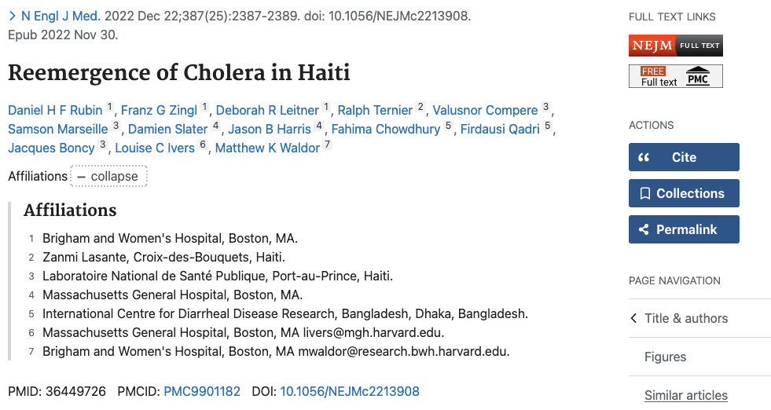
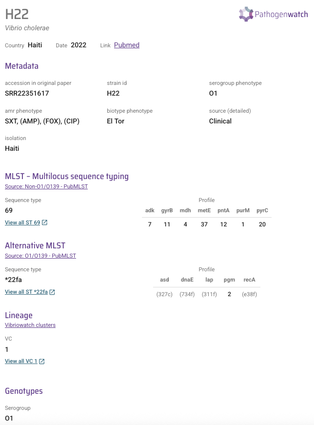
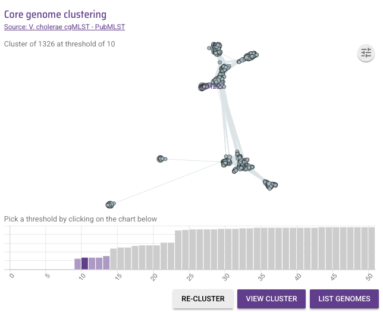
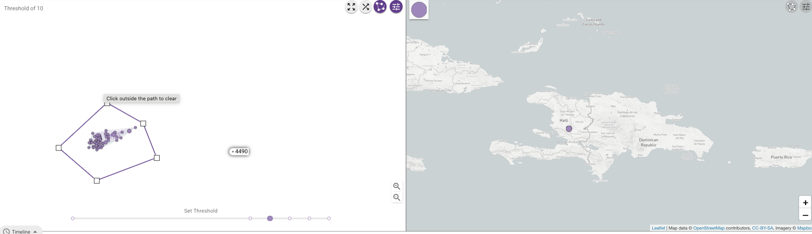

Case study - Haiti 2022 
=======================

Pour voir une traduction française de cette page, voir `traduction française`_).

.. _traduction française: https://vibriowatch.readthedocs.io/en/latest/haiti_francais.html

Estudo de caso - Haiti 2022 

ဖြစ်ရပ်မှန်လေ့လာမှု - ဟေတီ ၂၀၂၂

دراسة حالة - هايتي

مطالعه موردی - هائیتی 2022

This section is a worked example of using Vibriowatch to analyse cholera genomic data, using the Haiti 2022 outbreak as an example.

Esta seção é um exemplo prático do uso do Vibriowatch para analisar dados genômicos de cólera, usando o surto de 2022 no Haiti como exemplo.

ဤအပိုင်းသည် ဟေတီ 2022 ဖြစ်ပွားမှုကို နမူနာအဖြစ် အသုံးပြု၍ ကာလဝမ်းမျိုးဗီဇဒေတာကို ခွဲခြမ်းစိတ်ဖြာရန် Vibriowatch ကို အသုံးပြုခြင်း၏ နမူနာတစ်ခုဖြစ်သည်။

يعد هذا القسم مثالاً على استخدام Vibriowatch لتحليل بيانات الجينوم الخاصة بالكوليرا، باستخدام تفشي وباء الكوليرا في هايتي عام 2022 كمثال.

این بخش یک مثال کاربردی از استفاده از Vibriowatch برای تجزیه و تحلیل داده‌های ژنومی وبا است که از شیوع هائیتی در سال 2022 به عنوان نمونه استفاده می‌کند.

We wish to pay homage to the public health professionals, scientists and public servants of Haiti, and to the patient
who generously donated a sample, for making this cholera genomic data publicly available and therefore contributing a lot to our
global understanding of cholera.

Gostaríamos de prestar homenagem aos profissionais de saúde pública, cientistas e servidores públicos do Haiti, e ao paciente que generosamente doou uma amostra, por tornar esses dados genômicos da cólera disponíveis publicamente e, portanto, contribuir muito para nossa compreensão global da cólera.

ကျွန်ုပ်တို့သည် ဟေတီပြည်သူ့ကျန်းမာရေးပညာရှင်များ၊ သိပ္ပံပညာရှင်များနှင့် ပြည်သူ့ကျေးကျွန်များနှင့် နမူနာတစ်ခုကို ရက်ရက်ရောရောလှူဒါန်းခဲ့သော လူနာအား ဂါရဝပြုလိုပါသည်။ 
ဤ ကာလဝမ်းရောဂါ မျိုးရိုးဗီဇဆိုင်ရာ အချက်အလက်ကို လူသိရှင်ကြား ရရှိစေခြင်းဖြင့် ၎င်းတို့သည် ကာလဝမ်းရောဂါအကြောင်း ကျွန်ုပ်တို့၏ ကမ္ဘာလုံးဆိုင်ရာ နားလည်မှုကို များစွာ အထောက်အကူ ပြုစေပါသည်။

نود أن نعرب عن تقديرنا للعاملين في مجال الصحة العامة والعلماء والموظفين الحكوميين في هايتي، وللمريض الذي تبرع بسخاء بعينة، لجعل هذه البيانات الجينومية للكوليرا متاحة للجمهور، وبالتالي المساهمة بشكل كبير في فهمنا العالمي للكوليرا.

ما مایلیم از متخصصان بهداشت عمومی، دانشمندان و خدمتگزاران مردم هائیتی و از بیماری که سخاوتمندانه نمونه‌ای اهدا کرد، به خاطر در دسترس عموم قرار دادن این داده‌های ژنومی وبا و در نتیجه کمک شایانی به درک جهانی ما از وبا، ادای احترام کنیم.

This case study has been selected as it is an example of *Vibrio cholerae* persisting within a country or region between outbreaks. It also illustrates
how, if sampling is patchy, it is difficult to distinguish between persistance within a country and re-introduction from a nearby country.
Furthermore, it illustrates how it is very difficult to distinguish between persistance of *Vibrio cholerae* in the human population between outbreaks, versus
persistance in the environment between outbreaks.

Este estudo de caso foi selecionado por ser um exemplo da persistência do Vibrio cholerae em um país ou região entre surtos. Ele também ilustra como, se a amostragem for irregular, é difícil distinguir entre a persistência dentro de um país e a reintrodução de um país vizinho. Além disso, ilustra como é muito difícil distinguir entre a persistência do Vibrio cholerae na população humana entre surtos e a persistência no ambiente entre surtos.

နိုင်ငံတစ်ခု သို့မဟုတ် ဒေသတစ်ခုအတွင်း ကာလဝမ်းရောဂါဖြစ်ပွားမှုကြားကာလတွင် ဆက်လက်တည်ရှိနေသည့် Vibrio cholerae ၏ နမူနာတစ်ခုဖြစ်သောကြောင့် ဤဖြစ်ရပ်လေ့လာမှုကို ရွေးချယ်ထားပါသည်။
နမူနာယူခြင်းသည် ကွက်တိဖြစ်နေပါက နိုင်ငံတစ်ခုအတွင်း၌ တည်မြဲမှုနှင့် အနီးနားနိုင်ငံမှ ပြန်လည်မိတ်ဆက်ခြင်းကြားတွင် ခွဲခြားရန်ခက်ခဲကြောင်း ၎င်းမှလည်း သရုပ်ဖော်သည်။ 
ထို့အပြင်၊ ၎င်းသည် လူ့လူဦးရေတွင် Vibrio cholerae ၏တည်မြဲမှုကို ခွဲခြားရန် အလွန်ခက်ခဲပုံကို သရုပ်ဖော်ထားပြီး ရောဂါဖြစ်ပွားမှုကြား ပတ်ဝန်းကျင်တွင် ဆက်လက်တည်ရှိနေခြင်းကို သရုပ်ဖော်သည်။

اختيرت دراسة الحالة هذه لأنها مثال على استمرار وجود ضمة الكوليرا داخل بلد أو منطقة بين تفشيات المرض. كما توضح كيف يصعب التمييز بين استمرار وجودها داخل بلد ما وإعادة ظهورها من بلد مجاور، في حال عدم انتظام أخذ العينات.
علاوة على ذلك، توضح الدراسة صعوبة التمييز بين استمرار وجود ضمة الكوليرا بين السكان بين تفشيات المرض، واستمرار وجودها في البيئة بين تفشيات المرض.

این مطالعه موردی به این دلیل انتخاب شده است که نمونه‌ای از ویبریو کلرا است که در یک کشور یا منطقه بین شیوع‌ها باقی مانده است.
همچنین نشان می‌دهد که اگر نمونه‌برداری تکه‌تکه باشد، تشخیص بین تداوم در داخل یک کشور و معرفی مجدد از یک کشور مجاور دشوار است.
علاوه بر این، این نشان می‌دهد که چگونه تشخیص بین ماندگاری ویبریو کلرا در جمعیت انسانی بین شیوع‌ها، در مقابل ماندگاری آن در محیط بین شیوع‌ها بسیار دشوار است.

.. image:: HorizontalDivider.png
  :width: 1200

* `The Haiti 2022 outbreak`_.
* `The H22 genome`_.
* `Finding the H22 genome in Vibriowatch`_.
* `Assembly quality of the H22 genome`_.
* `Is H22 predicted to produce cholera toxin?`_
* `Is H22 predicted to have antimicrobial resistance?`_
* `Is H22 predicted to have plasmids?`_
* `What is the predicted serogroup of the H22 isolate?`_
* `Does H22 belong to the pandemic lineage of Vibrio cholerae?`_.
* `What are the closest relatives of H22 among published Vibrio cholerae genomes?`_.
* `What can we say about the origins of the Haiti 2022 outbreak, based on the H22 genome?`_
* `Reflections on the Haiti 2022 case study`_

.. image:: HorizontalDivider.png
  :width: 1200

The Haiti 2022 outbreak
-----------------------

O surto do Haiti em 2022

ဟေတီ 2022 ဖြစ်ပွားမှု

تفشي المرض في هايتي 2022

شیوع هائیتی ۲۰۲۲

You may already know that in January 2010 there was a catastrophic earthquake in Haiti, a country that forms part of the Caribbean island named Hispaniola.
Later that year, in October 2010, a huge cholera outbreak began in Haiti, that lasted up until 2019, and included
more than 820,000 cholera cases and nearly 10,000 deaths from cholera. This outbreak was found to have been caused
by the current pandemic lineage of *Vibrio cholerae* (known as the 7PET lineage), and evidence suggests that it
was likely carried from Nepal to Haiti in 2010 (`Orata et al 2014`_). 

Você já deve saber que em janeiro de 2010 houve um terremoto catastrófico no Haiti, uma ilha no Caribe.
Mais tarde naquele ano, em outubro de 2010, um enorme surto de cólera teve início no Haiti, que durou até 2019 e incluiu
mais de 820.000 casos de cólera e quase 10.000 mortes por cólera. Descobriu-se que esse surto foi causado
pela atual linhagem pandêmica do *Vibrio cholerae* (conhecida como 7PET), e evidências sugerem que
ele provavelmente foi transportado do Nepal para o Haiti em 2010 (`Orata et al 2014`_).

2010 ခုနှစ် ဇန်န၀ါရီလတွင် ကာရေဘီယံရှိ ဟေတီကျွန်းတွင် ကပ်ဘေးငလျင်လှုပ်ခဲ့သည်ကို သင်သိပြီးသားဖြစ်ပေမည်။ 
ထိုနှစ်နှောင်းပိုင်းတွင်၊ 2010 ခုနှစ် အောက်တိုဘာလတွင် ဟေတီနိုင်ငံတွင် ကြီးမားသော ကာလဝမ်းရောဂါစတင်ဖြစ်ပွားခဲ့ပြီး 2019 ခုနှစ်အထိ ကာလဝမ်းရောဂါဖြစ်ပွားသူ 820,000 ကျော်နှင့် ကာလဝမ်းရောဂါကြောင့် သေဆုံးသူ 10,000 နီးပါးပါဝင်သည်။ 
ဤရောဂါဖြစ်ပွားမှုသည် ကြီးမားသောကူးစက်ပျံ့နှံ့မှုကိုဖြစ်စေသော Vibrio cholerae ဘက်တီးရီးယားအမျိုးအစားခွဲတစ်ခုကြောင့် ဖြစ်ပွားရခြင်းဖြစ်ပြီး သက်သေအထောက်အထားများက နီပေါမှ ဟေတီသို့ 2010 (Orata et al 2014) သယ်ဆောင်လာဖွယ်ရှိကြောင်း သက်သေအထောက်အထားများက အကြံပြုထားသည်။
`Orata et al 2014`_ ကိုကြည့်ပါ။

.. _Orata et al 2014: https://pubmed.ncbi.nlm.nih.gov/24699938/

ربما تعلمون أنه في يناير 2010، ضرب زلزال كارثي هايتي، وهي جزيرة في البحر الكاريبي.
وفي وقت لاحق من ذلك العام، في أكتوبر 2010، اندلع تفشٍّ هائل للكوليرا في هايتي، واستمر حتى عام 2019، وشمل أكثر من 820 ألف حالة إصابة بالكوليرا وحوالي 10 آلاف حالة وفاة بسببها.
وُجد أن هذا التفشي ناجم عن سلالة جائحة ضمة الكوليرا الحالية (المعروفة باسم 7PET)، وتشير الأدلة إلى أنه من المرجح أن يكون قد انتقل من نيبال إلى هايتي في عام 2010.
انظر `Orata et al 2014`_.

شاید از قبل بدانید که در ژانویه ۲۰۱۰ زلزله‌ای فاجعه‌بار در هائیتی، جزیره‌ای در کارائیب، رخ داد.
بعدها در همان سال، در اکتبر ۲۰۱۰، شیوع گسترده وبا در هائیتی آغاز شد که تا سال ۲۰۱۹ ادامه داشت و شامل بیش از ۸۲۰،۰۰۰ مورد ابتلا به وبا و نزدیک به ۱۰،۰۰۰ مرگ ناشی از وبا بود.
مشخص شد که این شیوع ناشی از سویه همه‌گیر فعلی ویبریو کلرا (معروف به 7PET) بوده است و شواهد نشان می‌دهد که احتمالاً در سال ۲۰۱۰ از نپال به هائیتی منتقل شده است (اوراتا و همکاران، ۲۰۱۴).
به `Orata et al 2014`_ مراجعه کنید.

By 2019, the number of cholera cases had waned off, and it appeared that the cholera epidemic in Haiti was finally over.
No more cholera cases were reported in Haiti in 2020, 2021 and for most of 2022. However, unfortunately in October of 2022 a new cholera outbreak 
occurred in Haiti, after almost three years of no cholera cases. By February 2023, there had been more than 30,000
cholera cases, and >500 deaths from cholera (source: Pan American Health Organisation).

Em 2019, o número de casos de cólera havia diminuído e parecia que a epidemia de cólera no Haiti havia finalmente terminado.
Não foram relatados mais casos de cólera no Haiti em 2020, 2021 e durante a maior parte de 2022. No entanto, infelizmente, em outubro de 2022, um novo surto de cólera ocorreu no Haiti, após quase três anos sem casos de cólera. Em fevereiro de 2023, havia mais de 30.000
casos de cólera e mais de 500 mortes por cólera (fonte: Organização Pan-Americana da Saúde).

2019 ခုနှစ်တွင် ကာလဝမ်းရောဂါ ဖြစ်ပွားမှု အရေအတွက် လျော့နည်းသွားခဲ့ပြီး ဟေတီတွင် ကာလဝမ်းရောဂါ ပျံ့နှံ့မှု ပြီးဆုံးသွားကြောင်း ထင်ရှားသည်။ 
ဟေတီတွင် 2020၊ 2021 နှင့် 2022 အများစုတွင် ကာလဝမ်းရောဂါ ဖြစ်ပွားမှု မရှိခဲ့ပါ။ 
သို့သော် ကံမကောင်းစွာဖြင့်၊ 2022 ခုနှစ် အောက်တိုဘာလတွင် ဟေတီတွင် ကာလဝမ်းရောဂါဖြစ်ပွားမှုအသစ်တစ်ခုဖြစ်ပွားခဲ့သည်၊ သုံးနှစ်နီးပါးကာလဝမ်းရောဂါဖြစ်ပွားခြင်းမရှိခဲ့ပါ။ 
ဖေဖော်ဝါရီ 2023 စာရင်းအရ ကာလဝမ်းရောဂါဖြစ်ပွားသူ 30,000 ကျော်နှင့် ကာလဝမ်းရောဂါကြောင့် သေဆုံးမှု 500 ကျော်ရှိပြီ (အရင်းအမြစ်- Pan American Health Organisation)။

بحلول عام ٢٠١٩، انخفض عدد حالات الكوليرا، وبدا أن وباء الكوليرا في هايتي قد انتهى أخيرًا.
لم تُبلّغ عن أي حالات كوليرا أخرى في هايتي في عامي ٢٠٢٠ و٢٠٢١، ومعظم عام ٢٠٢٢. ومع ذلك، للأسف، في أكتوبر ٢٠٢٢، اندلع تفشٍّ جديد للكوليرا في هايتي، بعد ما يقرب من ثلاث سنوات من عدم تسجيل أي حالات كوليرا. وبحلول فبراير ٢٠٢٣، تجاوز عدد حالات الكوليرا ٣٠ ألف حالة، وأكثر من ٥٠٠ حالة وفاة بسببها.

تا سال ۲۰۱۹، تعداد موارد ابتلا به وبا کاهش یافت و به نظر می‌رسید که اپیدمی وبا در هائیتی سرانجام به پایان رسیده است.
در سال‌های ۲۰۲۰، ۲۰۲۱ و بیشتر سال ۲۰۲۲، هیچ مورد ابتلا به وبا در هائیتی گزارش نشد.
با این حال، متأسفانه در اکتبر ۲۰۲۲، پس از تقریباً سه سال عدم ابتلا به وبا، شیوع جدیدی از وبا در هائیتی رخ داد.
تا فوریه ۲۰۲۳، بیش از ۳۰۰۰۰ مورد ابتلا به وبا و بیش از ۵۰۰ مورد مرگ ناشی از وبا گزارش شده بود (منبع: سازمان بهداشت پان آمریکا).

An important epidemiological question was: where did the *V. cholerae* strain that caused the Haiti 2022 outbreak come from?
Had it persisted in Haiti since the previous 2010-2019 epidemic, persisting either in humans (e.g. asymptomatic or unreported cases)
or in the environment (e.g. in rivers or lakes)? Or was the Haiti 2022 outbreak due to a completely new introduction into Haiti from another
part of the world, such as Africa or Asia? 

Uma questão epidemiológica importante era: de onde veio a cepa *V. cholerae* que causou o surto no Haiti em 2022?
Ela havia persistido no Haiti desde a epidemia anterior, de 2010-2019, persistindo em humanos (por exemplo, casos assintomáticos ou não relatados)
ou no meio ambiente (por exemplo, em rios ou lagos)? Ou o surto no Haiti em 2022 foi devido a uma introdução completamente nova no Haiti vinda de outra
parte do mundo, como África ou Ásia?

အရေးကြီးသော ကူးစက်ရောဂါဆိုင်ရာ မေးခွန်းမှာ- ဟေတီ 2022 ဖြစ်ပွားမှုကို ဖြစ်စေသော V. cholerae ရောဂါပိုးသည် မည်သည့်နေရာက လာသနည်း။ 
ယခင် 2010-2019 ကပ်ရောဂါကတည်းက ဟေတီတွင် ဆက်ရှိနေသလား၊ လူတွင် (ဥပမာ- ရောဂါလက္ခဏာမပြသော သို့မဟုတ် အစီရင်ခံမထားသောရောဂါများ) သို့မဟုတ် ပတ်ဝန်းကျင်တွင် (ဥပမာ မြစ်ချောင်းများ သို့မဟုတ် ရေကန်များ) တွင် ဆက်လက်တည်ရှိနေပါသလား။ 
သို့မဟုတ် အာဖရိက သို့မဟုတ် အာရှကဲ့သို့သော ကမ္ဘာ့အခြားအစိတ်အပိုင်းမှ ဟေတီသို့ လုံးဝမိတ်ဆက်မှုအသစ်ကြောင့် ဟေတီ 2022 ဖြစ်ပွားခြင်းလား။

كان أحد الأسئلة الوبائية المهمة هو: من أين جاءت سلالة ضمة الكوليرا التي تسببت في تفشي وباء هايتي عام ٢٠٢٢؟
هل استمرت في هايتي منذ وباء ٢٠١٠-٢٠١٩ السابق، سواءً لدى البشر (مثل الحالات غير المصحوبة بأعراض أو غير المبلغ عنها) أو في البيئة (مثل الأنهار أو البحيرات)؟
أم أن تفشي وباء هايتي عام ٢٠٢٢ كان نتيجة دخول سلالة جديدة تمامًا إلى هايتي من منطقة أخرى من العالم، مثل أفريقيا أو آسيا؟

یک سوال مهم اپیدمیولوژیک این بود: سویه V. cholerae که باعث شیوع هائیتی در سال ۲۰۲۲ شد، از کجا آمده است؟
آیا از زمان همه‌گیری قبلی ۲۰۱۰-۲۰۱۹ در هائیتی ادامه داشته است، یا در انسان‌ها (مثلاً موارد بدون علامت یا گزارش نشده) یا در محیط (مثلاً در رودخانه‌ها یا دریاچه‌ها)؟
یا شیوع هائیتی در سال ۲۰۲۲ به دلیل ورود کاملاً جدید به هائیتی از بخش دیگری از جهان، مانند آفریقا یا آسیا، بوده است؟

.. image:: HorizontalDivider.png
  :width: 1200

The H22 genome
--------------

O genoma H22

H22 ဂျီနိုမ်

جينوم H22

ژنوم ایزوله H22

Late in 2022, `Rubin et al 2022`_ published the genome of a *V. cholerae* isolate from the Haiti 2022 outbreak, which
they named isolate 'H22'. The authors of this work were an international consortium of scientists and public health experts from the
Laboratoire National de Santé Publique (National Public Health Laboratory) in Haiti, Zanmi Lasante (a non-government healthcare provider in Haiti),
Brigham and Women's Hospital (USA), Massachusetts General Hospital (USA), and the
International Centre for Diarrheal Disease Research (Bangladesh):

No final de 2022, `Rubin et al 2022`_ publicaram o genoma de um isolado de *V. cholerae* do surto de 2022 no Haiti, que eles denominaram isolado 'H22'. Os autores deste trabalho foram um consórcio internacional de cientistas e especialistas em saúde pública do
Laboratório Nacional de Saúde Pública do Haiti, da Zanmi Lasante (uma instituição não governamental de saúde no Haiti), do Hospital Brigham and Women's (EUA), do Hospital Geral de Massachusetts (EUA) e do
Centro Internacional de Pesquisa de Doenças Diarreicas (Bangladesh):

2022 ခုနှစ်နှောင်းပိုင်းတွင် `Rubin et al 2022`_ သည် Haiti 2022 ဖြစ်ပွားမှုမှ Vibrio cholerae ၏ဂျီနိုပ်ကိုထုတ်ဝေခဲ့သည်။
သီးခြား 'H22' ဟုခေါ်သည်။ 
ဤလုပ်ငန်းကို ရေးသားသူများသည် နိုင်ငံတကာ သိပ္ပံပညာရှင်များနှင့် ပြည်သူ့ကျန်းမာရေး ကျွမ်းကျင်သူများ၏ လုပ်ငန်းစုဖြစ်သည်။
သူတို့လုပ်ခဲ့တာ
ဟေတီရှိ အမျိုးသားပြည်သူ့ကျန်းမာရေးဓာတ်ခွဲခန်း၊ Zanmi Lasante (ဟေတီရှိ အစိုးရမဟုတ်သော ကျန်းမာရေးစောင့်ရှောက်မှုပေးသူ)၊
Brigham and Women's Hospital (USA), Massachusetts General Hospital (USA) နှင့်
နိုင်ငံတကာ ဝမ်းပျက်ဝမ်းလျှောရောဂါ သုတေသနစင်တာ (ဘင်္ဂလားဒေ့ရှ်)။

في أواخر عام ٢٠٢٢، نشر روبن وآخرون (٢٠٢٢) جينوم عينة معزولة من ضمة الكوليرا من تفشي وباء الكوليرا في هايتي عام ٢٠٢٢، والتي أطلقوا عليها اسم العينة H22. شارك في إعداد هذا العمل اتحاد دولي من العلماء وخبراء الصحة العامة من المختبر الوطني للصحة العامة في هايتي، وزانمي لاسانتي في هايتي، ومستشفى بريغهام والنساء في أمريكا، ومستشفى ماساتشوستس العام في أمريكا، والمركز الدولي لأبحاث أمراض الإسهال في بنغلاديش.
انظر `Rubin et al 2022`_.

در اواخر سال ۲۰۲۲، روبین و همکارانش ژنوم یک جدایه ویبریو کلرا از شیوع بیماری هائیتی در سال ۲۰۲۲ را منتشر کردند که آن را جدایه «H22» نامیدند.
نویسندگان این اثر، کنسرسیومی بین‌المللی از دانشمندان و متخصصان بهداشت عمومی از آزمایشگاه ملی بهداشت عمومی در هائیتی، زانمی لاسانته (یک ارائه‌دهنده خدمات درمانی غیردولتی در هائیتی)، بیمارستان بریگهام و زنان (ایالات متحده آمریکا)، بیمارستان عمومی ماساچوست (ایالات متحده آمریکا) و مرکز بین‌المللی تحقیقات بیماری‌های اسهالی (بنگلادش) بودند:
به `Rubin et al 2022`_ مراجعه کنید.

.. _Rubin et al 2022: https://pubmed.ncbi.nlm.nih.gov/36449726/

In this worked example, I'm going to show you how to analyse the H22 genome to answer some key questions relevant
to public health, and answer questions about the origins of the Haiti 2022 outbreak:

#. Is H22 predicted to produce cholera toxin?
#. Is H22 predicted to have antimicrobial resistance?
#. Is H22 predicted to have plasmids?
#. Does H22 belong to the pandemic lineage of Vibrio cholerae?
#. What are the closest relatives of H22 among published Vibrio cholerae genomes? 
#. What can we say about the origins of the Haiti 2022 outbreak, based on the H22 genome?

Neste exemplo prático, mostrarei como analisar o genoma H22 para responder a algumas perguntas importantes
relevantes para a saúde pública e responder a perguntas sobre as origens do surto do Haiti em 2022:

#. É previsto que o H22 produza toxina da cólera?
#. É previsto que o H22 tenha resistência antimicrobiana?
#. É previsto que H22 tenha plasmídeos?
#. O H22 pertence à linhagem pandêmica do Vibrio cholerae?
#. Quais são os parentes mais próximos do H22 entre os genomas publicados do Vibrio cholerae?
#. O que podemos dizer sobre as origens do surto do Haiti em 2022, com base no genoma H22?

ဤအလုပ်နမူနာတွင်၊ ပြည်သူ့ကျန်းမာရေးနှင့်သက်ဆိုင်သည့် အဓိကမေးခွန်းအချို့ကိုဖြေဆိုရန်နှင့် ဟေတီ 2022 ဖြစ်ပွားမှု၏ဇစ်မြစ်အကြောင်းမေးခွန်းများကိုဖြေဆိုရန် H22 ဂျီနိုမ်ကို မည်သို့ခွဲခြမ်းစိတ်ဖြာရမည်ကို ကျွန်ုပ်ပြသပါမည်။

#. H22 သည် ကာလဝမ်းအဆိပ်အတောက်ဖြစ်စေရန် ခန့်မှန်းထားပါသလား။
#. H22 သည် ပဋိဇီဝဆေးခံနိုင်ရည်ရှိမည်ဟု ခန့်မှန်းထားပါသလား။
#. H22 ဂျီနိုမ်ကို အခြေခံ၍ ၎င်းတွင် plasmids ရှိမရှိ ခန့်မှန်းနိုင်ပါသလား။
#. H22 သည် Vibrio cholerae ၏ ကူးစက်ရောဂါမျိုးရိုးနှင့် သက်ဆိုင်ပါသလား။
#. ထုတ်ပြန်ထားတဲ့ Vibrio cholerae genomes တွေထဲမှာ H22 ရဲ့ အနီးစပ်ဆုံး ဆွေမျိုးတွေက ဘာတွေလဲ။
#. H22 ဂျီနိုမ်ကိုအခြေခံ၍ ဟေတီ 2022 ဖြစ်ပွားမှု၏ဇစ်မြစ်နှင့်ပတ်သက်၍ ကျွန်ုပ်တို့ဘာပြောနိုင်သနည်း။

في هذا المثال العملي، سأوضح لك كيفية تحليل جينوم H22 للإجابة على بعض الأسئلة الرئيسية المتعلقة بالصحة العامة، والإجابة على أسئلة حول أصول تفشي المرض في هايتي عام 2022:

#. هل يُتوقع أن تُنتج بكتيريا H22 سم الكوليرا؟
#. هل يُتوقع أن تكون عزلة H22 مقاومة للمضادات الحيوية؟
#. هل يُتوقع أن تحتوي H22 على بلازميدات؟
#. هل تنتمي عزلة H22 إلى سلالة ضمة الكوليرا الوبائية؟
#. ما هي أقرب سلالات ضمة الكوليرا الجينومية المنشورة لعزلة H22؟
#. ماذا يُمكننا أن نقول عن أصول تفشي وباء هايتي عام 2022، بناءً على جينوم H22؟؟

در این مثال کاربردی، به شما نشان خواهم داد که چگونه ژنوم H22 را تجزیه و تحلیل کنید تا به برخی از سوالات کلیدی مربوط به سلامت عمومی پاسخ دهید و به سوالاتی در مورد ریشه‌های شیوع هائیتی در سال 2022 پاسخ دهید:

#. آیا پیش‌بینی می‌شود که H22 سم وبا تولید کند؟
#. آیا پیش‌بینی می‌شود که H22 مقاومت ضدمیکروبی داشته باشد؟
#. آیا پیش‌بینی می‌شود که H22 دارای پلاسمید باشد؟
#. آیا H22 به دودمان همه‌گیر ویبریو کلرا تعلق دارد؟
#. نزدیکترین خویشاوندان H22 در میان ژنوم‌های منتشر شده ویبریو کلرا کدامند؟
#. بر اساس ژنوم H22، چه چیزی می‌توانیم در مورد ریشه‌های شیوع هائیتی ۲۰۲۲ بگوییم؟

Let's analyse the H22 genome in Vibriowatch to answer some of these questions. The H22
genome is amongst the approximately 6000 genomes that we have already added to Vibriowatch as 'public' genomes that
everyone can see. 

Vamos analisar o genoma H22 no Vibriowatch para responder a algumas dessas perguntas.
O genoma do H22 está entre os aproximadamente 6.000 genomas que já adicionamos ao Vibriowatch, que são genomas "públicos" que
todos podem ver.

ဤမေးခွန်းအချို့ကိုဖြေဆိုရန် Vibriowatch ရှိ H22 ဂျီနိုမ်ကို ခွဲခြမ်းစိတ်ဖြာကြည့်ကြပါစို့။ 
H22 ၏ ဂျီနိုမ်သည် ကျွန်ုပ်တို့ Vibriowatch သို့ ထည့်သွင်းထားပြီးဖြစ်သည့် ခန့်မှန်းခြေအားဖြင့် 6000 ဂျီနိုမ်များထဲမှဖြစ်ပြီး 'အများပြည်သူ' ဂျီနိုမ်များဖြစ်သည့်
လူတိုင်းမြင်နိုင်သည်။

دعونا نحلل جينوم H22 في Vibriowatch للإجابة على بعض هذه الأسئلة. يُعد جينوم H22 من بين حوالي 6000 جينوم أضفناها بالفعل إلى Vibriowatch كجينومات عامة يُمكن للجميع الاطلاع عليها.

بیایید ژنوم H22 را در Vibriowatch تجزیه و تحلیل کنیم تا به برخی از این سؤالات پاسخ دهیم.
ژنوم H22 یکی از حدود ۶۰۰۰ ژنومی است که قبلاً به Vibriowatch اضافه کرده‌ایم، که ژنوم‌های «عمومی» هستند و همه می‌توانند آنها را ببینند.

.. image:: HorizontalDivider.png
  :width: 1200

Finding the H22 genome in Vibriowatch 
-------------------------------------

Encontrando o genoma H22 no Vibriowatch

Vibriowatch ရှိ H22 ဂျီနိုမ်အတွက် အစီရင်ခံစာစာမျက်နှာ၏တည်နေရာကို ရှာဖွေခြင်း။

كيفية العثور على جينوم H22 في Vibriowatch

یافتن ژنوم H22 در Vibriowatch

If you learn better by seeing rather than reading, see the `video on finding H22's report page in Vibriowatch`_.

Se você aprende melhor vendo do que lendo, veja o `video on finding H22's report page in Vibriowatch`_.

စာဖတ်ခြင်းထက် ကြည့်ခြင်းဖြင့် ပိုကောင်းအောင် လေ့လာပါက `video on finding H22's report page in Vibriowatch`_ ကိုကြည့်ပါ။

إذا كنت تتعلم بشكل أفضل من خلال الرؤية بدلاً من القراءة، شاهد الفيديو (`video on finding H22's report page in Vibriowatch`_).

اگر با دیدن بهتر از خواندن یاد می‌گیرید، به `video on finding H22's report page in Vibriowatch`_ مراجعه کنید.

.. _video on finding H22's report page in Vibriowatch: https://youtu.be/7k79hfyTW4Q 

First, let's go to the H22 genome in Vibriowatch; click on this link to go to `H22's genome report page`_ in Vibriowatch (or see 
`How to search for an isolate in Vibriowatch and see its report page`_ to find out how to search for H22's report page yourself).

Primeiro, vamos ao genoma H22 no Vibriowatch; clique neste link para ir para `H22's genome report page`_ no Vibriowatch (ou veja
`How to search for an isolate in Vibriowatch and see its report page`_ para descobrir como encontrar a localização da página do relatório do H22).

ဦးစွာ Vibriowatch ရှိ H22 ဂျီနိုမ်သို့ သွားကြပါစို့။ Vibriowatch အတွင်း `H22's genome report page`_ သို့သွားရန် ဤလင့်ခ်ကို နှိပ်ပါ (သို့မဟုတ် ကြည့်ရှုပါ။ 
`How to search for an isolate in Vibriowatch and see its report page`_ H22 ၏ အစီရင်ခံစာ စာမျက်နှာ၏ တည်နေရာကို သင်ကိုယ်တိုင် ရှာဖွေနည်းကို ရှာဖွေရန်)။

أولاً، لننتقل إلى جينوم H22 في Vibriowatch بالنقر على هذا الرابط (`H22's genome report page`_).
أو تعلّم كيفية البحث عن صفحة تقرير H22 بنفسك بالنقر على هذا الرابط (`How to search for an isolate in Vibriowatch and see its report page`_).

ابتدا، بیایید به ژنوم H22 در Vibriowatch برویم؛ برای رفتن به `H22's genome report page`_ در Vibriowatch روی این لینک کلیک کنید (یا برای یافتن محل صفحه گزارش H22، به `How to search for an isolate in Vibriowatch and see its report page`_ مراجعه کنید).

.. _H22's genome report page: https://pathogen.watch/genomes/all?genusId=662&searchText=H22

.. _How to search for an isolate in Vibriowatch and see its report page: https://vibriowatch.readthedocs.io/en/latest/navigating.html#how-to-search-for-an-isolate-in-vibriowatch-and-see-its-report-page

The report page shows the curated metadata for the isolate, as well as bioinformatics analyses of the isolate. This shows the top of the report page for H22:

A página do relatório mostra os metadados coletados para o isolado, bem como as análises bioinformáticas do isolado. Isso mostra o topo da página do relatório para H22:

အစီရင်ခံစာစာမျက်နှာတွင် အထီးကျန်အတွက် စုဆောင်းထားသော မက်တာဒေတာအပြင် အထီးကျန်၏ ဂျီနိုမ်၏ တွက်ချက်မှုဆိုင်ရာ ခွဲခြမ်းစိတ်ဖြာမှုများကို ပြသသည်။ ၎င်းသည် H22 အတွက် အစီရင်ခံစာ၏ ထိပ်ပိုင်းကို ပြသသည်-

تعرض صفحة التقرير البيانات الوصفية المُعدّة بعناية للعزلة، بالإضافة إلى تحليلات المعلوماتية الحيوية لها. يظهر هذا أعلى صفحة تقرير H22:

صفحه گزارش، فراداده‌های جمع‌آوری‌شده برای ایزوله و همچنین تجزیه و تحلیل‌های بیوانفورماتیکی ایزوله را نشان می‌دهد. این تصویر، بالای صفحه گزارش مربوط به H22 را نشان می‌دهد:

.. image:: HorizontalDivider.png
  :width: 1200

Assembly quality of the H22 genome
----------------------------------

Qualidade de montagem do genoma H22

H22 ဂျီနိုမ် စည်းဝေးပွဲ၏ အရည်အသွေး

جودة تجميع جينوم H22

کیفیت مونتاژ H22

If you learn better by seeing rather than reading, see the `video on investigating H22's assembly quality, using Vibriowatch`_.

Se você aprende melhor vendo do que lendo, veja o `vidéo sur l'étude de la qualité d'assemblage du H22, en utilisant Vibriowatch`_.

စာဖတ်ခြင်းထက် ဗီဒီယိုကို ကြည့်ခြင်းဖြင့် ပိုကောင်းအောင် လေ့လာပါက `video on investigating H22's assembly quality, using Vibriowatch`_ ကိုကြည့်ပါ။

إذا كنت تتعلم بشكل أفضل من خلال الرؤية بدلاً من القراءة، شاهد الفيديو (`video on investigating H22's assembly quality, using Vibriowatch`_).

اگر با دیدن بهتر از خواندن یاد می‌گیرید، به `video on investigating H22's assembly quality, using Vibriowatch`_ مراجعه کنید.

.. _video on investigating H22's assembly quality, using Vibriowatch: https://youtu.be/SevDN1pLyqo 

.. image:: HowToGetTheResult.png
  :width: 600

Let's have a quick look at the assembly statistics for the H22 genome assembly, to check that the assembly looks
reasonably good quality and has the expected GC content for *V. cholerae*. To look at the assembly statistics, scroll
to the bottom of the genome report page for H22. You should see a section with the heading "Assembly stats", which
looks like this:

Vamos dar uma olhada rápida nas estatísticas de montagem do genoma H22 para verificar se a montagem parece
de qualidade razoavelmente boa e possui o conteúdo de GC esperado para *Vibrio. cholerae*. Para ver as estatísticas de montagem, role
até o final da página do relatório do genoma H22. Você deverá ver uma seção com o título "Estatísticas de montagem",
que se parece com isto:

စည်းဝေးပွဲသည် အရည်အသွေးကောင်းမွန်ကြောင်း စစ်ဆေးရန်နှင့် စည်းဝေးပွဲ၌ Vibrio cholerae အတွက် မျှော်လင့်ထားသည့် GC ပါဝင်မှုရှိမရှိကိုလည်း စစ်ဆေးရန် H22 ဂျီနိုမို တပ်ဆင်ခြင်းအတွက် စည်းဝေးပွဲစာရင်းဇယားကို အမြန်ကြည့်ရှုကြပါစို့။ 
ဂျီနိုမ်စည်းဝေးပွဲ၏ အရည်အသွေးဆိုင်ရာ အချက်အလက်ကို ကြည့်ရှုရန် H22 အတွက် အစီရင်ခံစာ စာမျက်နှာ၏ အောက်ခြေသို့ သွားပါ။ 
"Assembly stats" ဟူသော ခေါင်းစဉ်ဖြင့် ကဏ္ဍတစ်ခုကို သင်တွေ့ရပါမည်။

لنلقِ نظرة سريعة على إحصائيات تجميع جينوم H22، للتأكد من أن التجميع يبدو بجودة جيدة نسبيًا، ويحتوي على محتوى GC المتوقع لضمة الكوليرا. للاطلاع على إحصائيات التجميع، انتقل إلى أسفل صفحة تقرير جينوم H22. سترى قسمًا بعنوان "إحصائيات التجميع"، والذي يبدو كالتالي:

بیایید نگاهی سریع به آمار مونتاژ ژنوم H22 بیندازیم تا بررسی کنیم که آیا مونتاژ از کیفیت نسبتاً خوبی برخوردار است و محتوای GC مورد انتظار برای ویبریو کلرا را دارد یا خیر.
برای مشاهده آمار مونتاژ، به پایین صفحه گزارش ژنوم H22 بروید.
شما باید بخشی با عنوان "آمار مونتاژ" را ببینید که به این شکل است:

.. image:: Picture116.png
  :width: 550

We can see that the assembly for the H22 isolate has a genome size of about 4.0 Megabases (Mb), and GC content of 47.5%. Another commonly used measure of assembly quality is the number of contigs. We see here that the assembly for the H22 isolate has 44 contigs.

Podemos observar que a montagem do isolado H22 tem um tamanho de genoma de cerca de 4,0 Megabases (Mb) e um conteúdo de GC de 47,5%. Outra medida comumente utilizada para avaliar a qualidade da montagem é o número de contigs. Vemos aqui que a montagem do isolado H22 possui 44 contigs.

H22 isolate အတွက် စည်းဝေးပွဲသည် 4.0 Megabases (Mb) ခန့်ရှိပြီး GC ပါဝင်မှု 47.5% ရှိကြောင်း တွေ့ရှိနိုင်ပါသည်။ 
တပ်ဆင်အရည်အသွေး၏ နောက်ထပ်အသုံးများသည့်အတိုင်းအတာမှာ contigs အရေအတွက်ဖြစ်သည်။ 
H22 isolate အတွက် စည်းဝေးပွဲတွင် contigs 44 ခုရှိသည်ကို ဤနေရာတွင် ကျွန်ုပ်တို့မြင်ရသည်။

يتضح من خلال هذا البحث أن حجم جينوم عزلة H22 يبلغ حوالي 4.0 ميجابايت (Mb)، وأن نسبة التكتل (GC) فيه تبلغ 47.5%. ومن المقاييس الشائعة الأخرى لجودة التجميع عدد "الكونتيج". ونلاحظ هنا أن تجميع عزلة H22 يحتوي على 44 "كونتيج".

می‌توانیم ببینیم که مجموعه مربوط به ایزوله H22 دارای اندازه ژنوم حدود ۴.۰ مگاباز (Mb) و محتوای GC برابر با ۴۷.۵٪ است.
یکی دیگر از معیارهای رایج برای کیفیت مجموعه، تعداد کانتیگ‌ها است.
در اینجا می‌بینیم که مجموعه ژنوم مربوط به ایزوله H22 دارای ۴۴ کانتیگ است.

.. _Heidelberg et al 2000: https://pubmed.ncbi.nlm.nih.gov/10952301/

.. image:: HowToInterpretTheResult.png
  :width: 600

The assembly size of H22 of 4.0 Mb is consistent with the reference genome for *Vibrio cholerae* strain N16961, which has a genome size of about 4.0 Megabases and GC content of 47.5% (see `Heidelberg et al 2000`_). As a very rough 'rule of thumb', we would consider that an assembly size of between about 3.3 and 5.3 Megabase, and a GC content of between about 41.3% and 48.6%, is reasonable for a *Vibrio cholerae* genome. 

O tamanho de montagem de H22 de 4,0 Mb é consistente com o genoma de referência da cepa N16961 de *Vibrio cholerae*, que possui um tamanho de genoma de cerca de 4,0 Megabases e um conteúdo de GC de 47,5% (ver `Heidelberg et al 2000`_). Como uma "regra geral" bastante aproximada, consideraríamos que um tamanho de montagem entre cerca de 3,3 e 5,3 Megabases e um conteúdo de GC entre cerca de 41,3% e 48,6% são razoáveis ​​para um genoma de *Vibrio cholerae*.

4.0 Mb ၏ H22 ၏ စုဝေးမှုအရွယ်အစားသည် Vibrio cholerae strain N16961 အတွက်ရည်ညွှန်းဂျီနိုမ်အရွယ်အစားနှင့် အလွန်နီးစပ်ပါသည်။
N16961 တွင် 4.0 Megabases ခန့်ရှိပြီး GC ပါဝင်မှု 47.5% ခန့် (`Heidelberg et al 2000`_ ကိုကြည့်ပါ)။ 
အကြမ်းဖျင်းလမ်းညွှန်ချက်အနေဖြင့် Vibrio cholerae ဂျီနိုမ်သည် 3.3 မှ 5.3 Megabase ခန့်ရှိမည်ဟု ကျွန်ုပ်တို့ မျှော်လင့်ပါသည်။
နောက်ထပ်ကြမ်းတမ်းသောလမ်းညွှန်ချက်မှာ Vibrio cholerae genome သည် 41.3% မှ 48.6% GC ခန့်ရှိမည်ဟု ကျွန်ုပ်တို့ မျှော်လင့်ပါသည်။

يتوافق حجم تجميع H22، البالغ 4.0 ميجا بايت، مع الجينوم المرجعي لسلالة ضمة الكوليرا N16961، التي يبلغ حجم جينومها حوالي 4.0 ميجا قاعدة، ومحتوى GC بنسبة 47.5% (انظر `Heidelberg et al 2000`_).
كقاعدة عامة، نعتبر أن حجم تجميع يتراوح بين 3.3 و5.3 ميجا قاعدة، ومحتوى GC يتراوح بين 41.3% و48.6%، هو حجم معقول لجينوم ضمة الكوليرا.

اندازه مجموعه H22 معادل ۴.۰ مگابایت با ژنوم مرجع برای سویه ویبریو کلرا N16961 سازگار است که اندازه ژنوم آن حدود ۴.۰ مگاباز و محتوای GC آن ۴۷.۵٪ است (به `Heidelberg et al 2000`_ مراجعه کنید).
به عنوان یک "قاعده سرانگشتی" بسیار تقریبی، ما در نظر می‌گیریم که اندازه مجموعه ژنوم بین حدود ۳.۳ تا ۵.۳ مگاباز و محتوای GC بین حدود ۴۱.۳ تا ۴۸.۶ درصد برای ژنوم ویبریو کلرا منطقی است.

.. _Heidelberg et al 2000: https://pubmed.ncbi.nlm.nih.gov/10952301/

We would usually consider that an assembly is of relatively good quality if it consists of :math:`<` 700 contigs or less. The genome for the H22 isolate has 44 contigs, so is relatively good quality. 

Normalmente, consideramos que uma montagem é de qualidade relativamente boa se ela consiste em :math:`<` 700 contigs. O genoma do isolado H22 possui 44 contigs, portanto, é de qualidade relativamente boa.

၎င်းတွင် contigs 700 ထက်နည်းပါက စည်းဝေးပွဲတစ်ခုတွင် အရည်အသွေးကောင်းမွန်သည်ဟု ကျွန်ုပ်တို့ အများအားဖြင့် ယူဆပါသည်။ 
H22 isolate အတွက် genome တွင် 44 contigs ပါသောကြောင့် အရည်အသွေးကောင်းမွန်သည်။

عادةً ما نعتبر التجميع ذا جودة جيدة نسبيًا إذا كان يتكون من أقل من 700 وحدة متجاورة. يحتوي جينوم عزلة H22 على 44 وحدة متجاورة، لذا فهو ذو جودة جيدة نسبيًا.

ما معمولاً در نظر می‌گیریم که یک مجموعه ژنومی اگر از کمتر از ۷۰۰ کانتیگ تشکیل شده باشد، از کیفیت نسبتاً خوبی برخوردار است.
مجموعه ژنومی برای جدایه H22 دارای ۴۴ کانتیگ است، بنابراین کیفیت نسبتاً خوبی دارد.

.. image:: HorizontalDivider.png
  :width: 1200

Is H22 predicted to produce cholera toxin?
------------------------------------------

É previsto que o H22 produza toxina da cólera?

H22 သည် ကာလဝမ်းအဆိပ်အတောက်ကို ထုတ်လွှတ်နိုင်သည်ဟု ခန့်မှန်းထားပါသလား။

هل من المتوقع أن ينتج H22 "سم الكوليرا"؟

If you learn better by seeing rather than reading, see the `video on predicting if H22 produces cholera toxin, using Vibriowatch`_.

Se você aprende melhor vendo do que lendo, veja o `video on predicting if H22 produces cholera toxin, using Vibriowatch`_.

စာဖတ်ခြင်းထက် ကြည့်ခြင်းဖြင့် ပိုကောင်းအောင် လေ့လာပါက `video on predicting if H22 produces cholera toxin, using Vibriowatch`_ ကိုကြည့်ပါ။

إذا كنت تتعلم بشكل أفضل من خلال الرؤية بدلاً من القراءة، شاهد الفيديو (`video on predicting if H22 produces cholera toxin, using Vibriowatch`_).

.. _video on predicting if H22 produces cholera toxin, using Vibriowatch: https://youtu.be/fQHf4nCZ7L8 

Cholera is a disease characterised by acute watery diarrhoea, and the diarrhoea symptoms are mainly caused by the cholera toxin (Ctx) that is secreted
by *V. cholerae*. Therefore, cholera toxin is considered the primary virulence factor of *V. cholerae*. Practically all isolates of the current pandemic lineage
of *V. cholerae*, the 7PET lineage, carry the genes for cholera toxin (genes *ctxA* and *ctxB*) and produce cholera toxin, which is a protein
complex consisting of CtxA and CtxB subunits. However, many isolates of other
(non-pandemic) lineages of *V. cholerae* do not carry the genes for cholera toxin, and so do not produce cholera toxin.

A cólera é uma doença caracterizada por diarreia aquosa aguda, e os sintomas de diarreia são causados ​​principalmente pela toxina colérica (Ctx) secretada
pelo *Vibrio cholerae*. Portanto, a toxina colérica é considerada o principal fator de virulência do *Vibrio cholerae*. Praticamente todos os isolados da atual linhagem pandêmica
de *Vibrio cholerae*, a linhagem 7PET, carregam os genes da toxina colérica (genes *ctxA* e *ctxB*) e produzem a toxina colérica, que é um complexo proteico
consistindo nas subunidades CtxA e CtxB. No entanto, muitos isolados de outras
linhagens (não pandêmicas) de *Vibrio cholerae* não carregam os genes da toxina colérica e, portanto, não a produzem.

ကာလဝမ်းရောဂါသည် စူးရှသောရေများဝမ်းပျက်ဝမ်းလျှောရောဂါ၏လက္ခဏာရပ်ဖြစ်ပြီး ဝမ်းပျက်ဝမ်းလျှောရောဂါလက္ခဏာများမှာ အဓိကအားဖြင့် ဝမ်းတွင်းအဆိပ်အတောက် (Ctx) မှထွက်ရှိသော ကာလဝမ်းအဆိပ်ကြောင့်ဖြစ်ခြင်းဖြစ်သည်။
Vibrio cholerae အားဖြင့်။
ထို့ကြောင့် ကာလဝမ်းအဆိပ်အတောက်ကို Vibrio cholerae ၏ အဓိက ဗိုင်းရပ်စ်ပိုးဟု ယူဆပါသည်။ 
လက်တွေ့အားဖြင့် ကြီးမားသော ကူးစက်ရောဂါများကို ဖြစ်စေသည့် Vibrio cholerae ၏ 7PET မျိုးရိုး၏ အထီးကျန်အားလုံးသည် ကာလဝမ်းအဆိပ်သင့်ခြင်းအတွက် မျိုးဗီဇများ (မျိုးဗီဇ ctxA နှင့် ctxB) ကို သယ်ဆောင်သည်။
ထို့ကြောင့် 7PET isolates သည် CtxA နှင့် CtxB ပါ၀င်သော Ctx toxin ကိုထုတ်လုပ်သည်။
Vibrio cholerae ၏ 7PET မျိုးရိုးနှင့် မတူဘဲ Vibrio cholerae ၏ အခြားမျိုးကွဲများစွာ၏ အထီးကျန်များတွင် ctxA နှင့် ctxB ဗီဇများ မရှိပါ။ ထို့ကြောင့် ၎င်းတို့သည် ကာလဝမ်းအဆိပ်အတောက်ကို မထုတ်လုပ်ပါ။

الكوليرا مرضٌ يتميز بإسهال مائي حاد، وتنجم أعراضه بشكل رئيسي عن سم الكوليرا (Ctx) الذي تفرزه بكتيريا ضمة الكوليرا. لذلك، يُعتبر سم الكوليرا عامل الضراوة الرئيسي لضمة الكوليرا. تحمل جميع عزلات سلالة الكوليرا الوبائية الحالية تقريبًا، سلالة "7PET"، جينات سم الكوليرا (الجينان ctxA وctxB) وتنتج سم الكوليرا، وهو مركب بروتيني يتكون من وحدتين فرعيتين CtxA وCtxB. ومع ذلك، فإن العديد من عزلات سلالات أخرى (غير وبائية) من ضمة الكوليرا لا تحمل جينات سم الكوليرا، وبالتالي لا تنتج سم الكوليرا.

مشخصه اصلی بیماری وبا، اسهال حاد آبکی است.
این اسهال توسط سم Ctx ایجاد می‌شود که توسط باکتری ویبریو کلرا ترشح می‌شود.
بنابراین، Ctx به عنوان عامل اصلی تحریک‌کننده بیماری تولید شده توسط ویبریو کلرا در نظر گرفته می‌شود.
جدا شده‌های سویه اپیدمی‌زای ویبریو کلرا (7PET) دارای ژن‌های سم وبا (ژن‌های ctxA و ctxB) هستند.
بنابراین، جدا شده‌های 7PET سم وبا تولید می‌کنند که یک کمپلکس پروتئینی متشکل از زیر واحدهای CtxA و CtxB است.
با این حال، بسیاری از جدا شده‌های سایر دودمان‌های (غیر همه‌گیر) ویبریو کلرا ژن‌های سم وبا را ندارند و بنابراین سم وبا تولید نمی‌کنند.

.. image:: HowToGetTheResult.png
  :width: 600

To find out whether the H22 isolate carries the genes for cholera toxin, and so is predicted to produce cholera toxin, we can look at the "Virulence" section
of the genome report page for H22:

Para descobrir se o isolado H22 carrega os genes da toxina da cólera e, portanto, prevê-se que produza a toxina da cólera, podemos consultar a seção "Virulência"
da página do relatório do genoma para H22:

ولمعرفة ما إذا كانت عزلة H22 تحمل جينات سموم الكوليرا، وبالتالي من المتوقع أن تنتج Ctx، يمكننا إلقاء نظرة على قسم "الضراوة" في صفحة تقرير الجينوم لـ H22:

.. image:: Picture121.png
  :width: 550

You can see that there is a tick next to "ctxA" and "ctxB" so H22 is predicted to carry the cholera toxin genes.

Você pode ver que há uma marca de seleção ao lado de "ctxA" e "ctxB", então prevê-se que H22 carregue os genes da toxina da cólera.

يمكنك أن ترى أن هناك علامة صح بجوار "ctxA" و "ctxB" لذا من المتوقع أن يحمل H22 جينات سموم الكوليرا.

.. image:: HowToInterpretTheResult.png
  :width: 600

Because the H22 genome is predicted to carry the *ctxA* and *ctxB* genes, we can predict that it produces the cholera toxin. 
This agrees with evidence in the paper of `Rubin et al 2022`_, who reported phenotypic data suggesting that H22 is toxigenic, i.e. that produces cholera toxin.

.. _Rubin et al 2022: https://pubmed.ncbi.nlm.nih.gov/36449726/

Como se prevê que o genoma H22 carregue os genes *ctxA* e *ctxB*, podemos prever que ele produz a toxina da cólera.
Isso concorda com as evidências do artigo de `Rubin et al 2022`_, que relataram dados fenotípicos sugerindo que o H22 é toxigênico, ou seja, produz a toxina da cólera.

.. _Rubin et al 2022: https://pubmed.ncbi.nlm.nih.gov/36449726/

بما أنه من المتوقع أن يحمل جينوم H22 جيني ctxA وctxB، يمكننا التنبؤ بأنه يُنتج Ctx. وهذا يتفق مع الأدلة الواردة في ورقة روبن وآخرون (2022)، الذين أوردوا بيانات نمطية تُشير إلى أن H22 مُسبِّب للتسمم، أي أنه يُنتج سم الكوليرا.

.. image:: HorizontalDivider.png
  :width: 1200

Is H22 predicted to have antimicrobial resistance?
--------------------------------------------------

هل من المتوقع أن تكون العزلة H22 مقاومة للمضادات الحيوية؟

If you learn better by seeing rather than reading, see the `video on predicting if H22 has antimicrobial resistance, using Vibriowatch`_.

.. _video on predicting if H22 has antimicrobial resistance, using Vibriowatch: https://youtu.be/fexfUXza8M8 

إذا كنت تتعلم بشكل أفضل من خلال الرؤية بدلاً من القراءة، شاهد الفيديو (`video on predicting if H22 has antimicrobial resistance, using Vibriowatch`_).

.. _video on predicting if H22 has antimicrobial resistance, using Vibriowatch: https://youtu.be/fexfUXza8M8 

------------

The primary treatment for cholera is rehydration, but antimicrobials are given to the most vulnerable patients such as pregnant women, very small
children, and HIV-positive patients. The WHO recommends the antimicrobials azithromycin, doxycycline and ciprofloxacin for treating cholera. Therefore, any
antimicrobial resistance to these recommended antimicrobials would be a concern.

العلاج الأساسي للكوليرا هو معالجة الجفاف، ولكن تُعطى المضادات الحيوية للمرضى الأكثر عرضة للخطر، مثل النساء الحوامل والأطفال الصغار والمصابين بفيروس نقص المناعة البشرية. توصي منظمة الصحة العالمية باستخدام المضادات الحيوية أزيثروميسين ودوكسيسيكلين وسيبروفلوكساسين لعلاج الكوليرا. لذلك، فإن أي مقاومة لهذه المضادات الحيوية الموصى بها ستكون مصدر قلق.

.. image:: HowToGetTheResult.png
  :width: 600

To find out whether the H22 isolate carries antimicrobial resistance (AMR), we can look at the "AMR" section of the genome report page for H22:

ولمعرفة ما إذا كان H22 يحمل مقاومة للمضادات الميكروبية (AMR)، يمكننا إلقاء نظرة على قسم "AMR" في صفحة تقرير الجينوم لـ H22:

------------

.. image:: Picture122.png
  :width: 550

------------

You can see that the H22 isolate is not predicted to have resistance genes or mutations to azithromycin or doxycycline, but is predicted to
have an intermediate level of resistance to ciprofloxacin because it carries two resistance mutations, the *gyrA_S83I* and *parC_S85L* mutations (causing a substitution
from S to I at position 83 of the GyrA protein, and a substitution from S to L at position 85 of the ParC protein, respectively). You can also see that is predicted to be resistant to trimethoprim (because it carries the gene *dfrA1*) and sulfamethoxazole (because it carries the gene *sul2*).

كما هو واضح، لا يُتوقع أن تحتوي عزلة H22 على جينات أو طفرات مقاومة للأزيثروميسين أو الدوكسيسيكلين، بل يُتوقع أن تكون ذات مستوى مقاومة متوسط ​​للسيبروفلوكساسين لأنها تحمل طفرتين مقاومتين، هما gyrA_S83I وparC_S85L. تُسبب هاتان الطفرتان استبدالًا من S إلى I عند الموضع 83 من بروتين GyrA، واستبدالًا من S إلى L عند الموضع 85 من بروتين ParC، على التوالي. كما يُتوقع أن تكون H22 مقاومة للتريميثوبريم لأنها تحمل الجين dfrA1، وللسلفاميثوكسازول لأنها تحمل الجين sul2.

.. image:: HowToInterpretTheResult.png
  :width: 600

Based on the results above, we would predict H22 to have an intermediate level of resistance to ciprofloxacin, and to be resistant to trimethoprim and sulfamethoxazole.

وبناءً على النتائج المذكورة أعلاه، نتوقع أن يكون لدى H22 مستوى متوسط ​​من المقاومة للسيبروفلوكساسين، وأن يكون مقاومًا للتريميثوبريم والسلفاميثوكسازول.

------------

This agrees with the evidence in the paper of `Rubin et al 2022`_, who reported that from laboratory testing results, H22 has resistance to trimethoprim and sulfamethoxazole, and low-level
resistance to ciprofloxacin. Trimethoprim and sulfamethoxazole are not the WHO-recommended antimicrobials for cholera, but have been used
in the past in some locations (`Das et al 2020`_).

.. _Rubin et al 2022: https://pubmed.ncbi.nlm.nih.gov/36449726/
.. _Das et al 2020: https://pubmed.ncbi.nlm.nih.gov/31272870/

يتفق هذا مع الأدلة الواردة في ورقة روبن وآخرون (2022)، الذين أفادوا، بناءً على نتائج الاختبارات المعملية، بأن بكتيريا H22 مقاومة للتريميثوبريم والسلفاميثوكسازول، ومقاومة منخفضة المستوى للسيبروفلوكساسين. يُذكر أن التريميثوبريم والسلفاميثوكسازول ليسا من مضادات الميكروبات الموصى بها من قِبل منظمة الصحة العالمية لعلاج الكوليرا، ولكنهما استُخدما سابقًا في بعض المواقع.

.. image:: HorizontalDivider.png
  :width: 1200

Is H22 predicted to have plasmids?
----------------------------------

هل من المتوقع أن يحتوي H22 على البلازميدات؟

------------

If you learn better by seeing rather than reading, see the `video on predicting plasmids in H22, using Vibriowatch`_.

.. _video on predicting plasmids in H22, using Vibriowatch: https://youtu.be/_mtfCiBlJac 

إذا كنت تتعلم بشكل أفضل من خلال الرؤية بدلاً من القراءة، شاهد الفيديو (`video on predicting plasmids in H22, using Vibriowatch`_).

.. _video on predicting plasmids in H22, using Vibriowatch: https://youtu.be/_mtfCiBlJac 

------------

Antimicrobial resistance genes can be carried on large plasmids in *Vibrio cholerae*, but such large plasmids are relatively rare in *V. cholerae*.

يمكن أن تنتقل جينات مقاومة مضادات الميكروبات على البلازميدات الكبيرة في ضمة الكوليرا، ولكن مثل هذه البلازميدات الكبيرة نادرة نسبيًا.

.. image:: HowToGetTheResult.png
  :width: 600

To find out whether the H22 isolate is predicted to carry a plasmid, we can look at the "Plasmid Inc types" section of the genome report page for H22:

ولمعرفة ما إذا كان من المتوقع أن تحمل العزلة المسماة H22 بلازميدًا، يمكننا إلقاء نظرة على قسم "أنواع Plasmid Inc" في صفحة تقرير الجينوم لـ H22:

------------

.. image:: Picture123.png
  :width: 350

------------

We see that there are no predicted plasmids in H22.

نرى أنه لا توجد بلازميدات متوقعة في H22.

.. image:: HowToInterpretTheResult.png
  :width: 600

There are no plasmids predicted by Vibriowatch in the H22 isolate. Note that plasmid prediction in Vibriowatch may not be very accurate for small
plasmids, and also if the assembly quality is poor, it's possible that plasmids may be missed by Vibriowatch. For H22, based on the Vibriowatch results,
we would predict that there are no large plasmids in H22.

لم يتنبأ جهاز Vibriowatch بوجود بلازميدات في عزلة H22. تجدر الإشارة إلى أن التنبؤ بالبلازميدات في Vibriowatch قد لا يكون دقيقًا جدًا للبلازميدات الصغيرة، وإذا كانت جودة التجميع رديئة، فمن المحتمل ألا يكتشف Vibriowatch البلازميدات. بالنسبة لـ H22، وبناءً على نتائج Vibriowatch، نتوقع عدم وجود بلازميدات كبيرة فيه.

.. image:: HorizontalDivider.png
  :width: 1200

What is the predicted serogroup of the H22 isolate? (Quel est le sérogroupe prédit de l’isolat H22?)
----------------------------------------------------------------------------------------------------

ما هي المجموعة المصليّة المتوقعة لعزل H22؟

------------

If you learn better by seeing rather than reading, see the `video on predicting serogroup of H22, using Vibriowatch`_.

.. _video on predicting serogroup of H22, using Vibriowatch: https://youtu.be/Uh_04BSDaZ0 

إذا كنت تتعلم بشكل أفضل من خلال الرؤية بدلاً من القراءة، شاهد الفيديو (`video on predicting serogroup of H22, using Vibriowatch`_).

.. _video on predicting serogroup of H22, using Vibriowatch: https://youtu.be/Uh_04BSDaZ0 

------------

The current pandemic lineage (7PET lineage) of *V. cholerae* has the O1 serogroup (or occasionally, for some isolates, the O139 serogroup).

إن سلالة الوباء الحالية (سلالة '7PET') من ضمة الكوليرا تمتلك المجموعة المصلية O1، أو في بعض الأحيان بالنسبة لبعض العزلات المجموعة المصلية O139.

.. image:: HowToGetTheResult.png
  :width: 600

To find out the predicted serogroup for H22, we can look at the top of the report page for H22:

للتعرف على المجموعة المصليّة المتوقعة للعزلة المسماة H22، يمكننا إلقاء نظرة على أعلى صفحة التقرير الخاص بـ H22:

------------

------------

Under "Genotypes", you can see that the predicted serogroup is O1.

تحت "الأنماط الجينية"، يمكنك أن ترى أن المجموعة المصليّة المتوقعة هي O1.

.. image:: HowToInterpretTheResult.png
  :width: 600

From the above, we see that the predicted serogroup of the H22 isolate is O1. 
This agrees with phenotypic evidence from the paper of `Rubin et al 2022`_, who reported, based on laboratory results, that H22 has serogroup O1.

.. _Rubin et al 2022: https://pubmed.ncbi.nlm.nih.gov/36449726/

مما سبق، نرى أن المجموعة المصلية المتوقعة لعزل H22 هي O1. وهذا يتفق مع الأدلة الظاهرية الواردة في ورقة روبن وآخرون (2022)، والتي أفادت، بناءً على نتائج المختبر، بأن H22 لديه المجموعة المصلية O1.

------------

Note that the fact that H22 is serogroup O1 doesn't mean that H22 definitely belongs to the 7PET lineage,
as some *V. cholerae* isolates of other (non-pandemic) lineages also have serogroup O1. 

تجدر الإشارة إلى أن حقيقة امتلاك H22 للمجموعة المصلية O1 لا تعني بالضرورة أن H22 ينتمي إلى سلالة "7PET"، حيث إن بعض عزلات ضمة الكوليرا من سلالات أخرى (غير وبائية) تمتلك أيضًا المجموعة المصلية O1.

.. image:: HorizontalDivider.png
  :width: 1200

Does H22 belong to the pandemic lineage of Vibrio cholerae?
-----------------------------------------------------------

هل تنتمي البكتيريا المعزولة المسماة H22 إلى سلالة جائحة ضمة الكوليرا؟

------------

If you learn better by seeing rather than reading, see the `video on finding out the lineage of H22, using Vibriowatch`_.

.. _video on finding out the lineage of H22, using Vibriowatch: https://youtu.be/EBKcwA3pjA0 

إذا كنت تتعلم بشكل أفضل من خلال الرؤية بدلاً من القراءة، شاهد الفيديو (`video on finding out the lineage of H22, using Vibriowatch`_).

.. _video on finding out the lineage of H22, using Vibriowatch: https://youtu.be/EBKcwA3pjA0 

------------

The current pandemic (seventh pandemic) of cholera began in the 1960s and has been caused by the current pandemic lineage of *Vibrio cholerae*, known as the "7PET lineage". The 7PET lineage is a highly infectious and virulent lineage, and causes explosive outbreaks and huge epidemics.

بدأ جائحة الكوليرا الحالي (الوباء السابع) في ستينيات القرن الماضي، وتسببت فيه سلالة ضمة الكوليرا الوبائية الحالية، المعروفة باسم سلالة "7PET". سلالة "7PET" شديدة العدوى والضراوة، وتُسبب فاشيات هائلة وأوبئة هائلة.

.. image:: HowToGetTheResult.png
  :width: 600

A quick way to find out whether an isolate likely belongs to the 7PET lineage is to look at MLST (multi-locus sequence typing) results for the isolate in Vibriowatch. 
The MLST results for the isolate are shown at the top of the genome report page for the isolate in Vibriowatch. Here we can see the MLST results for isolate
H22 at the top of its report page (see under the heading "MLST"):

هناك طريقة سريعة لمعرفة ما إذا كانت العزلة تنتمي على الأرجح إلى سلالة 7PET، وهي الاطلاع على نتائج اختبار MLST (النمط التسلسلي متعدد المواقع) للعزلة في Vibriowatch.

تُعرض نتائج اختبار MLST للعزلة أعلى صفحة تقرير الجينوم الخاص بها في Vibriowatch. هنا، يُمكننا رؤية نتائج اختبار MLST للعزلة H22 أعلى صفحة تقريرها (انظر تحت عنوان "MLST"):

------------

------------

We can see that isolate H22 is classified as MLST sequence type ST69. 

يمكننا أن نرى أن العزلة H22 تم تصنيفها ضمن نوع تسلسل MLST ST69.

------------

A second approach for figuring out whether your isolate belongs to the pandemic lineage (7PET lineage) or not, is to look at the
PopPUNK cluster of your isolate. PopPUNK is a tool for classifying bacterial isolates into lineages. At the top of the
Vibriowatch genome report page for isolate H22 (see above), we can see the PopPUNK information under the heading "Lineage".
You can see that isolate H22 belongs to the PopPUNK lineage 1 (also known as VC1).

هناك طريقة أخرى لمعرفة ما إذا كانت عزلتك تنتمي إلى سلالة الجائحة (سلالة 7PET) أم لا، وهي النظر إلى مجموعة PopPUNK الخاصة بها. PopPUNK هي أداة لتصنيف عزلات البكتيريا إلى سلالات. في أعلى صفحة تقرير جينوم Vibriowatch للعزلة H22 (انظر أعلاه)، يمكنك رؤية معلومات PopPUNK تحت عنوان "السلالة". يمكنك أن ترى أن العزلة H22 تنتمي إلى سلالة PopPUNK 1 (المعروفة أيضًا باسم VC1).

.. image:: HowToInterpretTheResult.png
  :width: 600

ST69 is one of the STs (sequence types) often seen for the current pandemic ('7PET') lineage of *Vibrio cholerae*. Another sequence type that is sometimes seen for pandemic lineage *V. cholerae* is ST515. If an isolate is ST69 or ST515, it very likely belongs to the pandemic lineage. This suggests H22 belongs to the 7PET lineage.
From the PopPUNK results, we found that H22 belongs to PopPUNK cluster VC1; this corresponds to the current pandemic lineage (7PET lineage) (see
the `table of correspondences between PopPUNK clusters and known lineages`_).
Thus, like the MLST results, the PopPUNK results suggest that isolate H22 belongs to the current pandemic lineage.

.. _table of correspondences between PopPUNK clusters and known lineages: https://vibriowatch.readthedocs.io/en/latest/mlst.html#what-is-poppunk

ST69 هو أحد أنواع التسلسلات الشائعة في سلالة الجائحة الحالية (7PET) من ضمة الكوليرا. هناك نوع تسلسل آخر يُرى أحيانًا في سلالة الجائحة من ضمة الكوليرا وهو ST515. إذا كانت العينة المعزولة ST69 أو ST515، فمن المرجح جدًا أنها تنتمي إلى سلالة الجائحة. هذا يشير إلى أن H22 تنتمي إلى سلالة 7PET.
من نتائج PopPUNK، وجدنا أن H22 تنتمي إلى مجموعة PopPUNK VC1؛ وهذا يتوافق مع سلالة الجائحة الحالية (سلالة 7PET). وهكذا، وكما هو الحال في نتائج MLST، تشير نتائج PopPUNK إلى أن العينة المعزولة H22 تنتمي إلى سلالة الجائحة الحالية.

.. image:: HorizontalDivider.png
  :width: 1200

What are the closest relatives of H22 among published Vibrio cholerae genomes? 
------------------------------------------------------------------------------

ما هي أقرب أقارب H22 بين جينومات ضمة الكوليرا المنشورة؟

------------

If you learn better by seeing rather than reading, see the `video on identifying the closest relatives of H22, using Vibriowatch`_.

.. _video on identifying the closest relatives of H22, using Vibriowatch: https://youtu.be/essXib5sZ0c 

إذا كنت تتعلم بشكل أفضل من خلال الرؤية بدلاً من القراءة، شاهد الفيديو (`video on identifying the closest relatives of H22, using Vibriowatch`_).

.. _video on identifying the closest relatives of H22, using Vibriowatch: https://youtu.be/essXib5sZ0c 

------------

Vibriowatch includes a large set of >6000 published *V. cholerae* genomes, so you can search for the closest relatives of a new isolate among those published genomes.

يتضمن Vibriowatch مجموعة كبيرة تضم أكثر من 6000 جينوم منشور لـ V. cholerae، لذلك يمكنك البحث عن أقرب أقارب لعزلة جديدة بين تلك الجينومات المنشورة.

.. image:: HowToGetTheResult.png
  :width: 600

To find the closest relatives of H22 among publised *V. cholerae* genomes, we can look under the "Core Genome Clustering" 
section of the H22 genome report page, which gives the result of a cgMLST (core genome MLST) analysis:

للعثور على أقرب أقارب لـ H22 بين جينومات ضمة الكوليرا المنشورة، يُمكننا البحث في قسم "الجينوم الأساسي" في صفحة تقرير جينوم H22، والذي يُعطي نتيجة تحليل cgMLST ("تحليل الجينوم الأساسي MLST"):

------------

------------

You can see a network showing blobs representing sequenced isolates, where H22 is shown as a purple blob (and labelled "H22"), and other
closely related isolates are shown by grey blobs. The edges (lines) in the network show relationships between related isolates,
where the length of an edge between two isolates (two blobs) represents the number of genetic differences between them.
Isolates that are closer to H22 in the network have less genetic differences in their DNA from H22, and so are assumed 
to be more closely evolutionarily related to H22.

يمكنك رؤية شبكة تُظهر عُقدًا تُمثل العزلات المُتسلسلة، حيث يُظهر H22 كعقدة أرجوانية (ومُسمّاة بـ "H22")، بينما تُعرض العزلات الأخرى وثيقة الصلة بعُقد رمادية. تُظهر الحواف (الخطوط) في الشبكة العلاقات بين العزلات ذات الصلة، حيث يُمثل طول الحافة بين عزلتين (عقدتين) عدد الاختلافات الجينية بينهما. تختلف العزلات الأقرب إلى H22 في الشبكة عنه في حمضها النووي بدرجة أقل، ولذلك يُفترض أنها أقرب تطوريًا إلى H22.

------------

You can see that at the top of the network it says "Cluster of 1326 at a threshold of 10", so these are 1326
isolates that are closely related and differ from each other by 10 or less mutations in the DNA of their core genome
regions ("core genome regions" are regions of the genome shared by almost all *V. cholerae* isolates).

يمكنك أن ترى في أعلى الشبكة عبارة "مجموعة من ١٣٢٦ عزلة عند عتبة ١٠"، أي أن هذه ١٣٢٦ عزلة مرتبطة ببعضها ارتباطًا وثيقًا وتختلف عن بعضها البعض بعشر طفرات أو أقل في الحمض النووي لمناطق الجينوم الأساسية (مناطق الجينوم الأساسية هي مناطق من الجينوم تشترك فيها جميع عزلات ضمة الكوليرا تقريبًا).

------------

To examine the network a bit more closely, you can click on the big purple "VIEW CLUSTER" button.
This will bring you to a new view, in which you can see the network in the top left panel, a map of where the isolates
were collected in the top right panel, and a timeline of when the isolates were collected below.

لفحص الشبكة عن كثب، انقر على زر "عرض CLUSTER" الأرجواني الكبير. سينقلك هذا إلى عرض جديد، حيث يمكنك رؤية الشبكة في اللوحة العلوية اليسرى، وخريطة لأماكن جمع العينات في اللوحة العلوية اليمنى، وجدول زمني لوقت جمعها أدناه.

------------

.. image:: Picture125.png
  :width: 800

------------

You can see again that the purple blob representing H22 (which is labelled "H22") is in the top part of the network. To select
the top part of the network, in the top left panel that contains the network, you can click on the
"Controls" button in the top right of the panel:

يمكنك أن ترى مجددًا أن العقدة الأرجوانية التي تمثل H22 (والتي تحمل الرمز "H22") تقع في أعلى الرسم التخطيطي. لتحديد المنطقة العلوية من الرسم التخطيطي، في اللوحة العلوية اليسرى التي تحتوي على الرسم التخطيطي، يمكنك النقر على زر "عناصر التحكم" في أعلى يمين اللوحة.

------------

------------

Then click on the button to the left of the "Controls" button, which is the "Lasso" button:

ثم قم بالضغط على الزر الموجود على يسار زر "Controls" وهو زر "Lasso":

------------

.. image:: Picture127.png
  :width: 100

------------

Then using the mouse wheel on your mouse, zoom in on the part of the network that contains H22, to see H22 and its most
closely related isolates:

ثم باستخدام عجلة الماوس، قم بتكبير جزء الرسم التخطيطي الذي يحتوي على H22، لرؤية H22 وعزلاته الأكثر ارتباطًا به:

------------

.. image:: Picture128.png
  :width: 550

------------

Then draw a shape around H22 and its most closely related isolates, by using your mouse to click at points around the
region containing H22 and its closest relatives:

ثم ارسم شكلاً حول H22 وعزلاته الأقرب إليه، باستخدام الماوس للنقر على النقاط حول المنطقة التي تحتوي على H22 وأقرب أقاربه:

------------

.. image:: Picture129.png
  :width: 800

------------

You will see that it now only shows H22 and its closest isolates (that lie inside the shape you have drawn) in the network
panel at the top left. The map in the top right panel now only shows one dot. If you move your mouse into the map panel,
and use the rollerball on your mouse to zoom out, you will find that this dot is in the country of Haiti, so the closest
relatives of H22 were all collected from Haiti:

ستلاحظ أن لوحة الرسم البياني في أعلى اليسار تُظهر الآن فقط H22 وأقرب أقاربه (الذين يقعون داخل الشكل الذي رسمته). تُظهر الخريطة في أعلى اليمين نقطة واحدة فقط. إذا حركت الماوس داخل لوحة الخريطة، واستخدمت عجلة الماوس لتصغير الصورة، ستجد أن هذه النقطة تقع في هايتي، أي أن أقرب أقارب H22 جُمعت جميعها من هايتي.

------------

------------

To find out when these close relatives were collected, we need to look at their years of collection. By default, the
dates in the timeline panel at the bottom of the screen are given as days and months. To instead show the years,
click on the "Controls" button at the top right of the timeline panel:

لمعرفة تاريخ جمع هذه الأقارب المقربين، علينا النظر إلى سنوات جمعها. افتراضيًا، تُعرض التواريخ في لوحة الجدول الزمني أسفل الشاشة بالأيام والأشهر. لعرض السنوات، انقر على زر "عناصر التحكم" أعلى يمين لوحة الجدول الزمني.

------------

------------

Now change "Day" to "Year" in the menu that appears.

الآن قم بتغيير "اليوم" إلى "السنة" في القائمة التي تظهر.

------------

.. image:: Picture131.png
  :width: 350

------------

Then click on the "X" at the corner of the menu to close that menu. You will now see that the timeline panel
with the years when the most closely related isolates were collected:

ثم انقر على "X" في زاوية القائمة لإغلاقها. ستظهر لك الآن لوحة الجدول الزمني التي توضح السنوات التي جُمعت فيها عزلة H22 وأقرب أقاربها.

------------

.. image:: Picture132.png
  :width: 900

------------

In the timeline you can see one square at the right hand end, above "2022"; this is the isolate H22, which was collected in 2022.
You can also see squares above the years 2013, 2014, 2015 and 2017, indicating that the closest relatives of H22
in the Vibriowatch database are isolates collected in Haiti in the years 2013, 2014, 2015 and 2017.

في الجدول الزمني، يمكنك رؤية مربع واحد في الطرف الأيمن، فوق "2022"؛ هذه هي عزلة H22، التي جُمعت في عام 2022.
يمكنك أيضًا رؤية مربعات فوق الأعوام 2013، 2014، 2015، و2017، مما يشير إلى أن العزلات الأكثر صلة بعزلة H22 في قاعدة بيانات Vibriowatch هي عزلات جُمعت في هايتي في الأعوام 2013، 2014، 2015، و2017.

.. image:: HowToInterpretTheResult.png
  :width: 600

The results from the cgMLST (core genome MLST) analysis above tell us the closest relatives
of the H22 isolate among the >6000 published genomes in Vibriowatch are other published genomes from
Haiti, namely, isolates collected in Haiti in the years 2013, 2014, 2015 and 2017.

تشير نتائج تحليل cgMLST (تحليل الجينوم الأساسي MLST) أعلاه إلى أن أقرب أقارب عزلة H22 من بين أكثر من 6000 جينوم في Vibriowatch هي جينومات منشورة أخرى من هايتي، وهي عزلات جُمعت في هايتي في الأعوام 2013 و2014 و2015 و2017.

.. image:: HorizontalDivider.png
  :width: 1200

What can we say about the origins of the Haiti 2022 outbreak, based on the H22 genome?
--------------------------------------------------------------------------------------

ماذا يمكننا أن نقول عن أصول تفشي المرض في هايتي عام 2022، استناداً إلى جينوم H22؟

------------

To investigate the origins of the Haiti 2022 outbreak, we can make a phylogenetic tree of the H22 isolate and its
close relatives. 

للتحقق من أصول تفشي المرض في هايتي عام 2022، يمكننا إنشاء شجرة تطورية لعزلة H22 وأقاربها المقربين.

------------

If you learn better by seeing rather than reading, see the `video 1 on building a phylogenetic tree for the Haiti 2022 outbreak, using Vibriowatch`_
and `video 2 on building a phylogenetic tree for the Haiti 2022 outbreak, using Vibriowatch`_ and
and `video 3 on building a phylogenetic tree for the Haiti 2022 outbreak, using Vibriowatch`_.

.. _video 1 on building a phylogenetic tree for the Haiti 2022 outbreak, using Vibriowatch: https://youtu.be/ElX32K3QnQE 

.. _video 2 on building a phylogenetic tree for the Haiti 2022 outbreak, using Vibriowatch: https://youtu.be/LFQYJLugBQw 

.. _video 3 on building a phylogenetic tree for the Haiti 2022 outbreak, using Vibriowatch: https://youtu.be/XCKCevbBzB8 

إذا كنت تتعلم بشكل أفضل من خلال الرؤية بدلاً من القراءة، شاهد الفيديو (`video 1 on building a phylogenetic tree for the Haiti 2022 outbreak, using Vibriowatch`_).
إذا كنت تتعلم بشكل أفضل من خلال الرؤية بدلاً من القراءة، شاهد الفيديو (`video 2 on building a phylogenetic tree for the Haiti 2022 outbreak, using Vibriowatch`_).
إذا كنت تتعلم بشكل أفضل من خلال الرؤية بدلاً من القراءة، شاهد الفيديو (`video 3 on building a phylogenetic tree for the Haiti 2022 outbreak, using Vibriowatch`_).

.. _video 1 on building a phylogenetic tree for the Haiti 2022 outbreak, using Vibriowatch: https://youtu.be/ElX32K3QnQE 

.. _video 2 on building a phylogenetic tree for the Haiti 2022 outbreak, using Vibriowatch: https://youtu.be/LFQYJLugBQw 

.. _video 3 on building a phylogenetic tree for the Haiti 2022 outbreak, using Vibriowatch: https://youtu.be/XCKCevbBzB8 

.. image:: HowToGetTheResult.png
  :width: 600

To make a phylogenetic tree using Vibriowatch, you first need to log into the Pathogenwatch website. To do this, click on the three purple bars at the top left of the `Pathogenwatch`_ website, and click on "Sign in" in the menu that appears.

.. _Pathogenwatch: https://pathogen.watch/

لإنشاء شجرة تطورية باستخدام Vibriowatch، عليك أولاً تسجيل الدخول إلى موقع Pathogenwatch. للقيام بذلك، انقر على الأشرطة الأرجوانية الثلاثة أعلى يسار موقع Pathogenwatch، ثم انقر على "تسجيل الدخول" في القائمة التي تظهر.

------------

Now, we will explain how to build a phylogenetic tree for H22 and its closest relatives in Vibriowatch. As mentioned above, we can identify close relatives of H22 by looking at the "Core genome clustering"
section of the H22 genome report page:

سنشرح الآن كيفية بناء شجرة تطورية لعزلة H22 وأقرب أقاربها من Vibriowatch. كما ذكرنا سابقًا، يمكننا تحديد أقارب عزلة H22 من خلال فحص قسم "الجينوم الأساسي" في صفحة تقرير جينوم H22:

------------

------------

This network shows 1326 isolates that are closely related, one of which is H22. To build a phylogenetic tree of these 1326 isolates, we can build a "collection" for the isolates in Vibriowatch, and the collection will include a phylogenetic tree. To build a collection for the 1326 isolates in the network, you can click on the big purple "LIST GENOMES" button to list all 1326 genomes. This will bring up a list of all the genomes; here is just the first few:

تُظهر هذه الشبكة 1326 عزلة وثيقة الصلة، إحداها H22. لبناء شجرة تطورية لهذه العزلات الـ 1326، يُمكننا إنشاء علامة "collection" للعزلات في Vibriowatch، وستتضمن هذه العلامة شجرة تطورية. لإنشاء علامة "collection" للعزلات الـ 1326 في الشبكة، يُمكنك النقر على زر "قائمة الجينومات" الأرجواني الكبير لعرض جميع الجينومات الـ 1326. سيؤدي هذا إلى عرض قائمة بجميع الجينومات؛ إليك بعض الجينومات الأولى فقط:

------------

.. image:: Picture133.png
  :width: 800

------------

To make a collection for all these isolates, first check that the purple button at the top right of the screen says
"0 Selected Genomes". If it says "X Selected Genomes", and X is not zero, then click on the button, and then click on 
"Clear all" in the menu that appears. Then select all 1326 isolates by clicking on the box beside "Name" at the top of the list of isolates. This should
result in ticks in all the boxes beside all the isolates:

لإنشاء "collection" لجميع هذه العزلات، تأكد أولًا من أن الزر الأرجواني أعلى يمين الشاشة يُظهر "0 جينومات مختارة". إذا كان يُظهر "X جينومات مختارة"، ولم يكن X صفرًا، فانقر على الزر، ثم انقر على "مسح الكل" في القائمة التي تظهر. ثم حدد جميع العزلات الـ 1326 بالنقر على المربع بجوار "الاسم" أعلى قائمة العزلات. سيؤدي ذلك إلى وضع علامة صح في جميع المربعات بجوار جميع العزلات.

------------

.. image:: Picture134.png
  :width: 800

------------

Now click on the purple button saying "1326 Selected Genomes" at the top right of the webpage.
You can now click on that button to make a collection (see `How To Make a Collection of Isolates in Vibriowatch`_ for more details).

.. _How To Make a Collection of Isolates in Vibriowatch: https://vibriowatch.readthedocs.io/en/latest/navigating.html#how-to-make-a-collection-of-isolates-in-vibriowatch

انقر الآن على الزر الأرجواني المكتوب عليه "1326 جينومًا محددًا" أعلى يمين الصفحة. يمكنك الآن النقر عليه لإنشاء مجموعة.

------------

Then you will see a tree of the 1326 genomes:

ثم سوف ترى شجرة الجينومات الـ 1326:

------------

.. image:: Picture135.png
  :width: 600

------------

You can find the H22 isolate in the tree by typing "H22" in the search box at the top of the page, where it says "FILTER NAME":

يمكنك العثور على عزل H22 في الشجرة عن طريق كتابة "H22" في مربع البحث أعلى الصفحة، حيث يظهر "اسم الفلتر":

------------

.. image:: Picture136.png
  :width: 600

------------

You can see that the H22 isolate is part of a small clade (group) of isolates that are on quite a long branch. If you
move your mouse over the ancestral node of this clade, you will see the number "111" appear, indicating that there
are 111 isolates in that small clade (group) of isolates.

يمكنك أن ترى أن عزلة H22 جزء من مجموعة صغيرة من العزلات التي تنتمي إلى فرع طويل. إذا حركت مؤشر الماوس فوق العقدة الأصلية لهذا الفرع، سترى الرقم "111" يظهر، مما يشير إلى وجود 111 عزلة في تلك المجموعة الصغيرة.

------------

.. image:: Picture137.png
  :width: 600

------------

If you right-click on the ancestral node of that small clade, and then choose "View subtree" in the menu that appears, it will
show you just the part of the tree corresponding to that small clade. You can then delete "H22" from the search box at the top, to deselect the H22 isolate. You will now see that on the right, there
is only one dot on the map, and if you use the mouse wheel to zoom out, you will see it corresponds to Haiti,
indicating that all the isolates in this small clade are from Haiti:

إذا نقرت بزر الماوس الأيمن على العقدة الأصلية لتلك المجموعة الصغيرة، ثم اخترت "عرض الشجرة الفرعية" من القائمة التي تظهر، فسيظهر لك فقط جزء الشجرة المقابل لتلك المجموعة الصغيرة. يمكنك بعد ذلك حذف "H22" من مربع البحث في الأعلى، لإلغاء تحديد عينة H22 المعزولة. سترى الآن نقطة واحدة فقط على اليمين على الخريطة، وإذا استخدمت عجلة الماوس لتصغيرها، فستجد أنها تُشير إلى هايتي، مما يشير إلى أن جميع العينات المعزولة في هذه المجموعة الصغيرة من هايتي.

------------

.. image:: Picture138.png
  :width: 800

------------

To now make a pretty plot with the isolates collected in different years in Haiti highlighted, it is easiest
to do this using `Microreact`_ (see `Plotting the tree and data for a Vibriowatch collection in Microreact`_), by downloading the metadata and tree files to your computer, and then uploading
them into Microreact. This gives us a nice tree like this:

.. _Microreact: https://microreact.org/

.. _Plotting the tree and data for a Vibriowatch collection in Microreact: https://vibriowatch.readthedocs.io/en/latest/downloads.html#plotting-the-tree-and-data-for-a-vibriowatch-collection-in-microreact

لإنشاء صورة جميلة لشجرة النشوء والتطور الخاصة بك مع إبراز العزلات التي جُمعت في سنوات مختلفة في هايتي، يُمكنك القيام بذلك بسهولة باستخدام برنامج Microreact، وذلك بتنزيل البيانات الوصفية وملفات الشجرة على جهاز الكمبيوتر الخاص بك، ثم تحميلها على موقع Microreact الإلكتروني. يُنتج عن ذلك شجرة جميلة كهذه:

------------

.. image:: Picture140.png
  :width: 900

.. image:: HowToInterpretTheResult.png
  :width: 600

We can see from this tree that the H22 isolate (indicated with a blue dot) is closely related to isolates
collected from Haiti in 2014 (yellow dots), 2015 (purple dots) and 2017 (red dots). 

يمكننا أن نرى من هذه الشجرة أن عزلة H22 (المشار إليها بعقدة زرقاء) وثيقة الصلة بالعزلات التي تم جمعها من هايتي في عام 2014 (العقد الصفراء)، و2015 (العقد الأرجوانية)، و2017 (العقد الحمراء).

------------

Taken together, these results suggest that the *V. cholerae* that caused the Haiti 2022 outbreak
was very closely related to the *V. cholerae* that caused the Haiti 2010-2019 epidemic. This suggests
that the same clone of *V. cholerae* likely persisted in Haiti between 2019 and 2022, either in 
humans (e.g. asymptomatic or unreported cases) or in the environment (e.g. in rivers or lakes). 
However, another possibility, which we cannot discard (as we don't have evidence to disprove it), is that at some point during the Haiti 2010-2019
epidemic, cholera spread from Haiti to a nearby country in the Caribbean, and persisted undetected in that nearby country,
and that in 2022 it spread back to Haiti again.

تشير هذه النتائج مجتمعةً إلى أن ضمة الكوليرا التي تسببت في تفشي المرض في هايتي عام ٢٠٢٢ كانت وثيقة الصلة بضمة الكوليرا التي تسببت في وباء هايتي بين عامي ٢٠١٠ و٢٠١٩. ويشير هذا إلى أن نفس نسخة ضمة الكوليرا قد استمرت على الأرجح في هايتي بين عامي ٢٠١٩ و٢٠٢٢، إما في البشر (مثل الحالات غير المصحوبة بأعراض أو غير المبلغ عنها) أو في البيئة (مثل الأنهار أو البحيرات).
ومع ذلك، هناك احتمال آخر، لا يمكننا استبعاده (لعدم وجود أدلة تُنفيه)، وهو أنه في مرحلة ما خلال وباء هايتي بين عامي ٢٠١٠ و٢٠١٩، انتشر الكوليرا من هايتي إلى دولة مجاورة في منطقة البحر الكاريبي، واستمر دون أن يُكتشف في تلك الدولة المجاورة، وأنه في عام ٢٠٢٢ انتشر مجددًا إلى هايتي.

------------

These results agree with the paper of `Rubin et al 2022`_, who reported that, based on phylogenetic analysis, H22 "belongs to
a subclade of Haiti *V. cholerae* isolates that originated in 2013 during the previous epidemic". They say: "These analyses
suggest that the reemergence of cholera in Haiti in 2022 was caused, at least in part, by a descendant of the *V. cholerae* strain
that caused the 2010 epidemic. However, no cases of cholera were confirmed between 2019 and 2022, despite ongoing surveillance.
Several explanations for the recrudescence of this strain are possible. The first is that toxigenic *V. cholerae* O1 persisted
in Haiti through subclinical infections in humans and has recurred in the context of waning population immunity coupled with a crisis
in lack of clean water and sanitation. Another nonexclusive possibility is that this *V. cholerae* strain has persisted in environmental
reservoirs. Finally, because the 2010 outbreak in Haiti was ultimately transmitted to other countries in Latin America, a third
potential explanation is that the current strain could have been reintroduced to Haiti from a nearby country; however, this
explanation is less likely than the others, given the phylogenetic evidence and the absence of recent cholera cases in the region." You can see the phylogenetic tree produced by `Rubin et al 2022`_ in Figure 1 of their paper, and see that it agrees
with the tree we obtain with Vibriowatch.

.. _Rubin et al 2022: https://pubmed.ncbi.nlm.nih.gov/36449726/

تتفق هذه النتائج مع ورقة روبن وآخرون (2022)، التي أفادت، بناءً على تحليل النشوء والتطور، بأن سلالة H22 تنتمي إلى فرع من عزلات ضمة الكوليرا في هايتي، والتي نشأت عام 2013 خلال الوباء السابق. وجاء في الدراسة: «تشير هذه التحليلات إلى أن عودة ظهور الكوليرا في هايتي عام 2022 كانت ناجمة، جزئيًا على الأقل، عن سلالة من سلالة ضمة الكوليرا التي تسببت في وباء عام 2010. ومع ذلك، لم تُسجل أي حالات إصابة بالكوليرا بين عامي 2019 و2022، على الرغم من عمليات المراقبة المستمرة». «هناك عدة تفسيرات محتملة لعودة ظهور هذه السلالة. أولها أن ضمة الكوليرا O1 المنتجة للسموم استمرت في هايتي من خلال حالات عدوى دون سريرية لدى البشر، وعادت للظهور في ظل تراجع مناعة السكان، إلى جانب أزمة نقص المياه النظيفة والصرف الصحي». هناك احتمال آخر غير حصري وهو أن سلالة ضمة الكوليرا هذه قد استمرت في المستودعات البيئية. وأخيرًا، نظرًا لأن تفشي المرض عام ٢٠١٠ في هايتي انتقل في نهاية المطاف إلى دول أخرى في أمريكا اللاتينية، فإن التفسير المحتمل الثالث هو أن السلالة الحالية ربما تكون قد أُعيد إدخالها إلى هايتي من دولة مجاورة؛ ومع ذلك، فإن هذا التفسير أقل ترجيحًا من التفسيرات الأخرى، نظرًا للأدلة التطورية وغياب حالات كوليرا حديثة في المنطقة.
تظهر شجرة التطور التي أعدها روبن وآخرون (٢٠٢٢) في الشكل ١ من مقالهم.

.. image:: HorizontalDivider.png
  :width: 1200

Reflections on the Haiti 2022 case study
----------------------------------------

تأملات حول دراسة حالة هايتي 2022

------------

We can see that the Haiti 2022 case study is an example of cholera persisting within a country or region between outbreaks, as although 
there were no reported cholera cases in Haiti between 2019 and October 2022, the genomic data tell us that the Haiti 2022 outbreak was
extremely closely related to the Haiti outbreaks in 2018 and previous years. Therefore, it is very likely that the strain causing the
Haiti 2018 outbreak persisted either in Haiti or in nearby countries, and resurfaced in Haiti in October 2022 to cause a new outbreak.
However, there is no evidence of cholera in either Haiti or nearby countries between 2019 and October 2022, so it is difficult to 
know in which country (or countries) of the region that particular strain of *Vibrio cholerae* persisted during that time. One possibility is that it persisted 
in the human population, but that there were no reported cases because cases were asymptomatic or mild, or were in regions with limited
health infrastructure. Another possibility was that particular strain of *V. cholerae* persisted in the environment during the
period (but note that long-term survival of 7PET in the environment over months or years is still unproven and debated by scientists), or in both the human population and the environment (e.g. due to sewage contamination of the environment and ingestion
of contaminated water by humans), but again, as there are no human or environmental samples from Haiti available for the period from 2019 to October
2022, we are lacking sufficient data to investigate this possibility.

يمكننا أن نرى أن دراسة حالة هايتي لعام 2022 تُعدّ مثالاً على استمرار الكوليرا داخل بلد أو منطقة بين حالات تفشي المرض، فعلى الرغم من عدم الإبلاغ عن أي حالات كوليرا في هايتي بين عام 2019 وأكتوبر 2022، تُشير البيانات الجينومية إلى أن تفشي الكوليرا في هايتي عام 2022 كان وثيق الصلة بتفشي المرض في هايتي عام 2018 والأعوام السابقة. لذلك، من المرجح جدًا أن السلالة المُسببة لتفشي الكوليرا في هايتي عام 2018 استمرت إما في هايتي أو في البلدان المجاورة، ثم عادت للظهور في هايتي في أكتوبر 2022 مُسببةً تفشيًا جديدًا.
ومع ذلك، لا يوجد دليل على وجود الكوليرا في هايتي أو في البلدان المجاورة بين عامي 2019 وأكتوبر 2022، لذلك من الصعب معرفة أي بلد (أو بلدان) من المنطقة استمرت فيه تلك السلالة المُحددة من ضمة الكوليرا خلال تلك الفترة. أحد الاحتمالات هو أن ضمة الكوليرا استمرت بين السكان، ولم تُبلّغ عن أي حالات لأن الحالات كانت خفيفة أو بدون أعراض، أو في مناطق ذات بنية تحتية صحية محدودة. وهناك احتمال آخر وهو أن هذه السلالة تحديدًا من ضمة الكوليرا استمرت في البيئة خلال هذه الفترة، أو في كل من السكان والبيئة (على سبيل المثال، بسبب تلوث البيئة بمياه الصرف الصحي وابتلاع البشر للمياه الملوثة)، ولكن نظرًا لعدم توفر عينات بشرية أو بيئية من هايتي للفترة من عام 2019 إلى أكتوبر 2022، فإننا نفتقر إلى بيانات كافية للتحقيق في هذا الاحتمال.

------------

These insights are relevant just not to Haiti, but to many other countries worldwide where cholera outbreaks have occurred, but there
has then been a relatively long inter-outbreak period of months or even a year or two when there have not been any cases reported. In such situations, it is common to ask:

#. What can we say about the origins of the new outbreak, based on the genomes of isolates?
#. Is the new outbreak related to previous outbreaks in the same country or nearby countries, or is it due to a completely new introduction from a distant location?
#. If the new outbreak is related to previous outbreaks in the same country or nearby countries, how did it persist between outbreaks - in people, or in the environment, or in both?

هذه الرؤى لا تنطبق على هايتي فحسب، بل على العديد من البلدان الأخرى حول العالم التي تفشت فيها الكوليرا، ولكن مع مرور فترة طويلة نسبيًا بين تفشي المرض، امتدت لأشهر أو حتى عام أو عامين، لم تُسجل فيها أي حالات. في مثل هذه الحالات، من الشائع طرح الأسئلة التالية:

#. ماذا يمكننا أن نقول عن أصول تفشي الكوليرا الجديد، استنادا إلى جينومات العزلات؟
#. هل يرتبط تفشي الكوليرا الجديد بتفشي سابق في نفس البلد أو في بلدان مجاورة، أم أنه يرجع إلى دخول جديد تماما من مكان بعيد؟
#. إذا كان تفشي الكوليرا الجديد مرتبطًا بتفشي سابق في نفس البلد أو في البلدان المجاورة، فكيف استمر بين التفشي - في البشر، أو في البيئة، أو في كليهما؟

------------

The case study of the Haiti 2022 outbreak illustrates the insights that genomics can provide to address these questions, but
also illustrates the importance of the availability of appropriate samples to be able to address such questions.

وتوضح دراسة الحالة الخاصة بتفشي وباء الكوليرا في هايتي عام 2022 الرؤى التي يمكن أن توفرها علوم الجينوم لمعالجة هذه الأسئلة، كما توضح أهمية توافر العينات المناسبة للتمكن من معالجة مثل هذه الأسئلة.

------------

We thank again the scientists, public health professionals, and public servants of Haiti, and to the Haitian patient
who generously donated a sample, for making this cholera genomic data publicly available and thereby contributing to 
global understanding of cholera.

نتقدم بالشكر مرة أخرى للعلماء والعاملين في مجال الصحة العامة والموظفين العموميين في هايتي، وللمريض الهايتي الذي تبرع بسخاء بعينة، لجعل بيانات الجينوم الخاصة بالكوليرا متاحة للجمهور، وبالتالي المساهمة في الفهم العالمي للكوليرا.

.. image:: HorizontalDivider.png
  :width: 1200

CholeraBook
-----------

If you would like to learn more about cholera genomics, you may also be interested in our `Online Cholera Genomics Course (CholeraBook)`_.

.. _Online Cholera Genomics Course (CholeraBook): https://cholerabook.readthedocs.io/

.. image:: HorizontalDivider.png
  :width: 1200

Contact
-------

I will be grateful if you will send me (Avril Coghlan) corrections or suggestions for improvements to my email address alc@sanger.ac.uk

سأكون ممتنًا إذا أرسلت لي التصحيحات أو الاقتراحات للتحسينات إلى عنوان بريدي الإلكتروني alc@sanger.ac.uk

