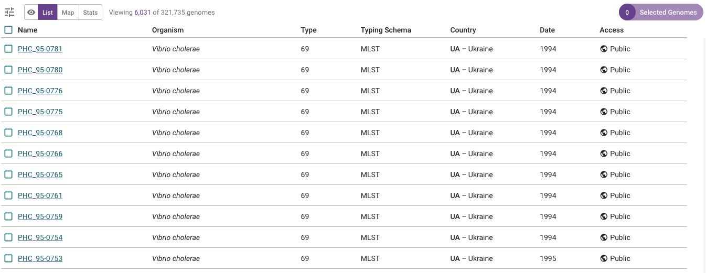

Worked example - Haiti 2022
===========================

This section is a worked example of using Vibriowatch to analyse cholera genomic data, using the Haiti 2022 outbreak as an example:

* `The Haiti 2022 outbreak`_
* `The H22 genome`_.
* `Finding the H22 genome in Vibriowatch`_.
* `Assembly quality of the H22 genome`_.
* `Is H22 predicted to produce cholera toxin?`_
* `Is H22 predicted to have antimicrobial resistance?`_
* `Is H22 predicted to have plasmids?`_
* `Does H22 belong to the pandemic lineage of Vibrio cholerae? (using MLST)`_.
* `Does H22 belong to the pandemic lineage of Vibrio cholerae? (using PopPUNK)`_.
* `What are the closest relatives of H22 among published Vibrio cholerae genomes?`_.
* `What can we say about the origins of the Haiti 2022 outbreak, based on the H22 genome?`_

The Haiti 2022 outbreak
-----------------------

You may already know that in January 2010 there was a catastrophic earthquake in Haiti, an island in the Caribbean.
Later that year, in October 2010, a huge cholera outbreak begain in Haiti, that lasted up until 2019, and included
more than 820,000 cholera cases and nearly 10,000 deaths from cholera. This outbreak was found to have been caused
by the current pandemic lineage of *Vibrio cholerae* (known as the 7PET lineage), and evidence suggests that it
was likely carried from Nepal to Haiti in 2010 (`Orata et al 2014`_). 

.. _Orata et al 2014: https://pubmed.ncbi.nlm.nih.gov/24699938/

By 2019, the number of cholera cases had waned off, and it appeared that the cholera epidemic in Haiti was finally over.
No more cholera cases were reported in Haiti in 2020, 2021 and for most of 2022. However, unfortunately in October of 2022 a new cholera outbreak 
occurred in Haiti, after almost three years of no cholera cases. By February 2023, there had been more than 30,000
cholera cases, and >500 deaths from cholera (source: Pan American Health Organisation).

An important epidemiological question was: where did the *V. cholerae* causing the Haiti 2022 outbreak come from?
Had it persisted in Haiti since the previous 2010-2019 epidemic, persisting either in humans (e.g. asymptomatic or unreported cases)
or in the environment (e.g. in rivers or lakes)?

The H22 genome
--------------

Late in 2022, `Rubin et al 2022`_ published the genome of a *V. cholerae* isolate from the Haiti 2022 outbreak, which
they named isolate 'H22'. 

.. _Rubin et al 2022: https://pubmed.ncbi.nlm.nih.gov/36449726/

In this worked example, I'm going to show you how to analyse the H22 genome to answer some key questions relevant
to public health, and answer questions about the origins of the Haiti 2022 outbreak:

#. Is H22 predicted to produce cholera toxin?
#. Is H22 predicted to have antimicrobial resistance?
#. Is H22 predicted to have plasmids?
#. Does H22 belong to the pandemic lineage of Vibrio cholerae?
#. What are the closest relatives of H22 among published Vibrio cholerae genomes? 
#. What can we say about the origins of the Haiti 2022 outbreak, based on the H22 genome?

Let's analyse the H22 genome in Vibriowatch to answer some of these questions. The H22
genome is amongst the approximately 6000 genomes that we have already added to Vibriowatch as 'public' genomes that
everyone can see. 

Finding the H22 genome in Vibriowatch
-------------------------------------

First, let's find the H22 genome in Vibriowatch.

You can search for an isolate in Vibriowatch by searching by its isolate/strain name(s).

You can search for isolate H22 in Vibriowatch by clicking on the three small horizontal bars at the top left of the Pathogenwatch website:

.. image:: Picture9.png
  :width: 150
  
This will bring up a menu:

.. image:: Picture10.png
  :width: 150
  
If you click on 'All Genomes' in the menu, you will then see a list of all the genomes in Pathogenwatch. 

To just select *V. cholerae* genomes, click on 'Genus' in the menu that now appears:

.. image:: Picture22.png
  :width: 150
  
Then select 'Vibrio', to select just genomes from *V. cholerae*. You will now see a list of the approximately 6000 *V. cholerae* genomes (just showing the top of the list here):

  
A search bar will now appear at the top left.
If you type 'H22' in the search bar, it will find isolate H22:

    
You can click on the isolate's name (link 'H22') to go to its 'report page'. 
The report page shows the curated metadata for the isolate, as well as bioinformatics analyses of the isolate.
This shows the top of the report page for H22:

.. image:: Picture115.png
  :width: 600

Assembly quality of the H22 genome
----------------------------------

Let's have a quick look at the assembly statistics for the H22 genome assembly, to check that the assembly looks
reasonably good quality and has the expected GC content for *V. cholerae*. To look at the assembly statistics, scroll
to the bottom of the genome report page for H22. You should see a section with the heading "Assembly stats", which
looks like this:

.. image:: Picture116.png
  :width: 550

We can see that the assembly for the H22 isolate has a genome size of about 4.0 Megabases, and GC content of 47.5%. This is consistent with the reference genome for *Vibrio cholerae* strain N16961, which has a genome size of about 4.0 Megabases and GC content of 47.5% (see `Heidelberg et al 2000`_).

.. _Heidelberg et al 2000: https://pubmed.ncbi.nlm.nih.gov/10952301/

As a very rough 'rule of thumb', we would consider that an assembly size of between about 3.3 and 5.3 Megabase, and a GC content of between about 41.3% and 48.6%, is reasonable for a *Vibrio cholerae* genome. 

Another commonly used measures of assembly quality is the number of contigs. We see here that the assembly for the H22 isolate has 44 contigs.
We would usually consider that an assembly is of relatively good quality if it consists of :math:`<` 700 contigs. 
The genome for the H22 isolate has 44 contigs, so is relatively good quality. 

Is H22 predicted to produce cholera toxin?
------------------------------------------

Is H22 predicted to have antimicrobial resistance?
--------------------------------------------------

Is H22 predicted to have plasmids?
----------------------------------

Does H22 belong to the pandemic lineage of Vibrio cholerae? (using MLST)
------------------------------------------------------------------------

The current pandemic (seventh pandemic) of cholera began in the 1960s and has been caused by the current pandemic lineage of *Vibrio cholerae*, known as the "7PET lineage". 
The 7PET lineage is a highly infectious and virulent lineage, and causes explosive outbreaks and huge epidemics.

A quick way to find out whether an isolate likely belongs to the 7PET lineage is to look at MLST (multi-locus sequence typing) results for the isolate in Vibriowatch. 

The MLST results for the isolate are shown at the top of the genome report page for the isolate in Vibriowatch. Here we can see the MLST results for isolate
H22 at the top of its report page (see under the heading "MLST"):

.. image:: Picture115.png
  :width: 600

We can see that isolate H22 is classified as MLST sequence type ST69.

ST69 is one of the STs (sequence types) often seen for the current pandemic ('7PET') lineage of *Vibrio cholerae*. Another sequence type that is sometimes seen for pandemic lineage *V. cholerae* is ST515. If an isolate is ST69 or ST515, it very likely belongs to the pandemic lineage. This suggests H22 belongs to the 7PET lineage.

Does H22 belong to the pandemic lineage of Vibrio cholerae? (using PopPUNK)
---------------------------------------------------------------------------

A second approach for figuring out whether your isolate belongs to the pandemic lineage (7PET lineage) or not, is to look at the
PopPUNK cluster of your isolate. PopPUNK is a tool for classifying bacterial isolates into lineages. At the top of the
Vibriowatch genome report page for isolate H22, we can see the PopPUNK information under the heading "Lineage":

.. image:: Picture115.png
  :width: 600

You can see that isolate H22 belongs to the PopPUNK lineage 1 (also known as VC1), which corresponds to the current pandemic lineage (7PET lineage).
Thus, like the MLST results, the PopPUNK results suggest that isolate H22 belongs to the current pandemic lineage.

What are the closest relatives of H22 among published Vibrio cholerae genomes?
------------------------------------------------------------------------------

What can we say about the origins of the Haiti 2022 outbreak, based on the H22 genome?
--------------------------------------------------------------------------------------

CholeraBook
-----------

If you would like to learn more about cholera genomics, you may also be interested in our `Online Cholera Genomics Course (CholeraBook)`_.

.. _Online Cholera Genomics Course (CholeraBook): https://cholerabook.readthedocs.io/

Contact
-------

I will be grateful if you will send me (Avril Coghlan) corrections or suggestions for improvements to my email address alc@sanger.ac.uk
