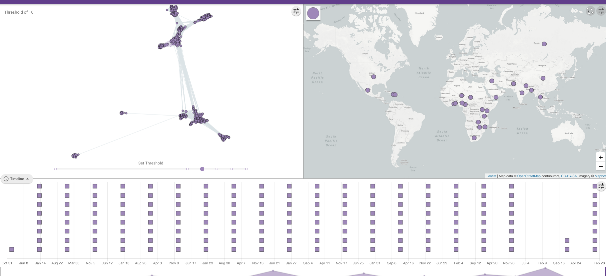
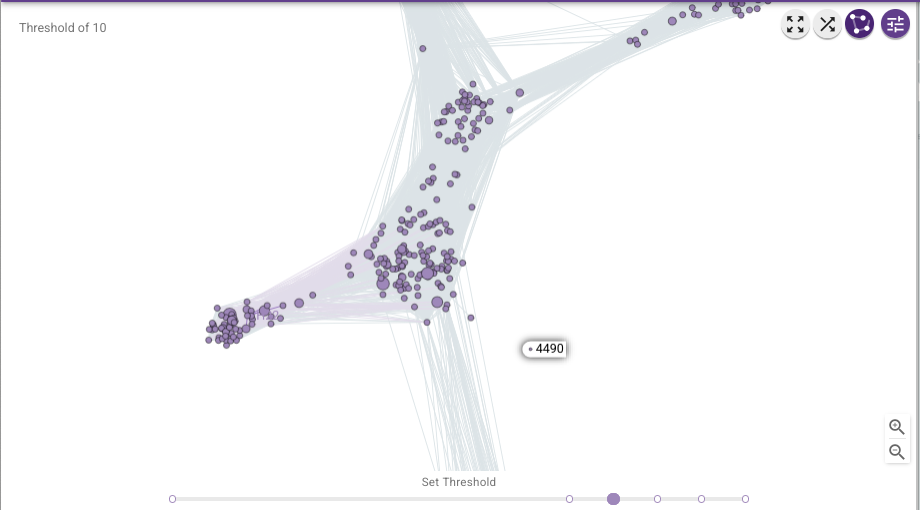
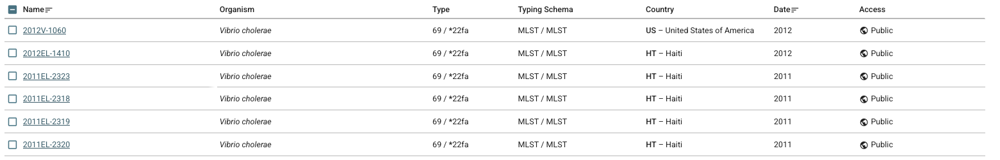
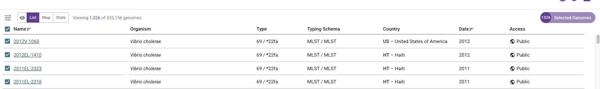
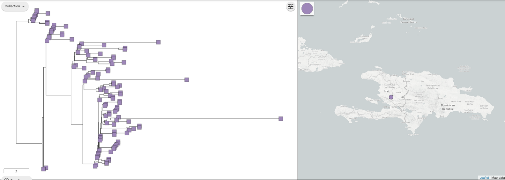

Case study - Haiti 2022 *(Étude de cas - Haïti 2022) دراسة حالة - هايتي*
===================================================================

This section is a worked example of using Vibriowatch to analyse cholera genomic data, using the Haiti 2022 outbreak as an example.

*Cette section est un exemple d’utilisation de Vibriowatch pour analyser les données génomiques du choléra, en utilisant l’épidémie d’Haïti de 2022 comme exemple.*

يعد هذا القسم مثالاً على استخدام Vibriowatch لتحليل بيانات الجينوم الخاصة بالكوليرا، باستخدام تفشي وباء الكوليرا في هايتي عام 2022 كمثال.

This page is dedicated to the fantastic public health professionals, scientists and public servants of Haiti, and to the patient
who generously donated a sample, for making this cholera genomic data publicly available and therefore contributing a lot to our
global understanding of cholera.

*Cette page est dédiée aux professionnels de la santé publique, scientifiques et fonctionnaires d'Haïti, ainsi qu'au patient qui a généreusement fait don d'un échantillon, pour avoir rendu publiques ces données génomiques sur le choléra et ainsi contribué à notre compréhension mondiale du choléra.*

هذه الصفحة مخصصة لمهنيي الصحة العامة والعلماء والمسؤولين الحكوميين في هايتي، وكذلك المريض الذي تبرع بسخاء بعينة، لجعل بيانات الجينوم الخاصة بالكوليرا هذه عامة وبالتالي المساهمة في فهمنا العالمي للكوليرا.

This case study has been selected as it is an example of cholera persisting within a country or region between outbreaks. It also illustrates
how, if sampling is patchy, it is difficult to distinguish between persistance within a country and re-introduction from a nearby country.
Furthermore, it illustrates how it is very difficult to distinguish between persistance of cholera in the human population between outbreaks, versus
persistance in the environment between outbreaks.

*Cette étude de cas a été sélectionnée car elle illustre la persistance du choléra dans un pays ou une région entre deux épidémies. Elle illustre également comment, si l'échantillonnage est fragmenté, il est difficile de distinguer la persistance dans un pays d'une réintroduction depuis un pays voisin. En outre, elle illustre la difficulté de distinguer la persistance du choléra dans la population humaine entre deux épidémies de sa persistance dans l'environnement entre ces épidémies.*

اختيرت دراسة الحالة هذه لأنها توضح استمرار الكوليرا في بلد أو منطقة بين وبائين. كما توضح كيف يصعب، في حال تجزؤ العينات، التمييز بين استمرار الكوليرا في بلد ما وإعادة ظهورها من بلد مجاور. علاوة على ذلك، توضح الدراسة صعوبة التمييز بين استمرار الكوليرا بين السكان بين وبائين واستمرارها في البيئة بينهما.

* `The Haiti 2022 outbreak (L'épidémie d'Haïti en 2022)`_.
* `The H22 genome (Le génome H22)`_.
* `Finding the H22 genome in Vibriowatch (Trouver le génome H22 dans Vibriowatch)`_.
* `Assembly quality of the H22 genome (Qualité d'assemblage du génome H22)`_.
* `Is H22 predicted to produce cholera toxin? (Est-il prévu que H22 produise de la toxine cholérique?)`_
* `Is H22 predicted to have antimicrobial resistance? (Est-il prévu que l’isolat H22 présente une résistance aux antimicrobiens?)`_
* `Is H22 predicted to have plasmids? (Est-il prévu que H22 contienne des plasmides?)`_
* `What is the predicted serogroup of the H22 isolate? (Quel est le sérogroupe prédit de l’isolat H22?)`_
* `Does H22 belong to the pandemic lineage of Vibrio cholerae? (Le H22 appartient-il à la lignée pandémique de Vibrio cholerae?)`_.
* `What are the closest relatives of H22 among published Vibrio cholerae genomes? (Quels sont les plus proches parents de H22 parmi les génomes de Vibrio cholerae publiés?)`_.
* `What can we say about the origins of the Haiti 2022 outbreak, based on the H22 genome? (Que pouvons-nous dire sur les origines de l’épidémie d’Haïti de 2022, sur la base du génome de l’isolat H22?)`_
* `Reflections on the Haiti 2022 case study (Réflexions sur l'étude de cas Haïti 2022)`_

The Haiti 2022 outbreak (L'épidémie d'Haïti en 2022)
----------------------------------------------------

You may already know that in January 2010 there was a catastrophic earthquake in Haiti, an island in the Caribbean.
Later that year, in October 2010, a huge cholera outbreak begain in Haiti, that lasted up until 2019, and included
more than 820,000 cholera cases and nearly 10,000 deaths from cholera. This outbreak was found to have been caused
by the current pandemic lineage of *Vibrio cholerae* (known as the 7PET lineage), and evidence suggests that it
was likely carried from Nepal to Haiti in 2010 (`Orata et al 2014`_). 

*Vous savez peut-être déjà qu'en janvier 2010, un tremblement de terre catastrophique a frappé Haïti, une île des Caraïbes.
Plus tard la même année, en octobre 2010, une importante épidémie de choléra a éclaté en Haïti, qui a duré jusqu'en 2019 et a fait plus de 820 000 cas et près de 10 000 décès. Cette épidémie a été attribuée à la lignée pandémique actuelle de Vibrio cholerae (connue sous le nom de lignée 7PET), et des éléments suggèrent qu'elle a probablement été transmise du Népal à Haïti en 2010* (`Orata et al 2014`_).

.. _Orata et al 2014: https://pubmed.ncbi.nlm.nih.gov/24699938/

By 2019, the number of cholera cases had waned off, and it appeared that the cholera epidemic in Haiti was finally over.
No more cholera cases were reported in Haiti in 2020, 2021 and for most of 2022. However, unfortunately in October of 2022 a new cholera outbreak 
occurred in Haiti, after almost three years of no cholera cases. By February 2023, there had been more than 30,000
cholera cases, and >500 deaths from cholera (source: Pan American Health Organisation).

*En 2019, le nombre de cas de choléra avait diminué et l'épidémie semblait enfin terminée en Haïti. Aucun cas de choléra n'a été signalé en Haïti en 2020, 2021 et pendant la majeure partie de 2022. Malheureusement, une nouvelle épidémie de choléra s'est déclarée en octobre 2022, après près de trois ans sans cas. En février 2023, on comptait plus de 30 000 cas de choléra et plus de 500 décès dus au choléra (source : Organisation Panaméricaine de la Santé).*

An important epidemiological question was: where did the *V. cholerae* causing the Haiti 2022 outbreak come from?
Had it persisted in Haiti since the previous 2010-2019 epidemic, persisting either in humans (e.g. asymptomatic or unreported cases)
or in the environment (e.g. in rivers or lakes)? Or was the Haiti 2022 outbreak due to a completely new introduction into Haiti from another
part of the world, such as Africa or Asia? 

*Une question épidémiologique importante était : d’où provenait la bactérie V. cholerae responsable de l’épidémie d’Haïti de 2022? Avait-elle persisté en Haïti depuis la précédente épidémie de 2010-2019, soit chez l’homme (cas asymptomatiques ou non déclarés, par exemple), soit dans l’environnement (dans les rivières ou les lacs, par exemple)? Ou bien l’épidémie d’Haïti de 2022 était-elle due à une introduction totalement nouvelle en Haïti, en provenance d’une autre région du monde, comme l’Afrique ou l’Asie?*

The H22 genome (Le génome H22)
------------------------------

Late in 2022, `Rubin et al 2022`_ published the genome of a *V. cholerae* isolate from the Haiti 2022 outbreak, which
they named isolate 'H22'. The authors of this work were an international consortium of scientists and public health experts from the
Laboratoire National de Santé Publique (National Health Laboratory) in Haiti, Zanmi Lasante (a non-government healthcare provider in Haiti),
Brigham and Women's Hospital (USA), Massachusetts General Hospital (USA), and the
International Centre for Diarrheal Disease Research (Bangladesh):

*Fin 2022,* `Rubin et al 2022`_ *ont publié le génome d'un isolat de V. cholerae issu de l'épidémie d'Haïti de 2022, qu'ils ont nommé isolat H22. Les auteurs de ces travaux étaient un consortium international de scientifiques et d'experts en santé publique du Laboratoire National de Santé Publique d'Haïti, de Zanmi Lasante (un prestataire de soins de santé non gouvernemental en Haïti), du Brigham and Women's Hospital (États-Unis), du Massachusetts General Hospital (États-Unis) et du Centre International de Recherche Sur Les Maladies Diarrhéiques (icddr,b, Bangladesh):*

.. _Rubin et al 2022: https://pubmed.ncbi.nlm.nih.gov/36449726/

.. image:: Picture172.png
  :width: 800

In this worked example, I'm going to show you how to analyse the H22 genome to answer some key questions relevant
to public health, and answer questions about the origins of the Haiti 2022 outbreak:

#. Is H22 predicted to produce cholera toxin?
#. Is H22 predicted to have antimicrobial resistance?
#. Is H22 predicted to have plasmids?
#. Does H22 belong to the pandemic lineage of Vibrio cholerae?
#. What are the closest relatives of H22 among published Vibrio cholerae genomes? 
#. What can we say about the origins of the Haiti 2022 outbreak, based on the H22 genome?

*Dans cet exemple pratique, je vais vous montrer comment analyser le génome de H22 afin de répondre à certaines questions clés de santé publique et aux questions sur les origines de l'épidémie d'Haïti de 2022:*

#. *H22 est-il susceptible de produire la toxine cholérique?*
#. *H22 est-il susceptible de présenter une résistance aux antimicrobiens?*
#. *H22 est-il susceptible de contenir des plasmides?*
#. *H22 appartient-il à la lignée pandémique de Vibrio cholerae?*
#. *Quels sont les plus proches parents de H22 parmi les génomes de Vibrio cholerae publiés?*
#. *Que pouvons-nous dire des origines de l'épidémie d'Haïti de 2022, d'après le génome de H22?*

Let's analyse the H22 genome in Vibriowatch to answer some of these questions. The H22
genome is amongst the approximately 6000 genomes that we have already added to Vibriowatch as 'public' genomes that
everyone can see. 

*Analysons le génome H22 dans Vibriowatch pour répondre à ces questions. Le génome H22 fait partie des quelque 6 000 génomes que nous avons déjà ajoutés à Vibriowatch en tant que génomes accessibles à tous.*

Finding the H22 genome in Vibriowatch (Trouver le génome H22 dans Vibriowatch)
------------------------------------------------------------------------------

If you learn better by seeing rather than reading, see the `video on finding H22's report page in Vibriowatch`_.

*Si vous apprenez mieux en voyant plutôt qu'en lisant, regardez la* `vidéo sur la recherche de la page de rapport de H22 dans Vibriowatch`_.

.. _video on finding H22's report page in Vibriowatch: https://youtu.be/7k79hfyTW4Q 

.. _vidéo sur la recherche de la page de rapport de H22 dans Vibriowatch: https://youtu.be/HsRtQGxhV4k 

First, let's go to the H22 genome in Vibriowatch; click on this link to go to `H22's genome report page`_ in Vibriowatch (or see 
`How to search for an isolate in Vibriowatch and see its report page`_ to find out how to search for H22's report page yourself).

*Tout d'abord, allons au génome H22 dans Vibriowatch; cliquez sur ce lien pour accéder à* `la page de rapport du génome H22`_ *dans Vibriowatch (ou consultez* `Comment rechercher un isolat dans Vibriowatch et voir sa page de rapport`_ *pour savoir comment rechercher vous-même la page de rapport H22).*

.. _H22's genome report page: https://pathogen.watch/genomes/all?genusId=662&searchText=H22

.. _la page de rapport du génome H22: https://pathogen.watch/genomes/all?genusId=662&searchText=H22

.. _How to search for an isolate in Vibriowatch and see its report page: https://vibriowatch.readthedocs.io/en/latest/navigating.html#how-to-search-for-an-isolate-in-vibriowatch-and-see-its-report-page

.. _Comment rechercher un isolat dans Vibriowatch et voir sa page de rapport: https://vibriowatch.readthedocs.io/en/latest/navigating.html#how-to-search-for-an-isolate-in-vibriowatch-and-see-its-report-page

The report page shows the curated metadata for the isolate, as well as bioinformatics analyses of the isolate.
This shows the top of the report page for H22:

*La page du rapport présente les métadonnées organisées pour l'isolat, ainsi que ses analyses bioinformatiques. Voici le haut de la page du rapport pour H22:*

.. image:: Picture115.png
  :width: 600

Assembly quality of the H22 genome (Qualité d'assemblage du génome H22)
-----------------------------------------------------------------------

If you learn better by seeing rather than reading, see the `video on investigating H22's assembly quality, using Vibriowatch`_.

*Si vous apprenez mieux en voyant plutôt qu'en lisant, regardez la* `vidéo sur l'étude de la qualité d'assemblage du H22, en utilisant Vibriowatch`_.

.. _video on investigating H22's assembly quality, using Vibriowatch: https://youtu.be/SevDN1pLyqo 

.. _vidéo sur l'étude de la qualité d'assemblage du H22, en utilisant Vibriowatch: https://youtu.be/3SHlwEmF794 

Let's have a quick look at the assembly statistics for the H22 genome assembly, to check that the assembly looks
reasonably good quality and has the expected GC content for *V. cholerae*. To look at the assembly statistics, scroll
to the bottom of the genome report page for H22. You should see a section with the heading "Assembly stats", which
looks like this:

*Examinons rapidement les statistiques d'assemblage du génome H22 afin de vérifier que l'assemblage est de bonne qualité et qu'il présente la teneur en GC attendue pour V. cholerae. Pour consulter les statistiques d'assemblage, faites défiler la page Web jusqu'en bas du rapport génomique pour H22. Vous devriez voir une section intitulée Statistiques d'assemblage, qui ressemble à ceci:*

.. image:: Picture116.png
  :width: 550

We can see that the assembly for the H22 isolate has a genome size of about 4.0 Megabases (Mb), and GC content of 47.5%. Another commonly used measures of assembly quality is the number of contigs. We see here that the assembly for the H22 isolate has 44 contigs.

*On constate que l'assemblage de l'isolat H22 présente une taille de génome d'environ 4,0 mégabases (Mb) et une teneur en GC de 47,5 %. Une autre mesure courante de la qualité de l'assemblage est le nombre de contigs. On constate ici que l'assemblage de l'isolat H22 comporte 44 contigs.*

.. _Heidelberg et al 2000: https://pubmed.ncbi.nlm.nih.gov/10952301/

.. image:: HowToInterpretTheResult.png
  :width: 600

The assembly size of H22 of 4.0 Mb is consistent with the reference genome for *Vibrio cholerae* strain N16961, which has a genome size of about 4.0 Megabases and GC content of 47.5% (see `Heidelberg et al 2000`_). As a very rough 'rule of thumb', we would consider that an assembly size of between about 3.3 and 5.3 Megabase, and a GC content of between about 41.3% and 48.6%, is reasonable for a *Vibrio cholerae* genome. 

*La taille d'assemblage de H22, soit 4,0 Mo, est cohérente avec le génome de référence de la souche N16961 de Vibrio cholerae, dont la taille du génome est d'environ 4,0 mégabases et la teneur en GC est de 47,5 % (voir* `Heidelberg et al 2000`_ *). Une taille d'assemblage comprise entre 3,3 et 5,3 mégabases et une teneur en GC comprise entre 41,3 % et 48,6 % sont considérées comme raisonnables pour un génome de Vibrio cholerae.*

.. _Heidelberg et al 2000: https://pubmed.ncbi.nlm.nih.gov/10952301/

We would usually consider that an assembly is of relatively good quality if it consists of :math:`<` 700 contigs. The genome for the H22 isolate has 44 contigs, so is relatively good quality. 

*On considère généralement qu'un assemblage est de relativement bonne qualité s'il est composé de 700 contigs. Le génome de l'isolat H22 comporte 44 contigs, ce qui le rend de relativement bonne qualité.*

Is H22 predicted to produce cholera toxin? (Est-il prévu que H22 produise de la toxine cholérique?)
---------------------------------------------------------------------------------------------------

If you learn better by seeing rather than reading, see the `video on predicting if H22 produces cholera toxin, using Vibriowatch`_.

*Si vous apprenez mieux en voyant plutôt qu'en lisant, regardez la* `vidéo sur la prédiction si H22 produit de la toxine cholérique, en utilisant Vibriowatch`_. 

.. _video on predicting if H22 produces cholera toxin, using Vibriowatch: https://youtu.be/fQHf4nCZ7L8 

.. _vidéo sur la prédiction si H22 produit de la toxine cholérique, en utilisant Vibriowatch: https://youtu.be/LoiBAPyUzQo 

Cholera is a disease characterised by acute watery diarrhoea, and the diarrhoea symptoms are mainly caused by the cholera toxin (Ctx) that is secreted
by *V. cholerae*. Therefore, cholera toxin is considered the primary virulence factor of *V. cholerae*. Practically all isolates of the current pandemic lineage
of *V. cholerae*, the 7PET lineage, carry the genes for cholera toxin (genes *ctxA* and *ctxB*) and produce cholera toxin, which is a protein
complex consisting of CtxA and CtxB subunits. However, many isolates of other
(non-pandemic) lineages of *V. cholerae* do not carry the genes for cholera toxin, and so do not produce cholera toxin.

*Le choléra est une maladie caractérisée par une diarrhée aqueuse aiguë, dont les symptômes sont principalement causés par la toxine cholérique (Ctx) sécrétée par V. cholerae. Par conséquent, la toxine cholérique est considérée comme le principal facteur de virulence de V. cholerae. Presque tous les isolats de la lignée pandémique actuelle de V. cholerae, la lignée 7PET, portent les gènes de la toxine cholérique (gènes ctxA et ctxB) et produisent de la toxine cholérique, un complexe protéique composé des sous-unités CtxA et CtxB. Cependant, de nombreux isolats d'autres lignées (non pandémiques) de V. cholerae ne portent pas les gènes de la toxine cholérique et ne produisent donc pas de toxine cholérique.*

To find out whether the H22 isolate carries the genes for cholera toxin, and so is predicted to produce cholera toxin, we can look at the "Virulence" section
of the genome report page for H22:

*Pour savoir si l'isolat H22 porte les gènes de la toxine cholérique et est donc susceptible de produire de la toxine cholérique, nous pouvons consulter la section Virulence de la page du rapport génomique de H22:*

.. image:: Picture121.png
  :width: 550

You can see that there is a tick next to "ctxA" and "ctxB" so H22 is predicted to carry the cholera toxin genes.

*Vous pouvez voir qu'il y a une coche à côté de ctxA et ctxB, donc il est prévu que H22 porte les gènes de la toxine cholérique.*

.. image:: HowToInterpretTheResult.png
  :width: 600

Because the H22 genome is predicted to carry the *ctxA* and *ctxB* genes, we can predict that it produces the cholera toxin. 
This agrees with evidence in the paper of `Rubin et al 2022`_, who reported phenotypic data suggesting that H22 is toxigenic, i.e. that produces cholera toxin.

.. _Rubin et al 2022: https://pubmed.ncbi.nlm.nih.gov/36449726/

*Étant donné que le génome H22 devrait contenir les gènes ctxA et ctxB, on peut prédire qu'il produit la toxine cholérique. Cela concorde avec les données de l'article de* `Rubin et al 2022`_, *qui ont rapporté des données phénotypiques suggérant que H22 est toxigène, c'est-à-dire qu'il produit la toxine cholérique.*

.. _Rubin et al 2022: https://pubmed.ncbi.nlm.nih.gov/36449726/

Is H22 predicted to have antimicrobial resistance? (Est-il prévu que l’isolat H22 présente une résistance aux antimicrobiens?)
------------------------------------------------------------------------------------------------------------------------------

If you learn better by seeing rather than reading, see the `video on predicting if H22 has antimicrobial resistance, using Vibriowatch`_.

.. _video on predicting if H22 has antimicrobial resistance, using Vibriowatch: https://youtu.be/fexfUXza8M8 

*Si vous apprenez mieux en voyant plutôt qu'en lisant, regardez la* `vidéo sur la prédiction de la résistance aux antimicrobiens du H22, en utilisant Vibriowatch`_.

.. _vidéo sur la prédiction de la résistance aux antimicrobiens du H22, en utilisant Vibriowatch: https://youtu.be/sOl5hqRyBa0 

The primary treatment for cholera is rehydration, but antimicrobials are given to the most vulnerable patients such as pregnant women, very small
children, and HIV-positive patients. The WHO recommends the antimicrobials azithromycin, doxycycline and ciprofloxacin for treating cholera. Therefore, any
antimicrobial resistance to these recommended antimicrobials would be a concern.

*Le traitement principal du choléra est la réhydratation, mais des antimicrobiens sont administrés aux patients les plus vulnérables, tels que les femmes enceintes, les très jeunes enfants et les patients séropositifs. L'OMS recommande l'azithromycine, la doxycycline et la ciprofloxacine pour traiter le choléra. Par conséquent, toute résistance à ces antimicrobiens recommandés serait préoccupante.*

To find out whether the H22 isolate carries antimicrobial resistance (AMR), we can look at the "AMR" section of the genome report page for H22:

*Pour savoir si l'isolat H22 présente une résistance aux antimicrobiens (RAM), nous pouvons consulter la section RAM de la page du rapport sur le génome de H22:*

.. image:: Picture122.png
  :width: 550

You can see that the H22 isolate is not predicted to have resistance genes or mutations to azithromycin or doxycycline, but is predicted to
have an intermediate level of resistance to ciprofloxacin because it carries two resistance mutations, the *gyrA_S83I* and *parC_S85L* mutations (causing a substitution
from S to I at position 83 of the GyrA protein, and a substitution from S to L at position 85 of the ParC protein, respectively). You can also see that is predicted to be resistant to trimethoprim (because it carries the gene *dfrA1*) and sulfamethoxazole (because it carries the gene *sul2*).

*On constate que l'isolat H22 ne devrait pas présenter de gènes de résistance ni de mutations à l'azithromycine ou à la doxycycline, mais devrait présenter un niveau de résistance intermédiaire à la ciprofloxacine, car il est porteur de deux mutations de résistance: gyrA_S83I et parC_S85L (provoquant respectivement une substitution de S en I en position 83 de la protéine GyrA et une substitution de S en L en position 85 de la protéine ParC). On constate également qu'il devrait être résistant au triméthoprime (car il porte le gène dfrA1) et au sulfaméthoxazole (car il porte le gène sul2).*

.. image:: HowToInterpretTheResult.png
  :width: 600

Based on the results above, we would predict H22 to have an intermediate level of resistance to ciprofloxacin, and to be resistant to trimethoprim and sulfamethoxazole.

*Sur la base des résultats ci-dessus, nous prédisons que H22 aura un niveau intermédiaire de résistance à la ciprofloxacine et qu’il sera résistant au triméthoprime et au sulfaméthoxazole.*

This agrees with the evidence in the paper of `Rubin et al 2022`_, who reported that from laboratory testing results, H22 has resistance to trimethoprim and sulfamethoxazole, and low-level
resistance to ciprofloxacin. Trimethoprim and sulfamethoxazole are not the WHO-recommended antimicrobials for cholera, but have been used
in the past in some locations (`Das et al 2020`_).

.. _Rubin et al 2022: https://pubmed.ncbi.nlm.nih.gov/36449726/
.. _Das et al 2020: https://pubmed.ncbi.nlm.nih.gov/31272870/

*Ceci concorde avec les données de l'article de* `Rubin et al 2022`_, *qui ont rapporté que, d'après les résultats des tests de laboratoire, H22 présente une résistance au triméthoprime et au sulfaméthoxazole, ainsi qu'une faible résistance à la ciprofloxacine. Le triméthoprime et le sulfaméthoxazole ne sont pas les antimicrobiens recommandés par l'OMS pour le choléra, mais ont été utilisés par le passé dans certaines régions* (`Das et al 2020`_).

Is H22 predicted to have plasmids? (Est-il prévu que H22 contienne des plasmides?)
----------------------------------------------------------------------------------

If you learn better by seeing rather than reading, see the `video on predicting plasmids in H22, using Vibriowatch`_.

.. _video on predicting plasmids in H22, using Vibriowatch: https://youtu.be/_mtfCiBlJac 

*Si vous apprenez mieux en voyant plutôt qu'en lisant, regardez la* `vidéo sur la prédiction des plasmides dans H22, en utilisant Vibriowatch`_.

.. _vidéo sur la prédiction des plasmides dans H22, en utilisant Vibriowatch: https://youtu.be/bPF2w3QDWfk 

Antimicrobial resistance genes can be carried on large plasmids in *Vibrio cholerae*, but such large plasmids are relatively rare.

*Les gènes de résistance aux antimicrobiens peuvent être transportés par de grands plasmides chez Vibrio cholerae, mais de tels grands plasmides sont relativement rares.*

To find out whether the H22 isolate is predicted to carry a plasmid, we can look at the "Plasmid Inc types" section of the genome report page for H22:

*Pour savoir si l'isolat H22 est censé contenir un plasmide, nous pouvons consulter la section Plasmid Inc Types de la page du rapport sur le génome de H22:*

.. image:: Picture123.png
  :width: 350

We see that there are no predicted plasmids in H22.

*Nous voyons qu’il n’y a pas de plasmides prédits dans H22.*

.. image:: HowToInterpretTheResult.png
  :width: 600

There are no plasmids predicted by Vibriowatch in the H22 isolate. Note that plasmid prediction in Vibriowatch may not be very accurate for small
plasmids, and also if the assembly quality is poor, it's possible that plasmids may be missed by Vibriowatch. For H22, based on the Vibriowatch results,
we would predict that there are no large plasmids in H22.

*Vibriowatch ne prédit aucun plasmide dans l'isolat H22. Notez que la prédiction des plasmides par Vibriowatch peut manquer de précision pour les petits plasmides. De plus, si la qualité de l'assemblage est médiocre, il est possible que Vibriowatch ne prédise pas certains plasmides. Pour H22, d'après les résultats de Vibriowatch, nous prédisons l'absence de grands plasmides.*

What is the predicted serogroup of the H22 isolate? (Quel est le sérogroupe prédit de l’isolat H22?)
----------------------------------------------------------------------------------------------------

If you learn better by seeing rather than reading, see the `video on predicting serogroup of H22, using Vibriowatch`_.

.. _video on predicting serogroup of H22, using Vibriowatch: https://youtu.be/Uh_04BSDaZ0 

*Si vous apprenez mieux en voyant plutôt qu'en lisant, regardez la* `vidéo sur la prédiction du sérogroupe de l'isolat H22, en utilisant Vibriowatch`_.

.. _vidéo sur la prédiction du sérogroupe de l'isolat H22, en utilisant Vibriowatch: https://youtu.be/cGTRULEIKQE 

The current pandemic lineage (7PET lineage) of *V. cholerae* has the O1 serogroup (or occasionally, for some isolates, the O139 serogroup).

*La lignée pandémique actuelle (lignée 7PET) de V. cholerae possède le sérogroupe O1 (ou occasionnellement, pour certains isolats, le sérogroupe O139).*

To find out the predicted serogroup for H22, we can look at the top of the report page for H22:

*Pour connaître le sérogroupe prévu pour H22, nous pouvons regarder en haut de la page du rapport pour H22:*

.. image:: Picture115.png
  :width: 600

Under "Genotypes", you can see that the predicted serogroup is O1.

*Sous Génotypes, vous pouvez voir que le sérogroupe prédit est O1.*

.. image:: HowToInterpretTheResult.png
  :width: 600

From the above, we see that the predicted serogroup of the H22 isolate is O1. 
This agrees with phenotypic evidence from the paper of `Rubin et al 2022`_, who reported, based on laboratory results, that H22 has serogroup O1.

.. _Rubin et al 2022: https://pubmed.ncbi.nlm.nih.gov/36449726/

*D’après ce qui précède, nous voyons que le sérogroupe prédit de l’isolat H22 est O1. Cela concorde avec les preuves phénotypiques de l'article de* `Rubin et al 2022`_, *qui ont rapporté, sur la base de résultats de laboratoire, que H22 a le sérogroupe O1.*

.. _Rubin et al 2022: https://pubmed.ncbi.nlm.nih.gov/36449726/

Note that the fact that H22 is serogroup O1 doesn't mean that H22 definitely belongs to the 7PET lineage,
as some *V. cholerae* isolates of other (non-pandemic) lineages also have serogroup O1. 

*Notez que le fait que H22 soit du sérogroupe O1 ne signifie pas qu'il appartient définitivement à la lignée 7PET, car certains isolats de V. cholerae d'autres lignées (non pandémiques) possèdent également le sérogroupe O1.*

Does H22 belong to the pandemic lineage of Vibrio cholerae? (Le H22 appartient-il à la lignée pandémique de Vibrio cholerae?)
-----------------------------------------------------------------------------------------------------------------------------

If you learn better by seeing rather than reading, see the `video on finding out the lineage of H22, using Vibriowatch`_.

.. _video on finding out the lineage of H22, using Vibriowatch: https://youtu.be/EBKcwA3pjA0 

*Si vous apprenez mieux en voyant plutôt qu'en lisant, regardez la* `vidéo sur la découverte de la lignée de H22, en utilisant Vibriowatch`_.

.. _vidéo sur la découverte de la lignée de H22, en utilisant Vibriowatch: https://youtu.be/v03msIL6oMA 

The current pandemic (seventh pandemic) of cholera began in the 1960s and has been caused by the current pandemic lineage of *Vibrio cholerae*, known as the "7PET lineage". The 7PET lineage is a highly infectious and virulent lineage, and causes explosive outbreaks and huge epidemics.

*La pandémie actuelle (septième pandémie) de choléra a débuté dans les années 1960 et a été causée par la lignée pandémique actuelle de Vibrio cholerae, connue sous le nom de lignée 7PET.
La lignée 7PET est hautement infectieuse et virulente, et provoque des flambées épidémiques massives.*

A quick way to find out whether an isolate likely belongs to the 7PET lineage is to look at MLST (multi-locus sequence typing) results for the isolate in Vibriowatch. 
The MLST results for the isolate are shown at the top of the genome report page for the isolate in Vibriowatch. Here we can see the MLST results for isolate
H22 at the top of its report page (see under the heading "MLST"):

*Un moyen rapide de déterminer si un isolat appartient vraisemblablement à la lignée 7PET consiste à consulter les résultats du MLST (typage de séquences multilocus) de l'isolat dans Vibriowatch. Les résultats du MLST pour l'isolat sont affichés en haut de la page du rapport génomique de l'isolat dans Vibriowatch. Voici les résultats du MLST pour l'isolat H22 en haut de sa page Web (voir sous la rubrique MLST):*

.. image:: Picture115.png
  :width: 600

We can see that isolate H22 is classified as MLST sequence type ST69. 

*Nous pouvons voir que l'isolat H22 est classé comme type de séquence MLST ST69.*

A second approach for figuring out whether your isolate belongs to the pandemic lineage (7PET lineage) or not, is to look at the
PopPUNK cluster of your isolate. PopPUNK is a tool for classifying bacterial isolates into lineages. At the top of the
Vibriowatch genome report page for isolate H22 (see above), we can see the PopPUNK information under the heading "Lineage".
You can see that isolate H22 belongs to the PopPUNK lineage 1 (also known as VC1).

*Une deuxième approche pour déterminer si votre isolat appartient à la lignée pandémique (lignée 7PET) consiste à examiner le cluster PopPUNK de votre isolat. PopPUNK est un outil logiciel de classification des isolats bactériens en lignées. En haut de la page du rapport génomique Vibriowatch pour l'isolat H22 (voir ci-dessus), les informations PopPUNK sont visibles sous la rubrique Lineage. Vous pouvez constater que l'isolat H22 appartient à la lignée PopPUNK 1 (également appelée VC1).*

.. image:: HowToInterpretTheResult.png
  :width: 600

ST69 is one of the STs (sequence types) often seen for the current pandemic ('7PET') lineage of *Vibrio cholerae*. Another sequence type that is sometimes seen for pandemic lineage *V. cholerae* is ST515. If an isolate is ST69 or ST515, it very likely belongs to the pandemic lineage. This suggests H22 belongs to the 7PET lineage.
From the PopPUNK results, we found that H22 belongs to PopPUNK cluster VC1; this corresponds to the current pandemic lineage (7PET lineage) (see
the `table of correspondences between PopPUNK clusters and known lineages`_).
Thus, like the MLST results, the PopPUNK results suggest that isolate H22 belongs to the current pandemic lineage.

.. _table of correspondences between PopPUNK clusters and known lineages: https://vibriowatch.readthedocs.io/en/latest/mlst.html#what-is-poppunk

*ST69 est l'un des types de séquences (ST) fréquemment observés pour la lignée pandémique actuelle (7PET) de Vibrio cholerae. Un autre type de séquence parfois observé pour la lignée 
pandémique actuelle de Vibrio cholerae (7PET) est ST515. Si un isolat est ST69 ou ST515, il appartient très probablement à la lignée pandémique (7PET). Cela suggère que H22 appartient à la lignée 7PET. D'après les résultats PopPUNK, nous avons constaté que H22 appartient au cluster PopPUNK VC1; cela correspond à la lignée pandémique actuelle (lignée 7PET) (voir* `le tableau de correspondance entre les clusters PopPUNK et les lignées connues`_). *Ainsi, à l'instar des résultats MLST, les résultats PopPUNK suggèrent que l'isolat H22 appartient à la lignée pandémique actuelle (7PET).*

.. _le tableau de correspondance entre les clusters PopPUNK et les lignées connues: https://vibriowatch.readthedocs.io/en/latest/mlst.html#what-is-poppunk

What are the closest relatives of H22 among published Vibrio cholerae genomes? (Quels sont les plus proches parents de H22 parmi les génomes de Vibrio cholerae publiés?)
-------------------------------------------------------------------------------------------------------------------------------------------------------------------------

If you learn better by seeing rather than reading, see the `video on identifying the closest relatives of H22, using Vibriowatch`_.

.. _video on identifying the closest relatives of H22, using Vibriowatch: https://youtu.be/essXib5sZ0c 

*Si vous apprenez mieux en voyant plutôt qu'en lisant, regardez la* `vidéo sur l'identification des plus proches parents de H22, en utilisant Vibriowatch`_.

.. _vidéo sur l'identification des plus proches parents de H22, en utilisant Vibriowatch: https://youtu.be/08PCqdvbhWE 

Vibriowatch includes a large set of >6000 published *V. cholerae* genomes, so you can search for the closest relatives of a new isolate among those published genomes.

*Vibriowatch comprend un large ensemble de > 6 000 génomes V. cholerae publiés, vous pouvez donc rechercher les parents les plus proches d'un nouvel isolat parmi ces génomes publiés.*

To find the closest relatives of H22 among publised *V. cholerae* genomes, we can look under the "Core Genome Clustering" 
section of the H22 genome report page, which gives the result of a cgMLST (core genome MLST) analysis:

*Pour trouver les parents les plus proches de H22 parmi les génomes de V. cholerae publiés, consultez la section Core Genome Clustering de la page du rapport sur le génome H22, qui fournit le résultat d'une analyse cgMLST (analyse MLST des régions ancestrales partagées du génome de Vibrio cholerae):*

.. image:: Picture124.png
  :width: 600

You can see a network showing blobs representing sequenced isolates, where H22 is shown as a purple blob (and labelled "H22"), and other
closely related isolates are shown by grey blobs. The edges (lines) in the network show relationships between related isolates,
where the length of an edge between two isolates (two blobs) represents the number of genetic differences between them.
Isolates that are closer to H22 in the network have less genetic differences in their DNA from H22, and so are assumed 
to be more closely evolutionarily related to H22.

*Vous pouvez observer un réseau de nœuds représentant les isolats séquencés. H22 est représenté par un nœud violet (étiqueté H22), tandis que les autres isolats étroitement apparentés sont représentés par des nœuds gris. Les arêtes (lignes) du réseau illustrent les relations entre les isolats apparentés. La longueur d'une arête entre deux isolats (deux nœuds) représente le nombre de différences génétiques entre eux. Les isolats les plus proches de H22 dans le réseau présentent moins de différences génétiques dans leur ADN et sont donc supposés être plus étroitement apparentés à H22 sur le plan évolutif.*

You can see that at the top of the network it says "Cluster of 1326 at a threshold of 10", so these are 1326
isolates that are closely related and differ from each other by 10 or less mutations in the DNA of their core genome
regions ("core genome regions" are regions of the genome shared by almost all *V. cholerae* isolates).

*Vous pouvez voir qu'en haut du réseau, il est indiqué Groupe de 1 326 à un Seuil de 10. Il s'agit donc de 1 326 isolats étroitement apparentés qui diffèrent les uns des autres par 10 mutations ou moins dans l'ADN de leurs régions génomiques ancestrales communes (les régions du génome partagées par presque tous les isolats de V. cholerae).*

To examine the network a bit more closely, you can click on the big purple "VIEW CLUSTER" button.
This will bring you to a new view, in which you can see the network in the top left panel, a map of where the isolates
were collected in the top right panel, and a timeline of when the isolates were collected below.

*Pour examiner le réseau de plus près, cliquez sur le gros bouton violet VIEW CLUSTER. Vous accéderez alors à une nouvelle vue: le réseau en haut à gauche, une carte des lieux de collecte des isolats en haut à droite et une chronologie de la collecte des isolats en bas.*

You can see again that the purple blob representing H22 (which is labelled "H22") is in the top part of the network. To select
the top part of the network, in the top left panel that contains the network, you can click on the
"Controls" button in the top right of the panel:

*Vous pouvez à nouveau constater que le nœud violet représentant H22 (étiqueté H22) se trouve dans la partie supérieure du réseau. Pour sélectionner cette partie, dans le panneau supérieur gauche contenant le réseau, cliquez sur le bouton Contrôles en haut à droite:*

.. image:: Picture126.png
  :width: 50

Then click on the button to the left of the "Controls" button, which is the "Lasso" button:

*Cliquez ensuite sur le bouton à gauche du bouton Contrôles, qui est le bouton Lasso:*

.. image:: Picture127.png
  :width: 100

Then using the rollerball on your mouse, zoom in on the part of the network that contains H22, to see H22 and its most
closely related isolates:

*Ensuite, à l'aide de la molette de souris d'ordinateur, zoomez sur la partie du réseau contenant H22 pour visualiser H22 et ses isolats les plus proches:*

Then draw a shape around H22 and its most closely related isolates, by using your mouse to click at points around the
region containing H22 and its closest relatives:

*Dessinez ensuite une forme autour de H22 et de ses isolats les plus proches, en cliquant avec la souris sur des points autour de la région contenant H22 et ses proches parents:*

.. image:: Picture129.png
  :width: 800

You will see that it now only shows H22 and its closest isolates (that lie inside the shape you have drawn) in the network
panel at the top left. The map in the top right panel now only shows one dot. If you move your mouse into the map panel,
and use the rollerball on your mouse to zoom out, you will find that this dot is in the country of Haiti, so the closest
relatives of H22 were all collected from Haiti:

*Vous constaterez que seuls H22 et ses isolats les plus proches (situés à l'intérieur de la forme que vous avez dessinée) sont désormais affichés dans le panneau Réseau en haut à gauche. La carte en haut à droite ne présente plus qu'un seul point. En déplaçant la souris sur le panneau Carte et en utilisant la molette pour dézoomer, vous constaterez que ce point se trouve en Haïti. Les parents les plus proches de H22 ont donc tous été collectés en Haïti:*

.. image:: Picture130.png
  :width: 800

To find out when these close relatives were collected, we need to look at their years of collection. By default, the
dates in the timeline panel at the bottom of the screen are given as days and months. To instead show the years,
click on the "Controls" button at the top right of the timeline panel:

*Pour savoir quand ces proches parents ont été collectés, il faut examiner leurs années de collecte. Par défaut, les dates dans la chronologie en bas de l'écran sont indiquées en jours et en mois. Pour afficher les années, cliquez sur le bouton Contrôles en haut à droite de la chronologie:*

.. image:: Picture126.png
  :width: 50

Now change "Day" to "Year" in the menu that appears.

*Changez maintenant Day en Year dans le menu qui apparaît.*

.. image:: Picture131.png
  :width: 350

Then click on the "X" at the corner of the menu to close that menu. You will now see that the timeline panel
with the years when the most closely related isolates were collected:

*Cliquez ensuite sur le X dans le coin du menu pour le fermer. Vous verrez alors la chronologie indiquant les années de collecte des isolats les plus proches:*

.. image:: Picture132.png
  :width: 900

In the timeline you can see one square at the right hand end, above "2022"; this is the isolate H22, which was collected in 2022.
You can also see squares above the years 2013, 2014, 2015 and 2017, indicating that the closest relatives of H22
in the Vibriowatch database are isolates collected in Haiti in the years 2013, 2014, 2015 and 2017.

*Sur la chronologie, vous pouvez voir un carré à l'extrémité droite, au-dessus de 2022; il s'agit de l'isolat H22, collecté en 2022.
Vous pouvez également voir des carrés au-dessus des années 2013, 2014, 2015 et 2017, indiquant que les plus proches parents de H22 dans la base de données Vibriowatch sont des isolats collectés en Haïti en 2013, 2014, 2015 et 2017.*

.. image:: HowToInterpretTheResult.png
  :width: 600

The results from the cgMLST (core genome MLST) analysis above tell us the closest relatives
of the H22 isolate among the >6000 published genomes in Vibriowatch are other published genomes from
Haiti, namely, isolates collected in Haiti in the years 2013, 2014, 2015 and 2017.

*Les résultats de l'analyse cgMLST ci-dessus indiquent que les plus proches parents de l'isolat H22 parmi les plus de 6 000 génomes publiés dans Vibriowatch sont d'autres génomes publiés en Haïti, à savoir des isolats collectés en Haïti en 2013, 2014, 2015 et 2017.*

What can we say about the origins of the Haiti 2022 outbreak, based on the H22 genome? (Que pouvons-nous dire sur les origines de l’épidémie d’Haïti de 2022, sur la base du génome de l’isolat H22?)
-----------------------------------------------------------------------------------------------------------------------------------------------------------------------------------------------------

To investigate the origins of the Haiti 2022 outbreak, we can make a phylogenetic tree of the H22 isolate and its
close relatives. 

*Pour étudier les origines de l’épidémie d’Haïti de 2022, nous pouvons établir un arbre phylogénétique de l’isolat H22 et de ses proches parents.*

If you learn better by seeing rather than reading, see the `video 1 on building a phylogenetic tree for the Haiti 2022 outbreak, using Vibriowatch`_
and `video 2 on building a phylogenetic tree for the Haiti 2022 outbreak, using Vibriowatch`_ and
and `video 3 on building a phylogenetic tree for the Haiti 2022 outbreak, using Vibriowatch`_.

.. _video 1 on building a phylogenetic tree for the Haiti 2022 outbreak, using Vibriowatch: https://youtu.be/ElX32K3QnQE 

.. _video 2 on building a phylogenetic tree for the Haiti 2022 outbreak, using Vibriowatch: https://youtu.be/LFQYJLugBQw 

.. _video 3 on building a phylogenetic tree for the Haiti 2022 outbreak, using Vibriowatch: https://youtu.be/XCKCevbBzB8 

*Si vous apprenez mieux en regardant plutôt qu'en lisant, regardez* `la vidéo 1 sur la création d'un arbre phylogénétique pour l'épidémie d'Haïti de 2022 à l'aide de Vibriowatch`_, `la vidéo 2 sur la création d'un arbre phylogénétique pour l'épidémie d'Haïti de 2022 à l'aide de Vibriowatch`_ et `la vidéo 3 sur la création d'un arbre phylogénétique pour l'épidémie d'Haïti de 2022 à l'aide de Vibriowatch`_.

.. _la vidéo 1 sur la création d'un arbre phylogénétique pour l'épidémie d'Haïti de 2022 à l'aide de Vibriowatch: https://youtu.be/twubRiTEjE8 

.. _la vidéo 2 sur la création d'un arbre phylogénétique pour l'épidémie d'Haïti de 2022 à l'aide de Vibriowatch: https://youtu.be/sh4eisl3h3g 

.. _la vidéo 3 sur la création d'un arbre phylogénétique pour l'épidémie d'Haïti de 2022 à l'aide de Vibriowatch: https://youtu.be/OYBq9Ac6e7c 

To make a phylogenetic tree using Vibriowatch, you first need to log into the Pathogenwatch website. To do this, click on the three purple bars at the top left of the `Pathogenwatch`_ website, and click on "Sign in" in the menu that appears.

.. _Pathogenwatch: https://pathogen.watch/

*Pour créer un arbre phylogénétique avec Vibriowatch, vous devez d'abord vous connecter au site web de Pathogenwatch. Pour cela, cliquez sur les trois barres violettes en haut à gauche du site web de* `Pathogenwatch`_, *puis sur Sign In dans le menu qui apparaît.*

.. _Pathogenwatch: https://pathogen.watch/

Now, we will explain how to build a phylogenetic tree for H22 and its closest relatives in Vibriowatch. As mentioned above, we can identify close relatives of H22 by looking at the "Core genome clustering"
section of the H22 genome report page:

*Nous allons maintenant expliquer comment construire un arbre phylogénétique pour H22 et ses plus proches parents dans Vibriowatch. Comme mentionné précédemment, nous pouvons identifier les proches parents de H22 en consultant la section Core Genome Clustering de la page du rapport sur le génome de H22:*

.. image:: Picture124.png
  :width: 600

This network shows 1326 isolates that are closely related, one of which is H22. To build a phylogenetic tree of these 1326 isolates, we can build a "collection" for the isolates in Vibriowatch, and the collection will include a phylogenetic tree. To build a collection for the 1326 isolates in the network, you can click on the big purple "LIST GENOMES" button to list all 1326 genomes. This will bring up a list of all the genomes; here is just the first few:

*Ce réseau présente 1326 isolats étroitement apparentés, dont H22. Pour construire un arbre phylogénétique de ces 1326 isolats, nous pouvons créer une Collection d'isolats dans Vibriowatch. Cette collection inclura un arbre phylogénétique. Pour créer une collection des 1326 isolats du réseau, cliquez sur le gros bouton violet LIST GENOMES pour lister tous les génomes. La liste de tous les génomes s'affichera; en voici quelques-uns:*

To make a collection for all these isolates, first check that the purple button at the top right of the screen says
"0 Selected Genomes". If it says "X Selected Genomes", and X is not zero, then click on the button, and then click on 
"Clear all" in the menu that appears. Then select all 1326 isolates by clicking on the box beside "Name" at the top of the list of isolates. This should
result in ticks in all the boxes beside all the isolates:

*Pour créer une collection de tous ces isolats, vérifiez d'abord que le bouton violet en haut à droite de l'écran indique 0 Selected Genomes. S'il indique X Selected Genomes et que X est différent de zéro, cliquez sur le bouton, puis sur Clear All dans le menu qui apparaît. Sélectionnez ensuite les 1 326 isolats en cochant la case Name en haut de la liste des isolats. Toutes les cases correspondant à chaque isolat devraient alors être cochées:*

Now click on the purple button saying "1326 Selected Genomes" at the top right of the webpage.
You can now click on that button to make a collection (see `How To Make a Collection of Isolates in Vibriowatch`_ for more details).

.. _How To Make a Collection of Isolates in Vibriowatch: https://vibriowatch.readthedocs.io/en/latest/navigating.html#how-to-make-a-collection-of-isolates-in-vibriowatch

*Cliquez maintenant sur le bouton violet 1326 Selected Genomes en haut à droite de la page web. Vous pouvez maintenant cliquer sur ce bouton pour créer une collection (voir* `Comment créer une collection d'isolats dans Vibriowatch`_ *pour plus de détails).*

.. _Comment créer une collection d'isolats dans Vibriowatch: https://vibriowatch.readthedocs.io/en/latest/navigating.html#how-to-make-a-collection-of-isolates-in-vibriowatch

Then you will see a tree of the 1326 genomes:

*Ensuite, vous verrez un arbre des 1326 génomes:*

.. image:: Picture135.png
  :width: 600

You can find the H22 isolate in the tree by typing "H22" in the search box at the top of the page, where it says "FILTER NAME":

*Vous pouvez trouver l'isolat H22 dans l'arbre phylogénétique en tapant H22 dans la zone de recherche en haut de la page, où il est indiqué FILTER NAME:*

.. image:: Picture136.png
  :width: 600

You can see that the H22 isolate is part of a small clade (group) of isolates that are on quite a long branch. If you
move your mouse over the ancestral node of this clade, you will see the number "111" appear, indicating that there
are 111 isolates in that small clade (group) of isolates.

*Vous pouvez constater que l'isolat H22 fait partie d'un petit clade (groupe) d'isolats situés sur une branche assez longue. Si vous déplacez votre souris sur le nœud ancestral de ce clade, vous verrez le nombre 111 apparaître, indiquant qu'il y a 111 isolats dans ce petit clade (groupe).*

.. image:: Picture137.png
  :width: 600

If you right-click on the ancestral node of that small clade, and then choose "View subtree" in the menu that appears, it will
show you just the part of the tree corresponding to that small clade. You can then delete "H22" from the search box at the top, to deselect the H22 isolate. You will now see that on the right, there
is only one dot on the map, and if you use the rollerball on your mouse to scroll out, you will see it corresponds to Haiti,
indicating that all the isolates in this small clade are from Haiti:

*Si vous faites un clic droit sur le nœud ancestral de ce petit clade, puis choisissez View Subtree dans le menu qui apparaît, vous n'afficherez que la partie de l'arbre correspondant à ce petit clade. Vous pouvez ensuite supprimer H22 du champ de recherche en haut pour désélectionner l'isolat H22. Vous verrez alors qu'à droite, il n'y a qu'un seul point sur la carte. Si vous utilisez la molette de votre souris pour faire défiler la carte, vous verrez qu'il correspond à Haïti, indiquant que tous les isolats de ce petit clade proviennent d'Haïti.*

To now make a pretty plot with the isolates collected in different years in Haiti highlighted, it is easiest
to do this using `Microreact`_ (see `Plotting the tree and data for a Vibriowatch collection in Microreact`_), by downloading the metadata and tree files to your computer, and then uploading
them into Microreact. This gives us a nice tree like this:

.. _Microreact: https://microreact.org/

.. _Plotting the tree and data for a Vibriowatch collection in Microreact: https://vibriowatch.readthedocs.io/en/latest/downloads.html#plotting-the-tree-and-data-for-a-vibriowatch-collection-in-microreact

*Pour créer un graphique attrayant mettant en évidence les isolats collectés en Haïti au cours de différentes années, le plus simple est d'utiliser Microreact (voir* `Représentation graphique de l'arbre phylogénétique et des données d'une collection Vibriowatch dans Microreact`_), *en téléchargeant les métadonnées et l'arbre sur votre ordinateur, puis en les téléversant dans Microreact. Cela nous donne un bel arbre comme celui-ci:*

.. _Microreact: https://microreact.org/

.. _Représentation graphique de l'arbre phylogénétique et des données d'une collection Vibriowatch dans Microreact: https://vibriowatch.readthedocs.io/en/latest/downloads.html#plotting-the-tree-and-data-for-a-vibriowatch-collection-in-microreact

.. image:: Picture140.png
  :width: 900

.. image:: HowToInterpretTheResult.png
  :width: 600

We can see from this tree that the H22 isolate (indicated with a blue dot) is closely related to isolates
collected from Haiti in 2014 (yellow dots), 2015 (purple dots) and 2017 (red dots). 

*Cet arbre montre que l'isolat H22 (indiqué par un nœud bleu) est étroitement lié aux isolats collectés en Haïti en 2014 (nœuds jaunes), 2015 (nœuds violets) et 2017 (nœuds rouges).*

Taken together, these results suggest that the *V. cholerae* that caused the Haiti 2022 outbreak
was very closely related to the *V. cholerae* that caused the Haiti 2010-2019 epidemic. This suggests
that the same clone of *V. cholerae* likely persisted in Haiti between 2019 and 2022, either in 
humans (e.g. asymptomatic or unreported cases) or in the environment (e.g. in rivers or lakes). 
However, another possibility, which we cannot discard (as we don't have evidence to disprove it), is that at some point during the Haiti 2010-2019
epidemic, cholera spread from Haiti to a nearby country in the Caribbean, and persisted undetected in that nearby country,
and that in 2022 it spread back to Haiti again.

*Pris ensemble, ces résultats suggèrent que la bactérie V. cholerae à l'origine de l'épidémie de 2022 en Haïti était étroitement liée à celle à l'origine de l'épidémie de 2010-2019 en Haïti. Cela suggère que le même clone de V. cholerae a probablement persisté en Haïti entre 2019 et 2022, soit chez l'homme (cas asymptomatiques ou non signalés, par exemple), soit dans l'environnement (rivières ou lacs, par exemple).
Cependant, une autre possibilité, que nous ne pouvons écarter (car nous ne disposons d'aucune preuve pour l'infirmer), est qu'à un moment donné, au cours de l'épidémie de 2010-2019 en Haïti, le choléra se soit propagé d'Haïti à un pays voisin des Caraïbes, où il aurait persisté sans être détecté, et qu'en 2022, il se soit à nouveau propagé en Haïti.*

These results agree with the paper of `Rubin et al 2022`_, who reported that, based on phylogenetic analysis, H22 "belongs to
a subclade of Haiti *V. cholerae* isolates that originated in 2013 during the previous epidemic". They say: "These analyses
suggest that the reemergence of cholera in Haiti in 2022 was caused, at least in part, by a descendant of the *V. cholerae* strain
that caused the 2010 epidemic. However, no cases of cholera were confirmed between 2019 and 2022, despite ongoing surveillance.
Several explanations for the recrudescence of this strain are possible. The first is that toxigenic *V. cholerae* O1 persisted
in Haiti through subclinical infections in humans and has recurred in the context of waning population immunity coupled with a crisis
in lack of clean water and sanitation. Another nonexclusive possibility is that this *V. cholerae* strain has persisted in environmental
reservoirs. Finally, because the 2010 outbreak in Haiti was ultimately transmitted to other countries in Latin America, a third
potential explanation is that the current strain could have been reintroduced to Haiti from a nearby country; however, this
explanation is less likely than the others, given the phylogenetic evidence and the absence of recent cholera cases in the region."
You can see the phylogenetic tree produced by `Rubin et al 2022`_ in Figure 1 of their paper, and see that it agrees
with the tree we obtain with Vibriowatch.

.. _Rubin et al 2022: https://pubmed.ncbi.nlm.nih.gov/36449726/

*Ces résultats concordent avec l'article de* `Rubin et al 2022`_, *qui ont rapporté que, sur la base d'une analyse phylogénétique, H22 «appartient à une sous-clade d'isolats de V. cholerae d'Haïti apparus en 2013 lors de la précédente épidémie». Ils affirment: «Ces analyses suggèrent que la réémergence du choléra en Haïti en 2022 a été causée, au moins en partie, par un descendant de la souche V. cholerae à l'origine de l'épidémie de 2010. Cependant, aucun cas de choléra n'a été confirmé entre 2019 et 2022, malgré une surveillance continue. Plusieurs explications sont possibles à la recrudescence de cette souche. La première est que la souche toxigène V. cholerae O1 a persisté en Haïti par le biais d'infections subcliniques chez l'homme et est réapparue dans un contexte de déclin de l'immunité de la population, conjugué à une crise liée au manque d'eau potable et d'assainissement. Une autre possibilité, non exclusive, est que cette souche V. cholerae ait persisté dans des réservoirs environnementaux. Enfin, l'épidémie de 2010 en Haïti ayant finalement été transmise à d'autres pays d'Amérique latine, une troisième explication possible est que la souche actuelle aurait pu être réintroduite en Haïti depuis un pays voisin. Cependant, cette explication est moins probable que les autres, compte tenu des preuves phylogénétiques et de l'absence de cas récents de choléra dans la région.»  Vous pouvez consulter l'arbre phylogénétique produit par* `Rubin et al 2022`_ *dans la figure 1 de leur article, et constater qu'il concorde avec l'arbre obtenu avec Vibriowatch.*

.. _Rubin et al 2022: https://pubmed.ncbi.nlm.nih.gov/36449726/

Reflections on the Haiti 2022 case study (Réflexions sur l'étude de cas Haïti 2022)
-----------------------------------------------------------------------------------

We can see that the Haiti 2022 case study is an example of cholera persisting within a country or region between outbreaks, as although 
there were no reported cholera cases in Haiti between 2019 and October 2022, the genomic data tell us that the Haiti 2022 outbreak was
extremely closely related to the Haiti outbreaks in 2018 and previous years. Therefore, it is very likely that the strain causing the
Haiti 2018 outbreak persisted either in Haiti or in nearby countries, and resurfaced in Haiti in October 2022 to cause a new outbreak.
However, there is no evidence of cholera in either Haiti or nearby countries between 2019 and October 2022, so it is difficult to 
know in which country (or countries) of the region that particular strain of *Vibrio cholerae* persisted during that time. One possibility is that it persisted 
in the human population, but that there were no reported cases because cases were asymptomatic or mild, or were in regions with limited
health infrastructure. Another possibility was that particular strain of *V. cholerae* persisted in the environment during the
period, or in both the human population and the environment (e.g. due to sewage contamination of the environment and ingestion
of contaminated water by humans), but again, as there are no human or environmental samples from Haiti available for the period from 2019 to October
2022, we are lacking sufficient data to investigate this possibility.

*L'étude de cas d'Haïti 2022 illustre la persistance du choléra dans un pays ou une région entre deux épidémies. En effet, bien qu'aucun cas de choléra n'ait été signalé en Haïti entre 2019 et octobre 2022, les données génomiques indiquent que l'épidémie d'Haïti 2022 était étroitement liée aux épidémies de 2018 et des années précédentes. Il est donc très probable que la souche à l'origine de l'épidémie d'Haïti 2018 ait persisté en Haïti ou dans les pays voisins, puis y soit réapparue en octobre 2022, provoquant une nouvelle épidémie. Cependant, aucune preuve de choléra n'a été observée en Haïti ou dans les pays voisins entre 2019 et octobre 2022; il est donc difficile de déterminer dans quel(s) pays de la région cette souche particulière de Vibrio cholerae a persisté pendant cette période. Il est possible que la maladie ait persisté dans la population humaine, mais qu'aucun cas n'ait été signalé, car les cas étaient asymptomatiques ou bénins, ou se trouvaient dans des régions aux infrastructures sanitaires limitées. Une autre possibilité est qu'une souche particulière de V. cholerae ait persisté dans l'environnement pendant cette période, ou à la fois dans la population humaine et dans l'environnement (par exemple, en raison de la contamination de l'environnement par les eaux usées et de l'ingestion d'eau contaminée par l'homme). Cependant, comme aucun échantillon humain ou environnemental n'est disponible en Haïti pour la période allant de 2019 à octobre 2022, nous manquons de données pour étudier cette possibilité.*

These insights are relevant just not to Haiti, but to many other countries worldwide where cholera outbreaks have occurred, but there
has then been a relatively long inter-outbreak period of months or even a year or two when there have not been any cases reported. In such situations, it is common to ask:

#. What can we say about the origins of the new outbreak, based on the genomes of isolates?
#. Is the new outbreak related to previous outbreaks in the same country or nearby countries, or is it due to a completely new introduction from a distant location?
#. If the new outbreak is related to previous outbreaks in the same country or nearby countries, how did it persist between outbreaks - in people, or in the environment, or in both?

*Ces informations ne s'appliquent pas seulement à Haïti, mais à de nombreux autres pays dans le monde où des épidémies de choléra ont eu lieu, mais où aucun cas n'a été signalé pendant une période relativement longue (de plusieurs mois, voire un an ou deux). Dans de telles situations, on se demande souvent:*

#. *Que pouvons-nous dire des origines de la nouvelle épidémie, d'après les génomes des isolats?*
#. *La nouvelle épidémie est-elle liée à des épidémies précédentes dans le même pays ou dans des pays voisins, ou est-elle due à une introduction totalement nouvelle depuis une région éloignée?*
#. *Si la nouvelle épidémie est liée à des épidémies précédentes dans le même pays ou dans des pays voisins, comment a-t-elle persisté entre les épidémies – chez l'homme, dans l'environnement, ou dans les deux?*

The case study of the Haiti 2022 outbreak illustrates the insights that genomics can provide to address these questions, but
also illustrates the importance of the availability of appropriate samples to be able to address such questions.

*L’étude de cas de l’épidémie d’Haïti de 2022 illustre les perspectives que la génomique peut apporter pour répondre à ces questions, mais illustre également l’importance de la disponibilité d’échantillons appropriés pour pouvoir répondre à ces questions.*

We thank again the scientists, public health professionals, and public servants of Haiti, and to the Haitian patient
who generously donated a sample, for making this cholera genomic data publicly available and thereby contributing to 
global understanding of cholera.

*Nous remercions à nouveau les scientifiques, les professionnels de la santé publique et les fonctionnaires haïtiens, ainsi que le patient haïtien qui a généreusement fait don d'un échantillon, pour avoir rendu ces données génomiques sur le choléra accessibles au public et contribué ainsi à une meilleure compréhension mondiale du choléra.*

CholeraBook
-----------

If you would like to learn more about cholera genomics, you may also be interested in our `Online Cholera Genomics Course (CholeraBook)`_.

.. _Online Cholera Genomics Course (CholeraBook): https://cholerabook.readthedocs.io/

*Si vous souhaitez en savoir plus sur la génomique du choléra, vous pourriez également être intéressé par notre* `Cours en ligne sur la génomique du choléra (CholeraBook)`_.

.. _Cours en ligne sur la génomique du choléra (CholeraBook): https://cholerabook.readthedocs.io/

Contact
-------

I will be grateful if you will send me (Avril Coghlan) corrections or suggestions for improvements to my email address alc@sanger.ac.uk

*Je vous serais reconnaissant de bien vouloir m'envoyer (Avril Coghlan) des corrections ou des suggestions d'amélioration à mon adresse e-mail alc@sanger.ac.uk*
