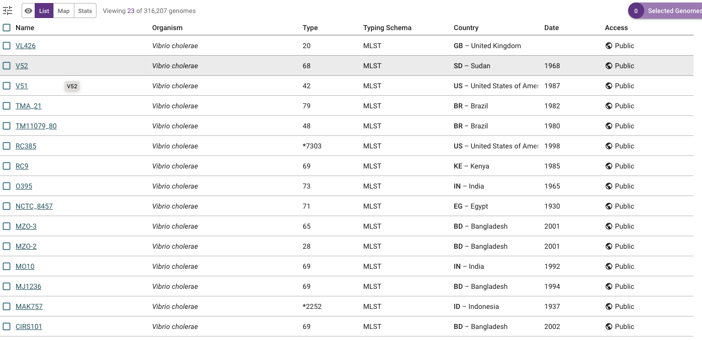
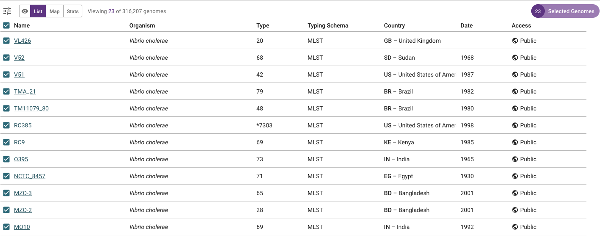
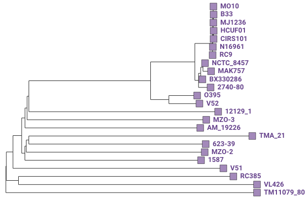
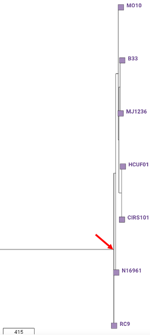

Worked example - Haiti 2022
===========================

This section will cover:

* `The Haiti 2022 outbreak`_
* `The H22 genome`_.
* `Finding the H22 genome in Vibriowatch`_.
* `Assembly quality of the H22 genome`_.
* `Does H22 belong to the pandemic lineage of Vibrio cholerae? (using MLST)`_.
* `Does H22 belong to the pandemic lineage of Vibrio cholerae? (using PopPUNK)`_.
* `Does H22 belong to the pandemic lineage of Vibrio cholerae? (using a phylogenetic tree)`_.
* `What are the closest relatives of H22 among published Vibrio cholerae genomes?`_.
* `What can we say about the origins of the Haiti 2022 outbreak, based on the H22 genome?`_
* `Is H22 predicted to produce cholera toxin?`_
* `Is H22 predicted to have antimicrobial resistance?`_
* `Is H22 predicted to have plasmids?`_

The Haiti 2022 outbreak
-----------------------

You may already know that in January 2010 there was a catastrophic earthquake in Haiti, an island in the Caribbean.
Later that year, in October 2010, a huge cholera outbreak begain in Haiti, that lasted up until 2019, and included
more than 820,000 cholera cases and nearly 10,000 deaths from cholera. This outbreak was found to have been caused
by the current pandemic lineage of *Vibrio cholerae* (known as the 7PET lineage), and evidence suggests that it
was likely carried from Nepal to Haiti in 2010 (`Orata et al 2014`_). 

.. _Orata et al 2014: https://pubmed.ncbi.nlm.nih.gov/24699938/

By 2019, the number of cholera cases had waned off, and it appeared that the cholera epidemic in Haiti was finally over.
No more cholera cases were reported in Haiti in 2020, 2021 and for most of 2022. As a result, the Haitian government
was keen for Haiti be declared 'cholera-free'. However, unfortunately in October of 2022 a new cholera outbreak 
occurred in Haiti, after almost three years of no cholera cases. By February 2023, there had been more than 30,000
cholera cases, and >500 deaths from cholera (source: Pan American Health Organisation).

An important epidemiological question was: where did the *V. cholerae* causing the Haiti 2022 outbreak come from?
Had it persisted in Haiti since the previous 2010-2019 epidemic, persisting either in humans (e.g. asymptomatic or unreported cases)
or in the environment (e.g. in rivers or lakes)?

The H22 genome
--------------

Late in 2022, `Rubin et al 2022`_ published the genome of a *V. cholerae* isolate from the Haiti 2022 outbreak, which
they named isolate 'H22'. 

.. _Rubin et al 2022: https://pubmed.ncbi.nlm.nih.gov/36449726/

In this worked example, I'm going to show you how to analyse the H22 genome to answer some key questions relevant
to public health, and answer questions about the origins of the Haiti 2022 outbreak:

#. Does H22 belong to the pandemic lineage of Vibrio cholerae?
#. What are the closest relatives of H22 among published Vibrio cholerae genomes? 
#. What can we say about the origins of the Haiti 2022 outbreak, based on the H22 genome?
#. Is H22 predicted to produce cholera toxin?
#. Is H22 predicted to have antimicrobial resistance?
#. Is H22 predicted to have plasmids?

Let's analyse the H22 genome in Vibriowatch to answer some of these questions. The H22
genome is amongst the approximately 6000 genomes that we have already added to Vibriowatch as 'public' genomes that
everyone can see. 

Finding the H22 genome in Vibriowatch
-------------------------------------

First, let's find the H22 genome in Vibriowatch.

You can search for an isolate in Vibriowatch by searching by its isolate/strain name(s).

You can search for isolate H22 in Vibriowatch by clicking on the three small horizontal bars at the top left of the Pathogenwatch website:

.. image:: Picture9.png
  :width: 150
  
This will bring up a menu:

.. image:: Picture10.png
  :width: 150
  
If you click on 'All Genomes' in the menu, you will then see a list of all the genomes in Pathogenwatch. 

To just select *V. cholerae* genomes, click on 'Genus' in the menu that now appears:

.. image:: Picture22.png
  :width: 150
  
Then select 'Vibrio', to select just genomes from *V. cholerae*. You will now see a list of the approximately 6000 *V. cholerae* genomes (just showing the top of the list here):

.. image:: Picture23.png
  :width: 850
  
A search bar will now appear at the top left.
If you type 'H22' in the search bar, it will find isolate H22:

.. image:: Picture114.png
  :width: 850
    
You can click on the isolate's name (link 'H22') to go to its 'report page'. 
The report page shows the curated metadata for the isolate, as well as bioinformatics analyses of the isolate.
This shows the top of the report page for H22:

.. image:: Picture115.png
  :width: 600

Assembly quality of the H22 genome
----------------------------------

Let's have a quick look at the assembly statistics for the H22 genome assembly, to check that the assembly looks
reasonably good quality and has the expected GC content for *V. cholerae*. To look at the assembly statistics, scroll
to the bottom of the genome report page for H22. You should see a section with the heading "Assembly stats", which
looks like this:

.. image:: Picture116.png
  :width: 600

We can see that the assembly for the H22 isolate has a genome size of about 4.0 Megabases, and GC content of 47.5%. This is consistent with the reference genome for *Vibrio cholerae* strain N16961, which has a genome size of about 4.0 Megabases and GC content of 47.5% (see `Heidelberg et al 2000`_).

.. _Heidelberg et al 2000: https://pubmed.ncbi.nlm.nih.gov/10952301/

As a very rough 'rule of thumb', we would consider that an assembly size of between about 3.3 and 5.3 Megabase, and a GC content of between about 41.3% and 48.6%, is reasonable for a *Vibrio cholerae* genome. However, note that this an extremely rough rule of thumb, and may need to be revised in future when more is known about the diversity found in the species *Vibrio cholerae*.

If your assembly has a genome size or GC content far outside these ranges, it would probably be a good idea to investigate whether your assembly likely contains contamination from another species' DNA (see my documentation `using CheckM to detect contamination`_).

.. _using CheckM to detect contamination: https://vibriowatch.readthedocs.io/en/latest/assemblies.html#run-checkm-to-check-if-the-assembly-for-your-isolate-is-contaminated

Another commonly used measures of assembly quality is the number of contigs. We see here that the assembly for the H22 isolate has 44 contigs.
We would usually consider that an assembly is of relatively good quality if it consists of :math:`<` 700 contigs. If the assembly for your isolate has more contigs, it is relatively poor quality and so this may introduce errors into further bioinformatic analyses that you carry out using Vibriowatch.
The genome for the H22 isolate has 44 contigs, so is relatively good quality. 

Does H22 belong to the pandemic lineage of Vibrio cholerae? (using MLST)
------------------------------------------------------------------------

The current pandemic (seventh pandemic) of cholera began in the 1960s and has been caused by the current pandemic lineage of *Vibrio cholerae*, known as the "7PET lineage". 
The 7PET lineage is a highly infectious and virulent lineage, and causes explosive outbreaks and huge epidemics.

A quick way to find out whether an isolate likely belongs to the 7PET lineage is to look at MLST (multi-locus sequence typing) results for the isolate in Vibriowatch. 

The MLST results for the isolate are shown at the top of the genome report page for the isolate in Vibriowatch. Here we can see the MLST results for isolate
H22 at the top of its report page (see under the heading "MLST"):

.. image:: Picture115.png
  :width: 600

We can see that isolate H22 is classified as MLST sequence type ST69.

ST69 is one of the STs (sequence types) often seen for the current pandemic ('7PET') lineage of *Vibrio cholerae*. Another sequence type that is sometimes seen for pandemic lineage *V. cholerae* is ST515. If an isolate is ST69 or ST515, it very likely belongs to the pandemic lineage. 

Note that if an isolate is not ST69 or ST515, it is still possible that it the isolate belongs to the pandemic lineage but has a very rare sequence type for the pandemic lineage. Also, if the isolate was sequenced using Oxford Nanopore Technology (ONT), then sometimes it is difficult to accurately identify
the MLST sequence type from ONT data (because ONT data can have many sequencing errors), so your isolate may belong to the 
pandemic lineage but it may be difficult to determine this using MLST information.

Does H22 belong to the pandemic lineage of Vibrio cholerae? (using PopPUNK)
---------------------------------------------------------------------------

A second approach for figuring out whether your isolate belongs to the pandemic lineage (7PET lineage) or not, is to look at the
PopPUNK cluster of your isolate. PopPUNK is a tool for classifying bacterial isolates into lineages. At the top of the
Vibriowatch genome report page for isolate H22, we can see the PopPUNK information under the heading "Lineage":

.. image:: Picture115.png
  :width: 600

You can see that isolate H22 belongs to the PopPUNK lineage 1 (also known as VC1), which corresponds to the current pandemic lineage (7PET lineage).
Thus, like the MLST results, the PopPUNK results suggest that isolate H22 belongs to the current pandemic lineage. 

Note that if the PopPUNK cluster of your isolate is not VC1 (but instead another VC number), 
there is still a small possibility that your isolate belongs to the pandemic lineage.
In particular, if your isolate was sequenced using Oxford Nanopore Technology (ONT), it is often difficult for PopPUNK
to accurately identify the PopPUNK cluster (because there are often sequencing errors in ONT data), 
so your isolate may belong to the pandemic lineage but it may be difficult to determine this using PopPUNK.

Does H22 belong to the pandemic lineage of Vibrio cholerae? (using a phylogenetic tree)
---------------------------------------------------------------------------------------

As mentioned above, since isolate H22 has MLST sequence type ST69 or ST515, and/or belongs to
the VC1 PopPUNK cluster, then it likely belongs to the current pandemic lineage (7PET lineage). 

However, this information from MLST and PopPUNK is just based on a fraction of the whole genome data (in the case of MLST, it's just
based on 7 genes!), so to be more confident of these inferences, it's a good idea to also build a phylogenetic tree containing isolate H22, as well as contextual isolates from 
known *V. cholerae* lineages. Note that if you were analysing an isolate for which MLST and PopPUNK were not very useful in identifying the lineage, then it would be 
especially important to identify the lineage by building a phylogenetic tree.

So, let's try to confirm that H22 belongs to the 7PET lineage, by building a Vibriowatch collection containing H22 and some contextual isolates of known lineages. 
Vibriowatch will build a tree for the collection for us.

To figure out whether isolate H22 belongs to the pandemic lineage, we can make a Vibriowatch collection containing both isolate H22 and the isolates of `Chun et al 2009`_.

.. _Chun et al 2009: https://pubmed.ncbi.nlm.nih.gov/19720995/

Go make a collection, you need to be logged into the Pathogenwatch website.

First we need to select the isolates that we want to put in the collection. To include H22 in the collection, first we search for H22
on the Vibriowatch website. You can search for isolate H22 in Vibriowatch by clicking on the three small horizontal bars at the top left of the Pathogenwatch website:

.. image:: Picture9.png
  :width: 150
  
This will bring up a menu:

.. image:: Picture10.png
  :width: 150
  
If you click on 'All Genomes' in the menu, you will then see a list of all the genomes in Pathogenwatch. 

To just select *V. cholerae* genomes, click on 'Genus' in the menu that now appears:

.. image:: Picture22.png
  :width: 150
  
Then select 'Vibrio', to select just genomes from *V. cholerae*. You will now see a list of the approximately 6000 *V. cholerae* genomes (just showing the top of the list here):

.. image:: Picture23.png
  :width: 850
  
A search bar will now appear at the top left.
If you type 'H22' in the search bar, it will find isolate H22:

Note that you should see "0 selected genomes" in a purple button at the top right of the screen. (If you see
"X selected genomes" where X is not 0, then click on the purple button and click on the "Clear all" button that appears).

Now select the H22 isolate by clicking on the box to the left of its name, and you should see "1 selected genomes" appear in the purple
button at the top right of the screen:

(which include isolates from the current pandemic lineage, as well as isolates from other *V. cholerae* lineages). 
To do this, go to `the list of genomes in our collection for Chun et al 2009`_:

.. _the list of genomes in our collection for Chun et al 2009: https://pathogen.watch/genomes/all?collection=2c43jl3z2xs8-vibriowatch-collection-chun-et-al-2009&organismId=666

  
This will list all 23 isolates in your `Chun et al 2009`_ collection. Make sure that you have no isolates selected at present (the purple button at the top right of the webpage should say '0 selected genomes'; if it does not, click on it, and then click on 'Clear all'). Then tick the box beside the
column heading 'Name', to select all 23 isolates sequenced by `Chun et al 2009`_.

.. _Chun et al 2009: https://pubmed.ncbi.nlm.nih.gov/19720995/

Next, search for your isolate of interest, that is, the one for which you want to find out whether it belongs to the current
pandemic lineage (7PET lineage). As an example, let's take isolate HCUF_O1, an isolate collected in Haiti in 2010 and sequenced by `Hasan et al 2012`_. We can search for this isolate in Vibriowatch, and tick the box beside its name to select it. Then we will have 24 isolates selected, and we can make a new collection containing these 24 isolates (you could call it something like 'Chun et al plus HCUF-01'). 

.. _Hasan et al 2012: https://pubmed.ncbi.nlm.nih.gov/22711841/

Vibriowatch will make a tree for these 24 isolates, which is a neighbour-joining tree, and which should look something like this:

  
You can see that HCUF-01 is placed in the clade of the tree containing the 7PET lineage isolates (MO10, B33, MJ1236, CIRS101, N16961, RC9). 
If you zoom in on the clade containing the 7PET lineage isolates, you will see that the branch length from the common ancestor of all the 7PET isolates
in the tree (shown with a red arrow) to isolate HCUF-01 is a relatively short branch length. If there are long branches in a phylogenetic tree,
sometimes it is difficult for the tree-building algorithm (tree-building method) to correctly place isolates in the tree. However, in this case,
since the branch length is relatively short to isolate HCUF-01, we can be more confident that the tree-building algorithm has placed isolate
HCUF-01 correctly:

Therefore, this strongly suggests that HCUF-01 belongs to the 7PET lineage, that is, that it belongs to the current pandemic lineage. This is consistent with the fact that the cholera outbreak in Haiti in 2010 developed into a huge epidemic with >820,000 cases and about 10,000 deaths (source: `CDC`_).

.. _CDC: https://www.cdc.gov/cholera/haiti/index.html

At the bottom left, we can see a scale-bar saying “415”, which tells us how much genetic distance is represented by a certain branch-length in the tree. The lengths of the branches between isolate HCUF-01 and its common ancestor with the 7PET isolates (ie. from HCUF-01 to the red arrow) is a fraction of the length of this scale-bar; we can roughly guess by eye that this is a genetic distance of <50, which is pretty small. 

What are the closest relatives of H22 among published Vibrio cholerae genomes?
------------------------------------------------------------------------------

What can we say about the origins of the Haiti 2022 outbreak, based on the H22 genome?
--------------------------------------------------------------------------------------

Is H22 predicted to produce cholera toxin?
------------------------------------------

Is H22 predicted to have antimicrobial resistance?
--------------------------------------------------

Is H22 predicted to have plasmids?
----------------------------------

CholeraBook
-----------

If you would like to learn more about cholera genomics, you may also be interested in our `Online Cholera Genomics Course (CholeraBook)`_.

.. _Online Cholera Genomics Course (CholeraBook): https://cholerabook.readthedocs.io/

Contact
-------

I will be grateful if you will send me (Avril Coghlan) corrections or suggestions for improvements to my email address alc@sanger.ac.uk
