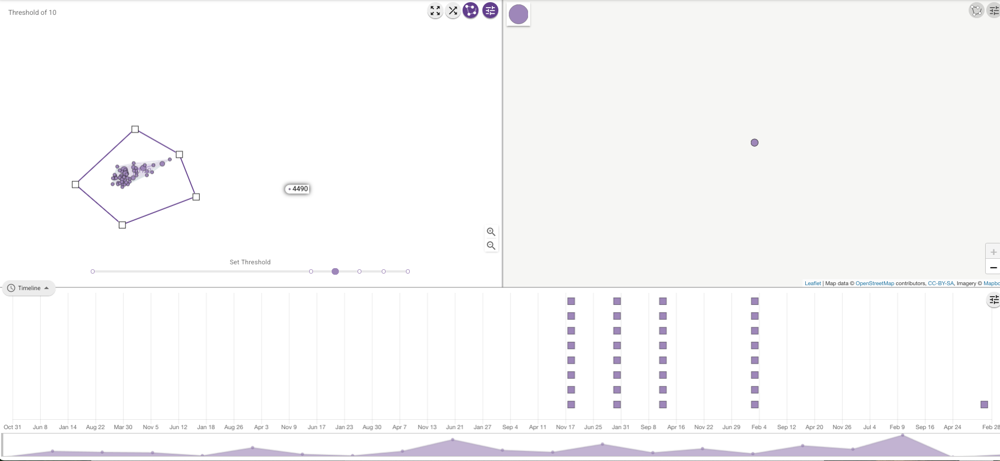
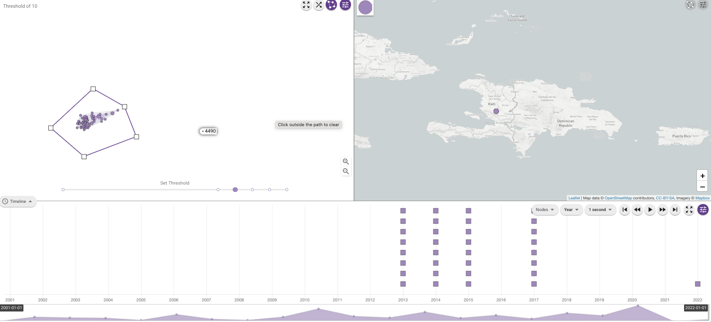

Case study - Haiti 2022
=======================

This section is a worked example of using Vibriowatch to analyse cholera genomic data, using the Haiti 2022 outbreak as an example.

This page is dedicated to the fantastic public health professionals, scientists and public servants of Haiti, and to the patient
who generously donated a sample, for making this cholera genomic data publicly available and therefore contributing a lot to our
global understanding of cholera.

This case study has been selected as it is an example of cholera persisting within a country or region between outbreaks. It also illustrates
how, if sampling is patchy, it is difficult to distinguish between persistance within a country and re-introduction from a nearby country.
Furthermore, it illustrates how it is very difficult to distinguish between persistance of cholera in the human population between outbreaks, versus
persistance in the environment between outbreaks.

* `The Haiti 2022 outbreak`_
* `The H22 genome`_.
* `Finding the H22 genome in Vibriowatch`_.
* `Assembly quality of the H22 genome`_.
* `Is H22 predicted to produce cholera toxin?`_
* `Is H22 predicted to have antimicrobial resistance?`_
* `Is H22 predicted to have plasmids?`_
* `What is the predicted serogroup of the H22 isolate?`_
* `Does H22 belong to the pandemic lineage of Vibrio cholerae?`_.
* `What are the closest relatives of H22 among published Vibrio cholerae genomes?`_.
* `What can we say about the origins of the Haiti 2022 outbreak, based on the H22 genome?`_
* `Reflections on the Haiti 2022 case study`_

The Haiti 2022 outbreak
-----------------------

You may already know that in January 2010 there was a catastrophic earthquake in Haiti, an island in the Caribbean.
Later that year, in October 2010, a huge cholera outbreak begain in Haiti, that lasted up until 2019, and included
more than 820,000 cholera cases and nearly 10,000 deaths from cholera. This outbreak was found to have been caused
by the current pandemic lineage of *Vibrio cholerae* (known as the 7PET lineage), and evidence suggests that it
was likely carried from Nepal to Haiti in 2010 (`Orata et al 2014`_). 

.. _Orata et al 2014: https://pubmed.ncbi.nlm.nih.gov/24699938/

By 2019, the number of cholera cases had waned off, and it appeared that the cholera epidemic in Haiti was finally over.
No more cholera cases were reported in Haiti in 2020, 2021 and for most of 2022. However, unfortunately in October of 2022 a new cholera outbreak 
occurred in Haiti, after almost three years of no cholera cases. By February 2023, there had been more than 30,000
cholera cases, and >500 deaths from cholera (source: Pan American Health Organisation).

An important epidemiological question was: where did the *V. cholerae* causing the Haiti 2022 outbreak come from?
Had it persisted in Haiti since the previous 2010-2019 epidemic, persisting either in humans (e.g. asymptomatic or unreported cases)
or in the environment (e.g. in rivers or lakes)? Or was the Haiti 2022 outbreak due to a completely new introduction into Haiti from another
part of the world, such as Africa or Asia? 

The H22 genome
--------------

Late in 2022, `Rubin et al 2022`_ published the genome of a *V. cholerae* isolate from the Haiti 2022 outbreak, which
they named isolate 'H22'. The authors of this work were an international consortium of scientists and public health experts from the
Laboratoire National de Santé Publique (National Health Laboratory) in Haiti, Zanmi Lasante (a non-government healthcare provider in Haiti),
Brigham and Women's Hospital (USA), Massachusetts General Hospital (USA), and the
International Centre for Diarrheal Disease Research (Bangladesh):

.. _Rubin et al 2022: https://pubmed.ncbi.nlm.nih.gov/36449726/

.. image:: Picture172.png
  :width: 800

In this worked example, I'm going to show you how to analyse the H22 genome to answer some key questions relevant
to public health, and answer questions about the origins of the Haiti 2022 outbreak:

#. Is H22 predicted to produce cholera toxin?
#. Is H22 predicted to have antimicrobial resistance?
#. Is H22 predicted to have plasmids?
#. Does H22 belong to the pandemic lineage of Vibrio cholerae?
#. What are the closest relatives of H22 among published Vibrio cholerae genomes? 
#. What can we say about the origins of the Haiti 2022 outbreak, based on the H22 genome?

Let's analyse the H22 genome in Vibriowatch to answer some of these questions. The H22
genome is amongst the approximately 6000 genomes that we have already added to Vibriowatch as 'public' genomes that
everyone can see. 

Finding the H22 genome in Vibriowatch
-------------------------------------

If you learn better by seeing rather than reading, see the `video on finding H22's report page in Vibriowatch`_.

.. _video on finding H22's report page in Vibriowatch: https://youtu.be/7k79hfyTW4Q 

First, let's go to the H22 genome in Vibriowatch; click on this link to go to `H22's genome report page`_ in Vibriowatch (or see 
`How to search for an isolate in Vibriowatch and see its report page`_ to find out how to search for H22's report page yourself).

.. _H22's genome report page: https://pathogen.watch/genomes/all?genusId=662&searchText=H22

.. _How to search for an isolate in Vibriowatch and see its report page: https://vibriowatch.readthedocs.io/en/latest/navigating.html#how-to-search-for-an-isolate-in-vibriowatch-and-see-its-report-page

The report page shows the curated metadata for the isolate, as well as bioinformatics analyses of the isolate.
This shows the top of the report page for H22:

.. image:: Picture115.png
  :width: 600

Assembly quality of the H22 genome
----------------------------------

If you learn better by seeing rather than reading, see the `video on investigating H22's assembly quality, using Vibriowatch`_.

.. _video on investigating H22's assembly quality, using Vibriowatch: https://youtu.be/SevDN1pLyqo 

.. image:: HowToGetTheResult.png
  :width: 600

Let's have a quick look at the assembly statistics for the H22 genome assembly, to check that the assembly looks
reasonably good quality and has the expected GC content for *V. cholerae*. To look at the assembly statistics, scroll
to the bottom of the genome report page for H22. You should see a section with the heading "Assembly stats", which
looks like this:

.. image:: Picture116.png
  :width: 550

We can see that the assembly for the H22 isolate has a genome size of about 4.0 Megabases (Mb), and GC content of 47.5%. 
Another commonly used measures of assembly quality is the number of contigs. We see here that the assembly for the H22 isolate has 44 contigs.

.. _Heidelberg et al 2000: https://pubmed.ncbi.nlm.nih.gov/10952301/

.. image:: HowToInterpretTheResult.png
  :width: 600

The assembly size of H22 of 4.0 Mb is consistent with the reference genome for *Vibrio cholerae* strain N16961, which has a genome size of about 4.0 Megabases and GC content of 47.5% (see `Heidelberg et al 2000`_). As a very rough 'rule of thumb', we would consider that an assembly size of between about 3.3 and 5.3 Megabase, and a GC content of between about 41.3% and 48.6%, is reasonable for a *Vibrio cholerae* genome. 

We would usually consider that an assembly is of relatively good quality if it consists of :math:`<` 700 contigs. 
The genome for the H22 isolate has 44 contigs, so is relatively good quality. 

Is H22 predicted to produce cholera toxin?
------------------------------------------

If you learn better by seeing rather than reading, see the `video on predicting if H22 produces cholera toxin, using Vibriowatch`_.

.. _video on predicting if H22 produces cholera toxin, using Vibriowatch: https://youtu.be/fQHf4nCZ7L8 

Cholera is a disease characterised by acute watery diarrhoea, and the diarrhoea symptoms are mainly caused by the cholera toxin (Ctx) that is secreted
by *V. cholerae*. Therefore, cholera toxin is considered the primary virulence factor of *V. cholerae*. Practically all isolates of the current pandemic lineage
of *V. cholerae*, the 7PET lineage, carry the genes for cholera toxin (genes *ctxA* and *ctxB*) and produce cholera toxin, which is a protein
complex consisting of CtxA and CtxB subunits. However, many isolates of other
(non-pandemic) lineages of *V. cholerae* do not carry the genes for cholera toxin, and so do not produce cholera toxin.

.. image:: HowToGetTheResult.png
  :width: 600

To find out whether the H22 isolate carries the genes for cholera toxin, and so is predicted to produce cholera toxin, we can look at the "Virulence" section
of the genome report page for H22:

.. image:: Picture121.png
  :width: 550

You can see that there is a tick next to "ctxA" and "ctxB" so H22 is predicted to carry the cholera toxin genes.

.. image:: HowToInterpretTheResult.png
  :width: 600

Because the H22 genome is predicted to carry the *ctxA* and *ctxB* genes, we can predict that it produces the cholera toxin. 
This agrees with evidence in the paper of `Rubin et al 2022`_, who reported phenotypic data suggesting that H22 is toxigenic, i.e. that produces cholera toxin.

.. _Rubin et al 2022: https://pubmed.ncbi.nlm.nih.gov/36449726/

Is H22 predicted to have antimicrobial resistance?
--------------------------------------------------

If you learn better by seeing rather than reading, see the `video on predicting if H22 has antimicrobial resistance, using Vibriowatch`_.

.. _video on predicting if H22 has antimicrobial resistance, using Vibriowatch: https://youtu.be/fexfUXza8M8 

The primary treatment for cholera is rehydration, but antimicrobials are given to the most vulnerable patients such as pregnant women, very small
children, and HIV-positive patients. The WHO recommends the antimicrobials azithromycin, doxycycline and ciprofloxacin for treating cholera. Therefore, any
antimicrobial resistance to these recommended antimicrobials would be a concern.

.. image:: HowToGetTheResult.png
  :width: 600

To find out whether the H22 isolate carries antimicrobial resistance (AMR), we can look at the "AMR" section of the genome report page for H22:

.. image:: Picture122.png
  :width: 550

You can see that the H22 isolate is not predicted to have resistance genes or mutations to azithromycin or doxycycline, but is predicted to
have an intermediate level of resistance to ciprofloxacin because it carries two resistance mutations, the *gyrA_S83I* and *parC_S85L* mutations (causing a substitution
from S to I at position 83 of the GyrA protein, and a substitution from S to L at position 85 of the ParC protein, respectively).
You can also see that is predicted to be resistant to trimethoprim (because it carries the gene *dfrA1*) and sulfamethoxazole (because it carries the gene *sul2*).

.. image:: HowToInterpretTheResult.png
  :width: 600

Based on the results above, we would predict H22 to have an intermediate level of resistance to ciprofloxacin, and to be resistant to trimethoprim and sulfamethoxazole.

This agrees with the evidence in the paper of `Rubin et al 2022`_, who reported that from laboratory testing results, H22 has resistance to trimethoprim and sulfamethoxazole, and low-level
resistance to ciprofloxacin. Trimethoprim and sulfamethoxazole are not the WHO-recommended antimicrobials for cholera, but have been used
in the past in some locations (`Das et al 2020`_).

.. _Rubin et al 2022: https://pubmed.ncbi.nlm.nih.gov/36449726/
.. _Das et al 2020: https://pubmed.ncbi.nlm.nih.gov/31272870/

Is H22 predicted to have plasmids?
----------------------------------

If you learn better by seeing rather than reading, see the `video on predicting plasmids in H22, using Vibriowatch`_.

.. _video on predicting plasmids in H22, using Vibriowatch: https://youtu.be/_mtfCiBlJac 

Antimicrobial resistance genes can be carried on large plasmids in *Vibrio cholerae*, but such large plasmids are relatively rare.

.. image:: HowToGetTheResult.png
  :width: 600

To find out whether the H22 isolate is predicted to carry a plasmid, we can look at the "Plasmid Inc types" section of the genome report page for H22:

.. image:: Picture123.png
  :width: 350

We see that there are no predicted plasmids in H22.

.. image:: HowToInterpretTheResult.png
  :width: 600

There are no plasmids predicted by Vibriowatch in the H22 isolate. Note that plasmid prediction in Vibriowatch may not be very accurate for small
plasmids, and also if the assembly quality is poor, it's possible that plasmids may be missed by Vibriowatch. For H22, based on the Vibriowatch results,
we would predict that there are no large plasmids in H22.

What is the predicted serogroup of the H22 isolate?
---------------------------------------------------

If you learn better by seeing rather than reading, see the `video on predicting serogroup of H22, using Vibriowatch`_.

.. _video on predicting serogroup of H22, using Vibriowatch: https://youtu.be/Uh_04BSDaZ0 

The current pandemic lineage (7PET lineage) of *V. cholerae* has the O1 serogroup (or occasionally, for some isolates, the O139 serogroup).

.. image:: HowToGetTheResult.png
  :width: 600

To find out the predicted serogroup for H22, we can look at the top of the report page for H22:

.. image:: Picture115.png
  :width: 600

Under "Genotypes", you can see that the predicted serogroup is O1.

.. image:: HowToInterpretTheResult.png
  :width: 600

From the above, we see that the predicted serogroup of the H22 isolate is O1. 

This agrees with phenotypic evidence from the paper of `Rubin et al 2022`_, who reported, based on laboratory results, that H22 is serogroup O1.

.. _Rubin et al 2022: https://pubmed.ncbi.nlm.nih.gov/36449726/

Note that the fact that H22 is serogroup O1 doesn't mean that H22 definitely belongs to the 7PET lineage,
as some *V. cholerae* isolates of other (non-pandemic) lineages also have serogroup O1. 

Does H22 belong to the pandemic lineage of Vibrio cholerae?
-----------------------------------------------------------

If you learn better by seeing rather than reading, see the `video on finding out the lineage of H22, using Vibriowatch`_.

.. _video on finding out the lineage of H22, using Vibriowatch: https://youtu.be/EBKcwA3pjA0 

The current pandemic (seventh pandemic) of cholera began in the 1960s and has been caused by the current pandemic lineage of *Vibrio cholerae*, known as the "7PET lineage". 
The 7PET lineage is a highly infectious and virulent lineage, and causes explosive outbreaks and huge epidemics.

.. image:: HowToGetTheResult.png
  :width: 600

A quick way to find out whether an isolate likely belongs to the 7PET lineage is to look at MLST (multi-locus sequence typing) results for the isolate in Vibriowatch. 
The MLST results for the isolate are shown at the top of the genome report page for the isolate in Vibriowatch. Here we can see the MLST results for isolate
H22 at the top of its report page (see under the heading "MLST"):

.. image:: Picture115.png
  :width: 600

We can see that isolate H22 is classified as MLST sequence type ST69. 

A second approach for figuring out whether your isolate belongs to the pandemic lineage (7PET lineage) or not, is to look at the
PopPUNK cluster of your isolate. PopPUNK is a tool for classifying bacterial isolates into lineages. At the top of the
Vibriowatch genome report page for isolate H22 (see above), we can see the PopPUNK information under the heading "Lineage".
You can see that isolate H22 belongs to the PopPUNK lineage 1 (also known as VC1).

.. image:: HowToInterpretTheResult.png
  :width: 600

ST69 is one of the STs (sequence types) often seen for the current pandemic ('7PET') lineage of *Vibrio cholerae*. Another sequence type that is sometimes seen for pandemic lineage *V. cholerae* is ST515. If an isolate is ST69 or ST515, it very likely belongs to the pandemic lineage. This suggests H22 belongs to the 7PET lineage.
From the PopPUNK results, we found that H22 belongs to PopPUNK cluster VC1; this corresponds to the current pandemic lineage (7PET lineage) (see
the `table of correspondences between PopPUNK clusters and known lineages`_).
Thus, like the MLST results, the PopPUNK results suggest that isolate H22 belongs to the current pandemic lineage.

.. _table of correspondences between PopPUNK clusters and known lineages: https://vibriowatch.readthedocs.io/en/latest/mlst.html#what-is-poppunk

What are the closest relatives of H22 among published Vibrio cholerae genomes?
------------------------------------------------------------------------------

If you learn better by seeing rather than reading, see the `video on identifying the closest relatives of H22, using Vibriowatch`_.

.. _video on identifying the closest relatives of H22, using Vibriowatch: https://youtu.be/essXib5sZ0c 

Vibriowatch includes a large set of >6000 published *V. cholerae* genomes, so you can search for the closest relatives of a new isolate among those published genomes.

.. image:: HowToGetTheResult.png
  :width: 600

To find the closest relatives of H22 among publised *V. cholerae* genomes, we can look under the "Core genome clustering" 
section of the H22 genome report page, which gives the result of a cgMLST (core genome MLST) analysis:

.. image:: Picture124.png
  :width: 600

You can see a network showing blobs representing sequenced isolates, where H22 is shown as a purple blob (and labelled "H22"), and other
closely related isolates are shown by grey blobs. The edges (lines) in the network show relationships between related isolates,
where the length of an edge between two isolates (two blobs) represents the number of genetic differences between them.
Isolates that are closer to H22 in the network have less genetic differences in their DNA from H22, and so are assumed 
to be more closely evolutionarily related to H22.

You can see that at the top of the network it says "Cluster of 1326 at a threshold of 10", so these are 1326
isolates that are closely related and differ from each other by 10 or less mutations in the DNA of their core genome
regions ("core genome regions" are regions of the genome shared by almost all *V. cholerae* isolates).

To examine the network a bit more closely, you can click on the big purple "VIEW CLUSTER" button.
This will bring you to a new view, in which you can see the network in the top left panel, a map of where the isolates
were collected in the top right panel, and a timeline of when the isolates were collected below.

.. image:: Picture125.png
  :width: 800

You can see again that the purple blob representing H22 (which is labelled "H22") is in the top part of the network. To select
the top part of the network, in the top left panel that contains the network, you can click on the
"Controls" button in the top right of the panel:

.. image:: Picture126.png
  :width: 50

Then click on the button to the left of the "Controls" button, which is the "Lasso" button:

.. image:: Picture127.png
  :width: 100

Then using the rollerball on your mouse, zoom in on the part of the network that contains H22, to see H22 and its most
closely related isolates:

.. image:: Picture128.png
  :width: 550

Then draw a shape around H22 and its most closely related isolates, by using your mouse to click at points around the
region containing H22 and its closest relatives:

You will see that it now only shows H22 and its closest isolates (that lie inside the shape you have drawn) in the network
panel at the top right. The map in the top left panel now only shows one dot. If you move your mouse into the map panel,
and use the rollerball on your mouse to zoom out, you will find that this dot is in the country of Haiti, so the closest
relatives of H22 were all collected from Haiti:

.. image:: Picture130.png
  :width: 800

To find out when these close relatives were collected, we need to look at their years of collection. By default, the
dates in the timeline panel at the bottom of the screen are given as days and months. To instead show the years,
click on the "Controls" button at the top right of the timeline panel:

.. image:: Picture126.png
  :width: 50

Now change "Day" to "Year" in the menu that appears.

.. image:: Picture131.png
  :width: 350

Then click on the "X" at the corner of the menu to close that menu. You will now see that the timeline panel
with the years when the most closely related isolates were collected:

In the timeline you can see one square at the right hand end, above "2022"; this is the isolate H22, which was collected in 2022.
You can also see squares above the years 2013, 2014, 2015 and 2017, indicating that the closest relatives of H22
in the Vibriowatch database are isolates collected in Haiti in the years 2013, 2014, 2015 and 2017.

.. image:: HowToInterpretTheResult.png
  :width: 600

The results from the cgMLST (core genome MLST) analysis above tell us the closest relatives
of the H22 isolate among the >6000 published genomes in Vibriowatch are other published genomes from
Haiti, namely, isolates collected in Haiti in the years 2013, 2014, 2015 and 2017.

What can we say about the origins of the Haiti 2022 outbreak, based on the H22 genome?
--------------------------------------------------------------------------------------

To investigate the origins of the Haiti 2022 outbreak, we can make a phylogenetic tree of the H22 isolate and its
close relatives. 

If you learn better by seeing rather than reading, see the `video 1 on building a phylogenetic tree for the Haiti 2022 outbreak, using Vibriowatch`_
and `video 2 on building a phylogenetic tree for the Haiti 2022 outbreak, using Vibriowatch`_ and
and `video 3 on building a phylogenetic tree for the Haiti 2022 outbreak, using Vibriowatch`_.

.. _video 1 on building a phylogenetic tree for the Haiti 2022 outbreak, using Vibriowatch: https://youtu.be/ElX32K3QnQE 

.. _video 2 on building a phylogenetic tree for the Haiti 2022 outbreak, using Vibriowatch: https://youtu.be/LFQYJLugBQw 

.. _video 3 on building a phylogenetic tree for the Haiti 2022 outbreak, using Vibriowatch: https://youtu.be/XCKCevbBzB8 

.. image:: HowToGetTheResult.png
  :width: 600

As mentioned above, we can identify close relatives of H22 by looking at the "Core genome clustering"
section of the H22 genome report page:

.. image:: Picture124.png
  :width: 600

This network shows 1326 isolates that are closely related, one of which is H22. To build a phylogenetic tree of these
1326 isolates, we can build a "collection" for the isolates in Vibriowatch, and the collection will include a phylogenetic tree.

To build a collection for the 1326 isolates in the network, you can click on the big purple "LIST GENOMES" button to list all
1326 genomes. This will bring up a list of all the genomes; here is just the first few:

.. image:: Picture133.png
  :width: 600

To make a collection for all these isolates, first check that the purple button at the top right of the screen says
"0 Selected Genomes". If it says "X Selected Genomes", and X is not zero, then click on the button, and then click on 
"Clear all" in the menu that appears.

Then select all 1326 isolates by clicking on the box beside "Name" at the top of the list of isolates. This should
result in ticks in all the boxes beside all the isolates:

.. image:: Picture134.png
  :width: 600

Now click on the purple button saying "1326 Selected Genomes" at the top right of the webpage.
You can now click on that button to make a collection (see `How To Make a Collection of Isolates in Vibriowatch`_ for more details).

.. _How To Make a Collection of Isolates in Vibriowatch: https://vibriowatch.readthedocs.io/en/latest/navigating.html#how-to-make-a-collection-of-isolates-in-vibriowatch

Then you will see a tree of the 1326 genomes:

.. image:: Picture135.png
  :width: 600

You can find the H22 isolate in the tree by typing "H22" in the search box at the top of the page, where it says "FILTER NAME":

.. image:: Picture136.png
  :width: 600

You can see that the H22 isolate is part of a small clade (group) of isolates that are on quite a long branch. If you
move your mouse over the ancestral node of this clade, you will see the number "111" appear, indicating that there
are 111 isolates in that small clade (group) of isolates.

.. image:: Picture137.png
  :width: 600

If you right-click on the ancestral node of that small clade, and then choose "View subtree" in the menu that appears, it will
show you just the part of the tree corresponding to that small clade.
You can then delete "H22" from the search box at the top, to deselect the H22 isolate. You will now see that on the right, there
is only one dot on the map, and if you use the rollerball on your mouse to scroll out, you will see it corresponds to Haiti,
indicating that all the isolates in this small clade are from Haiti:

.. image:: Picture138.png
  :width: 800

To now make a pretty plot with the isolates collected in different years in Haiti highlighted, it is easiest
to do this using `Microreact`_ (see `Plotting the tree and data for a Vibriowatch collection in Microreact`_), by downloading the metadata and tree files to your computer, and then uploading
them into Microreact. This gives us a nice tree like this:

.. image:: Picture140.png
  :width: 900

.. _Microreact: https://microreact.org/

.. _Plotting the tree and data for a Vibriowatch collection in Microreact: https://vibriowatch.readthedocs.io/en/latest/downloads.html#plotting-the-tree-and-data-for-a-vibriowatch-collection-in-microreact

.. image:: HowToInterpretTheResult.png
  :width: 600

We can see from this tree that the H22 isolate (indicated with a blue dot) is closely related to isolates
collected from Haiti in 2014 (yellow dots), 2015 (purple dots) and 2017 (red dots). 

Taken together, these results suggest that the *V. cholerae* that caused the Haiti 2022 outbreak
was very closely related to the *V. cholerae* that caused the Haiti 2010-2019 epidemic. This suggests
that the same clone of *V. cholerae* likely persisted in Haiti between 2019 and 2022, either in 
humans (e.g. asymptomatic or unreported cases) or in the environment (e.g. in rivers or lakes). 
However, another possibility, which we cannot discard (as we don't have evidence to disprove it), is that at some point during the Haiti 2010-2019
epidemic, cholera spread from Haiti to a nearby country in the Caribbean, and persisted undetected in that nearby country,
and that in 2022 it spread back to Haiti again.

These results agree with the paper of `Rubin et al 2022`_, who reported that, based on phylogenetic analysis, H22 "belongs to
a subclade of Haiti *V. cholerae* isolates that originated in 2013 during the previous epidemic". They say: "These analyses
suggest that the reemergence of cholera in Haiti in 2022 was caused, at least in part, by a descendant of the *V. cholerae* strain
that caused the 2010 epidemic. However, no cases of cholera were confirmed between 2019 and 2022, despite ongoing surveillance.
Several explanations for the recrudescence of this strain are possible. The first is that toxigenic *V. cholerae* O1 persisted
in Haiti through subclinical infections in humans and has recurred in the context of waning population immunity coupled with a crisis
in lack of clean water and sanitation. Another nonexclusive possibility is that this *V. cholerae* strain has persisted in environmental
reservoirs. Finally, because the 2010 outbreak in Haiti was ultimately transmitted to other countries in Latin America, a third
potential explanation is that the current strain could have been reintroduced to Haiti from a nearby country; however, this
explanation is less likely than the others, given the phylogenetic evidence and the absence of recent cholera cases in the region."
You can see the phylogenetic tree produced by `Rubin et al 2022`_ in Figure 1 of their paper, and see that it agrees
with the tree we obtain with Vibriowatch.

.. _Rubin et al 2022: https://pubmed.ncbi.nlm.nih.gov/36449726/

Reflections on the Haiti 2022 case study
----------------------------------------

We can see that the Haiti 2022 case study is an example of cholera persisting within a country or region between outbreaks, as although 
there were no reported cholera cases in Haiti between 2019 and October 2022, the genomic data tell us that the Haiti 2022 outbreak was
extremely closely related to the Haiti outbreaks in 2018 and previous years. Therefore, it is very likely that the strain causing the
Haiti 2018 outbreak persisted either in Haiti or in nearby countries, and resurfaced in Haiti in October 2022 to cause a new outbreak.
However, there is no evidence of cholera in either Haiti or nearby countries between 2019 and October 2022, so it is difficult to 
know in which country (or countries) of the region that particular strain of *Vibrio cholerae* persisted during that time. One possibility is that it persisted 
in the human population, but that there were no reported cases because cases were asymptomatic or mild, or were in regions with limited
health infrastructure. Another possibility was that particular strain of *V. cholerae* persisted in the environement during the
period, or in both the human population and the environment (e.g. due to sewage contamination of the environmentm and ingestion
of contaminated water by humans), but again, we are lacking evidence to support this.

CholeraBook
-----------

If you would like to learn more about cholera genomics, you may also be interested in our `Online Cholera Genomics Course (CholeraBook)`_.

.. _Online Cholera Genomics Course (CholeraBook): https://cholerabook.readthedocs.io/

Contact
-------

I will be grateful if you will send me (Avril Coghlan) corrections or suggestions for improvements to my email address alc@sanger.ac.uk
