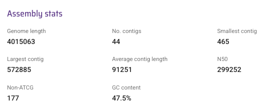
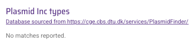
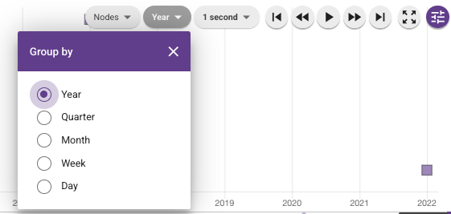
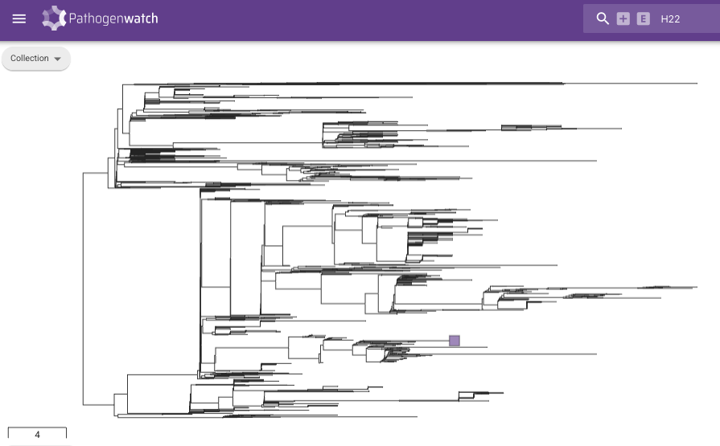
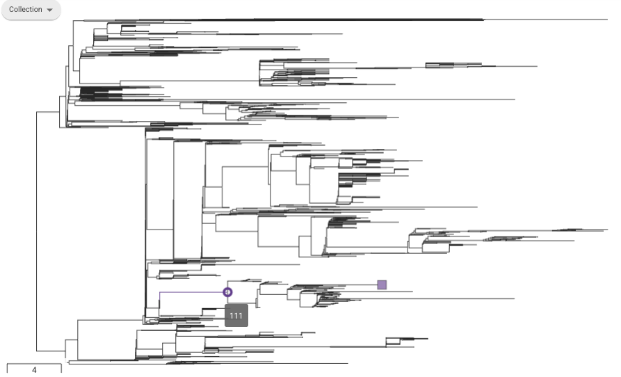
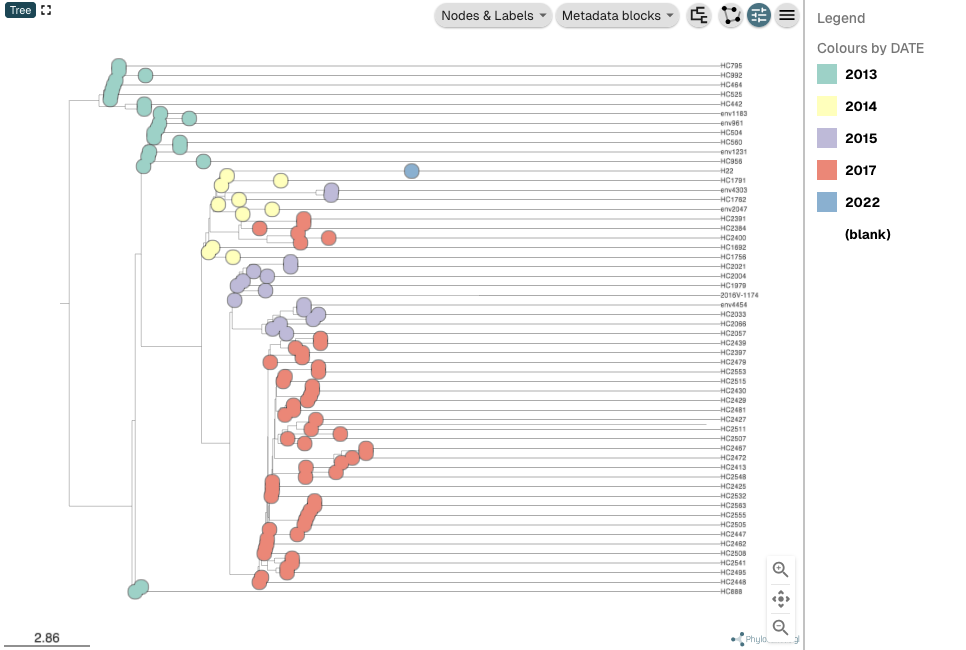

Case study - Haiti 2022 
=======================

الوباء في هايتي في عام 2022

يُقدّم هذا القسم مثالاً على كيفية استخدام Vibriowatch لتحليل بيانات الجينوم الخاصة بالكوليرا، مستخدماً وباء هايتي عام ٢٠٢٢ كمثال.

نودّ أن نشكر أخصائيي الصحة العامة والعلماء والمسؤولين الحكوميين في هايتي، بالإضافة إلى المريض الذي تبرّع بعينة بسخاء، على إتاحة بيانات الجينوم الخاصة بالكوليرا للجمهور، مما ساهم في فهمنا العالمي للكوليرا.

اختيرت دراسة الحالة هذه لأنها تُوضّح استمرار الكوليرا في بلد أو منطقة بين وبائين.

وهذا يوضح أيضاً كيف أنه في حالة عدم انتظام أخذ العينات، يكون من الصعب التمييز بين استمرار الكوليرا داخل بلد ما وإعادة إدخالها من بلد مجاور..

وعلاوة على ذلك، فإنه يوضح مدى صعوبة التمييز بين استمرار بكتيريا ضمة الكوليرا في السكان البشر خلال الفترة الزمنية بين تفشي المرض، مقابل استمرار بكتيريا ضمة الكوليرا في البيئة خلال الفترة الزمنية بين تفشي المرض.

* `The Haiti 2022 outbreak`_.
* `The H22 genome`_.
* `Finding the H22 genome in Vibriowatch`_.
* `Assembly quality of the H22 genome`_.
* `Is H22 predicted to produce cholera toxin?`_
* `Is H22 predicted to have antimicrobial resistance?`_
* `Is H22 predicted to have plasmids?`_
* `What is the predicted serogroup of the H22 isolate?`_
* `Does H22 belong to the pandemic lineage of Vibrio cholerae?`_.
* `What are the closest relatives of H22 among published Vibrio cholerae genomes?`_.
* `What can we say about the origins of the Haiti 2022 outbreak, based on the H22 genome?`_
* `Reflections on the Haiti 2022 case study`_

The Haiti 2022 outbreak
-----------------------

الوباء في هايتي في عام 2022

لعلّكم تعلمون أنه في يناير/كانون الثاني 2010، ضرب زلزال كارثي هايتي، وهي دولة تقع ضمن جزيرة هيسبانيولا الكاريبية.

وفي وقت لاحق من ذلك العام، وتحديدًا في أكتوبر/تشرين الأول 2010، اندلع تفشٍّ هائل للكوليرا في هايتي، استمر حتى عام 2019، وشمل أكثر من 820 ألف حالة إصابة بالكوليرا وحوالي 10 آلاف حالة وفاة.

وُجد أن هذا التفشي ناجم عن سلالة ضمة الكوليرا الوبائية الحالية (المعروفة باسم سلالة 7PET)، وتشير الدلائل إلى أنه من المرجح أن يكون قد انتقل من نيبال إلى هايتي عام 2010 (انظر `Orata et al 2014`_).

.. _Orata et al 2014: https://pubmed.ncbi.nlm.nih.gov/24699938/

The H22 genome
--------------

جينوم H22

في أواخر عام ٢٠٢٢، نشر روبن وآخرون (٢٠٢٢) جينوم عينة معزولة من ضمة الكوليرا من تفشي وباء الكوليرا في هايتي عام ٢٠٢٢، والتي أطلقوا عليها اسم العينة H22. شارك في إعداد هذا العمل اتحاد دولي من العلماء وخبراء الصحة العامة من المختبر الوطني للصحة العامة في هايتي، وزانمي لاسانتي في هايتي، ومستشفى بريغهام والنساء في أمريكا، ومستشفى ماساتشوستس العام في أمريكا، والمركز الدولي لأبحاث أمراض الإسهال في بنغلاديش.
انظر `Rubin et al 2022`_.

.. _Rubin et al 2022: https://pubmed.ncbi.nlm.nih.gov/36449726/

.. image:: Picture172.png
  :width: 800

في هذا المثال العملي، سأوضح لك كيفية تحليل جينوم H22 للإجابة على بعض الأسئلة الرئيسية المتعلقة بالصحة العامة، والإجابة على أسئلة حول أصول تفشي المرض في هايتي عام 2022:

#. هل يُتوقع أن تُنتج بكتيريا H22 سم الكوليرا؟
#. هل يُتوقع أن تكون عزلة H22 مقاومة للمضادات الحيوية؟
#. هل يُتوقع أن تحتوي H22 على بلازميدات؟
#. هل تنتمي عزلة H22 إلى سلالة ضمة الكوليرا الوبائية؟
#. ما هي أقرب سلالات ضمة الكوليرا الجينومية المنشورة لعزلة H22؟
#. ماذا يُمكننا أن نقول عن أصول تفشي وباء هايتي عام 2022، بناءً على جينوم H22؟؟

دعونا نحلل جينوم H22 في Vibriowatch للإجابة على بعض هذه الأسئلة. يُعد جينوم H22 من بين حوالي 6000 جينوم أضفناها بالفعل إلى Vibriowatch كجينومات عامة يُمكن للجميع الاطلاع عليها.

Finding the H22 genome in Vibriowatch 
-------------------------------------

كيفية العثور على جينوم H22 في Vibriowatch

إذا كنت تتعلم بشكل أفضل من خلال الرؤية بدلاً من القراءة، شاهد الفيديو (`video on finding H22's report page in Vibriowatch`_).

.. _video on finding H22's report page in Vibriowatch: https://youtu.be/7k79hfyTW4Q 

أولاً، لننتقل إلى جينوم H22 في Vibriowatch بالنقر على هذا الرابط (`H22's genome report page`_).
أو تعلّم كيفية البحث عن صفحة تقرير H22 بنفسك بالنقر على هذا الرابط (`How to search for an isolate in Vibriowatch and see its report page`_).

.. _H22's genome report page: https://pathogen.watch/genomes/all?genusId=662&searchText=H22

.. _How to search for an isolate in Vibriowatch and see its report page: https://vibriowatch.readthedocs.io/en/latest/navigating.html#how-to-search-for-an-isolate-in-vibriowatch-and-see-its-report-page

تعرض صفحة التقرير البيانات الوصفية المُعدّة بعناية للعزلة، بالإضافة إلى تحليلات المعلوماتية الحيوية لها. يظهر هذا أعلى صفحة تقرير H22:

.. image:: Picture115.png
  :width: 600

Assembly quality of the H22 genome
----------------------------------

جودة تجميع جينوم H22

إذا كنت تتعلم بشكل أفضل من خلال الرؤية بدلاً من القراءة، شاهد الفيديو (`video on investigating H22's assembly quality, using Vibriowatch`_).

.. _video on investigating H22's assembly quality, using Vibriowatch: https://youtu.be/SevDN1pLyqo 

.. image:: HowToGetTheResult.png
  :width: 600

لنلقِ نظرة سريعة على إحصائيات تجميع جينوم H22، للتأكد من أن التجميع يبدو بجودة جيدة نسبيًا، ويحتوي على محتوى GC المتوقع لضمة الكوليرا. للاطلاع على إحصائيات التجميع، انتقل إلى أسفل صفحة تقرير جينوم H22. سترى قسمًا بعنوان "إحصائيات التجميع"، والذي يبدو كالتالي:

يتضح من خلال هذا البحث أن حجم جينوم عزلة H22 يبلغ حوالي 4.0 ميجابايت (Mb)، وأن نسبة التكتل (GC) فيه تبلغ 47.5%. ومن المقاييس الشائعة الأخرى لجودة التجميع عدد "الكونتيج". ونلاحظ هنا أن تجميع عزلة H22 يحتوي على 44 "كونتيج".

.. _Heidelberg et al 2000: https://pubmed.ncbi.nlm.nih.gov/10952301/

.. image:: HowToInterpretTheResult.png
  :width: 600

يتوافق حجم تجميع H22، البالغ 4.0 ميجا بايت، مع الجينوم المرجعي لسلالة ضمة الكوليرا N16961، التي يبلغ حجم جينومها حوالي 4.0 ميجا قاعدة، ومحتوى GC بنسبة 47.5% (انظر `Heidelberg et al 2000`_).
كقاعدة عامة، نعتبر أن حجم تجميع يتراوح بين 3.3 و5.3 ميجا قاعدة، ومحتوى GC يتراوح بين 41.3% و48.6%، هو حجم معقول لجينوم ضمة الكوليرا.

.. _Heidelberg et al 2000: https://pubmed.ncbi.nlm.nih.gov/10952301/

عادةً ما نعتبر التجميع ذا جودة جيدة نسبيًا إذا كان يتكون من أقل من 700 وحدة متجاورة. يحتوي جينوم عزلة H22 على 44 وحدة متجاورة، لذا فهو ذو جودة جيدة نسبيًا.

Is H22 predicted to produce cholera toxin?
------------------------------------------

هل من المتوقع أن ينتج H22 "سم الكوليرا"؟

إذا كنت تتعلم بشكل أفضل من خلال الرؤية بدلاً من القراءة، شاهد الفيديو (`video on predicting if H22 produces cholera toxin, using Vibriowatch`_).

.. _video on predicting if H22 produces cholera toxin, using Vibriowatch: https://youtu.be/fQHf4nCZ7L8 

الكوليرا مرضٌ يتميز بإسهال مائي حاد، وتنجم أعراضه بشكل رئيسي عن سم الكوليرا (Ctx) الذي تفرزه بكتيريا ضمة الكوليرا. لذلك، يُعتبر سم الكوليرا عامل الضراوة الرئيسي لضمة الكوليرا. تحمل جميع عزلات سلالة الكوليرا الوبائية الحالية تقريبًا، سلالة "7PET"، جينات سم الكوليرا (الجينان ctxA وctxB) وتنتج سم الكوليرا، وهو مركب بروتيني يتكون من وحدتين فرعيتين CtxA وCtxB. ومع ذلك، فإن العديد من عزلات سلالات أخرى (غير وبائية) من ضمة الكوليرا لا تحمل جينات سم الكوليرا، وبالتالي لا تنتج سم الكوليرا.

مشخصه اصلی بیماری وبا، اسهال حاد آبکی است.
این اسهال توسط سم Ctx ایجاد می‌شود که توسط باکتری ویبریو کلرا ترشح می‌شود.
بنابراین، Ctx به عنوان عامل اصلی تحریک‌کننده بیماری تولید شده توسط ویبریو کلرا در نظر گرفته می‌شود.
جدا شده‌های سویه اپیدمی‌زای ویبریو کلرا (7PET) دارای ژن‌های سم وبا (ژن‌های ctxA و ctxB) هستند.
بنابراین، جدا شده‌های 7PET سم وبا تولید می‌کنند که یک کمپلکس پروتئینی متشکل از زیر واحدهای CtxA و CtxB است.
با این حال، بسیاری از جدا شده‌های سایر دودمان‌های (غیر همه‌گیر) ویبریو کلرا ژن‌های سم وبا را ندارند و بنابراین سم وبا تولید نمی‌کنند.

.. image:: HowToGetTheResult.png
  :width: 600

ولمعرفة ما إذا كانت عزلة H22 تحمل جينات سموم الكوليرا، وبالتالي من المتوقع أن تنتج Ctx، يمكننا إلقاء نظرة على قسم "الضراوة" في صفحة تقرير الجينوم لـ H22:

.. image:: Picture121.png
  :width: 550

يمكنك أن ترى أن هناك علامة صح بجوار "ctxA" و "ctxB" لذا من المتوقع أن يحمل H22 جينات سموم الكوليرا.

.. image:: HowToInterpretTheResult.png
  :width: 600

بما أنه من المتوقع أن يحمل جينوم H22 جيني ctxA وctxB، يمكننا التنبؤ بأنه يُنتج Ctx. وهذا يتفق مع الأدلة الواردة في ورقة روبن وآخرون (2022)، الذين أوردوا بيانات نمطية تُشير إلى أن H22 مُسبِّب للتسمم، أي أنه يُنتج سم الكوليرا.

Is H22 predicted to have antimicrobial resistance? 
--------------------------------------------------

هل من المتوقع أن تكون العزلة H22 مقاومة للمضادات الحيوية؟

إذا كنت تتعلم بشكل أفضل من خلال الرؤية بدلاً من القراءة، شاهد الفيديو (`video on predicting if H22 has antimicrobial resistance, using Vibriowatch`_).

.. _video on predicting if H22 has antimicrobial resistance, using Vibriowatch: https://youtu.be/fexfUXza8M8 

العلاج الأساسي للكوليرا هو معالجة الجفاف، ولكن تُعطى المضادات الحيوية للمرضى الأكثر عرضة للخطر، مثل النساء الحوامل والأطفال الصغار والمصابين بفيروس نقص المناعة البشرية. توصي منظمة الصحة العالمية باستخدام المضادات الحيوية أزيثروميسين ودوكسيسيكلين وسيبروفلوكساسين لعلاج الكوليرا. لذلك، فإن أي مقاومة لهذه المضادات الحيوية الموصى بها ستكون مصدر قلق.

.. image:: HowToGetTheResult.png
  :width: 600

ولمعرفة ما إذا كان H22 يحمل مقاومة للمضادات الميكروبية (AMR)، يمكننا إلقاء نظرة على قسم "AMR" في صفحة تقرير الجينوم لـ H22:

.. image:: Picture122.png
  :width: 550

كما هو واضح، لا يُتوقع أن تحتوي عزلة H22 على جينات أو طفرات مقاومة للأزيثروميسين أو الدوكسيسيكلين، بل يُتوقع أن تكون ذات مستوى مقاومة متوسط ​​للسيبروفلوكساسين لأنها تحمل طفرتين مقاومتين، هما gyrA_S83I وparC_S85L. تُسبب هاتان الطفرتان استبدالًا من S إلى I عند الموضع 83 من بروتين GyrA، واستبدالًا من S إلى L عند الموضع 85 من بروتين ParC، على التوالي. كما يُتوقع أن تكون H22 مقاومة للتريميثوبريم لأنها تحمل الجين dfrA1، وللسلفاميثوكسازول لأنها تحمل الجين sul2.

.. image:: HowToInterpretTheResult.png
  :width: 600

وبناءً على النتائج المذكورة أعلاه، نتوقع أن يكون لدى H22 مستوى متوسط ​​من المقاومة للسيبروفلوكساسين، وأن يكون مقاومًا للتريميثوبريم والسلفاميثوكسازول.

يتفق هذا مع الأدلة الواردة في ورقة روبن وآخرون (2022)، الذين أفادوا، بناءً على نتائج الاختبارات المعملية، بأن بكتيريا H22 مقاومة للتريميثوبريم والسلفاميثوكسازول، ومقاومة منخفضة المستوى للسيبروفلوكساسين. يُذكر أن التريميثوبريم والسلفاميثوكسازول ليسا من مضادات الميكروبات الموصى بها من قِبل منظمة الصحة العالمية لعلاج الكوليرا، ولكنهما استُخدما سابقًا في بعض المواقع.

Is H22 predicted to have plasmids?
----------------------------------

هل من المتوقع أن يحتوي H22 على البلازميدات؟

إذا كنت تتعلم بشكل أفضل من خلال الرؤية بدلاً من القراءة، شاهد الفيديو (`video on predicting plasmids in H22, using Vibriowatch`_).

يمكن أن تنتقل جينات مقاومة مضادات الميكروبات على البلازميدات الكبيرة في ضمة الكوليرا، ولكن مثل هذه البلازميدات الكبيرة نادرة نسبيًا.

.. image:: HowToGetTheResult.png
  :width: 600

ولمعرفة ما إذا كان من المتوقع أن تحمل العزلة المسماة H22 بلازميدًا، يمكننا إلقاء نظرة على قسم "أنواع Plasmid Inc" في صفحة تقرير الجينوم لـ H22:

نرى أنه لا توجد بلازميدات متوقعة في H22.

.. image:: HowToInterpretTheResult.png
  :width: 600

لم يتنبأ جهاز Vibriowatch بوجود بلازميدات في عزلة H22. تجدر الإشارة إلى أن التنبؤ بالبلازميدات في Vibriowatch قد لا يكون دقيقًا جدًا للبلازميدات الصغيرة، وإذا كانت جودة التجميع رديئة، فمن المحتمل ألا يكتشف Vibriowatch البلازميدات. بالنسبة لـ H22، وبناءً على نتائج Vibriowatch، نتوقع عدم وجود بلازميدات كبيرة فيه.

What is the predicted serogroup of the H22 isolate?
---------------------------------------------------

ما هي المجموعة المصليّة المتوقعة لعزل H22؟

إذا كنت تتعلم بشكل أفضل من خلال الرؤية بدلاً من القراءة، شاهد الفيديو (`video on predicting serogroup of H22, using Vibriowatch`_).

.. _video on predicting serogroup of H22, using Vibriowatch: https://youtu.be/Uh_04BSDaZ0 

إن سلالة الوباء الحالية (سلالة '7PET') من ضمة الكوليرا تمتلك المجموعة المصلية O1، أو في بعض الأحيان بالنسبة لبعض العزلات المجموعة المصلية O139.

.. image:: HowToGetTheResult.png
  :width: 600

للتعرف على المجموعة المصليّة المتوقعة للعزلة المسماة H22، يمكننا إلقاء نظرة على أعلى صفحة التقرير الخاص بـ H22:

.. image:: Picture115.png
  :width: 600

تحت "الأنماط الجينية"، يمكنك أن ترى أن المجموعة المصليّة المتوقعة هي O1.

.. image:: HowToInterpretTheResult.png
  :width: 600

مما سبق، نرى أن المجموعة المصلية المتوقعة لعزل H22 هي O1. وهذا يتفق مع الأدلة الظاهرية الواردة في ورقة روبن وآخرون (2022)، والتي أفادت، بناءً على نتائج المختبر، بأن H22 لديه المجموعة المصلية O1.

تجدر الإشارة إلى أن حقيقة امتلاك H22 للمجموعة المصلية O1 لا تعني بالضرورة أن H22 ينتمي إلى سلالة "7PET"، حيث إن بعض عزلات ضمة الكوليرا من سلالات أخرى (غير وبائية) تمتلك أيضًا المجموعة المصلية O1.

Does H22 belong to the pandemic lineage of Vibrio cholerae?
-----------------------------------------------------------

هل تنتمي البكتيريا المعزولة المسماة H22 إلى سلالة جائحة ضمة الكوليرا؟

إذا كنت تتعلم بشكل أفضل من خلال الرؤية بدلاً من القراءة، شاهد الفيديو (`video on finding out the lineage of H22, using Vibriowatch`_).

.. _video on finding out the lineage of H22, using Vibriowatch: https://youtu.be/EBKcwA3pjA0 

بدأ جائحة الكوليرا الحالي (الوباء السابع) في ستينيات القرن الماضي، وتسببت فيه سلالة ضمة الكوليرا الوبائية الحالية، المعروفة باسم سلالة "7PET". سلالة "7PET" شديدة العدوى والضراوة، وتُسبب فاشيات هائلة وأوبئة هائلة.

.. image:: HowToGetTheResult.png
  :width: 600

هناك طريقة سريعة لمعرفة ما إذا كانت العزلة تنتمي على الأرجح إلى سلالة 7PET، وهي الاطلاع على نتائج اختبار MLST (النمط التسلسلي متعدد المواقع) للعزلة في Vibriowatch.

تُعرض نتائج اختبار MLST للعزلة أعلى صفحة تقرير الجينوم الخاص بها في Vibriowatch. هنا، يُمكننا رؤية نتائج اختبار MLST للعزلة H22 أعلى صفحة تقريرها (انظر تحت عنوان "MLST"):

.. image:: Picture115.png
  :width: 600

يمكننا أن نرى أن العزلة H22 تم تصنيفها ضمن نوع تسلسل MLST ST69.

هناك طريقة أخرى لمعرفة ما إذا كانت عزلتك تنتمي إلى سلالة الجائحة (سلالة 7PET) أم لا، وهي النظر إلى مجموعة PopPUNK الخاصة بها. PopPUNK هي أداة لتصنيف عزلات البكتيريا إلى سلالات. في أعلى صفحة تقرير جينوم Vibriowatch للعزلة H22 (انظر أعلاه)، يمكنك رؤية معلومات PopPUNK تحت عنوان "السلالة". يمكنك أن ترى أن العزلة H22 تنتمي إلى سلالة PopPUNK 1 (المعروفة أيضًا باسم VC1).

.. image:: HowToInterpretTheResult.png
  :width: 600

ST69 هو أحد أنواع التسلسلات الشائعة في سلالة الجائحة الحالية (7PET) من ضمة الكوليرا. هناك نوع تسلسل آخر يُرى أحيانًا في سلالة الجائحة من ضمة الكوليرا وهو ST515. إذا كانت العينة المعزولة ST69 أو ST515، فمن المرجح جدًا أنها تنتمي إلى سلالة الجائحة. هذا يشير إلى أن H22 تنتمي إلى سلالة 7PET.
من نتائج PopPUNK، وجدنا أن H22 تنتمي إلى مجموعة PopPUNK VC1؛ وهذا يتوافق مع سلالة الجائحة الحالية (سلالة 7PET). وهكذا، وكما هو الحال في نتائج MLST، تشير نتائج PopPUNK إلى أن العينة المعزولة H22 تنتمي إلى سلالة الجائحة الحالية.

What are the closest relatives of H22 among published Vibrio cholerae genomes? 
------------------------------------------------------------------------------

ما هي أقرب أقارب H22 بين جينومات ضمة الكوليرا المنشورة؟

إذا كنت تتعلم بشكل أفضل من خلال الرؤية بدلاً من القراءة، شاهد الفيديو (`video on identifying the closest relatives of H22, using Vibriowatch`_).

يتضمن Vibriowatch مجموعة كبيرة تضم أكثر من 6000 جينوم منشور لـ V. cholerae، لذلك يمكنك البحث عن أقرب أقارب لعزلة جديدة بين تلك الجينومات المنشورة.

.. image:: HowToGetTheResult.png
  :width: 600

للعثور على أقرب أقارب لـ H22 بين جينومات ضمة الكوليرا المنشورة، يُمكننا البحث في قسم "الجينوم الأساسي" في صفحة تقرير جينوم H22، والذي يُعطي نتيجة تحليل cgMLST ("تحليل الجينوم الأساسي MLST"):

.. image:: Picture124.png
  :width: 600

يمكنك رؤية شبكة تُظهر عُقدًا تُمثل العزلات المُتسلسلة، حيث يُظهر H22 كعقدة أرجوانية (ومُسمّاة بـ "H22")، بينما تُعرض العزلات الأخرى وثيقة الصلة بعُقد رمادية. تُظهر الحواف (الخطوط) في الشبكة العلاقات بين العزلات ذات الصلة، حيث يُمثل طول الحافة بين عزلتين (عقدتين) عدد الاختلافات الجينية بينهما. تختلف العزلات الأقرب إلى H22 في الشبكة عنه في حمضها النووي بدرجة أقل، ولذلك يُفترض أنها أقرب تطوريًا إلى H22.

يمكنك أن ترى في أعلى الشبكة عبارة "مجموعة من ١٣٢٦ عزلة عند عتبة ١٠"، أي أن هذه ١٣٢٦ عزلة مرتبطة ببعضها ارتباطًا وثيقًا وتختلف عن بعضها البعض بعشر طفرات أو أقل في الحمض النووي لمناطق الجينوم الأساسية (مناطق الجينوم الأساسية هي مناطق من الجينوم تشترك فيها جميع عزلات ضمة الكوليرا تقريبًا).

لفحص الشبكة عن كثب، انقر على زر "عرض CLUSTER" الأرجواني الكبير. سينقلك هذا إلى عرض جديد، حيث يمكنك رؤية الشبكة في اللوحة العلوية اليسرى، وخريطة لأماكن جمع العينات في اللوحة العلوية اليمنى، وجدول زمني لوقت جمعها أدناه.

.. image:: Picture125.png
  :width: 800

يمكنك أن ترى مجددًا أن العقدة الأرجوانية التي تمثل H22 (والتي تحمل الرمز "H22") تقع في أعلى الرسم التخطيطي. لتحديد المنطقة العلوية من الرسم التخطيطي، في اللوحة العلوية اليسرى التي تحتوي على الرسم التخطيطي، يمكنك النقر على زر "عناصر التحكم" في أعلى يمين اللوحة.

.. image:: Picture126.png
  :width: 50

ثم قم بالضغط على الزر الموجود على يسار زر "Controls" وهو زر "Lasso":

ثم باستخدام عجلة الماوس، قم بتكبير جزء الرسم التخطيطي الذي يحتوي على H22، لرؤية H22 وعزلاته الأكثر ارتباطًا به:

.. image:: Picture128.png
  :width: 550

ثم ارسم شكلاً حول H22 وعزلاته الأقرب إليه، باستخدام الماوس للنقر على النقاط حول المنطقة التي تحتوي على H22 وأقرب أقاربه:

.. image:: Picture129.png
  :width: 800

ستلاحظ أن لوحة الرسم البياني في أعلى اليسار تُظهر الآن فقط H22 وأقرب أقاربه (الذين يقعون داخل الشكل الذي رسمته). تُظهر الخريطة في أعلى اليمين نقطة واحدة فقط. إذا حركت الماوس داخل لوحة الخريطة، واستخدمت عجلة الماوس لتصغير الصورة، ستجد أن هذه النقطة تقع في هايتي، أي أن أقرب أقارب H22 جُمعت جميعها من هايتي.

.. image:: Picture130.png
  :width: 800

لمعرفة تاريخ جمع هذه الأقارب المقربين، علينا النظر إلى سنوات جمعها. افتراضيًا، تُعرض التواريخ في لوحة الجدول الزمني أسفل الشاشة بالأيام والأشهر. لعرض السنوات، انقر على زر "عناصر التحكم" أعلى يمين لوحة الجدول الزمني.

.. image:: Picture126.png
  :width: 50

الآن قم بتغيير "اليوم" إلى "السنة" في القائمة التي تظهر.

ثم انقر على "X" في زاوية القائمة لإغلاقها. ستظهر لك الآن لوحة الجدول الزمني التي توضح السنوات التي جُمعت فيها عزلة H22 وأقرب أقاربها.

.. image:: Picture132.png
  :width: 900

في الجدول الزمني، يمكنك رؤية مربع واحد في الطرف الأيمن، فوق "2022"؛ هذه هي عزلة H22، التي جُمعت في عام 2022.
يمكنك أيضًا رؤية مربعات فوق الأعوام 2013، 2014، 2015، و2017، مما يشير إلى أن العزلات الأكثر صلة بعزلة H22 في قاعدة بيانات Vibriowatch هي عزلات جُمعت في هايتي في الأعوام 2013، 2014، 2015، و2017.

.. image:: HowToInterpretTheResult.png
  :width: 600

تشير نتائج تحليل cgMLST (تحليل الجينوم الأساسي MLST) أعلاه إلى أن أقرب أقارب عزلة H22 من بين أكثر من 6000 جينوم في Vibriowatch هي جينومات منشورة أخرى من هايتي، وهي عزلات جُمعت في هايتي في الأعوام 2013 و2014 و2015 و2017.

What can we say about the origins of the Haiti 2022 outbreak, based on the H22 genome? 
--------------------------------------------------------------------------------------

ماذا يمكننا أن نقول عن أصول تفشي المرض في هايتي عام 2022، استناداً إلى جينوم H22؟

للتحقق من أصول تفشي المرض في هايتي عام 2022، يمكننا إنشاء شجرة تطورية لعزلة H22 وأقاربها المقربين.

إذا كنت تتعلم بشكل أفضل من خلال الرؤية بدلاً من القراءة، شاهد الفيديو (`video 1 on building a phylogenetic tree for the Haiti 2022 outbreak, using Vibriowatch`_).
إذا كنت تتعلم بشكل أفضل من خلال الرؤية بدلاً من القراءة، شاهد الفيديو (`video 2 on building a phylogenetic tree for the Haiti 2022 outbreak, using Vibriowatch`_).
إذا كنت تتعلم بشكل أفضل من خلال الرؤية بدلاً من القراءة، شاهد الفيديو (`video 3 on building a phylogenetic tree for the Haiti 2022 outbreak, using Vibriowatch`_).

.. _video 1 on building a phylogenetic tree for the Haiti 2022 outbreak, using Vibriowatch: https://youtu.be/ElX32K3QnQE 

.. _video 2 on building a phylogenetic tree for the Haiti 2022 outbreak, using Vibriowatch: https://youtu.be/LFQYJLugBQw 

.. _video 3 on building a phylogenetic tree for the Haiti 2022 outbreak, using Vibriowatch: https://youtu.be/XCKCevbBzB8 

.. image:: HowToGetTheResult.png
  :width: 600

لإنشاء شجرة تطورية باستخدام Vibriowatch، عليك أولاً تسجيل الدخول إلى موقع Pathogenwatch. للقيام بذلك، انقر على الأشرطة الأرجوانية الثلاثة أعلى يسار موقع Pathogenwatch، ثم انقر على "تسجيل الدخول" في القائمة التي تظهر.

سنشرح الآن كيفية بناء شجرة تطورية لعزلة H22 وأقرب أقاربها من Vibriowatch. كما ذكرنا سابقًا، يمكننا تحديد أقارب عزلة H22 من خلال فحص قسم "الجينوم الأساسي" في صفحة تقرير جينوم H22:

.. image:: Picture124.png
  :width: 700

تُظهر هذه الشبكة 1326 عزلة وثيقة الصلة، إحداها H22. لبناء شجرة تطورية لهذه العزلات الـ 1326، يُمكننا إنشاء علامة "collection" للعزلات في Vibriowatch، وستتضمن هذه العلامة شجرة تطورية. لإنشاء علامة "collection" للعزلات الـ 1326 في الشبكة، يُمكنك النقر على زر "قائمة الجينومات" الأرجواني الكبير لعرض جميع الجينومات الـ 1326. سيؤدي هذا إلى عرض قائمة بجميع الجينومات؛ إليك بعض الجينومات الأولى فقط:

.. image:: Picture133.png
  :width: 800

لإنشاء "collection" لجميع هذه العزلات، تأكد أولًا من أن الزر الأرجواني أعلى يمين الشاشة يُظهر "0 جينومات مختارة". إذا كان يُظهر "X جينومات مختارة"، ولم يكن X صفرًا، فانقر على الزر، ثم انقر على "مسح الكل" في القائمة التي تظهر. ثم حدد جميع العزلات الـ 1326 بالنقر على المربع بجوار "الاسم" أعلى قائمة العزلات. سيؤدي ذلك إلى وضع علامة صح في جميع المربعات بجوار جميع العزلات.

.. image:: Picture134.png
  :width: 800

انقر الآن على الزر الأرجواني المكتوب عليه "1326 جينومًا محددًا" أعلى يمين الصفحة. يمكنك الآن النقر عليه لإنشاء مجموعة.

ثم سوف ترى شجرة الجينومات الـ 1326:

.. image:: Picture135.png
  :width: 600

يمكنك العثور على عزل H22 في الشجرة عن طريق كتابة "H22" في مربع البحث أعلى الصفحة، حيث يظهر "اسم الفلتر":

يمكنك أن ترى أن عزلة H22 جزء من مجموعة صغيرة من العزلات التي تنتمي إلى فرع طويل. إذا حركت مؤشر الماوس فوق العقدة الأصلية لهذا الفرع، سترى الرقم "111" يظهر، مما يشير إلى وجود 111 عزلة في تلك المجموعة الصغيرة.

إذا نقرت بزر الماوس الأيمن على العقدة الأصلية لتلك المجموعة الصغيرة، ثم اخترت "عرض الشجرة الفرعية" من القائمة التي تظهر، فسيظهر لك فقط جزء الشجرة المقابل لتلك المجموعة الصغيرة. يمكنك بعد ذلك حذف "H22" من مربع البحث في الأعلى، لإلغاء تحديد عينة H22 المعزولة. سترى الآن نقطة واحدة فقط على اليمين على الخريطة، وإذا استخدمت عجلة الماوس لتصغيرها، فستجد أنها تُشير إلى هايتي، مما يشير إلى أن جميع العينات المعزولة في هذه المجموعة الصغيرة من هايتي.

.. image:: Picture138.png
  :width: 800

لإنشاء صورة جميلة لشجرة النشوء والتطور الخاصة بك مع إبراز العزلات التي جُمعت في سنوات مختلفة في هايتي، يُمكنك القيام بذلك بسهولة باستخدام برنامج Microreact، وذلك بتنزيل البيانات الوصفية وملفات الشجرة على جهاز الكمبيوتر الخاص بك، ثم تحميلها على موقع Microreact الإلكتروني. يُنتج عن ذلك شجرة جميلة كهذه:

.. image:: HowToInterpretTheResult.png
  :width: 600

يمكننا أن نرى من هذه الشجرة أن عزلة H22 (المشار إليها بعقدة زرقاء) وثيقة الصلة بالعزلات التي تم جمعها من هايتي في عام 2014 (العقد الصفراء)، و2015 (العقد الأرجوانية)، و2017 (العقد الحمراء).

تشير هذه النتائج مجتمعةً إلى أن ضمة الكوليرا التي تسببت في تفشي المرض في هايتي عام ٢٠٢٢ كانت وثيقة الصلة بضمة الكوليرا التي تسببت في وباء هايتي بين عامي ٢٠١٠ و٢٠١٩. ويشير هذا إلى أن نفس نسخة ضمة الكوليرا قد استمرت على الأرجح في هايتي بين عامي ٢٠١٩ و٢٠٢٢، إما في البشر (مثل الحالات غير المصحوبة بأعراض أو غير المبلغ عنها) أو في البيئة (مثل الأنهار أو البحيرات).
ومع ذلك، هناك احتمال آخر، لا يمكننا استبعاده (لعدم وجود أدلة تُنفيه)، وهو أنه في مرحلة ما خلال وباء هايتي بين عامي ٢٠١٠ و٢٠١٩، انتشر الكوليرا من هايتي إلى دولة مجاورة في منطقة البحر الكاريبي، واستمر دون أن يُكتشف في تلك الدولة المجاورة، وأنه في عام ٢٠٢٢ انتشر مجددًا إلى هايتي.

تتفق هذه النتائج مع ورقة روبن وآخرون (2022)، التي أفادت، بناءً على تحليل النشوء والتطور، بأن سلالة H22 تنتمي إلى فرع من عزلات ضمة الكوليرا في هايتي، والتي نشأت عام 2013 خلال الوباء السابق. وجاء في الدراسة: «تشير هذه التحليلات إلى أن عودة ظهور الكوليرا في هايتي عام 2022 كانت ناجمة، جزئيًا على الأقل، عن سلالة من سلالة ضمة الكوليرا التي تسببت في وباء عام 2010. ومع ذلك، لم تُسجل أي حالات إصابة بالكوليرا بين عامي 2019 و2022، على الرغم من عمليات المراقبة المستمرة». «هناك عدة تفسيرات محتملة لعودة ظهور هذه السلالة. أولها أن ضمة الكوليرا O1 المنتجة للسموم استمرت في هايتي من خلال حالات عدوى دون سريرية لدى البشر، وعادت للظهور في ظل تراجع مناعة السكان، إلى جانب أزمة نقص المياه النظيفة والصرف الصحي». هناك احتمال آخر غير حصري وهو أن سلالة ضمة الكوليرا هذه قد استمرت في المستودعات البيئية. وأخيرًا، نظرًا لأن تفشي المرض عام ٢٠١٠ في هايتي انتقل في نهاية المطاف إلى دول أخرى في أمريكا اللاتينية، فإن التفسير المحتمل الثالث هو أن السلالة الحالية ربما تكون قد أُعيد إدخالها إلى هايتي من دولة مجاورة؛ ومع ذلك، فإن هذا التفسير أقل ترجيحًا من التفسيرات الأخرى، نظرًا للأدلة التطورية وغياب حالات كوليرا حديثة في المنطقة.
تظهر شجرة التطور التي أعدها روبن وآخرون (٢٠٢٢) في الشكل ١ من مقالهم.

Reflections on the Haiti 2022 case study 
----------------------------------------

تأملات حول دراسة حالة هايتي 2022

يمكننا أن نرى أن دراسة حالة هايتي لعام 2022 تُعدّ مثالاً على استمرار الكوليرا داخل بلد أو منطقة بين حالات تفشي المرض، فعلى الرغم من عدم الإبلاغ عن أي حالات كوليرا في هايتي بين عام 2019 وأكتوبر 2022، تُشير البيانات الجينومية إلى أن تفشي الكوليرا في هايتي عام 2022 كان وثيق الصلة بتفشي المرض في هايتي عام 2018 والأعوام السابقة. لذلك، من المرجح جدًا أن السلالة المُسببة لتفشي الكوليرا في هايتي عام 2018 استمرت إما في هايتي أو في البلدان المجاورة، ثم عادت للظهور في هايتي في أكتوبر 2022 مُسببةً تفشيًا جديدًا.
ومع ذلك، لا يوجد دليل على وجود الكوليرا في هايتي أو في البلدان المجاورة بين عامي 2019 وأكتوبر 2022، لذلك من الصعب معرفة أي بلد (أو بلدان) من المنطقة استمرت فيه تلك السلالة المُحددة من ضمة الكوليرا خلال تلك الفترة. أحد الاحتمالات هو أن ضمة الكوليرا استمرت بين السكان، ولم تُبلّغ عن أي حالات لأن الحالات كانت خفيفة أو بدون أعراض، أو في مناطق ذات بنية تحتية صحية محدودة. وهناك احتمال آخر وهو أن هذه السلالة تحديدًا من ضمة الكوليرا استمرت في البيئة خلال هذه الفترة، أو في كل من السكان والبيئة (على سبيل المثال، بسبب تلوث البيئة بمياه الصرف الصحي وابتلاع البشر للمياه الملوثة)، ولكن نظرًا لعدم توفر عينات بشرية أو بيئية من هايتي للفترة من عام 2019 إلى أكتوبر 2022، فإننا نفتقر إلى بيانات كافية للتحقيق في هذا الاحتمال.

هذه الرؤى لا تنطبق على هايتي فحسب، بل على العديد من البلدان الأخرى حول العالم التي تفشت فيها الكوليرا، ولكن مع مرور فترة طويلة نسبيًا بين تفشي المرض، امتدت لأشهر أو حتى عام أو عامين، لم تُسجل فيها أي حالات. في مثل هذه الحالات، من الشائع طرح الأسئلة التالية:

#. ماذا يمكننا أن نقول عن أصول تفشي الكوليرا الجديد، استنادا إلى جينومات العزلات؟
#. هل يرتبط تفشي الكوليرا الجديد بتفشي سابق في نفس البلد أو في بلدان مجاورة، أم أنه يرجع إلى دخول جديد تماما من مكان بعيد؟
#. إذا كان تفشي الكوليرا الجديد مرتبطًا بتفشي سابق في نفس البلد أو في البلدان المجاورة، فكيف استمر بين التفشي - في البشر، أو في البيئة، أو في كليهما؟

وتوضح دراسة الحالة الخاصة بتفشي وباء الكوليرا في هايتي عام 2022 الرؤى التي يمكن أن توفرها علوم الجينوم لمعالجة هذه الأسئلة، كما توضح أهمية توافر العينات المناسبة للتمكن من معالجة مثل هذه الأسئلة.

نتقدم بالشكر مرة أخرى للعلماء والعاملين في مجال الصحة العامة والموظفين العموميين في هايتي، وللمريض الهايتي الذي تبرع بسخاء بعينة، لجعل بيانات الجينوم الخاصة بالكوليرا متاحة للجمهور، وبالتالي المساهمة في الفهم العالمي للكوليرا.

CholeraBook
-----------

If you would like to learn more about cholera genomics, you may also be interested in our `Online Cholera Genomics Course (CholeraBook)`_.

.. _Online Cholera Genomics Course (CholeraBook): https://cholerabook.readthedocs.io/

Contact
-------

سأكون ممتنًا إذا أرسلت لي التصحيحات أو الاقتراحات للتحسينات إلى عنوان بريدي الإلكتروني alc@sanger.ac.uk

