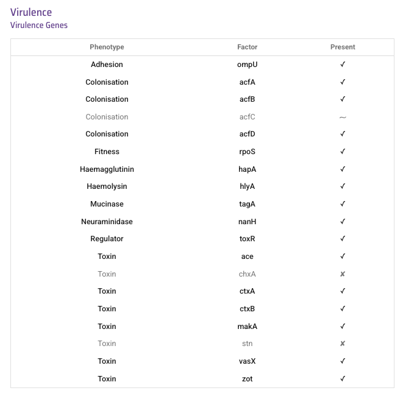

Étude de cas - l'épidémie en Haïti en 2022
==========================================

Cette section est un exemple d’utilisation de Vibriowatch pour analyser les données génomiques du choléra, en utilisant l’épidémie en Haïti en 2022 comme exemple.

Nous tenons à rendre hommage aux professionnels de la santé publique, aux scientifiques et aux fonctionnaires d'Haïti, ainsi qu'au patient qui a généreusement fait don d'un échantillon, pour avoir rendu ces données génomiques sur le choléra accessibles au public et ainsi avoir contribué à notre compréhension mondiale du choléra.

Cette étude de cas a été sélectionnée car elle illustre la persistance du choléra dans un pays ou une région entre deux épidémies. Elle illustre également comment, si l'échantillonnage est fragmenté, il est difficile de distinguer la persistance dans un pays d'une réintroduction depuis un pays voisin. En outre, elle illustre la difficulté de distinguer la persistance du choléra dans la population humaine entre deux épidémies, de sa persistance dans l'environnement entre ces épidémies.

* `L'épidémie en Haïti en 2022`_.
* `Le génome H22`_.
* `Trouver le génome H22 dans Vibriowatch`_.
* `Qualité d'assemblage du génome H22`_.
* `Est-il prévu que H22 produise de la toxine cholérique?`_
* `Est-il prévu que l’isolat H22 présente une résistance aux antimicrobiens?`_
* `Est-il prévu que H22 contienne des plasmides?`_
* `Quel est le sérogroupe prédit de l’isolat H22?`_
* `Le H22 appartient-il à la lignée pandémique de Vibrio cholerae?`_.
* `Quels sont les plus proches parents de H22 parmi les génomes de Vibrio cholerae publiés?`_.
* `Que pouvons-nous dire sur les origines de l’épidémie en Haïti en 2022, sur la base du génome de l’isolat H22?`_
* `Réflexions sur l'étude de cas de l’épidémie en Haïti en 2022`_

.. image:: HorizontalDivider.png
  :width: 1200

L'épidémie en Haïti en 2022
---------------------------

Vous savez peut-être déjà qu'en janvier 2010, un tremblement de terre catastrophique a frappé Haïti, un pays qui fait partie de l'île des Caraïbes nommée Hispaniola.
Plus tard la même année, en octobre 2010, une importante épidémie de choléra a éclaté en Haïti, qui a duré jusqu'en 2019 et a fait plus de 820 000 cas et près de 10 000 morts. Cette épidémie a été attribuée à la lignée pandémique actuelle de *Vibrio cholerae* et les données scientifiques suggèrent qu'elle a probablement été transmise du Népal à Haïti en 2010 (`Orata et al 2014`_).

.. _Orata et al 2014: https://pubmed.ncbi.nlm.nih.gov/24699938/

En 2019, le nombre de cas de choléra avait diminué et l'épidémie semblait enfin terminée en Haïti. Aucun cas de choléra n'a été signalé en Haïti en 2020, 2021 et pendant la majeure partie de 2022. Malheureusement, une nouvelle épidémie de choléra s'est déclarée en octobre 2022, après près de trois ans sans cas. En février 2023, on comptait plus de 30 000 cas de choléra et plus de 500 morts dus au choléra (source : Organisation Panaméricaine de la Santé).

Une question épidémiologique importante était : quelle était la source de la souche de *V. cholerae* responsable de l’épidémie en Haïti en 2022?
A-t-elle persisté en Haïti depuis la précédente épidémie de 2010-2019, soit chez l’homme (cas asymptomatiques ou non déclarés, par exemple), soit dans l’environnement (dans les rivières ou les lacs, par exemple)? Ou bien l’épidémie de 2022 en Haïti était-elle due à une introduction totalement nouvelle en provenance d’une autre région du monde, comme l’Afrique ou l’Asie?

.. image:: HorizontalDivider.png
  :width: 1200

Le génome H22
-------------

Fin 2022, `Rubin et al 2022`_ ont publié le génome d'un isolat de *V. cholerae* issu de l'épidémie en Haïti en 2022, qu'ils ont nommé isolat H22. Les auteurs de ces travaux étaient un consortium international de scientifiques et d'experts en santé publique du Laboratoire National de Santé Publique d'Haïti, de Zanmi Lasante (un prestataire de soins de santé non gouvernemental en Haïti), du Brigham and Women's Hospital (États-Unis), du Massachusetts General Hospital (États-Unis) et du Centre International de Recherche Sur Les Maladies Diarrhéiques (icddr,b, Bangladesh):

.. _Rubin et al 2022: https://pubmed.ncbi.nlm.nih.gov/36449726/

.. image:: Picture172.png
  :width: 800

Dans cet exemple pratique, je vais vous montrer comment analyser le génome de H22 afin de répondre à certaines questions clés de santé publique et aux questions sur les origines de l'épidémie en Haïti en 2022:

#. H22 est-il susceptible de produire la toxine cholérique?
#. H22 est-il susceptible de présenter une résistance aux antimicrobiens?
#. H22 est-il susceptible de contenir des plasmides?
#. L'isolat H22 appartient-il à la lignée pandémique de *Vibrio cholerae*?
#. Quels sont les plus proches parents de H22 parmi les génomes de *Vibrio cholerae* publiés?
#. Que pouvons-nous dire des origines de l'épidémie en Haïti en 2022, en analysant le génome de H22?

Analysons le génome H22 dans Vibriowatch pour répondre à ces questions. Le génome H22 fait partie des quelque 6 000 génomes que nous avons déjà ajoutés à Vibriowatch en tant que génomes accessibles à tous.

.. image:: HorizontalDivider.png
  :width: 1200

Trouver le génome H22 dans Vibriowatch 
--------------------------------------

Si vous apprenez mieux en voyant plutôt qu'en lisant, regardez la `vidéo sur comment rechercher la page du rapport sur H22 dans Vibriowatch`_.

.. _vidéo sur comment rechercher la page du rapport sur H22 dans Vibriowatch: https://youtu.be/HsRtQGxhV4k 

Tout d'abord, allons au génome H22 dans Vibriowatch; cliquez sur ce lien pour accéder à `la page du rapport du génome H22`_ dans Vibriowatch (ou consultez `Comment rechercher un isolat dans Vibriowatch et voir sa page du rapport`_ pour savoir comment rechercher vous-même la page du rapport H22).

.. _la page du rapport du génome H22: https://pathogen.watch/genomes/all?genusId=662&searchText=H22

.. _Comment rechercher un isolat dans Vibriowatch et voir sa page du rapport: https://vibriowatch.readthedocs.io/en/latest/navigating.html#how-to-search-for-an-isolate-in-vibriowatch-and-see-its-report-page

La page du rapport du génome présente les métadonnées compilées manuellement pour l'isolat, ainsi que ses analyses bioinformatiques. Voici le haut de la page du rapport du génome H22:

.. image:: Picture115.png
  :width: 600

.. image:: HorizontalDivider.png
  :width: 1200

Qualité d'assemblage du génome H22
----------------------------------

Si vous apprenez mieux en voyant plutôt qu'en lisant, regardez la `vidéo sur l'étude de la qualité d'assemblage du H22, en utilisant Vibriowatch`_.

.. _vidéo sur l'étude de la qualité d'assemblage du H22, en utilisant Vibriowatch: https://youtu.be/3SHlwEmF794 

.. image:: HowToGetTheResult.png
  :width: 600

Examinons rapidement les statistiques d'assemblage du génome H22 afin de vérifier que l'assemblage est de bonne qualité et qu'il présente la teneur en GC attendue pour V. cholerae. Pour consulter les statistiques d'assemblage, faites défiler la page Web jusqu'en bas du rapport génomique pour H22. Vous devriez voir une section intitulée Statistiques d'assemblage, qui ressemble à ceci:

.. image:: Picture116.png
  :width: 550

On constate que l'assemblage de l'isolat H22 présente une taille de génome d'environ 4,0 mégabases (Mb) et une teneur en GC de 47,5 %. Une autre mesure courante de la qualité de l'assemblage est le nombre de contigs. On constate ici que l'assemblage de l'isolat H22 comporte 44 contigs.

La taille d'assemblage de H22, soit 4,0 Mo, est cohérente avec le génome de référence de la souche N16961 de Vibrio cholerae, dont la taille du génome est d'environ 4,0 mégabases et la teneur en GC est de 47,5 % (voir `Heidelberg et al 2000`_ ). Une taille d'assemblage comprise entre 3,3 et 5,3 mégabases et une teneur en GC comprise entre 41,3 % et 48,6 % sont considérées comme raisonnables pour un génome de Vibrio cholerae.

.. _Heidelberg et al 2000: https://pubmed.ncbi.nlm.nih.gov/10952301/

On considère généralement qu'un assemblage est de relativement bonne qualité s'il est composé de 700 contigs. Le génome de l'isolat H22 comporte 44 contigs, ce qui le rend de relativement bonne qualité.

.. image:: HorizontalDivider.png
  :width: 1200

Est-il prévu que H22 produise de la toxine cholérique?
------------------------------------------------------

Si vous apprenez mieux en voyant plutôt qu'en lisant, regardez la `vidéo sur la prédiction si H22 produit de la toxine cholérique, en utilisant Vibriowatch`_. 

.. _vidéo sur la prédiction si H22 produit de la toxine cholérique, en utilisant Vibriowatch: https://youtu.be/LoiBAPyUzQo 

Le choléra est une maladie caractérisée par une diarrhée aqueuse aiguë, dont les symptômes sont principalement causés par la toxine cholérique (Ctx) sécrétée par V. cholerae. Par conséquent, la toxine cholérique est considérée comme le principal facteur de virulence de V. cholerae. Presque tous les isolats de la lignée pandémique actuelle de V. cholerae, la lignée 7PET, portent les gènes de la toxine cholérique (gènes ctxA et ctxB) et produisent de la toxine cholérique, un complexe protéique composé des sous-unités CtxA et CtxB. Cependant, de nombreux isolats d'autres lignées (non pandémiques) de V. cholerae ne portent pas les gènes de la toxine cholérique et ne produisent donc pas de toxine cholérique.

.. image:: HowToGetTheResult.png
  :width: 600

Pour savoir si l'isolat H22 porte les gènes de la toxine cholérique et est donc susceptible de produire de la toxine cholérique, nous pouvons consulter la section Virulence de la page du rapport génomique de H22:

Vous pouvez voir qu'il y a une coche à côté de ctxA et ctxB, donc il est prévu que H22 porte les gènes de la toxine cholérique.

Étant donné que le génome H22 devrait contenir les gènes ctxA et ctxB, on peut prédire qu'il produit la toxine cholérique. Cela concorde avec les données de l'article de `Rubin et al 2022`_, qui ont rapporté des données phénotypiques suggérant que H22 est toxigène, c'est-à-dire qu'il produit la toxine cholérique.

.. _Rubin et al 2022: https://pubmed.ncbi.nlm.nih.gov/36449726/

.. image:: HorizontalDivider.png
  :width: 1200

Est-il prévu que l’isolat H22 présente une résistance aux antimicrobiens?
-------------------------------------------------------------------------

Si vous apprenez mieux en voyant plutôt qu'en lisant, regardez la `vidéo sur la prédiction de la résistance aux antimicrobiens du H22, en utilisant Vibriowatch`_.

.. _vidéo sur la prédiction de la résistance aux antimicrobiens du H22, en utilisant Vibriowatch: https://youtu.be/sOl5hqRyBa0 

Le traitement principal du choléra est la réhydratation, mais des antimicrobiens sont administrés aux patients les plus vulnérables, tels que les femmes enceintes, les très jeunes enfants et les patients séropositifs. L'OMS recommande l'azithromycine, la doxycycline et la ciprofloxacine pour traiter le choléra. Par conséquent, toute résistance à ces antimicrobiens recommandés serait préoccupante.

.. image:: HowToGetTheResult.png
  :width: 600

Pour savoir si l'isolat H22 présente une résistance aux antimicrobiens (RAM), nous pouvons consulter la section RAM de la page du rapport sur le génome de H22:

.. image:: Picture122.png
  :width: 550

On constate que l'isolat H22 ne devrait pas présenter de gènes de résistance ni de mutations à l'azithromycine ou à la doxycycline, mais devrait présenter un niveau de résistance intermédiaire à la ciprofloxacine, car il est porteur de deux mutations de résistance: gyrA_S83I et parC_S85L (provoquant respectivement une substitution de S en I en position 83 de la protéine GyrA et une substitution de S en L en position 85 de la protéine ParC). On constate également qu'il devrait être résistant au triméthoprime (car il porte le gène dfrA1) et au sulfaméthoxazole (car il porte le gène sul2).

Sur la base des résultats ci-dessus, nous prédisons que H22 aura un niveau intermédiaire de résistance à la ciprofloxacine et qu’il sera résistant au triméthoprime et au sulfaméthoxazole.

Ceci concorde avec les données de l'article de `Rubin et al 2022`_, qui ont rapporté que, d'après les résultats des tests de laboratoire, H22 présente une résistance au triméthoprime et au sulfaméthoxazole, ainsi qu'une faible résistance à la ciprofloxacine. Le triméthoprime et le sulfaméthoxazole ne sont pas les antimicrobiens recommandés par l'OMS pour le choléra, mais ont été utilisés par le passé dans certaines régions (`Das et al 2020`_).

.. _Rubin et al 2022: https://pubmed.ncbi.nlm.nih.gov/36449726/
.. _Das et al 2020: https://pubmed.ncbi.nlm.nih.gov/31272870/

.. image:: HorizontalDivider.png
  :width: 1200

Est-il prévu que H22 contienne des plasmides?
---------------------------------------------

Si vous apprenez mieux en voyant plutôt qu'en lisant, regardez la `vidéo sur la prédiction des plasmides dans H22, en utilisant Vibriowatch`_.

.. _vidéo sur la prédiction des plasmides dans H22, en utilisant Vibriowatch: https://youtu.be/bPF2w3QDWfk 

Les gènes de résistance aux antimicrobiens peuvent être transportés par de grands plasmides chez Vibrio cholerae, mais de tels grands plasmides sont relativement rares.

.. image:: HowToGetTheResult.png
  :width: 600

Pour savoir si l'isolat H22 est censé contenir un plasmide, nous pouvons consulter la section Plasmid Inc Types de la page du rapport sur le génome de H22:

.. image:: Picture123.png
  :width: 350

Nous voyons qu’il n’y a pas de plasmides prédits dans H22.

Vibriowatch ne prédit aucun plasmide dans l'isolat H22. Notez que la prédiction des plasmides par Vibriowatch peut manquer de précision pour les petits plasmides. De plus, si la qualité de l'assemblage est médiocre, il est possible que Vibriowatch ne prédise pas certains plasmides. Pour H22, d'après les résultats de Vibriowatch, nous prédisons l'absence de grands plasmides.

.. image:: HorizontalDivider.png
  :width: 1200

Quel est le sérogroupe prédit de l’isolat H22?
----------------------------------------------

Si vous apprenez mieux en voyant plutôt qu'en lisant, regardez la `vidéo sur la prédiction du sérogroupe de l'isolat H22, en utilisant Vibriowatch`_.

.. _vidéo sur la prédiction du sérogroupe de l'isolat H22, en utilisant Vibriowatch: https://youtu.be/cGTRULEIKQE 

La lignée pandémique actuelle (lignée 7PET) de V. cholerae possède le sérogroupe O1 (ou occasionnellement, pour certains isolats, le sérogroupe O139).

.. image:: HowToGetTheResult.png
  :width: 600

Pour connaître le sérogroupe prévu pour H22, nous pouvons regarder en haut de la page du rapport pour H22:

.. image:: Picture115.png
  :width: 600

Sous Génotypes, vous pouvez voir que le sérogroupe prédit est O1.

D’après ce qui précède, nous voyons que le sérogroupe prédit de l’isolat H22 est O1. Cela concorde avec les preuves phénotypiques de l'article de `Rubin et al 2022`_, qui ont rapporté, sur la base de résultats de laboratoire, que H22 a le sérogroupe O1.

.. _Rubin et al 2022: https://pubmed.ncbi.nlm.nih.gov/36449726/

Notez que le fait que H22 soit du sérogroupe O1 ne signifie pas qu'il appartient définitivement à la lignée 7PET, car certains isolats de V. cholerae d'autres lignées (non pandémiques) possèdent également le sérogroupe O1.

.. image:: HorizontalDivider.png
  :width: 1200

Le H22 appartient-il à la lignée pandémique de Vibrio cholerae?
---------------------------------------------------------------

Si vous apprenez mieux en voyant plutôt qu'en lisant, regardez la `vidéo sur la découverte de la lignée de H22, en utilisant Vibriowatch`_.

.. _vidéo sur la découverte de la lignée de H22, en utilisant Vibriowatch: https://youtu.be/v03msIL6oMA 

La pandémie actuelle (septième pandémie) de choléra a débuté dans les années 1960 et a été causée par la lignée pandémique actuelle de Vibrio cholerae, connue sous le nom de lignée 7PET.
La lignée 7PET est hautement infectieuse et virulente, et provoque des flambées épidémiques massives.

.. image:: HowToGetTheResult.png
  :width: 600

Un moyen rapide de déterminer si un isolat appartient vraisemblablement à la lignée 7PET consiste à consulter les résultats du MLST (typage de séquences multilocus) de l'isolat dans Vibriowatch. Les résultats du MLST pour l'isolat sont affichés en haut de la page du rapport génomique de l'isolat dans Vibriowatch. Voici les résultats du MLST pour l'isolat H22 en haut de sa page Web (voir sous la rubrique MLST):

.. image:: Picture115.png
  :width: 600

Nous pouvons voir que l'isolat H22 est classé comme type de séquence MLST ST69.

Une deuxième approche pour déterminer si votre isolat appartient à la lignée pandémique (lignée 7PET) consiste à examiner le cluster PopPUNK de votre isolat. PopPUNK est un outil logiciel de classification des isolats bactériens en lignées. En haut de la page du rapport génomique Vibriowatch pour l'isolat H22 (voir ci-dessus), les informations PopPUNK sont visibles sous la rubrique Lineage. Vous pouvez constater que l'isolat H22 appartient à la lignée PopPUNK 1 (également appelée VC1).

ST69 est l'un des types de séquences (ST) fréquemment observés pour la lignée pandémique actuelle (7PET) de Vibrio cholerae. Un autre type de séquence parfois observé pour la lignée 
pandémique actuelle de Vibrio cholerae (7PET) est ST515. Si un isolat est ST69 ou ST515, il appartient très probablement à la lignée pandémique (7PET). Cela suggère que H22 appartient à la lignée 7PET. D'après les résultats PopPUNK, nous avons constaté que H22 appartient au cluster PopPUNK VC1; cela correspond à la lignée pandémique actuelle (lignée 7PET) (voir `le tableau de correspondance entre les clusters PopPUNK et les lignées connues`_). Ainsi, à l'instar des résultats MLST, les résultats PopPUNK suggèrent que l'isolat H22 appartient à la lignée pandémique actuelle (7PET).

.. _le tableau de correspondance entre les clusters PopPUNK et les lignées connues: https://vibriowatch.readthedocs.io/en/latest/mlst.html#what-is-poppunk

.. image:: HorizontalDivider.png
  :width: 1200

Quels sont les plus proches parents de H22 parmi les génomes de Vibrio cholerae publiés?
----------------------------------------------------------------------------------------

Si vous apprenez mieux en voyant plutôt qu'en lisant, regardez la `vidéo sur l'identification des plus proches parents de H22, en utilisant Vibriowatch`_.

.. _vidéo sur l'identification des plus proches parents de H22, en utilisant Vibriowatch: https://youtu.be/08PCqdvbhWE 

Vibriowatch comprend un large ensemble de > 6 000 génomes V. cholerae publiés, vous pouvez donc rechercher les parents les plus proches d'un nouvel isolat parmi ces génomes publiés.

.. image:: HowToGetTheResult.png
  :width: 600

Pour trouver les parents les plus proches de H22 parmi les génomes de V. cholerae publiés, consultez la section Core Genome Clustering de la page du rapport sur le génome H22, qui fournit le résultat d'une analyse cgMLST (analyse MLST des régions ancestrales partagées du génome de Vibrio cholerae):

.. image:: Picture124.png
  :width: 600

Vous pouvez observer un réseau de nœuds représentant les isolats séquencés. H22 est représenté par un nœud violet (étiqueté H22), tandis que les autres isolats étroitement apparentés sont représentés par des nœuds gris. Les arêtes (lignes) du réseau illustrent les relations entre les isolats apparentés. La longueur d'une arête entre deux isolats (deux nœuds) représente le nombre de différences génétiques entre eux. Les isolats les plus proches de H22 dans le réseau présentent moins de différences génétiques dans leur ADN et sont donc supposés être plus étroitement apparentés à H22 sur le plan évolutif.

Vous pouvez voir qu'en haut du réseau, il est indiqué Groupe de 1 326 à un Seuil de 10. Il s'agit donc de 1 326 isolats étroitement apparentés qui diffèrent les uns des autres par 10 mutations ou moins dans l'ADN de leurs régions génomiques ancestrales communes (les régions du génome partagées par presque tous les isolats de V. cholerae).

Pour examiner le réseau de plus près, cliquez sur le gros bouton violet VIEW CLUSTER. Vous accéderez alors à une nouvelle vue: le réseau en haut à gauche, une carte des lieux de collecte des isolats en haut à droite et une chronologie de la collecte des isolats en bas.

.. image:: Picture125.png
  :width: 800

Vous pouvez à nouveau constater que le nœud violet représentant H22 (étiqueté H22) se trouve dans la partie supérieure du réseau. Pour sélectionner cette partie, dans le panneau supérieur gauche contenant le réseau, cliquez sur le bouton Contrôles en haut à droite:

.. image:: Picture126.png
  :width: 50

Cliquez ensuite sur le bouton à gauche du bouton Contrôles, qui est le bouton Lasso:

.. image:: Picture127.png
  :width: 100

Ensuite, à l'aide de la molette de souris d'ordinateur, zoomez sur la partie du réseau contenant H22 pour visualiser H22 et ses isolats les plus proches:

.. image:: Picture128.png
  :width: 550

Dessinez ensuite une forme autour de H22 et de ses isolats les plus proches, en cliquant avec la souris sur des points autour de la région contenant H22 et ses proches parents:

.. image:: Picture129.png
  :width: 800

Vous constaterez que seuls H22 et ses isolats les plus proches (situés à l'intérieur de la forme que vous avez dessinée) sont désormais affichés dans le panneau Réseau en haut à gauche. La carte en haut à droite ne présente plus qu'un seul point. En déplaçant la souris sur le panneau Carte et en utilisant la molette pour dézoomer, vous constaterez que ce point se trouve en Haïti. Les parents les plus proches de H22 ont donc tous été collectés en Haïti:

.. image:: Picture130.png
  :width: 800

Pour savoir quand ces proches parents ont été collectés, il faut examiner leurs années de collecte. Par défaut, les dates dans la chronologie en bas de l'écran sont indiquées en jours et en mois. Pour afficher les années, cliquez sur le bouton Contrôles en haut à droite de la chronologie:

.. image:: Picture126.png
  :width: 50

Changez maintenant Day en Year dans le menu qui apparaît.

.. image:: Picture131.png
  :width: 350

Cliquez ensuite sur le X dans le coin du menu pour le fermer. Vous verrez alors la chronologie indiquant les années de collecte des isolats les plus proches:

.. image:: Picture132.png
  :width: 900

Sur la chronologie, vous pouvez voir un carré à l'extrémité droite, au-dessus de 2022; il s'agit de l'isolat H22, collecté en 2022.
Vous pouvez également voir des carrés au-dessus des années 2013, 2014, 2015 et 2017, indiquant que les plus proches parents de H22 dans la base de données Vibriowatch sont des isolats collectés en Haïti en 2013, 2014, 2015 et 2017.

Les résultats de l'analyse cgMLST ci-dessus indiquent que les plus proches parents de l'isolat H22 parmi les plus de 6 000 génomes publiés dans Vibriowatch sont d'autres génomes publiés en Haïti, à savoir des isolats collectés en Haïti en 2013, 2014, 2015 et 2017.

.. image:: HorizontalDivider.png
  :width: 1200

Que pouvons-nous dire sur les origines de l’épidémie en Haïti en 2022, sur la base du génome de l’isolat H22?
-------------------------------------------------------------------------------------------------------------

Pour étudier les origines de l’épidémie d’Haïti de 2022, nous pouvons établir un arbre phylogénétique de l’isolat H22 et de ses proches parents.

Si vous apprenez mieux en regardant plutôt qu'en lisant, regardez `la vidéo 1 sur la création d'un arbre phylogénétique pour l'épidémie en Haïti en 2022 à l'aide de Vibriowatch`_, `la vidéo 2 sur la création d'un arbre phylogénétique pour l'épidémie en Haïti en 2022 à l'aide de Vibriowatch`_ et `la vidéo 3 sur la création d'un arbre phylogénétique pour l'épidémie en Haïti en 2022 à l'aide de Vibriowatch`_.

.. _la vidéo 1 sur la création d'un arbre phylogénétique pour l'épidémie en Haïti en 2022 à l'aide de Vibriowatch: https://youtu.be/twubRiTEjE8 

.. _la vidéo 2 sur la création d'un arbre phylogénétique pour l'épidémie en Haïti en 2022 à l'aide de Vibriowatch: https://youtu.be/sh4eisl3h3g 

.. _la vidéo 3 sur la création d'un arbre phylogénétique pour l'épidémie en Haïti en 2022 à l'aide de Vibriowatch: https://youtu.be/OYBq9Ac6e7c 

.. image:: HowToGetTheResult.png
  :width: 600

Pour créer un arbre phylogénétique avec Vibriowatch, vous devez d'abord vous connecter au site web de Pathogenwatch. Pour cela, cliquez sur les trois barres violettes en haut à gauche du site web de `Pathogenwatch`_, puis sur Sign In dans le menu qui apparaît.

.. _Pathogenwatch: https://pathogen.watch/

Nous allons maintenant expliquer comment construire un arbre phylogénétique pour H22 et ses plus proches parents dans Vibriowatch. Comme mentionné précédemment, nous pouvons identifier les proches parents de H22 en consultant la section Core Genome Clustering de la page du rapport sur le génome de H22:

.. image:: Picture124.png
  :width: 700

Ce réseau présente 1326 isolats étroitement apparentés, dont H22. Pour construire un arbre phylogénétique de ces 1326 isolats, nous pouvons créer une Collection d'isolats dans Vibriowatch. Cette collection inclura un arbre phylogénétique. Pour créer une collection des 1326 isolats du réseau, cliquez sur le gros bouton violet LIST GENOMES pour lister tous les génomes. La liste de tous les génomes s'affichera; en voici quelques-uns:

.. image:: Picture133.png
  :width: 800

Pour créer une collection de tous ces isolats, vérifiez d'abord que le bouton violet en haut à droite de l'écran indique 0 Selected Genomes. S'il indique X Selected Genomes et que X est différent de zéro, cliquez sur le bouton, puis sur Clear All dans le menu qui apparaît. Sélectionnez ensuite les 1 326 isolats en cochant la case Name en haut de la liste des isolats. Toutes les cases correspondant à chaque isolat devraient alors être cochées:

.. image:: Picture134.png
  :width: 800

Cliquez maintenant sur le bouton violet 1326 Selected Genomes en haut à droite de la page web. Vous pouvez maintenant cliquer sur ce bouton pour créer une collection (voir `Comment créer une collection d'isolats dans Vibriowatch`_ pour plus de détails).

.. _Comment créer une collection d'isolats dans Vibriowatch: https://vibriowatch.readthedocs.io/en/latest/navigating.html#how-to-make-a-collection-of-isolates-in-vibriowatch

Ensuite, vous verrez un arbre des 1326 génomes:

.. image:: Picture135.png
  :width: 600

Vous pouvez trouver l'isolat H22 dans l'arbre phylogénétique en tapant H22 dans la zone de recherche en haut de la page, où il est indiqué FILTER NAME:

.. image:: Picture136.png
  :width: 600

Vous pouvez constater que l'isolat H22 fait partie d'un petit clade (groupe) d'isolats situés sur une branche assez longue. Si vous déplacez votre souris sur le nœud ancestral de ce clade, vous verrez le nombre 111 apparaître, indiquant qu'il y a 111 isolats dans ce petit clade (groupe).

.. image:: Picture137.png
  :width: 600

Si vous faites un clic droit sur le nœud ancestral de ce petit clade, puis choisissez View Subtree dans le menu qui apparaît, vous n'afficherez que la partie de l'arbre correspondant à ce petit clade. Vous pouvez ensuite supprimer H22 du champ de recherche en haut pour désélectionner l'isolat H22. Vous verrez alors qu'à droite, il n'y a qu'un seul point sur la carte. Si vous utilisez la molette de votre souris pour dézoomer, vous verrez qu'il correspond à Haïti, indiquant que tous les isolats de ce petit clade proviennent d'Haïti.

.. image:: Picture138.png
  :width: 800

Pour créer un graphique attrayant mettant en évidence les isolats collectés en Haïti au cours de différentes années, le plus simple est d'utiliser Microreact (voir `Représentation graphique de l'arbre phylogénétique et des données d'une collection Vibriowatch dans Microreact`_), en téléchargeant les métadonnées et l'arbre sur votre ordinateur, puis en les téléversant dans Microreact. Cela nous donne un bel arbre comme celui-ci:

.. _Microreact: https://microreact.org/

.. _Représentation graphique de l'arbre phylogénétique et des données d'une collection Vibriowatch dans Microreact: https://vibriowatch.readthedocs.io/en/latest/downloads.html#plotting-the-tree-and-data-for-a-vibriowatch-collection-in-microreact

.. image:: Picture140.png
  :width: 900

Cet arbre montre que l'isolat H22 (indiqué par un nœud bleu) est étroitement lié aux isolats collectés en Haïti en 2014 (nœuds jaunes), 2015 (nœuds violets) et 2017 (nœuds rouges).

Pris ensemble, ces résultats suggèrent que la bactérie V. cholerae à l'origine de l'épidémie de 2022 en Haïti était étroitement liée à celle à l'origine de l'épidémie de 2010-2019 en Haïti. Cela suggère que le même clone de V. cholerae a probablement persisté en Haïti entre 2019 et 2022, soit chez l'homme (cas asymptomatiques ou non signalés, par exemple), soit dans l'environnement (rivières ou lacs, par exemple). Cependant, une autre possibilité, que nous ne pouvons écarter (car nous ne disposons d'aucune preuve pour l'infirmer), est qu'à un moment donné, au cours de l'épidémie de 2010-2019 en Haïti, le choléra se soit propagé d'Haïti à un pays voisin des Caraïbes, où il aurait persisté sans être détecté, et qu'en 2022, il se soit à nouveau propagé en Haïti.

Ces résultats concordent avec l'article de `Rubin et al 2022`_, qui ont rapporté que, sur la base d'une analyse phylogénétique, H22 «appartient à une sous-clade d'isolats de V. cholerae d'Haïti apparus en 2013 lors de la précédente épidémie». Ils affirment: «Ces analyses suggèrent que la réémergence du choléra en Haïti en 2022 a été causée, au moins en partie, par un descendant de la souche V. cholerae à l'origine de l'épidémie de 2010. Cependant, aucun cas de choléra n'a été confirmé entre 2019 et 2022, malgré une surveillance continue. Plusieurs explications sont possibles à la recrudescence de cette souche. La première est que la souche toxigène V. cholerae O1 a persisté en Haïti par le biais d'infections subcliniques chez l'homme et est réapparue dans un contexte de déclin de l'immunité de la population, conjugué à une crise liée au manque d'eau potable et d'assainissement. Une autre possibilité, non exclusive, est que cette souche V. cholerae ait persisté dans des réservoirs environnementaux. Enfin, l'épidémie de 2010 en Haïti ayant finalement été transmise à d'autres pays d'Amérique latine, une troisième explication possible est que la souche actuelle aurait pu être réintroduite en Haïti depuis un pays voisin. Cependant, cette explication est moins probable que les autres, compte tenu des preuves phylogénétiques et de l'absence de cas récents de choléra dans la région.»  Vous pouvez consulter l'arbre phylogénétique produit par* `Rubin et al 2022`_ *dans la figure 1 de leur article, et constater qu'il concorde avec l'arbre obtenu avec Vibriowatch.

.. _Rubin et al 2022: https://pubmed.ncbi.nlm.nih.gov/36449726/

.. image:: HorizontalDivider.png
  :width: 1200

Réflexions sur l'étude de cas de l’épidémie en Haïti en 2022
------------------------------------------------------------

L'étude de cas en Haïti illustre la persistance du choléra dans un pays ou une région entre deux épidémies. En effet, bien qu'aucun cas de choléra n'ait été signalé en Haïti entre 2019 et octobre 2022, les données génomiques indiquent que l'épidémie en Haïti en 2022 était étroitement liée aux épidémies de 2018 et des années précédentes. Il est donc très probable que la souche à l'origine de l'épidémie en Haïti en 2018 ait persisté en Haïti ou dans les pays voisins, puis y soit réapparue en octobre 2022, provoquant une nouvelle épidémie. Cependant, aucune preuve de choléra n'a été observée en Haïti ou dans les pays voisins entre 2019 et octobre 2022; il est donc difficile de déterminer dans quel(s) pays de la région cette souche particulière de Vibrio cholerae a persisté pendant cette période. Il est possible que la maladie ait persisté dans la population humaine, mais qu'aucun cas n'ait été signalé, car les cas étaient asymptomatiques ou bénins, ou se trouvaient dans des régions aux infrastructures sanitaires limitées. Une autre possibilité est qu'une souche particulière de V. cholerae ait persisté dans l'environnement pendant cette période, ou à la fois dans la population humaine et dans l'environnement (par exemple, en raison de la contamination de l'environnement par les eaux usées et de l'ingestion d'eau contaminée par l'homme). Cependant, comme aucun échantillon humain ou environnemental n'est disponible en Haïti pour la période allant de 2019 à octobre 2022, nous manquons de données pour étudier cette possibilité.

Ces informations ne s'appliquent pas seulement à Haïti, mais à de nombreux autres pays dans le monde où des épidémies de choléra ont eu lieu, mais où aucun cas n'a été signalé pendant une période relativement longue (de plusieurs mois, voire un an ou deux). Dans de telles situations, on se demande souvent:

#. Que pouvons-nous dire des origines de la nouvelle épidémie, d'après les génomes des isolats?
#. La nouvelle épidémie est-elle liée à des épidémies précédentes dans le même pays ou dans des pays voisins, ou est-elle due à une introduction totalement nouvelle depuis une région éloignée?
#. Si la nouvelle épidémie est liée à des épidémies précédentes dans le même pays ou dans des pays voisins, comment a-t-elle persisté entre les épidémies – chez l'homme, dans l'environnement, ou dans les deux?

L’étude de cas de l’épidémie d’Haïti de 2022 illustre les perspectives que la génomique peut apporter pour répondre à ces questions, mais illustre également l’importance de la disponibilité d’échantillons appropriés pour pouvoir répondre à ces questions.

Nous remercions à nouveau les scientifiques, les professionnels de la santé publique et les fonctionnaires haïtiens, ainsi que le patient haïtien qui a généreusement fait don d'un échantillon, pour avoir rendu ces données génomiques sur le choléra accessibles au public et contribué ainsi à une meilleure compréhension mondiale du choléra.

.. image:: HorizontalDivider.png
  :width: 1200

CholeraBook
-----------

Si vous souhaitez en savoir plus sur la génomique du choléra, vous pourriez également être intéressé par notre `Cours en ligne sur la génomique du choléra (CholeraBook)`_.

.. _Cours en ligne sur la génomique du choléra (CholeraBook): https://cholerabook.readthedocs.io/

.. image:: HorizontalDivider.png
  :width: 1200

Contact
-------

Je vous serais reconnaissant de bien vouloir m'envoyer (Avril Coghlan) des corrections ou des suggestions d'amélioration à mon adresse e-mail alc@sanger.ac.uk

