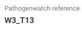

*Vibrio cholerae* lineage information
=====================================

In this section, we will describe how you can:

* `What is known about Vibrio cholerae lineages`_.
* `Carry out MLST analysis of your isolate`_.
* `Compare your isolate to Vibriowatch's reference genomes`_.
* `Build a phylogenetic tree to check if your isolate belongs to the pandemic lineage`_.

What is known about Vibrio cholerae lineages
--------------------------------------------

Bla bla bla

Carry out MLST analysis of your isolate
---------------------------------------

Vibriowatch uses the *Vibrio cholerae* MLST (multi-locus sequence typing) scheme of `Octavia et al 2013`_, which is based on seven housekeeping genes.

.. _Octavia et al 2013: https://pubmed.ncbi.nlm.nih.gov/23776471/

The MLST information is very fast for Vibriowatch to calculate, and can give you a quick idea of whether your isolate belongs to the current pandemic ('7PET') lineage of *V. cholerae*.

To view MLST information for your isolate's genome, you can look at the top of the 'report page' for your isolate in Vibriowatch.
An example of the top of a report page is shown here:

.. image:: Picture15.png
  :width: 500
  
In the example above, the isolate is classified as MLST sequence type ST69, based on its sequence at the seven housekeeping genes (ie. *adk*, *gyrB*, *mdh*, *metE*, *pntA*, *purM*, *pyrC*). The allele at each gene in the MLST scheme is given, e.g. this isolate has allele 7 of gene *adk*. 

ST69 is one of the STs (sequence types) often seen for the current pandemic ('7PET') lineage of *Vibrio cholerae*, so this suggests that this isolate belongs to the pandemic lineage. Another sequence type that is sometimes seen for pandemic lineage *V. cholerae* is ST515 (see `Cheney et al 2021`_). Note that it is possible that the pandemic lineage also contains other rare STs. Therefore, if your isolate is not ST69 or ST515, it is still possible that it your isolate belogns to the pandemic lineage; you will need to build a phylogenetic tree to find out (see `Build a phylogenetic tree to check if your isolate belongs to the pandemic lineage`_).

.. _Cheney et al 2021: https://pubmed.ncbi.nlm.nih.gov/34427512/

STs of *V. cholerae* that are not linked to the pandemic lineage, but are linked to other lineages that cause relatively small outbreaks, are ST75, which includes the 'Gulf Coast' lineage (see `Luo et al 2016`_); and ST68, which has caused outbreaks in Sudan and former Czechoslovakia (see `Octavia et al 2013`_). 

.. _Luo et al 2016: https://pubmed.ncbi.nlm.nih.gov/26920786/

.. _Octavia et al 2013: https://pubmed.ncbi.nlm.nih.gov/23776471/

Sometimes you will see that the sequence type of an isolate does not start with 'ST', but instead with a '*' symbol. This means that it is a novel sequence type that has not been included in the *V. cholerae* MLST scheme.

Compare your isolate to Vibriowatch's reference genomes
-------------------------------------------------------

Vibriowatch includes 17 'reference genomes' for *V. cholerae*, which are genomes for isolates whose lineage is already well established. 

14 of these reference genomes belong to the current pandemic ('7PET') lineage of *V. cholerae*. These are called 'W1_T1', 'W1_T2', 'W1_T3', 'W1_T4', 'W1_T5', 'W2_T6', 'W2_T7', 'W2_T8', 'W3_T9', 'W3_T10', 'W3_T11', 'W3_T12', 'W3_T13' and '7PET_MiddleEastern'. The '7PET_MiddleEastern' isolate is from Iraq, while the other 7PET isolates are representatives of the waves of global transmission in the current (seventh) pandemic of cholera (waves 'W1', 'W2', 'W3' described by `Mutreja et al 2011`_), as well as the long-distance transmission events (transmission events 'T1', 'T2', ... 'T13' described by `Weill et al 2017`_ and `Weill et al 2019`_). 

.. _Mutreja et al 2011: https://pubmed.ncbi.nlm.nih.gov/21866102/

.. _Weill et al 2017: https://pubmed.ncbi.nlm.nih.gov/29123067/

.. _Weill et al 2019: https://pubmed.ncbi.nlm.nih.gov/30602788/

As well as these 14 7PET reference genomes, another of the Vibriowatch reference genomes is the isolate M66, which is an isolate thought to be a 'pre-7PET' isolate, that is, ancestral to the current pandemic (7PET) lineage 'pre-7PET lineage' (see `Feng et al 2008`_).

.. _Feng et al 2008: https://pubmed.ncbi.nlm.nih.gov/19115014/

The remaining two 'reference genomes' in Vibriowatch are non-pandemic reference genomes, that is, they do not belong to the 7PET lineage. These are called 'Env_Seawater' and 'Env_Sewage', and correspond to environmental isolates from seawater and sewage, respectively.

As well as MLST, another source of lineage information in Vibriowatch is that it reports the Vibriowatch reference genome that is closest to your isolate of interest. This is reported on the 'report page' for your isolate in Vibriowatch, under the 'Core stats' heading, where you will see something like this:

  
In this example, it means that the closest Vibriowatch 'reference genome' to the isolate being examined was the 'W3_T13' reference genome. Since W3_T13 belongs to the current pandemic (7PET) lineage, this suggested that the isolate being examined belonged to the current pandemic lineage. The W3_T13 Vibriowatch reference is an isolate representing the 7PET sublineage that caused the cholera epidemic in Yemen, but which originally came from South Asia (see `Weill et al 2019`_). 

.. _Weill et al 2019: https://pubmed.ncbi.nlm.nih.gov/30602788/

If your isolate's closest Vibriowatch reference is one of the 7PET references ('W1_T1', 'W1_T2', 'W1_T3', 'W1_T4', 'W1_T5', 'W2_T6', 'W2_T7', 'W2_T8', 'W3_T9', 'W3_T10', 'W3_T11', 'W3_T12', 'W3_T13', or '7PET_MiddleEastern'), then your isolate likely belongs to the current pandemic (7PET) lineage. However, to be 100% sure if your isolate belongs to the pandemic lineage or not, you will need to build a phylogenetic tree (see `Build a phylogenetic tree to check if your isolate belongs to the pandemic lineage`_).

On the other hand, if your isolate's closest Vibriowatch reference is 'Env_Seawater' and 'Env_Sewage', then your isolate likely does not belong to the current pandemic (7PET) lineage. However, to be 100% sure, again you will need to build a phylogenetic tree.

*Vibrio cholerae* is a very diverse species, with many different lineages, but we have only included representatives of the current pandemic (7PET) lineage, and two other lineages (represented by 'Env_Seawater' and 'Env_Sewage') as Vibriowatch references. Therefore, if you find that two isolates
that you are interested in both have 'Env_Sewage' as their closest Vibriowatch reference, then it is likely that these do not belong to the pandemic lineage, but they do not necessarily belong to the same lineage (ie. they both have 'Env_Sewage' as their closest Vibriowatch reference, but still might be quite distant from 'Env_Sewage' and from each other). To figure this out, it will be necessary to build a phylogenetic tree. 

Build a phylogenetic tree to check if your isolate belongs to the pandemic lineage
----------------------------------------------------------------------------------

Bla bla

Contact
-------

I will be grateful if you will send me (Avril Coghlan) corrections or suggestions for improvements to my email address alc@sanger.ac.uk

