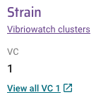
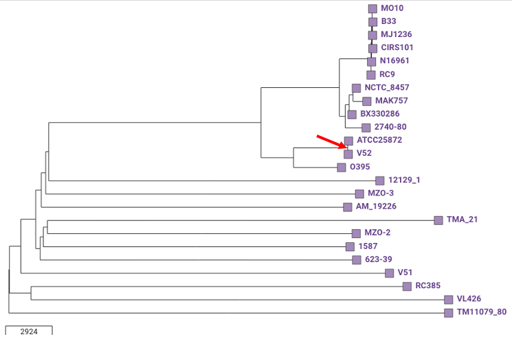

*Vibrio cholerae* lineage information
=====================================

This section will cover:

* `Short guide for those in a hurry: does my isolate belong to the current pandemic lineage?`_.
* `What is known about Vibrio cholerae lineages?`_.
* `What is MLST?`_.
* `How to view MLST information for your isolate`_.
* `Build a tree to check if your isolate belongs to the pandemic lineage: example 1`_.
* `Build a tree to check if your isolate belongs to the pandemic lineage: example 2`_.
* `Build a tree to check if your isolate belongs to the pandemic lineage: example 3`_.

Short guide for those in a hurry: does my isolate belong to the current pandemic lineage?
-----------------------------------------------------------------------------------------

The current pandemic (seventh pandemic) of cholera began in the 1960s and has been caused by the '7PET lineage' of *Vibrio cholerae*. 

A quick way to find out whether your isolate likely belongs to the 7PET lineage is to look at MLST (multi-locus sequence typing) results for your isolate in Vibriowatch. 

Once you have sequencing reads or a genome assembly for your isolate to Vibriowatch (see `Is my isolate Vibrio cholerae? <https://vibriowatch.readthedocs.io/en/latest/assemblies.html#short-guide-for-those-in-a-hurry-is-my-isolate-vibrio-cholerae>`_), Vibriowatch will display a piechart showing the identified species of your isolates, e.g.:

.. image:: Picture7.png
  :width: 650

To view the report pages for your isolates, which will tell you their MLST sequence types, you need to click on the 'View genomes' link in the middle of the piechart.
  
This will bring up a list of your isolates in Vibriowatch, looking something like this:

.. image:: Picture8.png
  :width: 650
  
To go to the report page for a particular isolate, click on the link on the left in the 'Name' column, e.g. '1_S1_L001'.

The top of the 'report page' for your isolate will look something like this:

.. image:: Picture15.png
  :width: 500
  
In the example above, the isolate is classified as MLST sequence type ST69.

ST69 is one of the STs (sequence types) often seen for the current pandemic ('7PET') lineage of *Vibrio cholerae*. Another sequence type that is sometimes seen for pandemic lineage *V. cholerae* is ST515.

If your isolate is ST69 or ST515, it very likely belongs to the pandemic lineage. 

Note that if your isolate is not ST69 or ST515, it is still possible that it your isolate belongs to the pandemic lineage but has a very rare sequence type for the pandemic lineage.

If you found this useful, you may want to read through the rest of the tutorial to find out more details. 

What is known about Vibrio cholerae lineages?
---------------------------------------------

A key early paper on *V. cholerae* genomes was that by `Chun et al 2009`_, who sequenced the genomes of 23 diverse *V. cholerae*.

.. _Chun et al 2009: https://pubmed.ncbi.nlm.nih.gov/19720995/

Here is a phylogenetic tree that I made (using Vibriowatch) of these 23 isolates:

  
In the tree of the 23 isolates, you can see that the isolates causing the current global pandemic, or 'seventh pandemic', all belong to a particular clade highlighted with the red box here. These seventh pandemic (7PET) lineage isolates belong to a larger clade which has been named the 'phylocore group 1 clade' or 'PG1' clade. You can see that there are some isolates in the phylocore group 1 clade that do not belong to the 7PET lineage, such as MAK757, BX330286, NCTC_8457 etc. These are sometimes called 'pre-7PET' isolates, as they are very closely related to the 7PET lineage, and are probably very similar to what was the ancestor of the 7PET lineage. 

The phylocore group 1 clade has a sister clade called the 'phylocore group 2' clade or 'PG2' clade. The phylocore group clades are distantly related to the other isolates sequenced, which are also all distantly related to each other.

Among the 23 isolate sequenced by `Chun et al 2009`_, there were quite a lot of isolates that did not belong to the current pandemic lineage (7PET lineage), or even to the larger 'phylocore group' clade, e.g. isolates 12129(1), MZO-3, AM-19226, etc. Some of these isolates that did not belong to the pandemic lineage were environmental isolates, but some were clinical isolates. The pandemic lineage of *V. cholerae* is a highly infectious lineage and causes severe diarrhoea. These other clinical isolates which did not belong to the 7PET lineage, such as isolate MZO-3, were probably not very infectious and probably only caused mild diarrhoea. 

.. _Chun et al 2009: https://pubmed.ncbi.nlm.nih.gov/19720995/

`Chun et al 2009`_ did not assign names to lineages outside the 'phylocore group' clade, but other researchers have done so. For example, `Domman et al 2017`_ analysed the genome sequences of 665 *Vibrio cholerae* isolates from across the world, and named 11 *V. cholerae* lineages found in the Americas (figure adapted from `Domman et al 2017`_):

.. _Domman et al 2017: https://pubmed.ncbi.nlm.nih.gov/29123068/

.. image:: Picture46.png
  :width: 350
  
The 7PET, Gulf Coast and MX-2 lineages belong to the PG-1 clade previously described by `Chun et al 2009`_, while the Classical lienage belongs to the PG-2 clade described by `Chun et al 2009`_.

.. _Chun et al 2009: https://pubmed.ncbi.nlm.nih.gov/19720995/

Some of the lineages named by `Domman et al 2017`_ are distantly related to the current pandemic lineage (7PET lineage), e.g. lineages ELA-5, MX-1, ELA-4, etc. There are probably many more *V. cholerae* lineages that are distantly related to the current pandemic lineage that will be discovered when researchers sequence genomes of more and more diverse *V. cholerae* isolates from different locations and environmental niches. Indeed, some isolates have already been sequenced that are very diverged from any of the lineages named so far, and these likely represent examples of yet-unnamed *V. cholerae* lineages. 

.. _Domman et al 2017: https://pubmed.ncbi.nlm.nih.gov/29123068/

The best way to figure out whether your isolate belongs to a *V. cholerae* lineage that has already been named is to carry out a phylogenetic analysis. For example, below we will explain how to use a phylogenetic analysis to figure out whether your *V. cholerae* isolate belongs to the current pandemic lineage (7PET lineage). 

What is MLST?
-------------

Carrying out a phylogenetic analysis to figure out whether your isolate belongs to a named *V. cholerae* lineage (e.g. to the 7PET lineage) takes some time and effort, but is a relatively accurate way to determine the lineage of an isolate.

On the other, a more 'quick and dirty' way to get a rough idea of the lineage of your isolate is MLST (multi-locus sequence typing) analysis, which Vibriowatch provides for your isolate. 

Vibriowatch uses the *Vibrio cholerae* MLST scheme of `Octavia et al 2013`_, a commonly used MLST scheme for *V. cholerae*, which is based on seven housekeeping genes (*adk*, *gyrB*, *mdh*, *metE*, *pntA*, *purM*, *pyrC*).
If two isolates have identical sequences at these seven genes, they will have the same sequence type; but if they differ by at least one base (ie. one 'single nucleotide polymorphism' or 'SNP') in their sequences at the seven genes, they will have a different sequence type. 

.. _Octavia et al 2013: https://pubmed.ncbi.nlm.nih.gov/23776471/

For example, here are the MLST sequence types of the 23 isolates sequenced by `Chun et al 2009`_ (see above):

.. _Chun et al 2009: https://pubmed.ncbi.nlm.nih.gov/19720995/

.. image:: Picture25.png
  :width: 650
  
Note that you can produce such a figure yourself, by looking at `our collection for the Chun et al 2009 isolates`_, 
clicking on the 'Timeline' menu below the tree, and choosing 'Typing' instead of 'Timeline', and then selecting the column 'ST' to show the MLST sequence type beside the leaves of the tree (remember also to change the tree display settings so that 'Show leaf labels' is turned on):

.. _our collection for the Chun et al 2009 isolates: https://pathogen.watch/collection/2c43jl3z2xs8-vibriowatch-collection-chun-et-al-2009

  
You can see that isolates MO10, B33, MJ-1236, CIRS_101, N16961 and RC9, which belong to the current pandemic lineage (7PET lineage), all have MLST sequence type ST69. Another sequence type that is sometimes seen for pandemic lineage *V. cholerae* is ST515 (see `Cheney et al 2021`_). 

.. _Cheney et al 2021: https://pubmed.ncbi.nlm.nih.gov/34427512/

STs of *V. cholerae* that are not linked to the pandemic lineage, but are linked to other lineages that cause relatively small outbreaks, are ST75, which includes the 'Gulf Coast' lineage (see `Luo et al 2016`_); and ST68, which has caused outbreaks in Sudan and former Czechoslovakia (Dorman & Thomson 2023, in press; see also `Octavia et al 2013`_). 

.. _Luo et al 2016: https://pubmed.ncbi.nlm.nih.gov/26920786/

.. _Octavia et al 2013: https://pubmed.ncbi.nlm.nih.gov/23776471/

Sometimes you will see that the sequence type of an isolate does not start with 'ST', but instead with an asterisk symbol. This means that it is a novel sequence type that has not been included in the *V. cholerae* MLST scheme.

How to view MLST information for your isolate
---------------------------------------------

As you can see, MLST information can give you a quick idea of whether your isolate might belong to the current pandemic ('7PET') lineage of *V. cholerae*.
To view MLST information for your isolate's genome, you can look at the top of the 'report page' for your isolate in Vibriowatch.
An example of the top of a report page is shown here:

.. image:: Picture15.png
  :width: 500
  
In the example above, the isolate is classified as MLST sequence type ST69, based on its sequence at the seven housekeeping genes (ie. *adk*, *gyrB*, *mdh*, *metE*, *pntA*, *purM*, *pyrC*). The allele at each gene in the MLST scheme is given, e.g. this isolate has allele 7 of gene *adk*, allele 11 of *gyrB*, allele 4 of *mdh*, allele 37 of *metE*, allele 12 of *pntA*, allele 1 of *purM*, and allele 20 of *pyrC*. 
ST69 is one of the STs (sequence types) often seen for the current pandemic ('7PET') lineage of *Vibrio cholerae*, so this suggests that this isolate belongs to the pandemic lineage. 

Here is another example of the top of the 'report page' for a different isolate in Vibriowatch, showing that it is MLST sequence type ST515:

This isolate has the same alleles as the isolate above at the *adk*, *gyrB*, *mdh*, *pntA*, *purM* and *pyrC* genes, but has allele 206 of *metE*. Because of that, it is classified as a different sequence type (ST515) than the isolate above (which is ST69). Like ST69, ST515 is another sequence type that is often seen for the current pandemic lineage (7PET lineage).

Note that it is possible that the pandemic lineage also contains other rare STs as well as ST69 and ST515. Therefore, if you isolate is not ST69 or ST515, it is still possible that it your isolate belongs to the pandemic lineage; you will need to build a phylogenetic tree to find out (see `Build a tree to check if your isolate belongs to the pandemic lineage: example 1`_).

How to view PopPUNK information for your isolate
------------------------------------------------

As discussed above, MLST classification for *V. cholerae* is based on just 7 genes, which is a tiny fraction of the genome. 
To give a more accurate classification of the *V. cholerae* lineage of an isolate, we have developed a `PopPUNK`_ database for *V. cholerae*. 
PopPUNK is a cutting-edge software for bacterial lineage assignment, which was developed by `Lees et al 2019`_.

.. _PopPUNK: https://poppunk.readthedocs.io/en/latest/

.. _Lees et al 2019: https://pubmed.ncbi.nlm.nih.gov/30679308/

To build a PopPUNK database for *V. cholerae* based on the assemblies in Vibriowatch, first PopPUNK estimated core distances between each pair
of assemblies, based on k-mer distances. Then it identified clusters of closely related isolates, by finding clusters of isolates for which the
core distances between isolates was relatively small. We found that these clusters of closely related isolates corresponded to previously named
*V. cholerae* isolates such as 7PET (the current pandemic lineage), MX-2, Classical, and so on.

You can see view the PopPUNK information for your isolate on the report page for the isolate in Vibriowatch.
Under the MLST information for your isolate, you will see the PopPUNK information for your isolate, which will look something like this:

In this example the PopPUNK cluster of the isolate is VC1 (*V. cholerae Cluster 1*), which corresponds to 7PET, the current pandemic lineage. This tells us that
the isolate belongs to the 7PET lineage. 

Here is a table of correspondences between previously named *V. cholerae* lineages and *V. cholerae* PopPUNK clusters in our PopPUNK database:

+------------+-----------------------+
| Cluster(s) | Lineage               |
+============+=======================+
| 1          | 7PET                  |
+------------+-----------------------+
| 2          | part of L3b           |
+------------+-----------------------+
| 7          | part of L3b           |
+------------+-----------------------+
| 9          | MX-2 / part of L3b    |
+------------+-----------------------+
| 13         | Gulf Coast            |
+------------+-----------------------+
| 18         | Classical             |
+------------+-----------------------+
| 21         | part of L3b           |
+------------+-----------------------+
| 25         | ELA-3 / part of L9    |
+------------+-----------------------+
| 39         | part of L3b           |
+------------+-----------------------+
| 48         | part of L3b           |
+------------+-----------------------+
| 49         | MX-1                  |
+------------+-----------------------+
| 61         | part of L9            |
+------------+-----------------------+
| 75         | part of ELA-1         |
+------------+-----------------------+
| 76         | part of ELA-1         |
+------------+-----------------------+
| 106        | part of L3b           |
+------------+-----------------------+
| 128        | part of L9            |
+------------+-----------------------+
| 166        | A1                    |
+------------+-----------------------+
| 263        | Sudan                 |
+------------+-----------------------+
| 276        | A3                    |
+------------+-----------------------+
| 351        | A2                    |
+------------+-----------------------+
| 352        | A4                    |
+------------+-----------------------+
| 363        | part of ELA-2         |
+------------+-----------------------+
| 364        | ELA-4                 |
+------------+-----------------------+
| 381        | part of L9            |
+------------+-----------------------+
| 382        | MX-3                  |
+------------+-----------------------+
| 589        | part of ELA-5         |
+------------+-----------------------+
| 604        | part of L9            |
+------------+-----------------------+
| 776        | part of L3b           |
+------------+-----------------------+
| 786        | part of ELA-2         |
+------------+-----------------------+
| 871        | part of ELA-2         |
+------------+-----------------------+
| 883        | part of L3b           |
+------------+-----------------------+
| 900        | part of ELA-5         |
+------------+-----------------------+
| 1053       | part of L9            |
+------------+-----------------------+
| 1173       | part of L3b           |
+------------+-----------------------+
| 1348       | part of L3b           |
+------------+-----------------------+
| 1510       | part of L3b           |
+------------+-----------------------+
| 1511       | part of L3b           |
+------------+-----------------------+
| 1515       | part of L3b           |
+------------+-----------------------+
| 1534       | part of ELA-2         |
+------------+-----------------------+
| 1645       | part of ELA-2         |
+------------+-----------------------+
| 1757       | part of ELA-2         |
+------------+-----------------------+

Build a tree to check if your isolate belongs to the pandemic lineage: example 1
--------------------------------------------------------------------------------

As mentioned above, if your isolate has sequence type ST69 or ST515 in the `Octavia et al 2013`_ MLST scheme, it likely belongs to the current
pandemic lineage (7PET lineage). On the other hand, if your isolate is not ST69 or ST515 in the `Octavia et al 2013`_ MLST scheme, it likely
belongs to some other *V. cholerae* lineage. However, this information from MLST is just based on seven housekeeping genes, so to be more
confident of these inferences, it's a good idea to build a phylogenetic tree containing your isolate, as well as contextual isolates from 
known *V. cholerae* lineages. To do this, you can build a Vibriowatch collection containing your isolate and some contextual isolates.

.. _Octavia et al 2013: https://pubmed.ncbi.nlm.nih.gov/23776471/

For example, to figure out whether your isolate belongs to the pandemic lineage, you can make a Vibriowatch collection containing both your isolate and the isolates of `Chun et al 2009`_ (which include isolates from the current pandemic lineage, as well as isolates from other *V. cholerae* lineages). 
To do this, go to `the list of genomes in our collection for Chun et al 2009`_:

.. _the list of genomes in our collection for Chun et al 2009: https://pathogen.watch/genomes/all?collection=2c43jl3z2xs8-vibriowatch-collection-chun-et-al-2009&organismId=666

.. image:: Picture105.png
  :width: 850
  
This will list all 23 isolates in your `Chun et al 2009`_ collection. Make sure that you have no isolates selected at present (the purple button at the top right of the webpage should say '0 selected genomes'; if it does not, click on it, and then click on 'Clear all'). Then tick the box beside the
column heading 'Name', to select all 23 isolates sequenced by `Chun et al 2009`_.

.. _Chun et al 2009: https://pubmed.ncbi.nlm.nih.gov/19720995/

.. image:: Picture106.png
  :width: 850

Next, search for your isolate of interest, that is, the one for which you want to find out whether it belongs to the current
pandemic lineage (7PET lineage). As an example, let's take isolate HCUF_O1, an isolate collected in Haiti in 2010 and sequenced by `Hasan et al 2012`_. We can search for this isolate in Vibriowatch, and tick the box beside its name to select it. Then we will have 24 isolates selected, and we can make a new collection containing these 24 isolates (you could call it something like 'Chun et al plus HCUF-01'). 

.. _Hasan et al 2012: https://pubmed.ncbi.nlm.nih.gov/22711841/

Vibriowatch will make a tree for these 24 isolates, which is a neighbour-joining tree, and which should look something like this:

.. image:: Picture48.png
  :width: 650
  
You can see that HCUF-01 is placed in the clade of the tree containing the 7PET lineage isolates (MO10, B33, MJ1236, CIRS101, N16961, RC9). 
If you zoom in on the clade containing the 7PET lineage isolates, you will see that the branch length from the common ancestor of all the 7PET isolates
in the tree (shown with a red arrow) to isolate HCUF-01 is a relatively short branch length. If there are long branches in a phylogenetic tree,
sometimes it is difficult for the tree-building algorithm (tree-building method) to correctly place isolates in the tree. However, in this case,
since the branch length is relatively short to isolate HCUF-01, we can be more confident that the tree-building algorithm has placed isolate
HCUF-01 correctly:

.. image:: Picture62.png
  :width: 350

Therefore, this strongly suggests that HCUF-01 belongs to the 7PET lineage, that is, that it belongs to the current pandemic lineage. This is consistent with the fact that the cholera outbreak in Haiti in 2010 developed into a huge epidemic with >820,000 cases and about 10,000 deaths (source: `CDC`_).

.. _CDC: https://www.cdc.gov/cholera/haiti/index.html

At the bottom left, we can see a scale-bar saying “415”, which tells us how much genetic distance is represented by a certain branch-length in the tree. The lengths of the branches between isolate HCUF-01 and its common ancestor with the 7PET isolates (ie. from HCUF-01 to the red arrow) is a fraction of the length of this scale-bar; we can roughly guess by eye that this is a genetic distance of <50, which is pretty small. 

Build a tree to check if your isolate belongs to the pandemic lineage: example 2
--------------------------------------------------------------------------------

As another example, let's take isolate ATCC 25872, which was collected from an outbreak in former Czechoslovakia in 1965 (`Aldova et al 1968`_). If you make a collection consisting of the 23 isolates from `Chun et al 2009`_ and ATCC 25872, Vibriowatch will build a tree that should look something like this:

.. _Aldova et al 1968: https://pubmed.ncbi.nlm.nih.gov/5640984/

.. _Chun et al 2009: https://pubmed.ncbi.nlm.nih.gov/19720995/

This shows that ATCC 25872 does not group together with the 7PET lineage isolates, but instead with isolate V52, an isolate collected from a relatively small outbreak in Sudan in 1968. The branch length from ATCC 25872 to the common ancestor of ATCC 25872 and V52 is very short (the ancestor node indicated with the red arrow) is very short (too short to see any horizontal branch in this picture). This indicates that ATCC 25872 and V52 are very closely related. 

This strongly suggests that ATCC 25872 does not belong to the current pandemic lineage (7PET lineage). This is consistent with the fact that the outbreak in former Czechoslovakia in 1965 was relatively small (`Aldova et al 1968`_). If we display the MLST sequence types on the tree in Vibriowatch, we can see that ATCC 25872 and V52 belong to the same MLST sequence type, ST68:

  
In fact, recent phylogenetic analysis suggests that ATCC 25872 and V52 belong to the same *V. cholerae* lineage, which has been named the 'Sudanese lineage' of *V. cholerae* and lies within the 'phylocore group 2' clade of *V. cholerae* (Dorman & Thomson 2023, in press).

Build a tree to check if your isolate belongs to the pandemic lineage: example 3
--------------------------------------------------------------------------------

As another example, let's take isolate GXFL1-4, which was sequenced from prawns by `Zhou et al 2022`_. If you make a collection consisting of the 23 isolates from `Chun et al 2009`_ and GXFL1-4, Vibriowatch builds a tree looking something like this:

.. _Zhou et al 2022: https://pubmed.ncbi.nlm.nih.gov/35664858/

.. _Chun et al 2009: https://pubmed.ncbi.nlm.nih.gov/19720995/

.. image:: Picture64.png
  :width: 650
  
We see that GXFL1-4 is not placed with the 7PET isolates in the tree, but instead is on a long branch near isolates 1587, MZO-2, 623-39, and TMA-21. However, the branch-length to isolate GXFL1-4 is very long. That is, the branch-lengths from its common ancestor with isolates 1587, MZO-2, 623-39 and TMA-1 (the common ancestor node indicated with a red arrow) is very long. As mentioned above, if there is a very long branch in a tree to an isolate (indicating a large genetic distance between it and other isolates), the tree-building algorithm may have had trouble correctly placing it in a tree. This means that we can be less confident that isolate GXFL1-4 was correctly placed in this tree. 

We can see that the scale bar at the bottom of the tree says "3237". The length of the branch from isolate GXFL1-4 to its common ancestor with isolates 1587, MZO-2, 623-39 and TMA-1 (the ancestral node indicated with a red arrow) is many times the lengths of this scale-bar. We could roughly guess that it is about eight times the length of the scale-bar, or >20000, which is a pretty large genetic distance. 

We can also show the MLST sequence types on the tree, by changing the "Timeline" menu to "Typing", and then clicking on "ST" in the "Typing" menu in Vibriowatch. This showed that the MLST sequence type for isolate GXFL1-4 is ST1092, and that the nearby isolates 1587, MZO-2, 623-39 and TMA-1 are different sequence types (ST748, ST28, ST32 and ST79):

  
Because the MLST sequence type of isolate GXFL1-4 is different from those of the 1587, MZO-2, 623-39 and TMA-1 isolates that are nearby in the tree, this also decreases our confidence that isolate GXFL1-4 is correctly placed in the phylogenetic tree. Thus, given the long branch-lengths to isolate GXFL1-4 in the tree, and the dissimilarity in its MLST sequence types to nearby isolates in the tree, we are not confident that isolate GXFL1-4 is correctly placed in the phylogenetic tree. It is not placed with the 7PET isolates, but we cannot tell which other isolates it is closely related to, based on the tree.

Contact
-------

I will be grateful if you will send me (Avril Coghlan) corrections or suggestions for improvements to my email address alc@sanger.ac.uk

