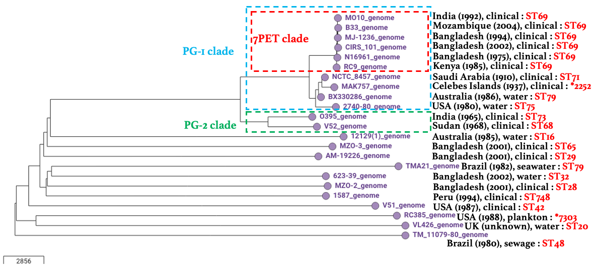

*Vibrio cholerae* lineage information
=====================================

In this section, we will describe how you can:

* `What is known about Vibrio cholerae lineages`_.
* `Carry out MLST analysis of your isolate`_.
* `Build a phylogenetic tree to check if your isolate belongs to the pandemic lineage`_.

What is known about Vibrio cholerae lineages
--------------------------------------------

A key early paper on *V. cholerae* genomes was that by `Chun et al 2009`_, who sequenced the genomes of 23 diverse *V. cholerae*.

.. _Chun et al 2009: https://pubmed.ncbi.nlm.nih.gov/19720995/

Here is a phylogenetic tree that I made (using Vibriowatch) of these 23 isolates:

.. image:: Picture18.png
  :width: 650
  
In the tree of the 23 isolates, you can see that the isolates causing the current global pandemic, or 'seventh pandemic', all belong to a particular clade highlighted with the red box here. These seventh pandemic (7PET) lineage isolates belong to a larger clade which has been named the 'phylocore group 1 clade' or 'PG1' clade, which has a sister clade called the 'phylocore group 2' clade or 'PG2' clade. The phylocore group clades are distantly related to the other isolates sequenced, which are also all distantly related to each other.

Among the 23 isolate sequenced by `Chun et al 2009`_, there were quite a lot of isolates that did not belong to the current pandemic lineage (7PET lineage), or even to the larger 'phylocore group' clade, e.g. isolates 12129(1), MZO-3, AM-19226, etc. Some of these isolates that did not belong to the pandemic lineage were environmental isolates, but some were clinical isolates. The pandemic lineage of *V. cholerae* is a highly infectious lineage and causes severe diarrhoea. These other clinical isolates such as isolate MZO-3 that did not belong to the 7PET lineage very probably they were not very infectious, and very probably only caused mild diarrhoea. 

.. _Chun et al 2009: https://pubmed.ncbi.nlm.nih.gov/19720995/

`Chun et al 2009`_ did not assign names to lineages outside the 'phylocore group' clade, but other researchers have done so. For example, `Domman et al 2017`_ analysed the genome sequences of 665 *Vibrio cholerae* isolates from across the world, and named 11 *V. cholerae* lineages found in the Americas (figure adapted from `Domman et al 2017`_):

.. _Domman et al 2017: https://pubmed.ncbi.nlm.nih.gov/29123068/

  
The 7PET, Gulf Coast and MX-2 lineages belong to the PG-1 clade previously described by `Chun et al 2009`_, while the Classical lienage belongs to the PG-2 clade described by `Chun et al 2009`_.

.. _Chun et al 2009: https://pubmed.ncbi.nlm.nih.gov/19720995/

Some of the lineages named by `Domman et al 2017`_ are distantly related to the current pandemic lineage (7PET lineage), e.g. lineages ELA-5, MX-1, ELA-4, etc. There are probably many more *V. cholerae* lineages that are distantly related to the current pandemic lineage that will be discovered when researchers sequence genomes of more and more diverse *V. cholerae* isolates from different locations and environmental niches. Indeed, some isolates have already been sequenced that are very diverged from any of the lineages named so far, and these likely represent examples of yet-unnamed *V. cholerae* lineages. 

.. _Domman et al 2017: https://pubmed.ncbi.nlm.nih.gov/29123068/

The best way to figure out whether your isolate belongs to a *V. cholerae* lineage that has already been named is to carry out a phylogenetic analysis. For example, below we will explain how to use a phylogenetic analysis to figure out whether your *V. cholerae* isolate belongs to the current pandemic lineage (7PET lineage). 

Carry out MLST analysis of your isolate
---------------------------------------

Carrying out a phylogenetic analysis to figure out whether your isolate belongs to a named *V. cholerae* lineage (e.g. to the 7PET lineage) takes some time and effort, but is a relatively accurate way to determine the lineage of an isolate.

On the other, a more 'quick and dirty' way to get a rough idea of the lineage of your isolate is MLST (multi-locus sequence typing) analysis, which Vibriowatch provides for your isolate. 

Vibriowatch uses the *Vibrio cholerae* MLST scheme of `Octavia et al 2013`_, a commonly used MLST scheme for *V. cholerae*, which is based on seven housekeeping genes (*adk*, *gyrB*, *mdh*, *metE*, *pntA*, *purM*, *pyrC*).
If two isolates have identical sequences at these seven genes, they will have the same sequence type; but if they differ by at least one base (ie. one 'single nucleotide polymorphism' or 'SNP') in their sequences at the seven genes, they will have a different sequence type. 

.. _Octavia et al 2013: https://pubmed.ncbi.nlm.nih.gov/23776471/

For example, here are the MLST sequence types of the 23 isolates sequenced by `Chun et al 2009`_ (see above):

.. _Chun et al 2009: https://pubmed.ncbi.nlm.nih.gov/19720995/

  
Note that you can produce such a figure yourself, by looking at the collection that you made for the `Chun et al 2009`_  isolates, clicking on the 'Timeline' menu below the tree, and choosing 'Typing' instead of 'Timeline', and then selecting the column 'ST' to show the MLST sequence type beside the leaves of the tree (remember also to change the tree display settings so that 'Show leaf labels' is turned on):

.. _Chun et al 2009: https://pubmed.ncbi.nlm.nih.gov/19720995/

.. image:: Picture47.png
  :width: 450
  
You can see that isolates MO10, B33, MJ-1236, CIRS_101, N16961 and RC9, which belong to the current pandemic lineage (7PET lineage), all have MLST sequence type ST69. Another sequence type that is sometimes seen for pandemic lineage *V. cholerae* is ST515 (see `Cheney et al 2021`_). 

.. _Cheney et al 2021: https://pubmed.ncbi.nlm.nih.gov/34427512/

STs of *V. cholerae* that are not linked to the pandemic lineage, but are linked to other lineages that cause relatively small outbreaks, are ST75, which includes the 'Gulf Coast' lineage (see `Luo et al 2016`_); and ST68, which has caused outbreaks in Sudan and former Czechoslovakia (see `Octavia et al 2013`_). 

.. _Luo et al 2016: https://pubmed.ncbi.nlm.nih.gov/26920786/

.. _Octavia et al 2013: https://pubmed.ncbi.nlm.nih.gov/23776471/

Sometimes you will see that the sequence type of an isolate does not start with 'ST', but instead with a '*' symbol. This means that it is a novel sequence type that has not been included in the *V. cholerae* MLST scheme.

As you can see, MLST information can give you a quick idea of whether your isolate might belong to the current pandemic ('7PET') lineage of *V. cholerae*.
To view MLST information for your isolate's genome, you can look at the top of the 'report page' for your isolate in Vibriowatch.
An example of the top of a report page is shown here:

  
In the example above, the isolate is classified as MLST sequence type ST69, based on its sequence at the seven housekeeping genes (ie. *adk*, *gyrB*, *mdh*, *metE*, *pntA*, *purM*, *pyrC*). The allele at each gene in the MLST scheme is given, e.g. this isolate has allele 7 of gene *adk*. 
ST69 is one of the STs (sequence types) often seen for the current pandemic ('7PET') lineage of *Vibrio cholerae*, so this suggests that this isolate belongs to the pandemic lineage. Note that it is possible that the pandemic lineage also contains other rare STs as well as ST69 and ST515. Therefore, if you isolate is not ST69 or ST515, it is still possible that it your isolate belongs to the pandemic lineage; you will need to build a phylogenetic tree to find out (see `Build a phylogenetic tree to check if your isolate belongs to the pandemic lineage`_).

Build a phylogenetic tree to check if your isolate belongs to the pandemic lineage
----------------------------------------------------------------------------------

Bla bla

Acknowledgements
----------------

I would like here to acknowledge the great help and work of my colleagues at the Wellcome Sanger Institute, especially Dr Matthew Dorman, Dr Florent Lassalle, Dr Sina Beier, Dr Alyce Taylor-Brown, Dr Adrian Cazares, Sam Dougan, and Prof. Nicholas Thomson, and all of the Thomson group.

Thank you also to our fantastic collaborators Dr Corin Yeats and Prof. David Aanensen who have developed Pathogenwatch at the Centre for Genomic Pathogen Surveillance, and have extensively adapted it for Vibriowatch.

Thank you to Dr Josefina Campos (INEI-ANLIS Malbran, Argentina),
Dr Neelam Taneja and Nisha Singh (PGIMER Chandigarh, India), 
and Dr Yann Boucher (National University of Singapore),
who have advised us on Vibriowatch.

Lastly, but very importantly, we would
like to say thank you to our funders who have funded our work. These are the Bill and Melinda Gates Foundation, and also the University of Oxford, Wellcome Trust, and Wellcome Sanger Institute. 

Contact
-------

I will be grateful if you will send me (Avril Coghlan) corrections or suggestions for improvements to my email address alc@sanger.ac.uk

