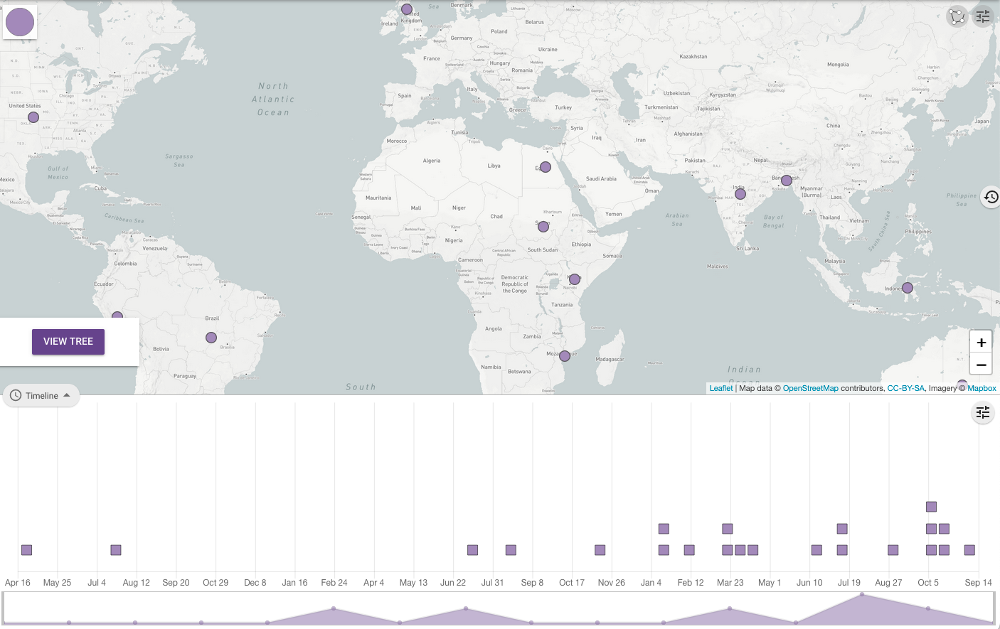
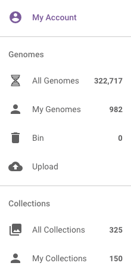
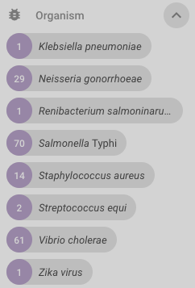
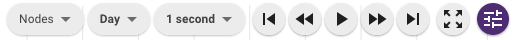

Navigating Vibriowatch
======================

In this section, we will describe:

* `How to search for an isolate in Vibriowatch and see its report page`_.
* `How to make a collection of isolates in Vibriowatch`_.
* `Finding your list of collections in Vibriowatch`_.
* `Public collections in Vibriowatch`_.
* `Exploring the timeline for a collection of isolates`_.
* `Exploring the tree for a collection of isolates`_.
* `Displaying metadata on the tree for a collection of isolates`_.

How to search for an isolate in Vibriowatch and see its report page
-------------------------------------------------------------------

You can search for an isolate in Vibriowatch by searching by its isolate/strain name(s).
For example, isolate HCUF_O1 is an isolate collected in Haiti in 2010, sequenced by `Hasan et al 2012`_. 

.. _Hasan et al 2012: https://pubmed.ncbi.nlm.nih.gov/22711841/

You can search for isolate HCUF_01 in Vibriowatch by clicking on the three small horizontal bars at the top left of the Pathogenwatch website:

.. image:: Picture9.png
  :width: 150
  
This will bring up a menu:

  
If you click on 'All Genomes' in the menu, you will then see a list of all the genomes in Pathogenwatch. 

To just select *V. cholerae* genomes, click on 'Genus' in the menu that now appears:

.. image:: Picture22.png
  :width: 150
  
Then select 'Vibrio', to select just genomes from *V. cholerae*. You will now see a list of the approximately 6000 *V. cholerae* genomes (just showing the top of the list here):

.. image:: Picture23.png
  :width: 850
  
A search bar will now appear at the top left.
If you type 'HCUF' in the search bar, it will find isolate HCUF_01:

  
Note that sometimes if there is a hyphen or dash in the name of an isolate, you might not find the isolate if is stored in a slightly different format in Vibriowatch. For example, HCUF_01 is stored as 'HCUF01' in Vibriowatch, so you won't find it if you search for 'HCUF_01' or 'HCUF-01', but you can find it if you search for part of the name, e.g. 'HCUF'. 
  
You can click on the isolate's name (link 'HCUF01') to go to its 'report page'. 
The report page shows the curated metadata for the isolate, as well as bioinformatics analyses of the isolate.
This shows the top of the report page for HCUF-01:

.. image:: Picture26.png
  :width: 650

How to make a collection of isolates in Vibriowatch
---------------------------------------------------

A nice feature of Pathogenwatch/Vibriowatch is that it is possible to make a 'collection' of isolates, and Vibriowatch will
build a tree for the isolates in the collection, and let you display their metadata, as well as results of some bioinformatics analyses, on the tree.

As mentioned above, a key early paper on *V. cholerae* genomics was by `Chun et al 2009`_, who sequenced the genomes of 23 diverse *V. cholerae* isolates. 

.. _Chun et al 2009: https://pubmed.ncbi.nlm.nih.gov/19720995/

The 23 isolates sequenced by `Chun et al 2009`_ were: MO10, B33, MJ-1236, CIRS-101, N16961, RC9, NCTC_8457, MAK757, BX330286, 2740-80, O395, V52, 12129(1), MZO-3, AM-19226, TMA21, 623-39, MZO-2, 1587, V51, RC385, VL426, and TM11079-80. 

.. _Chun et al 2009: https://pubmed.ncbi.nlm.nih.gov/19720995/

To make a collection in Vibriowatch for these isolates, we can search for the isolates one-by-one (in the same way that we searched for HCUF-01 above). To include the isolate in the collection, when we find the isolate, we tick the box on the left of the isolate's name: 

  
When you have searched for and ticked the boxes for all 23 of the genomes sequenced by `Chun et al 2009`_, you will see a purple button the top right saying '23 Selected Genomes':
  

  
If you click on this purple button you will see another purple button saying 'Sign in to create collection':
  

  
You will need to now sign into the Pathogenwatch/Vibriowatch website.
To make a collection on the Pathogenwatch/Vibriowatch website, it's necessary
to make an account first, for example, using your email address as your login. 

Once you have logged in, if you now click on the purple button saying '23 Selected Genomes', you will see a purple button 'Create collection'. You will need to fill in a title and brief description of the collection, and a PubMed id. if you like:

  
The collection will only be visible in your private Vibriowatch account, so only you will be able to view it.
Now click on the 'Create now' purple button to create the collection.

Vibriowatch will now build a tree for the collection, which may take a little while if your collection has hundreds of isolates, but will
be very fast for the 23 isolates of `Chun et al 2009`_.

.. _Chun et al 2009: https://pubmed.ncbi.nlm.nih.gov/19720995/

You will now see a map showing where the isolates in the collection were collected (at the top), and a timeline of when they were collected (at the bottom):

  
If you make a collection of isolates in Vibriowatch, it will be visible only to yourself in your private Vibriowatch account, and nobody
else can see it.

Finding your list of collections in Vibriowatch
-----------------------------------------------

If you want to find a collection that you previously made in Vibriowatch, you can see a list of all your collections
by clicking on the three horizontal bars at the top left of the Vibriowatch website:

.. image:: Picture9.png
  :width: 150
  
This will bring up a menu:

  
If you click on 'My collections' in this menu, it will bring up a list of all your collections. If you move your mouse over a particular
collection, it will bring up buttons showing a bin (which if you click on it, will delete the collection), a button saying 'LIST GENOMES' to 
see a list of genomes in the collection, and a button saying 'VIEW COLLECTION' to see the tree and map for that collection:

Public collections in Vibriowatch
---------------------------------

We have made many public collections of *V. cholerae* isolates in Vibriowatch. Each collection contains the isolates sequenced in
a particular published paper. 
For example, we have made a public collection for isolates sequenced by `Chun et al 2009`_.

.. _Chun et al 2009: https://pubmed.ncbi.nlm.nih.gov/19720995/

To see the list of all the public collections, click on the three small horizontal bars at the top left of the Pathogenwatch website:

.. image:: Picture9.png
  :width: 150
  
This will bring up a menu:

  
If you click on 'Public Collections' in the menu, you will then see a list of all the publicly visible collections in Pathogenwatch.

To just select *V. cholerae* genomes, click on 'Genus' in the menu that now appears on the left, and then select 'Vibrio':

  
You will now see a list of the approximately 60 public collections for *V. cholerae* that we have made (just showing the top of the list here):

  
If you hover your mouse over a collection, you can click on the 'LIST GENOMES' button to see a list of genomes for that collection,
or the 'VIEW COLLECTION' button to see the tree for the collection, or the 'PUBMED' button to see the original paper in PubMed:

Exploring the timeline for a collection of isolates
---------------------------------------------------

By default, the timeline for a collection of isolates shows the day of collection. To see instead the year of collection, click on this small 'Settings' symbol at the top right of the timeline panel: 

  
You will see a menus appear with settings for the timeline:

  
To change from day of collection to year of collection, click on 'Day' in the settings menu, and choose 'Year'. You will now see the timeline in terms of year of collection of the isolates. For the collection containing isolates sequenced by `Chun et al 2009`_,
you can see that the isolates were collected between 1930 and 2004.

.. _Chun et al 2009: https://pubmed.ncbi.nlm.nih.gov/19720995/

If you hover your mouse over the box representing a particular isolate, you will see the year of collection of that isolate pop up over the box representing the isolate:

  
Exploring the tree for a collection of isolates
-----------------------------------------------

As mentioned above, Vibriowatch builds a tree for each collection of isolates. This tree is built using the neighbour-joining
algorithm, a relatively fast and reliable method for building phylogenetic trees. You should see a big purple button 'View tree' in the middle of the map of isolates for your collection. If you click on the purple button, you will see the tree of your isolates on the left panel, the map of your isolates on the right panel, and the timeline for your isolates below that:

.. image:: Picture37.png
  :width: 850
  
By default, the isolate names are not shown on the tree. To show the isolate names on the tree, click on the small 'Settings' symbol at the top right of the tree panel:

  
You will see some menus appear with settings for the tree:

To show the isolate names on the tree, click on the 'Nodes and labels' menu that appeared, and slide the 'Show leaf labels' slider to the right. You should now see the isolate names appear on the tree. You can click on the 'X' in the corner of the menu to hide that menu.

To see the whole of your tree, you may have to zoom out by rolling the rollerball on your mouse away from you:

Similarly, you can zoom in on the tree by rolling the rollerball on your mouse towards you. Also, if you click on the picture of the tree and drag to the right/left or up/down, it will let you view different parts of the tree.

Displaying metadata on the tree for a collection of isolates
------------------------------------------------------------

Instead of showing the isolate name beside the leaves (tips) of the tree, you can instead show some of the curated metadata that was uploaded to Vibriowatch with the genome sequences.

To do this, click on the button saying 'Timeline' below the tree, and instead select 'Metadata' from the menu that appears:

Now instead of the map, below the tree you will see a panel with curated metadata:

You can click on a column that you want to display beside the tree instead of the isolate names, e.g. 'serogroup_phenotype' to show the experimentally determined serogroups:

You will now see the serogroups displayed beside the leaves of the tree in the tree panel:

For the collection containing isolates sequenced by `Chun et al 2009`_,
we can see that the isolates collected by `Chun et al 2009`_ had a variety of serogroups, including O1, O139, O37, O39, etc.
Some of the isolates were just assigned serogroup 'non O1', so it was only determined that they were not O1, but their exact serogroup was not determined. Isolates belonging to the current pandemic lineage (7PET lineage) have been found to be serogroup O1, or sometimes O139. 

.. _Chun et al 2009: https://pubmed.ncbi.nlm.nih.gov/19720995/

CholeraBook
-----------

If you would like to learn more about cholera genomics, you may also be interested in our `Online Cholera Genomics Course (CholeraBook)`_.

.. _Online Cholera Genomics Course (CholeraBook): https://cholerabook.readthedocs.io/

Contact
-------

I will be grateful if you will send me (Avril Coghlan) corrections or suggestions for improvements to my email address alc@sanger.ac.uk
