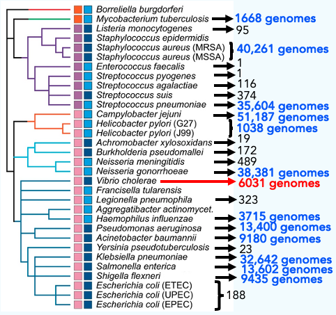
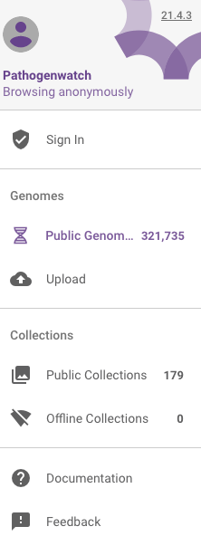

*Vibrio cholerae* genomic data
==============================

In this section, we will describe:

* `The Vibrio cholerae reference genome`_.
* `What genomic data is available for Vibrio cholerae`_.
* `Pathogenwatch and Vibriowatch`_.
* `How many V. cholerae genomes are in Vibriowatch`_.
* `Where in the world were the isolates in Vibriowatch collected`_.
* `How to search for an isolate in Vibriowatch and see its report page`_.
* `How to make a collection of isolates in Vibriowatch`_.

The Vibrio cholerae reference genome
------------------------------------

The *Vibrio cholerae* genome was first sequenced by `Heidelberg et al 2000`_. They sequenced strain N16961, which belongs to the current pandemic lineage (7PET lineage). They found that the genome is four Megabase and consists of two circular chromosomes, a larger chromosome of about three Megabase and a smaller chromosome of about 1.1 Megabase. Together, these two chromosomes have about 4000 genes, and their GC content of the chromosomes is about 47%. 

.. _Heidelberg et al 2000: https://pubmed.ncbi.nlm.nih.gov/10952301/

It's worth bearing in mind that N16961 is the reference strain, but there may be a wide variety of genomic variation in the *V. cholerae population* worldwide. Some interesting examples have already been reported. `Johnson et al 2015`_ reported a *V. cholerae* isolate that has the two chromosomes fused into one big chromosome. `Okada et al 2015`_ reported an isolate with a third replicon of nearly one Megabase so that its genome size was five Megabase. As we sequence more and more genomes of *V. cholorae* isolates, we are likely to see more and more genomic variation.

.. _Johnson et al 2015: https://pubmed.ncbi.nlm.nih.gov/25977434/

.. _Okada et al 2015: https://pubmed.ncbi.nlm.nih.gov/26079534/

What genomic data is available for Vibrio cholerae
--------------------------------------------------

Since the year 2000, genome sequencing technologies have greatly improved, and this has meant that many different *V. cholerae* isolates have had their genomes sequenced. An example of this with a key paper by `Chun et al 2009`_, who sequenced the genomes of 23 diverse *V. cholerae* isolates that had been collected over nearly 100 years. These isolates included both clinical and environmental isolates from many different countries. 

.. _Chun et al 2009: https://pubmed.ncbi.nlm.nih.gov/19720995/

Since then, many more *V. cholerae* genomes have been sequenced. This plot shows with the number of isolates sequenced in 22 key papers ranging from the year 2000 at the top to 2022 at the bottom:

Together these 22 key papers have published 3254 *V. cholerae* genomes, of which 84% belonged to the current pandemic lineage (7PET lineage). All of these genome data has been useful to clinicians and epidemiologists to try and understand the spread of *V. cholerae* around the world and also to scientists and epidemiologists interested in *V. cholerae* genome evolution, for example, the spread of antibiotic resistance genes, and the presence or absence of virulence genes. 

Of course, these 22 key papers do not include all papers that have published *V. cholerae* genomes. In fact, if you look at the `NCBI database`_ or `ENA database`_, you will be able to find about 5700 *V. cholerae* genome assemblies. These will include some genomes that were published in papers that I have not listed here, but also some genomes that have not yet been published. Furthermore, if you look in the ENA database, you will see about 14,500  *V. cholerae* sequence runs, which are unassembled reads for *V. cholerae* isolates. This reflects the fact that many researchers in the past have not assembled reads into assemblies but simply aligned the reads to the reference genome. 

Clearly, there is a huge amount of genomic data available for *V. cholerae*. Our goal in the VibrioWatch project is to make all this data available and useful for clinicians, epidemiologists and researchers studying *V. cholerae*.

.. _NCBI database: https://www.ncbi.nlm.nih.gov/data-hub/genome/?taxon=666

.. _ENA database: https://www.ebi.ac.uk/ena/browser/advanced-search

Pathogenwatch and Vibriowatch
-----------------------------

Next we'll tell you about Pathogenwatch, and its *V. cholerae* component, which we call **VibrioWatch**. `Pathogenwatch`_ is a website that can be used as a global platform for genomic surveillance of pathogens of humans. It has been developed by the Centre for Genomic Pathogen Surveillance, a collaboration between the University of Oxford and the Wellcome Sanger Institute. So far, Pathogenwatch includes almost 250,000 genomes for bacterial pathogens of humans that cause worldwide problems. This is a phylogenetic tree (tree adapted from `Avican et al 2021`_) of some major bacterial pathogens of humans, showing the number of genomes (as of January 2023) that are in Pathogenwatch so far for those species:

.. _Pathogenwatch: https://pathogen.watch/

.. _Avican et al 2021: https://pubmed.ncbi.nlm.nih.gov/34078900/

You can see that there are several species (e.g. *Steptococcus pneumoniae*) that include a large fraction of the genomes added so far. This reflects the fact that the research communities studying those species have found Pathogenwatch to be an extremely useful website for disseminating and analysing genome data for their species. 

How many V. cholerae genomes are in Vibriowatch
-----------------------------------------------

We are convinced that Pathogenwatch is a useful website for *V. cholerae*, and so we have started uploading *V. cholerae* genomes to Pathogenwatch. So far, we have put about 4700 *V. cholerae* genomes into Pathogenwatch (as of February 2023), that is, its *V. cholerae* component Vibriowatch. 
But as we mentioned above, there are many 1000s of genomes already available, and our goal is to upload as many more as possible in the near future. 

As well as the genome sequences for the approximately 4700 genomes, we have also uploaded metadata for those genomes that we have manually curated
from the papers that published the genomes. This metadata includes strain name(s); assembly accession in databases (e.g. NCBI or ENA databases); PubMed id. of the paper; and phenotypic data for biotype, serogroup, serotype, and antimicrobial resistance. 

You can see a list of the *V. cholerae* genomes uploaded into Pathogenwatch by visiting the `Pathogenwatch`_ website. 

.. _Pathogenwatch: https://pathogen.watch/

Note that you can also find the full list of genomes in your private Vibriowatch account by clicking on the three small horizontal bars at the top left of the Pathogenwatch website:

.. image:: Picture9.png
  :width: 150
  
This will bring up a menu:

  
If you click on 'Public Genomes' in this menu, it will give you the list of all the genomes in Pathogenwatch. 

To just select *V. cholerae* genomes, click on 'Genus' in the menu that now appears:

.. image:: Picture22.png
  :width: 150
  
Then select 'Vibrio', to select just genomes from *V. cholerae*. You will now see a list of the approximately 4700 *V. cholerae* genomes (just showing the top of the list here):

.. image:: Picture23.png
  :width: 650

Where in the world were the isolates in Vibriowatch collected
-------------------------------------------------------------

Once you have got the list of the approximately 4700 *V. cholerae* isolates in Vibriowatch (see above), 
if you now click on 'Map' (instead of 'List') at the top of the page, it will show a map of where these approximately 4700 isolates were collected:

For example, you can see 207 were collected from Mexico, 198 from Haiti, and 262 from China, and so on. 

The approximately 4700 isolates were collected between 1916 and 2020. 
As we put more and more genomes into Pathogenwatch for *V. cholerae*, the map will be updated, and we hope to cover a larger time span. 

In the next sections, we will explain some analyses that can be carried out on the VibrioWatch website, both of the approximately 4700 genomes already uploaded, but also of genomes that you upload yourself into your private space in the VibrioWatch website.

How to search for an isolate in Vibriowatch and see its report page
-------------------------------------------------------------------

You can search for an isolate in Vibriowatch by searching by its isolate/strain name(s).
For example, isolate HCUF_O1 is an isolate collected in Haiti in 2010, sequenced by `Hasan et al 2012`_. 

.. _Hasan et al 2012: https://pubmed.ncbi.nlm.nih.gov/22711841/

You can search for isolate HCUF_01 in Vibriowatch by clicking on the three small horizontal bars at the top left of the Pathogenwatch website:

.. image:: Picture9.png
  :width: 150
  
This will bring up a menu:

.. image:: Picture10.png
  :width: 150
  
If you click on 'All Genomes' in the menu, you will then see a list of all the genomes in Pathogenwatch. 

To just select *V. cholerae* genomes, click on 'Genus' in the menu that now appears:

.. image:: Picture22.png
  :width: 150
  
Then select 'Vibrio', to select just genomes from *V. cholerae*. You will now see a list of the approximately 4700 *V. cholerae* genomes (just showing the top of the list here):

.. image:: Picture23.png
  :width: 650
  
A search bar will now appear at the top left: 

.. image:: Picture22.png
  :width: 150
  
If you type 'HCUF' in the search bar, it will find isolate HCUF_01:

.. image:: Picture28.png
  :width: 650
  
You can click on the isolate's name (link 'HCUF01') to go to its 'report page'. 
The report page shows the curated metadata for the isolate, as well as bioinformatics analyses of the isolate.
This shows the top of the report page for HCUF-01:

.. image:: Picture26.png
  :width: 650

How to make a collection of isolates in Vibriowatch
---------------------------------------------------

Contact
-------

I will be grateful if you will send me (Avril Coghlan) corrections or suggestions for improvements to my email address alc@sanger.ac.uk

