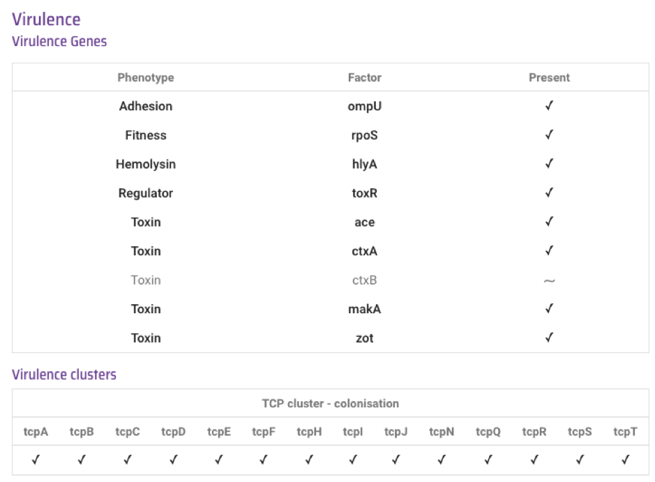

Predicting virulence genes
==========================

In this section, we will describe how you can:

* `Predict virulence genes in your isolate`_.

Predict virulence genes in your isolate
---------------------------------------

It is well described that certain 'virulence genes' can make *Vibrio cholerae* more virulent, causing more severe disease. The most important virulence genes for *V. cholerae* are the `ctxA`_ and `ctxB`_ genes, which encode the cholera toxin and also the `tcpA`_ gene which encodes the toxin coregulated pilus, which is important for colonisation of the host. The `ctxA`_ and `ctxB`_ genes are almost always found in isolates belonging to the current pandemic lineage (7PET lineage), but are occasionally found in isolates of other lineages too. 
As well as `ctxA`_, `ctxB`_, and `tcpA`_, *V. cholerae* isolates can also have some 
other virulence genes of lesser importance, such as additonal toxin genes `zot`_, `ace`_, `hlyA`_, `makA`_ and `rtxA`_. 

.. _ctxA: https://biocyc.org/gene?orgid=GCF_900205735&id=FY484_RS07330

.. _ctxB: https://biocyc.org/gene?orgid=GCF_900205735&id=FY484_RS07325

.. _tcpA: https://biocyc.org/gene?orgid=GCF_900205735&id=FY484_RS04280

.. _zot: https://biocyc.org/gene?orgid=GCF_900205735&id=FY484_RS07335

.. _ace: https://biocyc.org/gene?orgid=GCF_900205735&id=FY484_RS07340

.. _hlyA: https://biocyc.org/gene?orgid=GCF_900205735&id=FY484_RS14860

.. _makA: https://biocyc.org/gene?orgid=GCF_900205735&id=FY484_RS18340

.. _rtxA: https://biocyc.org/gene?orgid=GCF_900205735&id=FY484_RS07295

Vibriowatch uses a tool called ‘VISTA’, based on BLAST, to identify virulence genes in *V. cholerae* genomes.
The predicted virulence genes are shown on the report page for a genome. This is an example of the section of a report page on virulence:

  
The ticks show that the intestinal colonisation gene  `ompU`_, regulatory gene,
`rpoS`_, and toxin genes `ctxA`_, `hlyA`_, `toxR`_, `ace`_, `makA`_, and `zot`_ genes are present. There is a '~' symbol for the `ctxB`_ gene, indicating that there was a partial match to it. This could either mean that the `ctxB`_ gene is truncated in this isolate, or that there are one or more SNPs in `ctxB`_ in this isolate. 

.. _ompU: https://biocyc.org/gene?orgid=GCF_900205735&id=FY484_RS03340

.. _rpoS: https://biocyc.org/gene?orgid=GCF_900205735&id=FY484_RS02845

.. _ctxA: https://biocyc.org/gene?orgid=GCF_900205735&id=FY484_RS07330

.. _hlyA: https://biocyc.org/gene?orgid=GCF_900205735&id=FY484_RS14860

.. _toxR: https://biocyc.org/gene?orgid=GCF_900205735&id=FY484_RS05040

.. _ace: https://biocyc.org/gene?orgid=GCF_900205735&id=FY484_RS07340

.. _makA: https://biocyc.org/gene?orgid=GCF_900205735&id=FY484_RS18340

.. _zot: https://biocyc.org/gene?orgid=GCF_900205735&id=FY484_RS07335

.. _ctxB: https://biocyc.org/gene?orgid=GCF_900205735&id=FY484_RS07325

It seems that this isolate has `ctxA`_ and likely has `ctxB`_, and that there is one or more SNP in its `ctxB`_ gene, since `ctxB`_ is known to have several circulating SNPs in the *V. cholerae* species (see `Lee et al 2021`_). Because this isolate probably has both `ctxA`_ and `ctxB`_, it probably produces cholera toxin, so will give rise to severe cholera.

.. _ctxB: https://biocyc.org/gene?orgid=GCF_900205735&id=FY484_RS07325

.. _ctxA: https://biocyc.org/gene?orgid=GCF_900205735&id=FY484_RS07330

.. _Lee et al 2021: https://pubmed.ncbi.nlm.nih.gov/34566903/

Below the Virulence gene list, there are also some virulence gene clusters listed, such as the TCP cluster, where the TCP cluster includes genes *tcpABCDEFHIJNQRST*, the Lux operon includes genes *luxOPQSU*, the RTX operon includes *rtxABCD*, and the MSHA pilus includes *mshABCDEFGHIJKMN*. 
The TCP cluster contains the important virulence gene `tcpA`_ and is part of the 'Vibrio Pathogenicity Island-1' (VPI-1), a genomic island often found in isolates of *V. cholerae* that belong to the current pandemic lineage (7PET lineage).

.. _tcpA: https://biocyc.org/gene?orgid=GCF_900205735&id=FY484_RS04280

In the example above, the isolate has a partial hit to `rtxA`_ in the RTX operon, which as for `ctxB`_ gene (see above), may either mean that the `rtxA`_ gene is truncated in this isolate, or that there are one or more SNPs in the `rtxA`_ gene in this isolate.

.. _rtxA: https://biocyc.org/gene?orgid=GCF_900205735&id=FY484_RS07295

.. _ctxB: https://biocyc.org/gene?orgid=GCF_900205735&id=FY484_RS07325

Contact
-------

I will be grateful if you will send me (Avril Coghlan) corrections or suggestions for improvements to my email address alc@sanger.ac.uk

