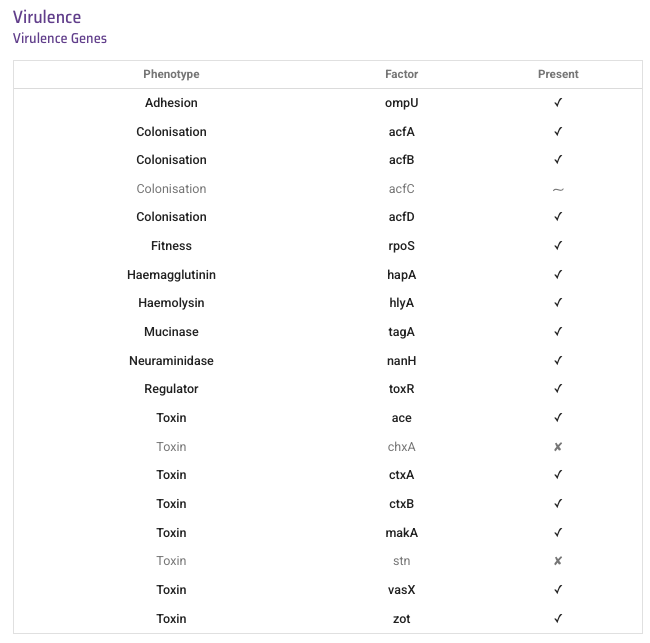

Predicting virulence genes
==========================

This section will cover:

* `Short guide for those in a hurry: is my isolate predicted to produce cholera toxin`_.
* `Predicting additional virulence genes in your isolate`_.
* `Predicting virulence clusters in your isolate`_.
* `Displaying virulence gene presence/absence on the tree for a collection of isolates`_.

Short guide for those in a hurry: is my isolate predicted to produce cholera toxin
----------------------------------------------------------------------------------

Cholera toxin (CT) is a toxin usually produced by *Vibrio cholerae* of the current pandemic lineage (7PET lineage),
and is a protein that causes profuse, watery diarrhoea.

Cholera toxin is encoded by the `ctxA`_ and `ctxB`_ genes.

A quick way to find out whether your isolate likely expresses cholera toxin is to look at the predicted virulence genes for your isolate in Vibriowatch.

Once you have sequencing reads or a genome assembly for your isolate to Vibriowatch (see `Is my isolate Vibrio cholerae? <https://vibriowatch.readthedocs.io/en/latest/assemblies.html#short-guide-for-those-in-a-hurry-is-my-isolate-vibrio-cholerae>`_), Vibriowatch will display a piechart showing the species of your isolates are, e.g.:

.. image:: Picture7.png
  :width: 650

To view the report pages for your isolates, which will tell you their predicted virulence genes, you need
to click on the 'View genomes' link in the middle of the piechart.
  
This will bring up a list of your isolates in Vibriowatch, looking something like this:

.. image:: Picture8.png
  :width: 650
  
To go to the report page for a particular isolate, click on the link on the left in the 'Name' column, e.g. '1_S1_L001'.

If you scroll down the 'report page' for your isolate, you will find a section with the heading 'Virulence Genes'. 

For example, here is 'Virulence Genes' part of 
the report page for an isolate HCUF-01:

The tick next to 'ctxA' shows that the cholera toxin gene `ctxA`_ is present. 
Because this isolate probably has `ctxA`_, it probably produces cholera toxin, so will give rise to severe cholera.

.. _ctxA: https://biocyc.org/gene?orgid=GCF_900205735&id=FY484_RS07330

(Note: there is currently a problem predicting gene *ctxB* in Vibriowatch, which we are currently working on fixing.)

Sometimes you may see a '~' symbol beside 'ctxB', indicating that there was a partial match to the `ctxB`_ gene. 
This could either mean that the `ctxB`_ gene is truncated in this isolate, or that there are one or more SNPs in `ctxB`_ in this isolate. 
The `ctxB`_ gene is known to have several circulating SNPs in the *V. cholerae* species (see `Lee et al 2021`_). 

.. _ctxB: https://biocyc.org/gene?orgid=GCF_900205735&id=FY484_RS07325

.. _ctxA: https://biocyc.org/gene?orgid=GCF_900205735&id=FY484_RS07330

.. _Lee et al 2021: https://pubmed.ncbi.nlm.nih.gov/34566903/

If an isolate lacks the `ctxA`_ and `ctxB`_ genes, it is predicted to not produce cholera toxin and as a result will not cause severe cholera, probably only relatively mild diarrhoea. 

If you found this useful, you may want to read through the rest of the tutorial to find out more details.

Predicting additional virulence genes in your isolate
-----------------------------------------------------

It is well described that certain 'virulence genes' can make *Vibrio cholerae* more virulent, causing more severe disease (see
`Ramamurthy et al 2020`_ for a review of virulence in *V. cholerae*). 
The most important virulence genes for *V. cholerae* are the `ctxA`_ and `ctxB`_ genes, which encode the cholera toxin and also the `tcpA`_ gene which encodes the toxin coregulated pilus, which is important for colonisation of the host. The `ctxA`_ and `ctxB`_ genes are almost always found in isolates belonging to the current pandemic lineage (7PET lineage), but are occasionally found in isolates of other lineages too. 

.. _Ramamurthy et al 2020: https://pubmed.ncbi.nlm.nih.gov/33102256/

As well as `ctxA`_, `ctxB`_, and `tcpA`_, *V. cholerae* isolates can also have some 
other virulence genes of lesser importance, such as additonal toxin genes `zot`_, `ace`_, `hlyA`_, `makA`_, `rtxA`_, `chxA`_, `vasX`_, and `stn`_.

.. _ctxA: https://biocyc.org/gene?orgid=GCF_900205735&id=FY484_RS07330

.. _ctxB: https://biocyc.org/gene?orgid=GCF_900205735&id=FY484_RS07325

.. _tcpA: https://biocyc.org/gene?orgid=GCF_900205735&id=FY484_RS04280

.. _zot: https://biocyc.org/gene?orgid=GCF_900205735&id=FY484_RS07335

.. _ace: https://biocyc.org/gene?orgid=GCF_900205735&id=FY484_RS07340

.. _hlyA: https://biocyc.org/gene?orgid=GCF_900205735&id=FY484_RS14860

.. _makA: https://biocyc.org/gene?orgid=GCF_900205735&id=FY484_RS18340

.. _rtxA: https://biocyc.org/gene?orgid=GCF_900205735&id=FY484_RS07295

.. _chxA: https://biocyc.org/gene?orgid=GCF_000969265&id=VAB027_RS11625

.. _vasX: https://biocyc.org/gene?orgid=GCF_900205735&id=FY484_RS13930

.. _stn: https://pubmed.ncbi.nlm.nih.gov/8246823/

Vibriowatch uses a tool called ‘VISTA’, based on BLAST, to identify virulence genes in *V. cholerae* genomes.
Let's look again at the section of the report page on 'Virulence Genes' for isolate HCUF-01: 

  
The ticks show that the intestinal colonisation genes  `ompU`_, `acfA`_, `acfB`_, `acfC`_ and `acfD`_; virulence regulatory gene `toxR`_;
sigma factor gene `rpoS`_; mucinase `tagA`_; haemagglutinin `hapA`_; neuraminidase/sialidase `nanH`_; 
and toxin genes `ctxA`_, `hlyA`_, `toxR`_, `ace`_, `makA`_, `zot`_, and `vasX`_ genes are present.
The genes `hlyA`_, `toxR`_, `ace`_, `makA`_, `zot`_, and `vasX`_ encode toxins that are not as potent as that encoded by `ctxA`_ and `ctxB`_,
ie. these toxins do not cause very severe diarrhoea. We see a '~' symbol beside 'acfC', which means that the `acfC`_ gene may be partial or contain SNPs.

.. _ompU: https://biocyc.org/gene?orgid=GCF_900205735&id=FY484_RS03340

.. _acfA: https://biocyc.org/gene?orgid=GCF_900205735&id=FY484_RS04360

.. _acfB: https://biocyc.org/gene?orgid=GCF_900205735&id=FY484_RS04340

.. _acfC: https://biocyc.org/gene?orgid=GCF_900205735&id=FY484_RS04345

.. _acfD: https://biocyc.org/gene?orgid=GCF_900205735&id=FY484_RS04365

.. _toxR: https://biocyc.org/gene?orgid=GCF_900205735&id=FY484_RS05040

.. _rpoS: https://biocyc.org/gene?orgid=GCF_900205735&id=FY484_RS02845

.. _tagA: https://biocyc.org/gene?orgid=GCF_900205735&id=FY484_RS04245

.. _hapA: https://biocyc.org/gene?orgid=GCF_900205735&id=FY484_RS18255

.. _nanH: https://biocyc.org/gene?orgid=GCF_900205735&id=FY484_RS08940

.. _ctxA: https://biocyc.org/gene?orgid=GCF_900205735&id=FY484_RS07330

.. _hlyA: https://biocyc.org/gene?orgid=GCF_900205735&id=FY484_RS14860

.. _toxR: https://biocyc.org/gene?orgid=GCF_900205735&id=FY484_RS05040

.. _ace: https://biocyc.org/gene?orgid=GCF_900205735&id=FY484_RS07340

.. _makA: https://biocyc.org/gene?orgid=GCF_900205735&id=FY484_RS18340

.. _zot: https://biocyc.org/gene?orgid=GCF_900205735&id=FY484_RS07335

.. _vasX: https://biocyc.org/gene?orgid=GCF_900205735&id=FY484_RS13930

.. _ctxB: https://biocyc.org/gene?orgid=GCF_900205735&id=FY484_RS07325

The sigma factor gene `rpoS`_ has many roles, but is 
part of a large regulatory network involved in regulating virulence in *V. cholerae* (see `Dorman and Dorman 2018`_).

.. _rpoS: https://biocyc.org/gene?orgid=GCF_900205735&id=FY484_RS02845

.. _Dorman and Dorman 2018: https://pubmed.ncbi.nlm.nih.gov/30473684/

Here is an example of the virulence section of the report page from another isolate, isolate GXFL1-4, which was isolated from prawns by `Zhou et al 2022`_:

.. _Zhou et al 2022: https://pubmed.ncbi.nlm.nih.gov/35664858/

  
And here is its section on virulence clusters:

  
It's interesting to note that this isolate, which does not belong to the current pandemic lineage (7PET lineage), is missing the key genes necessary for virulence in human hosts, `ctxA`_ and `ctxB`_, and `tcpA`_. Therefore, it would be very unlikely to cause severe cholera in humans, and would probably only produce mild diarrhoea. Interestingly, this isolate is predicted to have the cholix toxin gene, `chxA`_, which is rare in the current pandemic lineage (7PET lineage) but may perhaps be important to interactions between *V. cholerae* and crustaceans (see `Jorgensen et al 2008`_).

.. _ctxA: https://biocyc.org/gene?orgid=GCF_900205735&id=FY484_RS07330

.. _ctxB: https://biocyc.org/gene?orgid=GCF_900205735&id=FY484_RS07325

.. _tcpA: https://biocyc.org/gene?orgid=GCF_900205735&id=FY484_RS04280

.. _chxA: https://biocyc.org/gene?orgid=GCF_000969265&id=VAB027_RS11625

.. _Jorgensen et al 2008: https://pubmed.ncbi.nlm.nih.gov/18276581/

Predicting virulence clusters in your isolate
---------------------------------------------

Below the Virulence gene list, there are also some virulence gene clusters listed, such as the TCP cluster, where the TCP cluster includes genes *tcpABCDEFHIJNQRST*, the Lux operon includes genes *luxOPQSU*, the RTX operon includes *rtxABCD*, and the MSHA pilus includes *mshABCDEFGHIJKMN*.
For example, here is the 'Virulence clusters' section for isolate HCUF-01:

The **TCP cluster** contains the important virulence gene `tcpA`_ and is part of the 'Vibrio Pathogenicity Island-1' (VPI-1), a genomic island often found in isolates of *V. cholerae* that belong to the current pandemic lineage (7PET lineage). 
`tcpA`_ is a key virulence factor for intestinal adherence/colonisation, and if an isolate lacks 
`tcpA`_, it likely will not cause severe cholera, probably only relatively mild diarrhoea. 
The TCP cluster also contains the key virulence regulator `toxT`_ (also known as *tcpN*). We see a '~' symbol beside 'tcpI', which means that the `tcpI`_ gene may be partial or contain SNPs.

.. _tcpA: https://biocyc.org/gene?orgid=GCF_900205735&id=FY484_RS04280

.. _toxT: https://biocyc.org/gene?orgid=GCF_900205735&id=FY484_RS04330

.. _tcpI: https://biocyc.org/gene?orgid=GCF_900205735&id=FY484_RS04265

The **RTX operon** *rtxABCD* includes gene `rtxA`_, which encodes a toxin known as 'repeats-in-toxin'. 

.. _rtxA: https://biocyc.org/gene?orgid=GCF_900205735&id=FY484_RS07295

The **MSH operon** includes the key gene *mshA*, which encodes the key structural unit of the MSHA pilus.
The role of the MSHA pilus in virulence is possibly indirect. 
The MSHA pilus is involved in attachment to biofilms and surfaces, and is likely important for *V. cholerae* to form biofilm on
some surfaces in the environment (see `Watnick et al 1999`_). Furthermore, ingesting water
containing *V. cholerae* biofilms may enhance acute cholera infection, for example, based on evidence from infant mouse models of cholera
(see `Tamayo et al 2010`_). 

.. _mshA: https://biocyc.org/gene?orgid=GCF_900205735&id=FY484_RS02175

.. _Watnick et al 1999: https://pubmed.ncbi.nlm.nih.gov/10348878/

.. _Tamayo et al 2010: https://pubmed.ncbi.nlm.nih.gov/20515927/

The **Lux operon** of *Vibrio cholerae* is involved in luminescence (see `Grim et al 2008`_), and is also part of a large regulatory network involved in regulating virulence in *V. cholerae* (see `Dorman and Dorman 2018`_). 

.. _Grim et al 2008: https://pubmed.ncbi.nlm.nih.gov/18065611/

.. _Dorman and Dorman 2018: https://pubmed.ncbi.nlm.nih.gov/30473684/

Displaying virulence gene presence/absence on the tree for a collection of isolates
-----------------------------------------------------------------------------------

If you make a collection of isolates in Vibriowatch, you can display the presence/absence of a particular virulence gene
(e.g. `ctxA`_) beside the tree.

.. _ctxA: https://biocyc.org/gene?orgid=GCF_900205735&id=FY484_RS07330

For example, if you look at the public Vibriowatch `collection for the paper by Chun et al 2009`_ (see `here`_ for the paper in PubMed), if
you turn on the leaf labels you will see a picture of the tree with the isolate names beside the tips of the tree:

.. _collection for the paper by Chun et al 2009: https://pathogen.watch/collection/2c43jl3z2xs8-vibriowatch-collection-chun-et-al-2009

.. _here: https://pubmed.ncbi.nlm.nih.gov/19720995/

.. image:: Picture93.png
  :width: 650
  
To show virulence gene presence/absence beside the tree, click on the 'Timeline' menu below the tree, and choose 'Virulence' instead
of 'Timeline'. Then click on the column heading 'ctxA' to show the presence/absence of the `ctxA`_ gene and you should see the nodes
of the tree light up as red if they have the `ctxA`_ gene, orange if they have a partial match to the `ctxA`_ gene, and colourless if
they don't have a match to `ctxA`_:

.. _ctxA: https://biocyc.org/gene?orgid=GCF_900205735&id=FY484_RS07330

  
We can see that the `ctxA`_ gene, which encodes part of the cholera toxin, is present (or found at least partially) in the isolates in
the current pandemic lineage (7PET lineage), i.e. isolates M010, B33, MJ1236, CIRS101, N16961, and RC9; as well as in some closely 
related 'pre-7PET' lineage isolates (isolates MAK757 and BX330286). However, interestingly,
the `ctxA`_  is also present too in some isolates that are not in current pandemic lineage (7PET lineage), such as the isolates 
V52 and O395. Indeed, some isolates such as V52 that do not belong to the current pandemic lineage have been found to produce cholera toxin.

.. _ctxA: https://biocyc.org/gene?orgid=GCF_900205735&id=FY484_RS07330

Contact
-------

I will be grateful if you will send me (Avril Coghlan) corrections or suggestions for improvements to my email address alc@sanger.ac.uk

