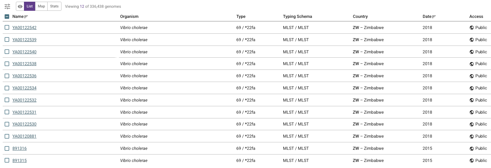
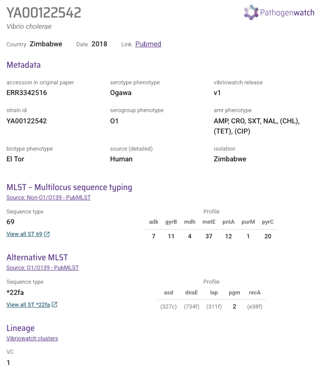
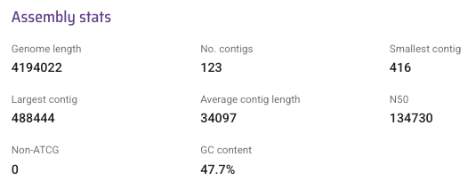
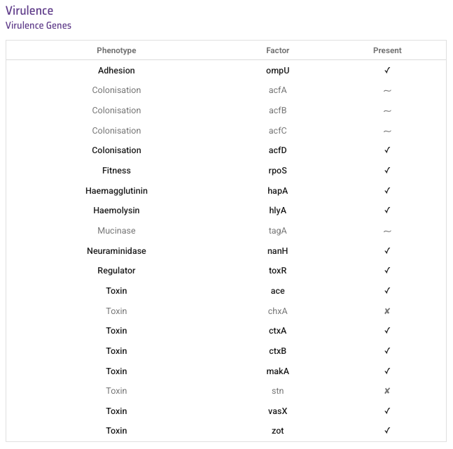
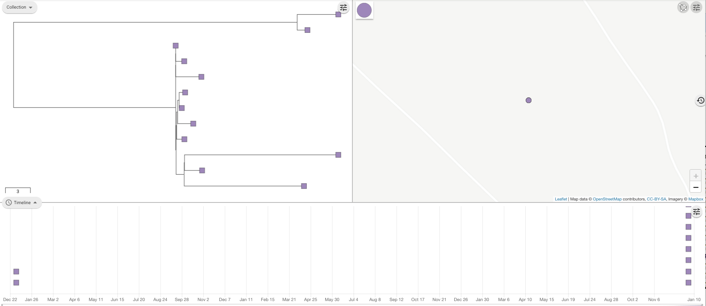
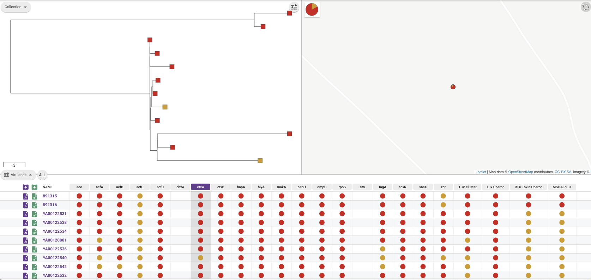
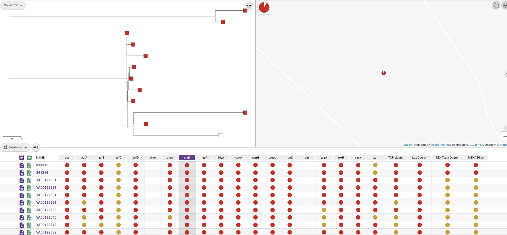
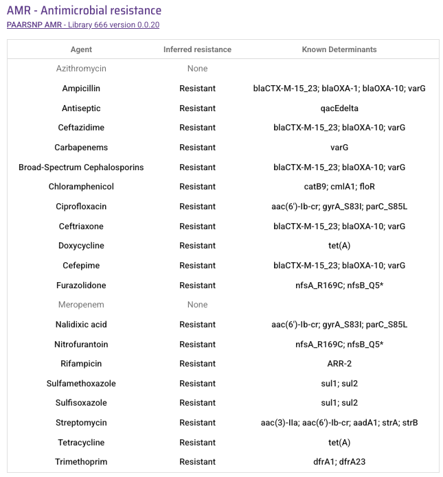
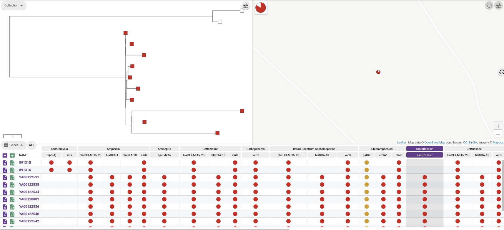
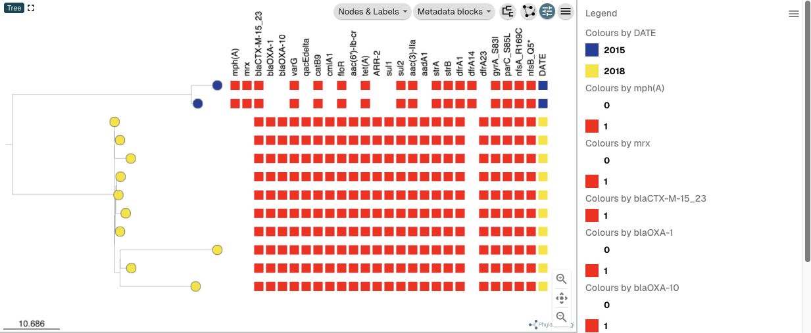

Worked example - Zimbabwe 2018
==============================

This section is a worked example of using Vibriowatch to analyse cholera genomic data, using the Zimbabwe 2018 outbreak as an example:

* `The Zimbabwe 2018 outbreak`_
* `The Zimbabwe 2018 genomes`_.
* `Finding the Zimbabwe 2018 genomes in Vibriowatch`_.
* `Assembly quality of the Zimbabwe 2018 genomes`_.
* `Are the Zimbabwe 2018 isolates predicted to produce cholera toxin?`_
* `Are the Zimbabwe 2018 isolates predicted to have antimicrobial resistance?`_
* `Are the Zimbabwe 2018 isolates predicted to have plasmids?`_
* `What is the predicted serogroup of the Zimbabwe 2018 isolates?`_
* `Do the Zimbabwe 2018 isolates belong to the pandemic lineage of Vibrio cholerae?`_.
* `What are the closest relatives of the Zimbabwe 2018 isolates among published Vibrio cholerae genomes?`_.
* `What can we say about the origins of the Zimbabwe 2018 outbreak, based on the Zimbabwe 2018 genomes?`_

The Zimbabwe 2018 outbreak
--------------------------

Between September 2018 and March 2019 there was a large cholera outbreak in Zimbabwe, with 10,730 suspected
cases of cholera and 69 deaths (`Mashe et al 2020`_). A worrying feature of this large cholera outbreak was
that antimicrobial-susceptibility testing data showed that the isolates were multidrug-resistant, with
an unexpectedly high-level resistance to ciprofloxacin (in an estimated 96.7% of isolates), one of the antimicrobials
recommended for use for the most vulnerable patients. The Zimbabwe 2018 isolates also had resistance to 
other drugs including ceftriaxone (in an estimated 99.6% of isolates).
Ceftriaxone is not a WHO-recommended antimicrobial for cholera, but resistance to ceftriaxone is of interest 
as it is a third-generation cephalosporin.

.. _Mashe et al 2020: https://pubmed.ncbi.nlm.nih.gov/32786196/

An important epidemiological question was: where did the *V. cholerae* causing the Zimbabwe 2018 outbreak come from?
Was it the same lineage/sublineage of *V. cholerae* that had previously been circulating in Zimbabwe or other countries
in the Southern African region in previous years, or was it a new introduction from elsewhere in the world (e.g. from
Asia or Latin America)? Why was the Zimbabwe 2018 outbreak strain multi-drug resistant? Did it carry resistance
mutations or genes that had not previously been seen in cholera in the Southern African region?

The Zimbabwe 2018 genomes
-------------------------

`Mashe et al 2020`_ published the genomes of 13 *V. cholerae* isolates, including 10 that had been obtained
during the Zimbabwe 2018 outbreak, one obtained from a South African patient who had a history of travel to
Zimbabwe, and two that were obtained in Zimbabwe in 2015. 

.. _Mashe et al 2020: https://pubmed.ncbi.nlm.nih.gov/32786196/

In this worked example, I'm going to show you how to analyse the Zimbabwe 2018 genomes to answer some key questions relevant
to public health, and answer questions about the multi-drug resistance and origins of the Zimbabwe 2018 outbreak:

#. Are the Zimbabwe 2018 isolates predicted to produce cholera toxin?
#. Are the Zimbabwe 2018 isolates predicted to have antimicrobial resistance?
#. Are the Zimbabwe 2018 isolates predicted to have plasmids?
#. Do the Zimbabwe 2018 isolates belong to the pandemic lineage of Vibrio cholerae?
#. What are the closest relatives of the Zimbabwe 2018 isolates among published Vibrio cholerae genomes? 
#. What can we say about the origins of the Zimbabwe 2018 outbreak, based on the Zimbabwe 2018 genomes?

Let's analyse the Zimbabwe 2018 genomes in Vibriowatch to answer some of these questions. The Zimbabwe 2018
genomes are amongst the approximately 6000 genomes that we have already added to Vibriowatch as 'public' genomes that
everyone can see. 

Finding the Zimbabwe 2018 genomes in Vibriowatch
------------------------------------------------

First, let's go to the Zimbabwe 2018 genomes in Vibriowatch; click on this link to go to see `a list of the Zimbabwe 2018 genomes`_ in Vibriowatch:

.. _a list of the Zimbabwe 2018 genomes: https://pathogen.watch/genomes/all?collection=e3l0zdw22pbb-vibriowatch-collection-mashe-et-al-2020&organismId=666

You can see that 10 genomes are listed from Zimbabwe 2018, and two genomes from Zimbabwe 2015, that we have included in Vibriowatch
(we did not include one of the isolates sequenced by `Mashe et al 2020`_ in Vibriowatch, because the assembly was very fragmented).

.. _Mashe et al 2020: https://pubmed.ncbi.nlm.nih.gov/32786196/

If you click on the name of the top isolate, YA00122542, you will be brought to the Vibriowatch genome report page for the isolate.
The report page shows the curated metadata for the isolate, as well as bioinformatics analyses of the isolate.
This shows the top of the report page for YA00122542:

Assembly quality of the Zimbabwe 2018 genomes
---------------------------------------------

Let's have a quick look at the assembly statistics for the YA00122542 genome assembly, one of the Zimbabwe 2018 genomes, to check that the assembly looks
reasonably good quality and has the expected GC content for *V. cholerae*. To look at the assembly statistics, scroll
to the bottom of the genome report page for YA00122542. You should see a section with the heading "Assembly stats", which
looks like this:

We can see that the assembly for the YA00122542 isolate has a genome size of about 4.2 Megabases, and GC content of 47.7%. The assembly size is slighly larger
than the reference genome for *Vibrio cholerae* strain N16961, which has a genome size of about 4.0 Megabases and GC content of 47.5% (see `Heidelberg et al 2000`_). As a very rough 'rule of thumb', we would consider that an assembly size of between about 3.3 and 5.3 Megabase, and a GC content of between about 41.3% and 48.6%, is reasonable for a *Vibrio cholerae* genome. It's interesting that the YA00122542 isolate has a genome size about 200 kb larger than what is expected; could this be due to additional
DNA in its genome compared to the reference genome, such as a plasmid? This is something we can bear in mind during our further analyses.

.. _Heidelberg et al 2000: https://pubmed.ncbi.nlm.nih.gov/10952301/

Another commonly used measures of assembly quality is the number of contigs. We see here that the assembly for the YA00122542 isolate has 123 contigs.
We would usually consider that an assembly is of relatively good quality if it consists of :math:`<` 700 contigs. 
The genome for the YA00122542 isolate has 123 contigs, so is relatively good quality. 

We can examine at the assembly quality for each of the Zimbabwe 2018 (see `list of the Zimbabwe 2018 genomes`_ in Vibriowatch) in a similar way, by looking at their Vibriowatch genome report cards one at a time.

.. _list of the Zimbabwe 2018 genomes: https://pathogen.watch/genomes/all?collection=e3l0zdw22pbb-vibriowatch-collection-mashe-et-al-2020&organismId=666

Are the Zimbabwe 2018 isolates predicted to produce cholera toxin?
------------------------------------------------------------------

Cholera is a disease characterised by acute watery diarrhoea, and the diarrhoea symptoms are mainly caused by the cholera toxin (Ctx) that is secreted
by *V. cholerae*. Therefore, cholera toxin is considered the primary virulence factor of *V. cholerae*. Practically all isolates of the current pandemic lineage
of *V. cholerae*, the 7PET lineage, carry the genes for cholera toxin (genes *ctxA* and *ctxB*) and produce cholera toxin. However, many isolates of other
(non-pandemic) lineages of *V. cholerae* do not carry the genes for cholera toxin, and so do not produce cholera toxin.

To find out whether the YA00122542 isolate carries the genes for cholera toxin, and so is predicted to produce cholera toxin, we can look at the "Virulence" section
of the genome report page for YA00122542:

You can see that there is a tick next to "ctxA" and "ctxB" so YA00122542 is predicted to carry the cholera toxin genes and so to produce cholera toxin.

To figure out whether each of the 10 Zimbabwe 2018 isolates are predicted to produce cholera toxin, you can look at their Vibriowatch genome
report cards one at a time. However, an easier way is to look at the `public collection of the Zimbabwe 2018 isolates`_ that we have
included in Vibriowatch. If you click on the link for this collection, you will see a webpage with a tree of the Zimbabwe isolates on the top
left, a map showing where the isolates were collected (as expected, the map is centred on Zimbabwe) on the top right, and a timeline for when the isolates were collected below:

.. _public collection of the Zimbabwe 2018 isolates: https://pathogen.watch/collection/e3l0zdw22pbb-vibriowatch-collection-mashe-et-al-2020

To show on the tree which isolates are predicted to carry the cholera toxin genes, click on the "Timeline" heading below the panel with the
phylogenetic tree, and select "Virulence" in the menu that appears. Then click on the "ctxA" column to highlight in the tree which isolates
are predicted to carry the *ctxA* gene. Genomes that have a full-length match to the *ctxA* gene are highlighted on the tree as red boxes,
while genomes that have a partial match to the *ctxA* gene (indicating that the gene may be truncated, or may have several substitutions in it)
are highlighted on the tree as orange boxes, and genomes that lack the *ctxA* gene are shown on the tree as white boxes:

In a similar way, we can click on the "ctxB" column in the "Virulence" panel to highlight in the tree which isolates are
predicted to carry the *ctxB* gene:

You can see that all the isolates are predicted to have full-length or partial copies of the *ctxA* gene, and all except one isolate
have full-length or partial copies of the *ctxB* gene. Given that only one of the genomes appears to be missing the *ctxB* gene, it is possible
that the genome that appears to be missing *ctxB* may have an assembly error (i.e. the isolate may not really have been missing *ctxB*, but
instead the assembly be missing it due to assembly errors). 

Since most of the Zimbabwe 2018 isolates contain both the *ctxA* and *ctxB* genes, we would predict that they produce cholera toxin.
This agrees with the paper of `Mashe et al 2020`_ (see their Table S2), who reported that the Zimbabwe 2018 isolates carry the *ctx* genes, so are predicted to produce cholera toxin.

.. _Mashe et al 2020: https://pubmed.ncbi.nlm.nih.gov/32786196/

Are the Zimbabwe 2018 isolates predicted to have antimicrobial resistance?
--------------------------------------------------------------------------

The primary treatment for cholera is rehydration, but antimicrobials are given to the most vulnerable patients such as pregnant women, very small
children, and HIV-positive patients. The WHO recommends the antimicrobials azithromycin, doxycycline and ciprofloxacin for treating cholera. Therefore, any
antimicrobial resistance to these recommended antimicrobials would be a concern.

To find out whether the YA00122542 isolate carries antimicrobial resistance (AMR), we can look at the "AMR" section of the genome report page for YA00122542:

You can see that the YA00122542 isolate is not predicted to have resistance genes or mutations to azithromycin, but is predicted
to have a *tetA* gene conferring resistance to doxycycline, as well as a *aac(6')-Ib-cr* gene conferring resistance to ciprofloxacin, as well as two mutations 
contributing to ciprofloxacin resistance, *gyrA_S83I* and *parC_S85L* mutations (these mutations cause a substitution from S to I at position 83 of the GyrA protein, and a substitution from S to L at position 85 of the ParC protein, respectively).
You can also see that it is predicted to be resistant to ceftriaxone because it carries the genes
*blaCTX-M-15_23*, *blaOXA-10*, and *varG*.

To figure out whether each of the 10 Zimbabwe 2018 isolates are predicted to produce cholera toxin, you can look at their Vibriowatch genome
report cards one at a time. However, an easier way is to look at the `public collection of the Zimbabwe 2018 isolates`_ that we have
included in Vibriowatch. To show on the tree which isolates are predicted to antimicrobial resistance genes, click on the "Timeline" heading
below the panel with the phylogenetic tree, and select "Genes" in the menu that appears. Then click on the "aac(6')-Ib-cr"
column to highlight in the tree which isolates are predicted to carry the *aac(6')-Ib-cr* gene that confers resisatnce to ciprofloxacin:

.. _public collection of the Zimbabwe 2018 isolates: https://pathogen.watch/collection/e3l0zdw22pbb-vibriowatch-collection-mashe-et-al-2020

You can see that ten of the isolates are represented by red boxes, indicating that they have full-length matches to the *aac(6')-Ib-cr* gene.
These are the Zimbabwe 2018 isolates. A  pair of closely related isolates at the top of the tree are represented by white boxes, 
indicating that they lack matches to *aac(6')-Ib-cr*.
These two are the two isolates collected earlier in Zimbabwe 2015.

To investigate the presence/absence of each resistance gene in the tree of isolates, you can click on the column representing
each of the resistance genes in turn. Similarly, if you click on the "Genes" heading below the panel containing the tree,  
and select "Variants" in the menu that appears, you can investigate the presence/absence of resistance mutations in the isolates.

However, a nice way to get a plot showing the presence/absence of all resistance genes and mutations beside the tree is to export
the data from Vibriowatch, and then plot it using `Microreact`_ (see `Plotting the tree and data for a Vibriowatch collection in Microreact`_), 
by downloading the metadata and tree files, as well as the antimicrobial resistance genes and variants files
to your computer, and then uploading them into Microreact. That is, go to the "Download" button at the top right of the
webpage for the Vibriowatch collection, and in the menu that appears download the files "Tree (.nwk)", "Metadata table", "AMR SNPs" and "AMR genes".
You can then upload these into Microreact, and in Microreact you can choose to plot the "METADATA BLOCKS" for "DATE", and all
the resistance genes and mutations. This gives us a nice tree like this:

.. _Microreact: https://microreact.org/

.. _Plotting the tree and data for a Vibriowatch collection in Microreact: https://vibriowatch.readthedocs.io/en/latest/downloads.html#plotting-the-tree-and-data-for-a-vibriowatch-collection-in-microreact

We can see from this tree that the Zimbabwe 2018 isolates have a different pattern of resistance genes
and mutations than the Zimbabwe 2015 isolates. Here a red block indicates presence of a gene or mutation, and white indicates absence of a gene or mutation.
You can see that the Zimbabwe 2015 isolates have resistance gene *aac(6')-Ib-cr* and mutations *gyrA_S83I* and *parC_S85L* (conferring resistance to ciprofloxacin), 
and resistance genes *blaCTX-M-15_23*, *blaOXA-10*, and *varG* (conferring resistance to ceftriaxone).

This agrees with the paper of `Mashe et al 2020`_, who reported that of Zimbabwe 2018 isolates tested in the laboratory for antimicrobial susceptibility,
96.7% of isolates showed high-level resistance to ciprofloxacin, and 99.6% showed resistance to ceftriaxone. 

.. _Mashe et al 2020: https://pubmed.ncbi.nlm.nih.gov/32786196/

It's interesting to note that the Zimbabwe 2018 isolates have some resistance genes that are absent from the Zimbabwe 2015 isolates,
including *blaOXA-1*, *blaOXA-10*, and *aac(6')-Ib-cr*, and others. This suggests that the Zimbabwe 2018 clone has gained some genes
that were not present in the Zimbabwe 2015 clone. An interesting question is how: did the Zimbabwe 2018 clone gain these extra genes on a plasmid, for example?

Are the Zimbabwe 2018 isolates predicted to have plasmids?
----------------------------------------------------------

To fill in...

What is the predicted serogroup of the Zimbabwe 2018 isolates?
--------------------------------------------------------------

To fill in...

Do the Zimbabwe 2018 isolates belong to the pandemic lineage of Vibrio cholerae?
--------------------------------------------------------------------------------

To fill in...

What are the closest relatives of the Zimbabwe 2018 isolates among published Vibrio cholerae genomes?
-----------------------------------------------------------------------------------------------------

To fill in...

What can we say about the origins of the Zimbabwe 2018 outbreak, based on the Zimbabwe 2018 genomes?
----------------------------------------------------------------------------------------------------

To fill in...

CholeraBook
-----------

If you would like to learn more about cholera genomics, you may also be interested in our `Online Cholera Genomics Course (CholeraBook)`_.

.. _Online Cholera Genomics Course (CholeraBook): https://cholerabook.readthedocs.io/

Contact
-------

I will be grateful if you will send me (Avril Coghlan) corrections or suggestions for improvements to my email address alc@sanger.ac.uk
